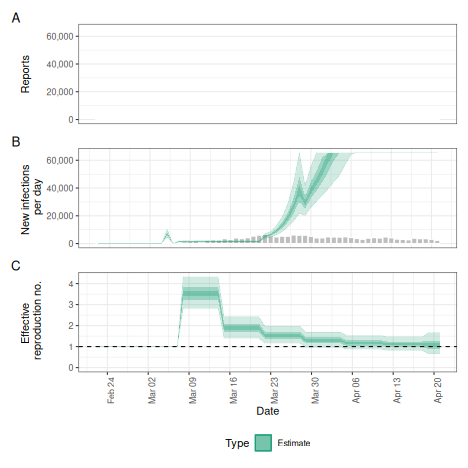
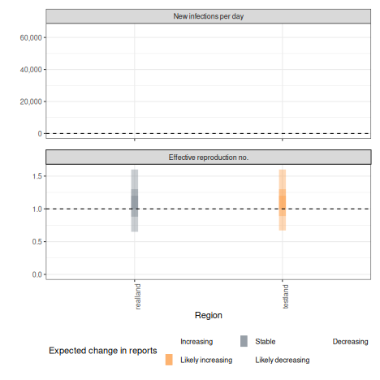

## Quick start

In the following section we give an overview of the simple use case for `epinow()` and `regional_epinow()`.

The first step to using the package is to load it as follows.


``` r
library(EpiNow2)
```

### Reporting delays, incubation period and generation time

Delay distributions can be specified using the distribution functions such as `Gamma` or `LogNormal`. An arbitrary number of delay distributions are supported in `dist_spec()` with a common use case being an incubation period followed by a reporting delay. For more information on specifying distributions see (see `?EpiNow2::Distributions`).

To demonstrate, we choose a lognormal distribution with mean 2, standard deviation 1 and a maximum of 10. *This is just an example and unlikely to apply in any particular use case*.


``` r
reporting_delay <- LogNormal(mean = 2, sd = 1, max = 10)
reporting_delay
#> - lognormal distribution (max: 10):
#>   meanlog:
#>     0.58
#>   sdlog:
#>     0.47
```

For the rest of this vignette, we will use inbuilt example literature estimates for the incubation period and generation time of Covid-19 (see [here](https://github.com/epiforecasts/EpiNow2/tree/main/data-raw) for the code that generates these estimates). *These distributions are unlikely to be applicable for your use case. We strongly recommend investigating what might be the best distributions to use in any given use case.*


``` r
example_generation_time
#> - gamma distribution (max: 14):
#>   shape:
#>     - normal distribution:
#>       mean:
#>         1.4
#>       sd:
#>         0.48
#>   rate:
#>     - normal distribution:
#>       mean:
#>         0.38
#>       sd:
#>         0.25
example_incubation_period
#> - lognormal distribution (max: 14):
#>   meanlog:
#>     - normal distribution:
#>       mean:
#>         1.6
#>       sd:
#>         0.064
#>   sdlog:
#>     - normal distribution:
#>       mean:
#>         0.42
#>       sd:
#>         0.069
```

Users can also pass a non-parametric delay distribution vector using the `NonParametric` option 
for both the generation interval and reporting delays. It is important to note that if doing so,
both delay distributions are 0-indexed, meaning the first element corresponds to the probability mass
at day 0 of an individual's infection. Because the discretised renewal equation doesn't support mass on day 0, the generation interval should be passed in as a 0-indexed vector with a mass of zero on day 0. 


``` r
example_non_parametric_gi <-  NonParametric(pmf = c(0, 0.3, 0.5, 0.2))

example_non_parametric_delay <- NonParametric(pmf = c(0.01, 0.1, 0.5, 0.3, 0.09))
```
These distributions are passed to downstream functions in the same way that the 
parametric distributions are. 

Now, to the functions.

### [epinow()](https://epiforecasts.io/EpiNow2/reference/epinow.html)

This function represents the core functionality of the package and includes results reporting, plotting, and optional saving. It requires a data frame of cases by date of report and the distributions defined above.

Load example case data from `{EpiNow2}`.


``` r
reported_cases <- example_confirmed[1:60]
head(reported_cases)
#>          date confirm
#>        <Date>   <num>
#> 1: 2020-02-22      14
#> 2: 2020-02-23      62
#> 3: 2020-02-24      53
#> 4: 2020-02-25      97
#> 5: 2020-02-26      93
#> 6: 2020-02-27      78
```

Estimate cases by date of infection, the time-varying reproduction number, the rate of growth, and forecast these estimates into the future by 7 days. Summarise the posterior and return a summary table and plots for reporting purposes. If a `target_folder` is supplied results can be internally saved (with the option to also turn off explicit returning of results).


``` r
estimates <- epinow(
  data = reported_cases,
  generation_time = gt_opts(example_generation_time),
  delays = delay_opts(example_incubation_period + reporting_delay),
  rt = rt_opts(prior = LogNormal(mean = 2, sd = 0.2), rw = 7),
  stan = stan_opts(cores = 4),
  verbose = interactive()
)
#> Path [1] :Initial log joint density = -35798649.947630 
#> Exception: Exception: Exception: neg_binomial_2_log_lpmf: Log location parameter[1] is inf, but must be finite! (in '/tmp/Rtmp7MjmHm/include_1/stan/functions/obs_lpmf.stan', line 35, column 4, included from 
#> '/tmp/Rtmp7MjmHm/model-116e1e66f0a505.stan', line 13, column 0) (in '/tmp/Rtmp7MjmHm/include_1/stan/functions/delay_lpmf.stan', line 202, column 4, included from 
#> '/tmp/Rtmp7MjmHm/model-116e1e66f0a505.stan', line 18, column 0) (in '/tmp/Rtmp7MjmHm/model-116e1e66f0a505.stan', line 427, column 6 to line 434, column 8) 
#> Exception: Exception: Exception: neg_binomial_2_log_lpmf: Log location parameter[40] is inf, but must be finite! (in '/tmp/Rtmp7MjmHm/include_1/stan/functions/obs_lpmf.stan', line 35, column 4, included from 
#> '/tmp/Rtmp7MjmHm/model-116e1e66f0a505.stan', line 13, column 0) (in '/tmp/Rtmp7MjmHm/include_1/stan/functions/delay_lpmf.stan', line 202, column 4, included from 
#> '/tmp/Rtmp7MjmHm/model-116e1e66f0a505.stan', line 18, column 0) (in '/tmp/Rtmp7MjmHm/model-116e1e66f0a505.stan', line 427, column 6 to line 434, column 8) 
#> Error evaluating model log probability: Non-finite function evaluation. 
#> Error evaluating model log probability: Non-finite function evaluation. 
#> Error evaluating model log probability: Non-finite function evaluation. 
#> Error evaluating model log probability: Non-finite function evaluation.
#> Path [1] : Iter      log prob        ||dx||      ||grad||     alpha      alpha0      # evals       ELBO    Best ELBO        Notes  
#>              99      -6.743e+02      7.496e-02   2.955e+00    1.000e+00  1.000e+00      9572 -7.396e+02 -8.300e+02                   
#> Path [1] : Iter      log prob        ||dx||      ||grad||     alpha      alpha0      # evals       ELBO    Best ELBO        Notes  
#>             199      -6.740e+02      1.869e-03   9.311e-02    1.000e+00  1.000e+00     31145 -7.396e+02 -8.405e+02                   
#> Path [1] : Iter      log prob        ||dx||      ||grad||     alpha      alpha0      # evals       ELBO    Best ELBO        Notes  
#>             234      -6.740e+02      8.429e-04   2.413e-02    1.000e+00  1.000e+00     41686 -7.396e+02 -9.857e+02                   
#> Path [1] :Best Iter: [71] ELBO (-739.634647) evaluations: (41686) 
#> Path [2] :Initial log joint density = -35798649.947630 
#> Exception: Exception: Exception: neg_binomial_2_log_lpmf: Log location parameter[1] is inf, but must be finite! (in '/tmp/Rtmp7MjmHm/include_1/stan/functions/obs_lpmf.stan', line 35, column 4, included from 
#> '/tmp/Rtmp7MjmHm/model-116e1e66f0a505.stan', line 13, column 0) (in '/tmp/Rtmp7MjmHm/include_1/stan/functions/delay_lpmf.stan', line 202, column 4, included from 
#> '/tmp/Rtmp7MjmHm/model-116e1e66f0a505.stan', line 18, column 0) (in '/tmp/Rtmp7MjmHm/model-116e1e66f0a505.stan', line 427, column 6 to line 434, column 8) 
#> Exception: Exception: Exception: neg_binomial_2_log_lpmf: Log location parameter[40] is inf, but must be finite! (in '/tmp/Rtmp7MjmHm/include_1/stan/functions/obs_lpmf.stan', line 35, column 4, included from 
#> '/tmp/Rtmp7MjmHm/model-116e1e66f0a505.stan', line 13, column 0) (in '/tmp/Rtmp7MjmHm/include_1/stan/functions/delay_lpmf.stan', line 202, column 4, included from 
#> '/tmp/Rtmp7MjmHm/model-116e1e66f0a505.stan', line 18, column 0) (in '/tmp/Rtmp7MjmHm/model-116e1e66f0a505.stan', line 427, column 6 to line 434, column 8) 
#> Error evaluating model log probability: Non-finite function evaluation. 
#> Error evaluating model log probability: Non-finite function evaluation. 
#> Error evaluating model log probability: Non-finite function evaluation. 
#> Error evaluating model log probability: Non-finite function evaluation. 
#> Path [2] : Iter      log prob        ||dx||      ||grad||     alpha      alpha0      # evals       ELBO    Best ELBO        Notes  
#>              99      -6.743e+02      7.496e-02   2.955e+00    1.000e+00  1.000e+00      9572 -7.410e+02 -8.057e+02                   
#> Path [2] : Iter      log prob        ||dx||      ||grad||     alpha      alpha0      # evals       ELBO    Best ELBO        Notes  
#>             199      -6.740e+02      1.869e-03   9.311e-02    1.000e+00  1.000e+00     31145 -7.410e+02 -8.643e+02                   
#> Path [2] : Iter      log prob        ||dx||      ||grad||     alpha      alpha0      # evals       ELBO    Best ELBO        Notes  
#>             234      -6.740e+02      8.429e-04   2.413e-02    1.000e+00  1.000e+00     41686 -7.410e+02 -8.648e+02                   
#> Path [2] :Best Iter: [71] ELBO (-740.969524) evaluations: (41686) 
#> Path [3] :Initial log joint density = -35798649.947630 
#> Exception: Exception: Exception: neg_binomial_2_log_lpmf: Log location parameter[1] is inf, but must be finite! (in '/tmp/Rtmp7MjmHm/include_1/stan/functions/obs_lpmf.stan', line 35, column 4, included from 
#> '/tmp/Rtmp7MjmHm/model-116e1e66f0a505.stan', line 13, column 0) (in '/tmp/Rtmp7MjmHm/include_1/stan/functions/delay_lpmf.stan', line 202, column 4, included from 
#> '/tmp/Rtmp7MjmHm/model-116e1e66f0a505.stan', line 18, column 0) (in '/tmp/Rtmp7MjmHm/model-116e1e66f0a505.stan', line 427, column 6 to line 434, column 8) 
#> Exception: Exception: Exception: neg_binomial_2_log_lpmf: Log location parameter[40] is inf, but must be finite! (in '/tmp/Rtmp7MjmHm/include_1/stan/functions/obs_lpmf.stan', line 35, column 4, included from 
#> '/tmp/Rtmp7MjmHm/model-116e1e66f0a505.stan', line 13, column 0) (in '/tmp/Rtmp7MjmHm/include_1/stan/functions/delay_lpmf.stan', line 202, column 4, included from 
#> '/tmp/Rtmp7MjmHm/model-116e1e66f0a505.stan', line 18, column 0) (in '/tmp/Rtmp7MjmHm/model-116e1e66f0a505.stan', line 427, column 6 to line 434, column 8) 
#> Error evaluating model log probability: Non-finite function evaluation. 
#> Error evaluating model log probability: Non-finite function evaluation. 
#> Error evaluating model log probability: Non-finite function evaluation. 
#> Error evaluating model log probability: Non-finite function evaluation. 
#> Path [3] : Iter      log prob        ||dx||      ||grad||     alpha      alpha0      # evals       ELBO    Best ELBO        Notes  
#>              99      -6.743e+02      7.496e-02   2.955e+00    1.000e+00  1.000e+00      9572 -7.438e+02 -8.051e+02                   
#> Path [3] : Iter      log prob        ||dx||      ||grad||     alpha      alpha0      # evals       ELBO    Best ELBO        Notes  
#>             199      -6.740e+02      1.869e-03   9.311e-02    1.000e+00  1.000e+00     31145 -7.438e+02 -9.020e+02                   
#> Path [3] : Iter      log prob        ||dx||      ||grad||     alpha      alpha0      # evals       ELBO    Best ELBO        Notes  
#>             234      -6.740e+02      8.429e-04   2.413e-02    1.000e+00  1.000e+00     41686 -7.438e+02 -9.532e+02                   
#> Path [3] :Best Iter: [71] ELBO (-743.753709) evaluations: (41686) 
#> Path [4] :Initial log joint density = -35798649.947630 
#> Exception: Exception: Exception: neg_binomial_2_log_lpmf: Log location parameter[1] is inf, but must be finite! (in '/tmp/Rtmp7MjmHm/include_1/stan/functions/obs_lpmf.stan', line 35, column 4, included from 
#> '/tmp/Rtmp7MjmHm/model-116e1e66f0a505.stan', line 13, column 0) (in '/tmp/Rtmp7MjmHm/include_1/stan/functions/delay_lpmf.stan', line 202, column 4, included from 
#> '/tmp/Rtmp7MjmHm/model-116e1e66f0a505.stan', line 18, column 0) (in '/tmp/Rtmp7MjmHm/model-116e1e66f0a505.stan', line 427, column 6 to line 434, column 8) 
#> Exception: Exception: Exception: neg_binomial_2_log_lpmf: Log location parameter[40] is inf, but must be finite! (in '/tmp/Rtmp7MjmHm/include_1/stan/functions/obs_lpmf.stan', line 35, column 4, included from 
#> '/tmp/Rtmp7MjmHm/model-116e1e66f0a505.stan', line 13, column 0) (in '/tmp/Rtmp7MjmHm/include_1/stan/functions/delay_lpmf.stan', line 202, column 4, included from 
#> '/tmp/Rtmp7MjmHm/model-116e1e66f0a505.stan', line 18, column 0) (in '/tmp/Rtmp7MjmHm/model-116e1e66f0a505.stan', line 427, column 6 to line 434, column 8) 
#> Error evaluating model log probability: Non-finite function evaluation. 
#> Error evaluating model log probability: Non-finite function evaluation. 
#> Error evaluating model log probability: Non-finite function evaluation. 
#> Error evaluating model log probability: Non-finite function evaluation. 
#> Path [4] : Iter      log prob        ||dx||      ||grad||     alpha      alpha0      # evals       ELBO    Best ELBO        Notes  
#>              99      -6.743e+02      7.496e-02   2.955e+00    1.000e+00  1.000e+00      9572 -7.446e+02 -8.512e+02                   
#> Path [4] : Iter      log prob        ||dx||      ||grad||     alpha      alpha0      # evals       ELBO    Best ELBO        Notes  
#>             199      -6.740e+02      1.869e-03   9.311e-02    1.000e+00  1.000e+00     31145 -7.364e+02 -8.601e+02                   
#> Path [4] : Iter      log prob        ||dx||      ||grad||     alpha      alpha0      # evals       ELBO    Best ELBO        Notes  
#>             234      -6.740e+02      8.429e-04   2.413e-02    1.000e+00  1.000e+00     41686 -7.364e+02 -9.558e+02                   
#> Path [4] :Best Iter: [108] ELBO (-736.368049) evaluations: (41686) 
#> Pareto k value (2) is greater than 0.7. Importance resampling was not able to improve the approximation, which may indicate that the approximation itself is poor. 
#> Finished in  1.8 seconds.
names(estimates)
#> [1] "fit"          "enw_fit"      "args"         "observations" "timing"
```

The default model uses a random walk prior to estimate the time-varying reproduction number. The `rw` parameter in `rt_opts()` controls the period of the random walk (e.g. `rw = 7` for weekly).

Both summary measures and posterior samples are returned for all parameters in an easily explored format which can be accessed using `summary`. The default is to return a summary table of estimates for key parameters at the latest date partially supported by data. 


``` r
knitr::kable(summary(estimates))
```


|measure                      |estimate                  |
|:----------------------------|:-------------------------|
|New infections per day       |231352 (157862 -- 340930) |
|Expected change in reports   |Likely increasing         |
|Effective reproduction no.   |1.1 (0.67 -- 1.7)         |
|Rate of growth               |0.072 (-0.41 -- 0.5)      |
|Doubling/halving time (days) |9.6 (1.4 -- -1.7)         |


Summarised parameter estimates can also easily be returned, either filtered for a single parameter or for all parameters.


``` r
head(summary(estimates, type = "parameters", params = "R"))
#>          date variable  strat     type   median     mean        sd  lower_90
#>        <Date>   <char> <char>   <char>    <num>    <num>     <num>     <num>
#> 1:       <NA>        R   <NA> estimate 1.072862 1.246797 0.8548342 0.4154477
#> 2: 2020-02-22        R   <NA> estimate 1.000000 1.000000 0.0000000 1.0000000
#> 3: 2020-02-23        R   <NA> estimate 1.000000 1.000000 0.0000000 1.0000000
#> 4: 2020-02-24        R   <NA> estimate 1.000000 1.000000 0.0000000 1.0000000
#> 5: 2020-02-25        R   <NA> estimate 1.000000 1.000000 0.0000000 1.0000000
#> 6: 2020-02-26        R   <NA> estimate 1.000000 1.000000 0.0000000 1.0000000
#>    lower_50  lower_20 upper_20 upper_50 upper_90
#>       <num>     <num>    <num>    <num>    <num>
#> 1: 0.779581 0.9602026 1.196732 1.457594 2.659534
#> 2: 1.000000 1.0000000 1.000000 1.000000 1.000000
#> 3: 1.000000 1.0000000 1.000000 1.000000 1.000000
#> 4: 1.000000 1.0000000 1.000000 1.000000 1.000000
#> 5: 1.000000 1.0000000 1.000000 1.000000 1.000000
#> 6: 1.000000 1.0000000 1.000000 1.000000 1.000000
```

Reported cases can be extracted using `get_predictions()` which returns summarised estimates by default.


``` r
head(get_predictions(estimates))
#>          date median     mean      sd lower_90 lower_50 lower_20 upper_20
#>        <Date>  <num>    <num>   <num>    <num>    <num>    <num>    <num>
#> 1: 2020-02-22 201290 527423.3 2076391 30301.65 92907.75 150681.8 268463.2
#>    upper_50 upper_90
#>       <num>    <num>
#> 1:   445041  1655620
```

A range of plots are returned (with the single summary plot shown below). These plots can also be generated using the following `plot` method.


``` r
plot(estimates)
```




### [regional_epinow()](https://epiforecasts.io/EpiNow2/reference/regional_epinow.html)

The `regional_epinow()` function runs the `epinow()` function across multiple regions in
an efficient manner.

Define cases in multiple regions delineated by the region variable.


``` r
reported_cases <- data.table::rbindlist(list(
  data.table::copy(reported_cases)[, region := "testland"],
  reported_cases[, region := "realland"]
))
head(reported_cases)
#>          date confirm   region
#>        <Date>   <num>   <char>
#> 1: 2020-02-22      14 testland
#> 2: 2020-02-23      62 testland
#> 3: 2020-02-24      53 testland
#> 4: 2020-02-25      97 testland
#> 5: 2020-02-26      93 testland
#> 6: 2020-02-27      78 testland
```

Calling `regional_epinow()` runs the `epinow()` on each region in turn (or in parallel depending on the settings used). Here we also assign "testland" a different ascertainment of 50%, using the `opts_list()` function, which is used to assign region-specific settings.


``` r
obs <- opts_list(
  obs_opts(),
  reported_cases,
  testland = obs_opts(scale = Fixed(0.5))
)

estimates <- regional_epinow(
  data = reported_cases,
  generation_time = gt_opts(example_generation_time),
  delays = delay_opts(example_incubation_period + reporting_delay),
  rt = rt_opts(prior = LogNormal(mean = 2, sd = 0.2), rw = 7),
  obs = obs,
  stan = stan_opts(cores = 4, warmup = 1000, samples = 1000),
  logs = NULL
)
#> Path [1] :Initial log joint density = -21954150.924858 
#> Exception: Exception: Exception: neg_binomial_2_log_lpmf: Log location parameter[1] is inf, but must be finite! (in '/tmp/Rtmp7MjmHm/include_1/stan/functions/obs_lpmf.stan', line 35, column 4, included from 
#> '/tmp/Rtmp7MjmHm/model-116e1e66f0a505.stan', line 13, column 0) (in '/tmp/Rtmp7MjmHm/include_1/stan/functions/delay_lpmf.stan', line 202, column 4, included from 
#> '/tmp/Rtmp7MjmHm/model-116e1e66f0a505.stan', line 18, column 0) (in '/tmp/Rtmp7MjmHm/model-116e1e66f0a505.stan', line 427, column 6 to line 434, column 8) 
#> Exception: Exception: Exception: neg_binomial_2_log_lpmf: Log location parameter[8] is inf, but must be finite! (in '/tmp/Rtmp7MjmHm/include_1/stan/functions/obs_lpmf.stan', line 35, column 4, included from 
#> '/tmp/Rtmp7MjmHm/model-116e1e66f0a505.stan', line 13, column 0) (in '/tmp/Rtmp7MjmHm/include_1/stan/functions/delay_lpmf.stan', line 202, column 4, included from 
#> '/tmp/Rtmp7MjmHm/model-116e1e66f0a505.stan', line 18, column 0) (in '/tmp/Rtmp7MjmHm/model-116e1e66f0a505.stan', line 427, column 6 to line 434, column 8) 
#> Exception: Exception: Exception: neg_binomial_2_log_lpmf: Log location parameter[8] is inf, but must be finite! (in '/tmp/Rtmp7MjmHm/include_1/stan/functions/obs_lpmf.stan', line 35, column 4, included from 
#> '/tmp/Rtmp7MjmHm/model-116e1e66f0a505.stan', line 13, column 0) (in '/tmp/Rtmp7MjmHm/include_1/stan/functions/delay_lpmf.stan', line 202, column 4, included from 
#> '/tmp/Rtmp7MjmHm/model-116e1e66f0a505.stan', line 18, column 0) (in '/tmp/Rtmp7MjmHm/model-116e1e66f0a505.stan', line 427, column 6 to line 434, column 8) 
#> Exception: Exception: Exception: neg_binomial_2_log_lpmf: Log location parameter[29] is inf, but must be finite! (in '/tmp/Rtmp7MjmHm/include_1/stan/functions/obs_lpmf.stan', line 35, column 4, included from 
#> '/tmp/Rtmp7MjmHm/model-116e1e66f0a505.stan', line 13, column 0) (in '/tmp/Rtmp7MjmHm/include_1/stan/functions/delay_lpmf.stan', line 202, column 4, included from 
#> '/tmp/Rtmp7MjmHm/model-116e1e66f0a505.stan', line 18, column 0) (in '/tmp/Rtmp7MjmHm/model-116e1e66f0a505.stan', line 427, column 6 to line 434, column 8) 
#> Exception: Exception: Exception: neg_binomial_2_log_lpmf: Precision parameter is 0, but must be positive finite! (in '/tmp/Rtmp7MjmHm/include_1/stan/functions/obs_lpmf.stan', line 35, column 4, included from 
#> '/tmp/Rtmp7MjmHm/model-116e1e66f0a505.stan', line 13, column 0) (in '/tmp/Rtmp7MjmHm/include_1/stan/functions/delay_lpmf.stan', line 202, column 4, included from 
#> '/tmp/Rtmp7MjmHm/model-116e1e66f0a505.stan', line 18, column 0) (in '/tmp/Rtmp7MjmHm/model-116e1e66f0a505.stan', line 427, column 6 to line 434, column 8) 
#> Error evaluating model log probability: Non-finite function evaluation. 
#> Error evaluating model log probability: Non-finite function evaluation. 
#> Error evaluating model log probability: Non-finite function evaluation. 
#> Error evaluating model log probability: Non-finite function evaluation. 
#> Exception: Exception: Exception: neg_binomial_2_log_lpmf: Log location parameter[8] is inf, but must be finite! (in '/tmp/Rtmp7MjmHm/include_1/stan/functions/obs_lpmf.stan', line 35, column 4, included from 
#> '/tmp/Rtmp7MjmHm/model-116e1e66f0a505.stan', line 13, column 0) (in '/tmp/Rtmp7MjmHm/include_1/stan/functions/delay_lpmf.stan', line 202, column 4, included from 
#> '/tmp/Rtmp7MjmHm/model-116e1e66f0a505.stan', line 18, column 0) (in '/tmp/Rtmp7MjmHm/model-116e1e66f0a505.stan', line 427, column 6 to line 434, column 8) 
#> Exception: Exception: Exception: neg_binomial_2_log_lpmf: Log location parameter[22] is inf, but must be finite! (in '/tmp/Rtmp7MjmHm/include_1/stan/functions/obs_lpmf.stan', line 35, column 4, included from 
#> '/tmp/Rtmp7MjmHm/model-116e1e66f0a505.stan', line 13, column 0) (in '/tmp/Rtmp7MjmHm/include_1/stan/functions/delay_lpmf.stan', line 202, column 4, included from 
#> '/tmp/Rtmp7MjmHm/model-116e1e66f0a505.stan', line 18, column 0) (in '/tmp/Rtmp7MjmHm/model-116e1e66f0a505.stan', line 427, column 6 to line 434, column 8)
#> Path [1] : Iter      log prob        ||dx||      ||grad||     alpha      alpha0      # evals       ELBO    Best ELBO        Notes  
#>              99      -6.739e+02      2.041e-02   2.507e+00    1.000e+00  1.000e+00      9498 -7.492e+02 -7.646e+02                   
#> Path [1] : Iter      log prob        ||dx||      ||grad||     alpha      alpha0      # evals       ELBO    Best ELBO        Notes  
#>             199      -6.737e+02      9.826e-04   1.037e-01    1.000e+00  1.000e+00     30469 -7.401e+02 -8.935e+02                   
#> Path [1] : Iter      log prob        ||dx||      ||grad||     alpha      alpha0      # evals       ELBO    Best ELBO        Notes  
#>             204      -6.737e+02      2.173e-04   5.558e-02    1.000e+00  1.000e+00     31829 -7.401e+02 -9.508e+02                   
#> Path [1] :Best Iter: [141] ELBO (-740.083634) evaluations: (31829) 
#> Path [2] :Initial log joint density = -21954150.924858 
#> Exception: Exception: Exception: neg_binomial_2_log_lpmf: Log location parameter[1] is inf, but must be finite! (in '/tmp/Rtmp7MjmHm/include_1/stan/functions/obs_lpmf.stan', line 35, column 4, included from 
#> '/tmp/Rtmp7MjmHm/model-116e1e66f0a505.stan', line 13, column 0) (in '/tmp/Rtmp7MjmHm/include_1/stan/functions/delay_lpmf.stan', line 202, column 4, included from 
#> '/tmp/Rtmp7MjmHm/model-116e1e66f0a505.stan', line 18, column 0) (in '/tmp/Rtmp7MjmHm/model-116e1e66f0a505.stan', line 427, column 6 to line 434, column 8) 
#> Exception: Exception: Exception: neg_binomial_2_log_lpmf: Log location parameter[8] is inf, but must be finite! (in '/tmp/Rtmp7MjmHm/include_1/stan/functions/obs_lpmf.stan', line 35, column 4, included from 
#> '/tmp/Rtmp7MjmHm/model-116e1e66f0a505.stan', line 13, column 0) (in '/tmp/Rtmp7MjmHm/include_1/stan/functions/delay_lpmf.stan', line 202, column 4, included from 
#> '/tmp/Rtmp7MjmHm/model-116e1e66f0a505.stan', line 18, column 0) (in '/tmp/Rtmp7MjmHm/model-116e1e66f0a505.stan', line 427, column 6 to line 434, column 8) 
#> Exception: Exception: Exception: neg_binomial_2_log_lpmf: Log location parameter[8] is inf, but must be finite! (in '/tmp/Rtmp7MjmHm/include_1/stan/functions/obs_lpmf.stan', line 35, column 4, included from 
#> '/tmp/Rtmp7MjmHm/model-116e1e66f0a505.stan', line 13, column 0) (in '/tmp/Rtmp7MjmHm/include_1/stan/functions/delay_lpmf.stan', line 202, column 4, included from 
#> '/tmp/Rtmp7MjmHm/model-116e1e66f0a505.stan', line 18, column 0) (in '/tmp/Rtmp7MjmHm/model-116e1e66f0a505.stan', line 427, column 6 to line 434, column 8) 
#> Exception: Exception: Exception: neg_binomial_2_log_lpmf: Log location parameter[29] is inf, but must be finite! (in '/tmp/Rtmp7MjmHm/include_1/stan/functions/obs_lpmf.stan', line 35, column 4, included from 
#> '/tmp/Rtmp7MjmHm/model-116e1e66f0a505.stan', line 13, column 0) (in '/tmp/Rtmp7MjmHm/include_1/stan/functions/delay_lpmf.stan', line 202, column 4, included from 
#> '/tmp/Rtmp7MjmHm/model-116e1e66f0a505.stan', line 18, column 0) (in '/tmp/Rtmp7MjmHm/model-116e1e66f0a505.stan', line 427, column 6 to line 434, column 8) 
#> Exception: Exception: Exception: neg_binomial_2_log_lpmf: Precision parameter is 0, but must be positive finite! (in '/tmp/Rtmp7MjmHm/include_1/stan/functions/obs_lpmf.stan', line 35, column 4, included from 
#> '/tmp/Rtmp7MjmHm/model-116e1e66f0a505.stan', line 13, column 0) (in '/tmp/Rtmp7MjmHm/include_1/stan/functions/delay_lpmf.stan', line 202, column 4, included from 
#> '/tmp/Rtmp7MjmHm/model-116e1e66f0a505.stan', line 18, column 0) (in '/tmp/Rtmp7MjmHm/model-116e1e66f0a505.stan', line 427, column 6 to line 434, column 8) 
#> Error evaluating model log probability: Non-finite function evaluation. 
#> Error evaluating model log probability: Non-finite function evaluation. 
#> Error evaluating model log probability: Non-finite function evaluation. 
#> Error evaluating model log probability: Non-finite function evaluation. 
#> Exception: Exception: Exception: neg_binomial_2_log_lpmf: Log location parameter[8] is inf, but must be finite! (in '/tmp/Rtmp7MjmHm/include_1/stan/functions/obs_lpmf.stan', line 35, column 4, included from 
#> '/tmp/Rtmp7MjmHm/model-116e1e66f0a505.stan', line 13, column 0) (in '/tmp/Rtmp7MjmHm/include_1/stan/functions/delay_lpmf.stan', line 202, column 4, included from 
#> '/tmp/Rtmp7MjmHm/model-116e1e66f0a505.stan', line 18, column 0) (in '/tmp/Rtmp7MjmHm/model-116e1e66f0a505.stan', line 427, column 6 to line 434, column 8) 
#> Exception: Exception: Exception: neg_binomial_2_log_lpmf: Log location parameter[22] is inf, but must be finite! (in '/tmp/Rtmp7MjmHm/include_1/stan/functions/obs_lpmf.stan', line 35, column 4, included from 
#> '/tmp/Rtmp7MjmHm/model-116e1e66f0a505.stan', line 13, column 0) (in '/tmp/Rtmp7MjmHm/include_1/stan/functions/delay_lpmf.stan', line 202, column 4, included from 
#> '/tmp/Rtmp7MjmHm/model-116e1e66f0a505.stan', line 18, column 0) (in '/tmp/Rtmp7MjmHm/model-116e1e66f0a505.stan', line 427, column 6 to line 434, column 8) 
#> Path [2] : Iter      log prob        ||dx||      ||grad||     alpha      alpha0      # evals       ELBO    Best ELBO        Notes  
#>              99      -6.739e+02      2.041e-02   2.507e+00    1.000e+00  1.000e+00      9498 -7.469e+02 -7.544e+02                   
#> Path [2] : Iter      log prob        ||dx||      ||grad||     alpha      alpha0      # evals       ELBO    Best ELBO        Notes  
#>             199      -6.737e+02      9.826e-04   1.037e-01    1.000e+00  1.000e+00     30469 -7.409e+02 -8.589e+02                   
#> Path [2] : Iter      log prob        ||dx||      ||grad||     alpha      alpha0      # evals       ELBO    Best ELBO        Notes  
#>             204      -6.737e+02      2.173e-04   5.558e-02    1.000e+00  1.000e+00     31829 -7.409e+02 -1.842e+03                   
#> Path [2] :Best Iter: [141] ELBO (-740.942390) evaluations: (31829) 
#> Path [3] :Initial log joint density = -21954150.924858 
#> Exception: Exception: Exception: neg_binomial_2_log_lpmf: Log location parameter[1] is inf, but must be finite! (in '/tmp/Rtmp7MjmHm/include_1/stan/functions/obs_lpmf.stan', line 35, column 4, included from 
#> '/tmp/Rtmp7MjmHm/model-116e1e66f0a505.stan', line 13, column 0) (in '/tmp/Rtmp7MjmHm/include_1/stan/functions/delay_lpmf.stan', line 202, column 4, included from 
#> '/tmp/Rtmp7MjmHm/model-116e1e66f0a505.stan', line 18, column 0) (in '/tmp/Rtmp7MjmHm/model-116e1e66f0a505.stan', line 427, column 6 to line 434, column 8) 
#> Exception: Exception: Exception: neg_binomial_2_log_lpmf: Log location parameter[8] is inf, but must be finite! (in '/tmp/Rtmp7MjmHm/include_1/stan/functions/obs_lpmf.stan', line 35, column 4, included from 
#> '/tmp/Rtmp7MjmHm/model-116e1e66f0a505.stan', line 13, column 0) (in '/tmp/Rtmp7MjmHm/include_1/stan/functions/delay_lpmf.stan', line 202, column 4, included from 
#> '/tmp/Rtmp7MjmHm/model-116e1e66f0a505.stan', line 18, column 0) (in '/tmp/Rtmp7MjmHm/model-116e1e66f0a505.stan', line 427, column 6 to line 434, column 8) 
#> Exception: Exception: Exception: neg_binomial_2_log_lpmf: Log location parameter[8] is inf, but must be finite! (in '/tmp/Rtmp7MjmHm/include_1/stan/functions/obs_lpmf.stan', line 35, column 4, included from 
#> '/tmp/Rtmp7MjmHm/model-116e1e66f0a505.stan', line 13, column 0) (in '/tmp/Rtmp7MjmHm/include_1/stan/functions/delay_lpmf.stan', line 202, column 4, included from 
#> '/tmp/Rtmp7MjmHm/model-116e1e66f0a505.stan', line 18, column 0) (in '/tmp/Rtmp7MjmHm/model-116e1e66f0a505.stan', line 427, column 6 to line 434, column 8) 
#> Exception: Exception: Exception: neg_binomial_2_log_lpmf: Log location parameter[29] is inf, but must be finite! (in '/tmp/Rtmp7MjmHm/include_1/stan/functions/obs_lpmf.stan', line 35, column 4, included from 
#> '/tmp/Rtmp7MjmHm/model-116e1e66f0a505.stan', line 13, column 0) (in '/tmp/Rtmp7MjmHm/include_1/stan/functions/delay_lpmf.stan', line 202, column 4, included from 
#> '/tmp/Rtmp7MjmHm/model-116e1e66f0a505.stan', line 18, column 0) (in '/tmp/Rtmp7MjmHm/model-116e1e66f0a505.stan', line 427, column 6 to line 434, column 8) 
#> Exception: Exception: Exception: neg_binomial_2_log_lpmf: Precision parameter is 0, but must be positive finite! (in '/tmp/Rtmp7MjmHm/include_1/stan/functions/obs_lpmf.stan', line 35, column 4, included from 
#> '/tmp/Rtmp7MjmHm/model-116e1e66f0a505.stan', line 13, column 0) (in '/tmp/Rtmp7MjmHm/include_1/stan/functions/delay_lpmf.stan', line 202, column 4, included from 
#> '/tmp/Rtmp7MjmHm/model-116e1e66f0a505.stan', line 18, column 0) (in '/tmp/Rtmp7MjmHm/model-116e1e66f0a505.stan', line 427, column 6 to line 434, column 8) 
#> Error evaluating model log probability: Non-finite function evaluation. 
#> Error evaluating model log probability: Non-finite function evaluation. 
#> Error evaluating model log probability: Non-finite function evaluation. 
#> Error evaluating model log probability: Non-finite function evaluation. 
#> Exception: Exception: Exception: neg_binomial_2_log_lpmf: Log location parameter[8] is inf, but must be finite! (in '/tmp/Rtmp7MjmHm/include_1/stan/functions/obs_lpmf.stan', line 35, column 4, included from 
#> '/tmp/Rtmp7MjmHm/model-116e1e66f0a505.stan', line 13, column 0) (in '/tmp/Rtmp7MjmHm/include_1/stan/functions/delay_lpmf.stan', line 202, column 4, included from 
#> '/tmp/Rtmp7MjmHm/model-116e1e66f0a505.stan', line 18, column 0) (in '/tmp/Rtmp7MjmHm/model-116e1e66f0a505.stan', line 427, column 6 to line 434, column 8) 
#> Exception: Exception: Exception: neg_binomial_2_log_lpmf: Log location parameter[22] is inf, but must be finite! (in '/tmp/Rtmp7MjmHm/include_1/stan/functions/obs_lpmf.stan', line 35, column 4, included from 
#> '/tmp/Rtmp7MjmHm/model-116e1e66f0a505.stan', line 13, column 0) (in '/tmp/Rtmp7MjmHm/include_1/stan/functions/delay_lpmf.stan', line 202, column 4, included from 
#> '/tmp/Rtmp7MjmHm/model-116e1e66f0a505.stan', line 18, column 0) (in '/tmp/Rtmp7MjmHm/model-116e1e66f0a505.stan', line 427, column 6 to line 434, column 8) 
#> Path [3] : Iter      log prob        ||dx||      ||grad||     alpha      alpha0      # evals       ELBO    Best ELBO        Notes  
#>              99      -6.739e+02      2.041e-02   2.507e+00    1.000e+00  1.000e+00      9498 -7.494e+02 -7.545e+02                   
#> Path [3] : Iter      log prob        ||dx||      ||grad||     alpha      alpha0      # evals       ELBO    Best ELBO        Notes  
#>             199      -6.737e+02      9.826e-04   1.037e-01    1.000e+00  1.000e+00     30469 -7.356e+02 -1.029e+03                   
#> Path [3] : Iter      log prob        ||dx||      ||grad||     alpha      alpha0      # evals       ELBO    Best ELBO        Notes  
#>             204      -6.737e+02      2.173e-04   5.558e-02    1.000e+00  1.000e+00     31829 -7.356e+02 -1.088e+03                   
#> Path [3] :Best Iter: [141] ELBO (-735.636451) evaluations: (31829) 
#> Path [4] :Initial log joint density = -21954150.924858 
#> Exception: Exception: Exception: neg_binomial_2_log_lpmf: Log location parameter[1] is inf, but must be finite! (in '/tmp/Rtmp7MjmHm/include_1/stan/functions/obs_lpmf.stan', line 35, column 4, included from 
#> '/tmp/Rtmp7MjmHm/model-116e1e66f0a505.stan', line 13, column 0) (in '/tmp/Rtmp7MjmHm/include_1/stan/functions/delay_lpmf.stan', line 202, column 4, included from 
#> '/tmp/Rtmp7MjmHm/model-116e1e66f0a505.stan', line 18, column 0) (in '/tmp/Rtmp7MjmHm/model-116e1e66f0a505.stan', line 427, column 6 to line 434, column 8) 
#> Exception: Exception: Exception: neg_binomial_2_log_lpmf: Log location parameter[8] is inf, but must be finite! (in '/tmp/Rtmp7MjmHm/include_1/stan/functions/obs_lpmf.stan', line 35, column 4, included from 
#> '/tmp/Rtmp7MjmHm/model-116e1e66f0a505.stan', line 13, column 0) (in '/tmp/Rtmp7MjmHm/include_1/stan/functions/delay_lpmf.stan', line 202, column 4, included from 
#> '/tmp/Rtmp7MjmHm/model-116e1e66f0a505.stan', line 18, column 0) (in '/tmp/Rtmp7MjmHm/model-116e1e66f0a505.stan', line 427, column 6 to line 434, column 8) 
#> Exception: Exception: Exception: neg_binomial_2_log_lpmf: Log location parameter[8] is inf, but must be finite! (in '/tmp/Rtmp7MjmHm/include_1/stan/functions/obs_lpmf.stan', line 35, column 4, included from 
#> '/tmp/Rtmp7MjmHm/model-116e1e66f0a505.stan', line 13, column 0) (in '/tmp/Rtmp7MjmHm/include_1/stan/functions/delay_lpmf.stan', line 202, column 4, included from 
#> '/tmp/Rtmp7MjmHm/model-116e1e66f0a505.stan', line 18, column 0) (in '/tmp/Rtmp7MjmHm/model-116e1e66f0a505.stan', line 427, column 6 to line 434, column 8) 
#> Exception: Exception: Exception: neg_binomial_2_log_lpmf: Log location parameter[29] is inf, but must be finite! (in '/tmp/Rtmp7MjmHm/include_1/stan/functions/obs_lpmf.stan', line 35, column 4, included from 
#> '/tmp/Rtmp7MjmHm/model-116e1e66f0a505.stan', line 13, column 0) (in '/tmp/Rtmp7MjmHm/include_1/stan/functions/delay_lpmf.stan', line 202, column 4, included from 
#> '/tmp/Rtmp7MjmHm/model-116e1e66f0a505.stan', line 18, column 0) (in '/tmp/Rtmp7MjmHm/model-116e1e66f0a505.stan', line 427, column 6 to line 434, column 8) 
#> Exception: Exception: Exception: neg_binomial_2_log_lpmf: Precision parameter is 0, but must be positive finite! (in '/tmp/Rtmp7MjmHm/include_1/stan/functions/obs_lpmf.stan', line 35, column 4, included from 
#> '/tmp/Rtmp7MjmHm/model-116e1e66f0a505.stan', line 13, column 0) (in '/tmp/Rtmp7MjmHm/include_1/stan/functions/delay_lpmf.stan', line 202, column 4, included from 
#> '/tmp/Rtmp7MjmHm/model-116e1e66f0a505.stan', line 18, column 0) (in '/tmp/Rtmp7MjmHm/model-116e1e66f0a505.stan', line 427, column 6 to line 434, column 8) 
#> Error evaluating model log probability: Non-finite function evaluation. 
#> Error evaluating model log probability: Non-finite function evaluation. 
#> Error evaluating model log probability: Non-finite function evaluation. 
#> Error evaluating model log probability: Non-finite function evaluation. 
#> Exception: Exception: Exception: neg_binomial_2_log_lpmf: Log location parameter[8] is inf, but must be finite! (in '/tmp/Rtmp7MjmHm/include_1/stan/functions/obs_lpmf.stan', line 35, column 4, included from 
#> '/tmp/Rtmp7MjmHm/model-116e1e66f0a505.stan', line 13, column 0) (in '/tmp/Rtmp7MjmHm/include_1/stan/functions/delay_lpmf.stan', line 202, column 4, included from 
#> '/tmp/Rtmp7MjmHm/model-116e1e66f0a505.stan', line 18, column 0) (in '/tmp/Rtmp7MjmHm/model-116e1e66f0a505.stan', line 427, column 6 to line 434, column 8) 
#> Exception: Exception: Exception: neg_binomial_2_log_lpmf: Log location parameter[22] is inf, but must be finite! (in '/tmp/Rtmp7MjmHm/include_1/stan/functions/obs_lpmf.stan', line 35, column 4, included from 
#> '/tmp/Rtmp7MjmHm/model-116e1e66f0a505.stan', line 13, column 0) (in '/tmp/Rtmp7MjmHm/include_1/stan/functions/delay_lpmf.stan', line 202, column 4, included from 
#> '/tmp/Rtmp7MjmHm/model-116e1e66f0a505.stan', line 18, column 0) (in '/tmp/Rtmp7MjmHm/model-116e1e66f0a505.stan', line 427, column 6 to line 434, column 8) 
#> Path [4] : Iter      log prob        ||dx||      ||grad||     alpha      alpha0      # evals       ELBO    Best ELBO        Notes  
#>              99      -6.739e+02      2.041e-02   2.507e+00    1.000e+00  1.000e+00      9498 -7.458e+02 -7.538e+02                   
#> Path [4] : Iter      log prob        ||dx||      ||grad||     alpha      alpha0      # evals       ELBO    Best ELBO        Notes  
#>             199      -6.737e+02      9.826e-04   1.037e-01    1.000e+00  1.000e+00     30469 -7.379e+02 -9.008e+02                   
#> Path [4] : Iter      log prob        ||dx||      ||grad||     alpha      alpha0      # evals       ELBO    Best ELBO        Notes  
#>             204      -6.737e+02      2.173e-04   5.558e-02    1.000e+00  1.000e+00     31829 -7.379e+02 -9.038e+02                   
#> Path [4] :Best Iter: [141] ELBO (-737.913515) evaluations: (31829) 
#> Pareto k value (1.8) is greater than 0.7. Importance resampling was not able to improve the approximation, which may indicate that the approximation itself is poor. 
#> Finished in  1.6 seconds.
#> Path [1] :Initial log joint density = -34639568.204672 
#> Exception: Exception: Exception: neg_binomial_2_log_lpmf: Log location parameter[1] is inf, but must be finite! (in '/tmp/Rtmp7MjmHm/include_1/stan/functions/obs_lpmf.stan', line 35, column 4, included from 
#> '/tmp/Rtmp7MjmHm/model-116e1e66f0a505.stan', line 13, column 0) (in '/tmp/Rtmp7MjmHm/include_1/stan/functions/delay_lpmf.stan', line 202, column 4, included from 
#> '/tmp/Rtmp7MjmHm/model-116e1e66f0a505.stan', line 18, column 0) (in '/tmp/Rtmp7MjmHm/model-116e1e66f0a505.stan', line 427, column 6 to line 434, column 8) 
#> Exception: Exception: Exception: neg_binomial_2_log_lpmf: Precision parameter is 0, but must be positive finite! (in '/tmp/Rtmp7MjmHm/include_1/stan/functions/obs_lpmf.stan', line 35, column 4, included from 
#> '/tmp/Rtmp7MjmHm/model-116e1e66f0a505.stan', line 13, column 0) (in '/tmp/Rtmp7MjmHm/include_1/stan/functions/delay_lpmf.stan', line 202, column 4, included from 
#> '/tmp/Rtmp7MjmHm/model-116e1e66f0a505.stan', line 18, column 0) (in '/tmp/Rtmp7MjmHm/model-116e1e66f0a505.stan', line 427, column 6 to line 434, column 8) 
#> Exception: Exception: Exception: neg_binomial_2_log_lpmf: Precision parameter is 0, but must be positive finite! (in '/tmp/Rtmp7MjmHm/include_1/stan/functions/obs_lpmf.stan', line 35, column 4, included from 
#> '/tmp/Rtmp7MjmHm/model-116e1e66f0a505.stan', line 13, column 0) (in '/tmp/Rtmp7MjmHm/include_1/stan/functions/delay_lpmf.stan', line 202, column 4, included from 
#> '/tmp/Rtmp7MjmHm/model-116e1e66f0a505.stan', line 18, column 0) (in '/tmp/Rtmp7MjmHm/model-116e1e66f0a505.stan', line 427, column 6 to line 434, column 8) 
#> Error evaluating model log probability: Non-finite function evaluation. 
#> Error evaluating model log probability: Non-finite function evaluation. 
#> Error evaluating model log probability: Non-finite function evaluation. 
#> Error evaluating model log probability: Non-finite function evaluation. 
#> Error evaluating model log probability: Non-finite function evaluation.
#> Path [1] : Iter      log prob        ||dx||      ||grad||     alpha      alpha0      # evals       ELBO    Best ELBO        Notes  
#>              99      -6.738e+02      5.191e-02   3.003e+00    1.000e+00  1.000e+00      9035 -7.531e+02 -8.134e+02                   
#> Path [1] : Iter      log prob        ||dx||      ||grad||     alpha      alpha0      # evals       ELBO    Best ELBO        Notes  
#>             198      -6.737e+02      1.419e-04   3.832e-02    1.000e+00  1.000e+00     30311 -7.482e+02 -7.816e+02                   
#> Path [1] :Best Iter: [131] ELBO (-748.165558) evaluations: (30311) 
#> Path [2] :Initial log joint density = -34639568.204672 
#> Exception: Exception: Exception: neg_binomial_2_log_lpmf: Log location parameter[1] is inf, but must be finite! (in '/tmp/Rtmp7MjmHm/include_1/stan/functions/obs_lpmf.stan', line 35, column 4, included from 
#> '/tmp/Rtmp7MjmHm/model-116e1e66f0a505.stan', line 13, column 0) (in '/tmp/Rtmp7MjmHm/include_1/stan/functions/delay_lpmf.stan', line 202, column 4, included from 
#> '/tmp/Rtmp7MjmHm/model-116e1e66f0a505.stan', line 18, column 0) (in '/tmp/Rtmp7MjmHm/model-116e1e66f0a505.stan', line 427, column 6 to line 434, column 8) 
#> Exception: Exception: Exception: neg_binomial_2_log_lpmf: Precision parameter is 0, but must be positive finite! (in '/tmp/Rtmp7MjmHm/include_1/stan/functions/obs_lpmf.stan', line 35, column 4, included from 
#> '/tmp/Rtmp7MjmHm/model-116e1e66f0a505.stan', line 13, column 0) (in '/tmp/Rtmp7MjmHm/include_1/stan/functions/delay_lpmf.stan', line 202, column 4, included from 
#> '/tmp/Rtmp7MjmHm/model-116e1e66f0a505.stan', line 18, column 0) (in '/tmp/Rtmp7MjmHm/model-116e1e66f0a505.stan', line 427, column 6 to line 434, column 8) 
#> Exception: Exception: Exception: neg_binomial_2_log_lpmf: Precision parameter is 0, but must be positive finite! (in '/tmp/Rtmp7MjmHm/include_1/stan/functions/obs_lpmf.stan', line 35, column 4, included from 
#> '/tmp/Rtmp7MjmHm/model-116e1e66f0a505.stan', line 13, column 0) (in '/tmp/Rtmp7MjmHm/include_1/stan/functions/delay_lpmf.stan', line 202, column 4, included from 
#> '/tmp/Rtmp7MjmHm/model-116e1e66f0a505.stan', line 18, column 0) (in '/tmp/Rtmp7MjmHm/model-116e1e66f0a505.stan', line 427, column 6 to line 434, column 8) 
#> Error evaluating model log probability: Non-finite function evaluation. 
#> Error evaluating model log probability: Non-finite function evaluation. 
#> Error evaluating model log probability: Non-finite function evaluation. 
#> Error evaluating model log probability: Non-finite function evaluation. 
#> Error evaluating model log probability: Non-finite function evaluation. 
#> Path [2] : Iter      log prob        ||dx||      ||grad||     alpha      alpha0      # evals       ELBO    Best ELBO        Notes  
#>              99      -6.738e+02      5.191e-02   3.003e+00    1.000e+00  1.000e+00      9035 -7.535e+02 -7.718e+02                   
#> Path [2] : Iter      log prob        ||dx||      ||grad||     alpha      alpha0      # evals       ELBO    Best ELBO        Notes  
#>             198      -6.737e+02      1.419e-04   3.832e-02    1.000e+00  1.000e+00     30311 -7.466e+02 -7.815e+02                   
#> Path [2] :Best Iter: [141] ELBO (-746.559899) evaluations: (30311) 
#> Path [3] :Initial log joint density = -34639568.204672 
#> Exception: Exception: Exception: neg_binomial_2_log_lpmf: Log location parameter[1] is inf, but must be finite! (in '/tmp/Rtmp7MjmHm/include_1/stan/functions/obs_lpmf.stan', line 35, column 4, included from 
#> '/tmp/Rtmp7MjmHm/model-116e1e66f0a505.stan', line 13, column 0) (in '/tmp/Rtmp7MjmHm/include_1/stan/functions/delay_lpmf.stan', line 202, column 4, included from 
#> '/tmp/Rtmp7MjmHm/model-116e1e66f0a505.stan', line 18, column 0) (in '/tmp/Rtmp7MjmHm/model-116e1e66f0a505.stan', line 427, column 6 to line 434, column 8) 
#> Exception: Exception: Exception: neg_binomial_2_log_lpmf: Precision parameter is 0, but must be positive finite! (in '/tmp/Rtmp7MjmHm/include_1/stan/functions/obs_lpmf.stan', line 35, column 4, included from 
#> '/tmp/Rtmp7MjmHm/model-116e1e66f0a505.stan', line 13, column 0) (in '/tmp/Rtmp7MjmHm/include_1/stan/functions/delay_lpmf.stan', line 202, column 4, included from 
#> '/tmp/Rtmp7MjmHm/model-116e1e66f0a505.stan', line 18, column 0) (in '/tmp/Rtmp7MjmHm/model-116e1e66f0a505.stan', line 427, column 6 to line 434, column 8) 
#> Exception: Exception: Exception: neg_binomial_2_log_lpmf: Precision parameter is 0, but must be positive finite! (in '/tmp/Rtmp7MjmHm/include_1/stan/functions/obs_lpmf.stan', line 35, column 4, included from 
#> '/tmp/Rtmp7MjmHm/model-116e1e66f0a505.stan', line 13, column 0) (in '/tmp/Rtmp7MjmHm/include_1/stan/functions/delay_lpmf.stan', line 202, column 4, included from 
#> '/tmp/Rtmp7MjmHm/model-116e1e66f0a505.stan', line 18, column 0) (in '/tmp/Rtmp7MjmHm/model-116e1e66f0a505.stan', line 427, column 6 to line 434, column 8) 
#> Error evaluating model log probability: Non-finite function evaluation. 
#> Error evaluating model log probability: Non-finite function evaluation. 
#> Error evaluating model log probability: Non-finite function evaluation. 
#> Error evaluating model log probability: Non-finite function evaluation. 
#> Error evaluating model log probability: Non-finite function evaluation. 
#> Path [3] : Iter      log prob        ||dx||      ||grad||     alpha      alpha0      # evals       ELBO    Best ELBO        Notes  
#>              99      -6.738e+02      5.191e-02   3.003e+00    1.000e+00  1.000e+00      9035 -7.541e+02 -7.900e+02                   
#> Path [3] : Iter      log prob        ||dx||      ||grad||     alpha      alpha0      # evals       ELBO    Best ELBO        Notes  
#>             198      -6.737e+02      1.419e-04   3.832e-02    1.000e+00  1.000e+00     30311 -7.474e+02 -7.784e+02                   
#> Path [3] :Best Iter: [143] ELBO (-747.446806) evaluations: (30311) 
#> Path [4] :Initial log joint density = -34639568.204672 
#> Exception: Exception: Exception: neg_binomial_2_log_lpmf: Log location parameter[1] is inf, but must be finite! (in '/tmp/Rtmp7MjmHm/include_1/stan/functions/obs_lpmf.stan', line 35, column 4, included from 
#> '/tmp/Rtmp7MjmHm/model-116e1e66f0a505.stan', line 13, column 0) (in '/tmp/Rtmp7MjmHm/include_1/stan/functions/delay_lpmf.stan', line 202, column 4, included from 
#> '/tmp/Rtmp7MjmHm/model-116e1e66f0a505.stan', line 18, column 0) (in '/tmp/Rtmp7MjmHm/model-116e1e66f0a505.stan', line 427, column 6 to line 434, column 8) 
#> Exception: Exception: Exception: neg_binomial_2_log_lpmf: Precision parameter is 0, but must be positive finite! (in '/tmp/Rtmp7MjmHm/include_1/stan/functions/obs_lpmf.stan', line 35, column 4, included from 
#> '/tmp/Rtmp7MjmHm/model-116e1e66f0a505.stan', line 13, column 0) (in '/tmp/Rtmp7MjmHm/include_1/stan/functions/delay_lpmf.stan', line 202, column 4, included from 
#> '/tmp/Rtmp7MjmHm/model-116e1e66f0a505.stan', line 18, column 0) (in '/tmp/Rtmp7MjmHm/model-116e1e66f0a505.stan', line 427, column 6 to line 434, column 8) 
#> Exception: Exception: Exception: neg_binomial_2_log_lpmf: Precision parameter is 0, but must be positive finite! (in '/tmp/Rtmp7MjmHm/include_1/stan/functions/obs_lpmf.stan', line 35, column 4, included from 
#> '/tmp/Rtmp7MjmHm/model-116e1e66f0a505.stan', line 13, column 0) (in '/tmp/Rtmp7MjmHm/include_1/stan/functions/delay_lpmf.stan', line 202, column 4, included from 
#> '/tmp/Rtmp7MjmHm/model-116e1e66f0a505.stan', line 18, column 0) (in '/tmp/Rtmp7MjmHm/model-116e1e66f0a505.stan', line 427, column 6 to line 434, column 8) 
#> Error evaluating model log probability: Non-finite function evaluation. 
#> Error evaluating model log probability: Non-finite function evaluation. 
#> Error evaluating model log probability: Non-finite function evaluation. 
#> Error evaluating model log probability: Non-finite function evaluation. 
#> Error evaluating model log probability: Non-finite function evaluation. 
#> Path [4] : Iter      log prob        ||dx||      ||grad||     alpha      alpha0      # evals       ELBO    Best ELBO        Notes  
#>              99      -6.738e+02      5.191e-02   3.003e+00    1.000e+00  1.000e+00      9035 -7.475e+02 -7.833e+02                   
#> Path [4] : Iter      log prob        ||dx||      ||grad||     alpha      alpha0      # evals       ELBO    Best ELBO        Notes  
#>             198      -6.737e+02      1.419e-04   3.832e-02    1.000e+00  1.000e+00     30311 -7.379e+02 -7.786e+02                   
#> Path [4] :Best Iter: [141] ELBO (-737.866424) evaluations: (30311) 
#> Pareto k value (1.8) is greater than 0.7. Importance resampling was not able to improve the approximation, which may indicate that the approximation itself is poor. 
#> Finished in  1.6 seconds.
```

Results from each region are stored in a `regional` list with across region summary measures and plots stored in a `summary` list. All results can be set to be internally saved by setting the `target_folder` and `summary_dir` arguments. Each region can be estimated in parallel using the `{future}` package (when in most scenarios `cores` should be set to 1). For routine use each MCMC chain can also be run in parallel (with `future` = `TRUE`) with a time out (`max_execution_time`) allowing for partial results to be returned if a subset of chains is running longer than expected. See the documentation for the [`{future}`](https://future.futureverse.org/) package for details on nested futures.

Summary measures that are returned include a table formatted for reporting (along with raw results for further processing).


``` r
knitr::kable(estimates$summary$summarised_results$table)
```


|Region   |New infections per day    |Expected change in reports |Effective reproduction no. |Rate of growth        |Doubling/halving time (days) |
|:--------|:-------------------------|:--------------------------|:--------------------------|:---------------------|:----------------------------|
|realland |234080 (158240 -- 345691) |Stable                     |1.1 (0.65 -- 1.6)          |0.072 (-0.43 -- 0.49) |9.7 (1.4 -- -1.6)            |
|testland |230595 (159497 -- 343321) |Likely increasing          |1.1 (0.67 -- 1.6)          |0.075 (-0.4 -- 0.5)   |9.2 (1.4 -- -1.7)            |


A range of plots are again returned (with the single summary plot shown below).


``` r
estimates$summary$summary_plot
```


