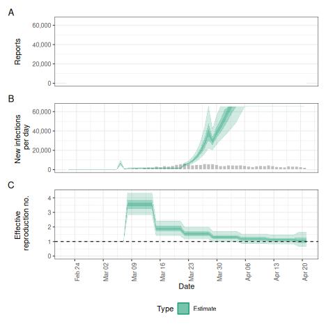
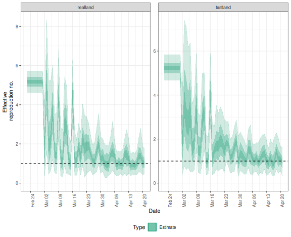
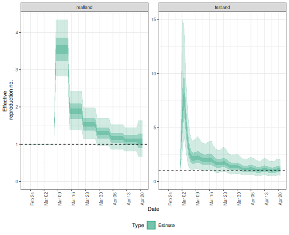

The _EpiNow2_ package contains functionality to run `estimate_infections()` in production mode, i.e. with full logging and saving all relevant outputs and plots to dedicated folders in the hard drive.
This is done with the `epinow()` function, that takes the same options as `estimate_infections()` with some additional options that determine, for example, where output gets stored and what output exactly.
The function can be a useful option when, e.g., running the model daily with updated data on a high-performance computing server to feed into a dashboard.
For more detail on the various model options available, see the [Examples](estimate_infections_options.html) vignette, for more on the general modelling approach the [Workflow](estimate_infections_workflow.html), and for theoretical background the [Model definitions](estimate_infections.html) vignette

# Running the model on a single region

To run the model in production mode for a single region, set the parameters up in the same way as for `estimate_infections()` (see the [Workflow](estimate_infections_workflow.html) vignette).
Here we use the example delay and generation time distributions that come with the package.
This should be replaced with parameters relevant to the system that is being studied.


``` r
library("EpiNow2")
options(mc.cores = 4)
reported_cases <- example_confirmed[1:60]
reporting_delay <- LogNormal(mean = 2, sd = 1, max = 10)
delay <- example_incubation_period + reporting_delay
rt_prior <- LogNormal(mean = 2, sd = 1)
```

We can then run the `epinow()` function with the same arguments as `estimate_infections()`.


``` r
res <- epinow(reported_cases,
  generation_time = gt_opts(example_generation_time),
  delays = delay_opts(delay),
  rt = rt_opts(prior = rt_prior, rw = 7),
  logs = NULL
)
#> ℹ Using model /home/sebfunk/R/x86_64-pc-linux-gnu-library/4.5/epinowcast/stan/epinowcast.stan.
#> ℹ Include is /home/sebfunk/R/x86_64-pc-linux-gnu-library/4.5/epinowcast/stan.
#> ! `enw_cache_location` is not set.
#> ℹ Using `tempdir()` at /tmp/RtmphdPCcJ for the epinowcast model cache location.
#> ℹ Set a specific cache location using `enw_set_cache` to control Stan
#>   recompilation in this R session or across R sessions.
#> ℹ For example: `enw_set_cache(tools::R_user_dir(package = "epinowcast",
#>   "cache"), type = c('session', 'persistent'))`.
#> ℹ See `?enw_set_cache` for details.
#> ℹ Using pathfinder initialization.
#> Path [1] :Initial log joint density = -28002478.280694 
#> Exception: Exception: Exception: neg_binomial_2_log_lpmf: Log location parameter[1] is inf, but must be finite! (in '/tmp/RtmphdPCcJ/include_1/stan/functions/obs_lpmf.stan', line 35, column 4, included from 
#> '/tmp/RtmphdPCcJ/model-1140f64fd0c1b8.stan', line 13, column 0) (in '/tmp/RtmphdPCcJ/include_1/stan/functions/delay_lpmf.stan', line 202, column 4, included from 
#> '/tmp/RtmphdPCcJ/model-1140f64fd0c1b8.stan', line 18, column 0) (in '/tmp/RtmphdPCcJ/model-1140f64fd0c1b8.stan', line 427, column 6 to line 434, column 8) 
#> Exception: Exception: Exception: neg_binomial_2_log_lpmf: Precision parameter is 0, but must be positive finite! (in '/tmp/RtmphdPCcJ/include_1/stan/functions/obs_lpmf.stan', line 35, column 4, included from 
#> '/tmp/RtmphdPCcJ/model-1140f64fd0c1b8.stan', line 13, column 0) (in '/tmp/RtmphdPCcJ/include_1/stan/functions/delay_lpmf.stan', line 202, column 4, included from 
#> '/tmp/RtmphdPCcJ/model-1140f64fd0c1b8.stan', line 18, column 0) (in '/tmp/RtmphdPCcJ/model-1140f64fd0c1b8.stan', line 427, column 6 to line 434, column 8) 
#> Exception: Exception: Exception: neg_binomial_2_log_lpmf: Precision parameter is 0, but must be positive finite! (in '/tmp/RtmphdPCcJ/include_1/stan/functions/obs_lpmf.stan', line 35, column 4, included from 
#> '/tmp/RtmphdPCcJ/model-1140f64fd0c1b8.stan', line 13, column 0) (in '/tmp/RtmphdPCcJ/include_1/stan/functions/delay_lpmf.stan', line 202, column 4, included from 
#> '/tmp/RtmphdPCcJ/model-1140f64fd0c1b8.stan', line 18, column 0) (in '/tmp/RtmphdPCcJ/model-1140f64fd0c1b8.stan', line 427, column 6 to line 434, column 8) 
#> Exception: Exception: Exception: neg_binomial_2_log_lpmf: Precision parameter is 0, but must be positive finite! (in '/tmp/RtmphdPCcJ/include_1/stan/functions/obs_lpmf.stan', line 35, column 4, included from 
#> '/tmp/RtmphdPCcJ/model-1140f64fd0c1b8.stan', line 13, column 0) (in '/tmp/RtmphdPCcJ/include_1/stan/functions/delay_lpmf.stan', line 202, column 4, included from 
#> '/tmp/RtmphdPCcJ/model-1140f64fd0c1b8.stan', line 18, column 0) (in '/tmp/RtmphdPCcJ/model-1140f64fd0c1b8.stan', line 427, column 6 to line 434, column 8) 
#> Exception: Exception: Exception: neg_binomial_2_log_lpmf: Precision parameter is 0, but must be positive finite! (in '/tmp/RtmphdPCcJ/include_1/stan/functions/obs_lpmf.stan', line 35, column 4, included from 
#> '/tmp/RtmphdPCcJ/model-1140f64fd0c1b8.stan', line 13, column 0) (in '/tmp/RtmphdPCcJ/include_1/stan/functions/delay_lpmf.stan', line 202, column 4, included from 
#> '/tmp/RtmphdPCcJ/model-1140f64fd0c1b8.stan', line 18, column 0) (in '/tmp/RtmphdPCcJ/model-1140f64fd0c1b8.stan', line 427, column 6 to line 434, column 8) 
#> Error evaluating model log probability: Non-finite function evaluation. 
#> Error evaluating model log probability: Non-finite function evaluation. 
#> Error evaluating model log probability: Non-finite function evaluation. 
#> Error evaluating model log probability: Non-finite function evaluation. 
#> Exception: Exception: Exception: neg_binomial_2_log_lpmf: Log location parameter[8] is inf, but must be finite! (in '/tmp/RtmphdPCcJ/include_1/stan/functions/obs_lpmf.stan', line 35, column 4, included from 
#> '/tmp/RtmphdPCcJ/model-1140f64fd0c1b8.stan', line 13, column 0) (in '/tmp/RtmphdPCcJ/include_1/stan/functions/delay_lpmf.stan', line 202, column 4, included from 
#> '/tmp/RtmphdPCcJ/model-1140f64fd0c1b8.stan', line 18, column 0) (in '/tmp/RtmphdPCcJ/model-1140f64fd0c1b8.stan', line 427, column 6 to line 434, column 8) 
#> Exception: Exception: Exception: neg_binomial_2_log_lpmf: Log location parameter[36] is inf, but must be finite! (in '/tmp/RtmphdPCcJ/include_1/stan/functions/obs_lpmf.stan', line 35, column 4, included from 
#> '/tmp/RtmphdPCcJ/model-1140f64fd0c1b8.stan', line 13, column 0) (in '/tmp/RtmphdPCcJ/include_1/stan/functions/delay_lpmf.stan', line 202, column 4, included from 
#> '/tmp/RtmphdPCcJ/model-1140f64fd0c1b8.stan', line 18, column 0) (in '/tmp/RtmphdPCcJ/model-1140f64fd0c1b8.stan', line 427, column 6 to line 434, column 8)
#> Chain 1 Warning: file '/tmp/RtmphdPCcJ/init-1140f62214fd5a_1.json' is being used to initialize all 4 chains!
#> Path [1] : Iter      log prob        ||dx||      ||grad||     alpha      alpha0      # evals       ELBO    Best ELBO        Notes  
#>              99      -6.740e+02      5.800e-02   1.112e+01    5.175e-01  1.000e+00     10014 -7.445e+02 -8.434e+02                   
#> Path [1] : Iter      log prob        ||dx||      ||grad||     alpha      alpha0      # evals       ELBO    Best ELBO        Notes  
#>             199      -6.737e+02      1.849e-03   3.820e-01    5.084e-01  5.084e-01     32894 -7.445e+02 -8.534e+02                   
#> Path [1] : Iter      log prob        ||dx||      ||grad||     alpha      alpha0      # evals       ELBO    Best ELBO        Notes  
#>             231      -6.737e+02      1.158e-04   4.876e-02    4.830e-01  4.830e-01     42710 -7.445e+02 -8.119e+02                   
#> Path [1] :Best Iter: [82] ELBO (-744.472606) evaluations: (42710) 
#> Path [2] :Initial log joint density = -28002478.280694 
#> Exception: Exception: Exception: neg_binomial_2_log_lpmf: Log location parameter[1] is inf, but must be finite! (in '/tmp/RtmphdPCcJ/include_1/stan/functions/obs_lpmf.stan', line 35, column 4, included from 
#> '/tmp/RtmphdPCcJ/model-1140f64fd0c1b8.stan', line 13, column 0) (in '/tmp/RtmphdPCcJ/include_1/stan/functions/delay_lpmf.stan', line 202, column 4, included from 
#> '/tmp/RtmphdPCcJ/model-1140f64fd0c1b8.stan', line 18, column 0) (in '/tmp/RtmphdPCcJ/model-1140f64fd0c1b8.stan', line 427, column 6 to line 434, column 8) 
#> Exception: Exception: Exception: neg_binomial_2_log_lpmf: Precision parameter is 0, but must be positive finite! (in '/tmp/RtmphdPCcJ/include_1/stan/functions/obs_lpmf.stan', line 35, column 4, included from 
#> '/tmp/RtmphdPCcJ/model-1140f64fd0c1b8.stan', line 13, column 0) (in '/tmp/RtmphdPCcJ/include_1/stan/functions/delay_lpmf.stan', line 202, column 4, included from 
#> '/tmp/RtmphdPCcJ/model-1140f64fd0c1b8.stan', line 18, column 0) (in '/tmp/RtmphdPCcJ/model-1140f64fd0c1b8.stan', line 427, column 6 to line 434, column 8) 
#> Exception: Exception: Exception: neg_binomial_2_log_lpmf: Precision parameter is 0, but must be positive finite! (in '/tmp/RtmphdPCcJ/include_1/stan/functions/obs_lpmf.stan', line 35, column 4, included from 
#> '/tmp/RtmphdPCcJ/model-1140f64fd0c1b8.stan', line 13, column 0) (in '/tmp/RtmphdPCcJ/include_1/stan/functions/delay_lpmf.stan', line 202, column 4, included from 
#> '/tmp/RtmphdPCcJ/model-1140f64fd0c1b8.stan', line 18, column 0) (in '/tmp/RtmphdPCcJ/model-1140f64fd0c1b8.stan', line 427, column 6 to line 434, column 8) 
#> Exception: Exception: Exception: neg_binomial_2_log_lpmf: Precision parameter is 0, but must be positive finite! (in '/tmp/RtmphdPCcJ/include_1/stan/functions/obs_lpmf.stan', line 35, column 4, included from 
#> '/tmp/RtmphdPCcJ/model-1140f64fd0c1b8.stan', line 13, column 0) (in '/tmp/RtmphdPCcJ/include_1/stan/functions/delay_lpmf.stan', line 202, column 4, included from 
#> '/tmp/RtmphdPCcJ/model-1140f64fd0c1b8.stan', line 18, column 0) (in '/tmp/RtmphdPCcJ/model-1140f64fd0c1b8.stan', line 427, column 6 to line 434, column 8) 
#> Exception: Exception: Exception: neg_binomial_2_log_lpmf: Precision parameter is 0, but must be positive finite! (in '/tmp/RtmphdPCcJ/include_1/stan/functions/obs_lpmf.stan', line 35, column 4, included from 
#> '/tmp/RtmphdPCcJ/model-1140f64fd0c1b8.stan', line 13, column 0) (in '/tmp/RtmphdPCcJ/include_1/stan/functions/delay_lpmf.stan', line 202, column 4, included from 
#> '/tmp/RtmphdPCcJ/model-1140f64fd0c1b8.stan', line 18, column 0) (in '/tmp/RtmphdPCcJ/model-1140f64fd0c1b8.stan', line 427, column 6 to line 434, column 8) 
#> Error evaluating model log probability: Non-finite function evaluation. 
#> Error evaluating model log probability: Non-finite function evaluation. 
#> Error evaluating model log probability: Non-finite function evaluation. 
#> Error evaluating model log probability: Non-finite function evaluation. 
#> Exception: Exception: Exception: neg_binomial_2_log_lpmf: Log location parameter[8] is inf, but must be finite! (in '/tmp/RtmphdPCcJ/include_1/stan/functions/obs_lpmf.stan', line 35, column 4, included from 
#> '/tmp/RtmphdPCcJ/model-1140f64fd0c1b8.stan', line 13, column 0) (in '/tmp/RtmphdPCcJ/include_1/stan/functions/delay_lpmf.stan', line 202, column 4, included from 
#> '/tmp/RtmphdPCcJ/model-1140f64fd0c1b8.stan', line 18, column 0) (in '/tmp/RtmphdPCcJ/model-1140f64fd0c1b8.stan', line 427, column 6 to line 434, column 8) 
#> Exception: Exception: Exception: neg_binomial_2_log_lpmf: Log location parameter[36] is inf, but must be finite! (in '/tmp/RtmphdPCcJ/include_1/stan/functions/obs_lpmf.stan', line 35, column 4, included from 
#> '/tmp/RtmphdPCcJ/model-1140f64fd0c1b8.stan', line 13, column 0) (in '/tmp/RtmphdPCcJ/include_1/stan/functions/delay_lpmf.stan', line 202, column 4, included from 
#> '/tmp/RtmphdPCcJ/model-1140f64fd0c1b8.stan', line 18, column 0) (in '/tmp/RtmphdPCcJ/model-1140f64fd0c1b8.stan', line 427, column 6 to line 434, column 8) 
#> Path [2] : Iter      log prob        ||dx||      ||grad||     alpha      alpha0      # evals       ELBO    Best ELBO        Notes  
#>              99      -6.740e+02      5.800e-02   1.112e+01    5.175e-01  1.000e+00     10014 -7.440e+02 -8.700e+02                   
#> Path [2] : Iter      log prob        ||dx||      ||grad||     alpha      alpha0      # evals       ELBO    Best ELBO        Notes  
#>             199      -6.737e+02      1.849e-03   3.820e-01    5.084e-01  5.084e-01     32894 -7.440e+02 -8.229e+02                   
#> Path [2] : Iter      log prob        ||dx||      ||grad||     alpha      alpha0      # evals       ELBO    Best ELBO        Notes  
#>             231      -6.737e+02      1.158e-04   4.876e-02    4.830e-01  4.830e-01     42710 -7.440e+02 -8.477e+02                   
#> Path [2] :Best Iter: [82] ELBO (-744.013820) evaluations: (42710) 
#> Path [3] :Initial log joint density = -28002478.280694 
#> Exception: Exception: Exception: neg_binomial_2_log_lpmf: Log location parameter[1] is inf, but must be finite! (in '/tmp/RtmphdPCcJ/include_1/stan/functions/obs_lpmf.stan', line 35, column 4, included from 
#> '/tmp/RtmphdPCcJ/model-1140f64fd0c1b8.stan', line 13, column 0) (in '/tmp/RtmphdPCcJ/include_1/stan/functions/delay_lpmf.stan', line 202, column 4, included from 
#> '/tmp/RtmphdPCcJ/model-1140f64fd0c1b8.stan', line 18, column 0) (in '/tmp/RtmphdPCcJ/model-1140f64fd0c1b8.stan', line 427, column 6 to line 434, column 8) 
#> Exception: Exception: Exception: neg_binomial_2_log_lpmf: Precision parameter is 0, but must be positive finite! (in '/tmp/RtmphdPCcJ/include_1/stan/functions/obs_lpmf.stan', line 35, column 4, included from 
#> '/tmp/RtmphdPCcJ/model-1140f64fd0c1b8.stan', line 13, column 0) (in '/tmp/RtmphdPCcJ/include_1/stan/functions/delay_lpmf.stan', line 202, column 4, included from 
#> '/tmp/RtmphdPCcJ/model-1140f64fd0c1b8.stan', line 18, column 0) (in '/tmp/RtmphdPCcJ/model-1140f64fd0c1b8.stan', line 427, column 6 to line 434, column 8) 
#> Exception: Exception: Exception: neg_binomial_2_log_lpmf: Precision parameter is 0, but must be positive finite! (in '/tmp/RtmphdPCcJ/include_1/stan/functions/obs_lpmf.stan', line 35, column 4, included from 
#> '/tmp/RtmphdPCcJ/model-1140f64fd0c1b8.stan', line 13, column 0) (in '/tmp/RtmphdPCcJ/include_1/stan/functions/delay_lpmf.stan', line 202, column 4, included from 
#> '/tmp/RtmphdPCcJ/model-1140f64fd0c1b8.stan', line 18, column 0) (in '/tmp/RtmphdPCcJ/model-1140f64fd0c1b8.stan', line 427, column 6 to line 434, column 8) 
#> Exception: Exception: Exception: neg_binomial_2_log_lpmf: Precision parameter is 0, but must be positive finite! (in '/tmp/RtmphdPCcJ/include_1/stan/functions/obs_lpmf.stan', line 35, column 4, included from 
#> '/tmp/RtmphdPCcJ/model-1140f64fd0c1b8.stan', line 13, column 0) (in '/tmp/RtmphdPCcJ/include_1/stan/functions/delay_lpmf.stan', line 202, column 4, included from 
#> '/tmp/RtmphdPCcJ/model-1140f64fd0c1b8.stan', line 18, column 0) (in '/tmp/RtmphdPCcJ/model-1140f64fd0c1b8.stan', line 427, column 6 to line 434, column 8) 
#> Exception: Exception: Exception: neg_binomial_2_log_lpmf: Precision parameter is 0, but must be positive finite! (in '/tmp/RtmphdPCcJ/include_1/stan/functions/obs_lpmf.stan', line 35, column 4, included from 
#> '/tmp/RtmphdPCcJ/model-1140f64fd0c1b8.stan', line 13, column 0) (in '/tmp/RtmphdPCcJ/include_1/stan/functions/delay_lpmf.stan', line 202, column 4, included from 
#> '/tmp/RtmphdPCcJ/model-1140f64fd0c1b8.stan', line 18, column 0) (in '/tmp/RtmphdPCcJ/model-1140f64fd0c1b8.stan', line 427, column 6 to line 434, column 8) 
#> Error evaluating model log probability: Non-finite function evaluation. 
#> Error evaluating model log probability: Non-finite function evaluation. 
#> Error evaluating model log probability: Non-finite function evaluation. 
#> Error evaluating model log probability: Non-finite function evaluation. 
#> Exception: Exception: Exception: neg_binomial_2_log_lpmf: Log location parameter[8] is inf, but must be finite! (in '/tmp/RtmphdPCcJ/include_1/stan/functions/obs_lpmf.stan', line 35, column 4, included from 
#> '/tmp/RtmphdPCcJ/model-1140f64fd0c1b8.stan', line 13, column 0) (in '/tmp/RtmphdPCcJ/include_1/stan/functions/delay_lpmf.stan', line 202, column 4, included from 
#> '/tmp/RtmphdPCcJ/model-1140f64fd0c1b8.stan', line 18, column 0) (in '/tmp/RtmphdPCcJ/model-1140f64fd0c1b8.stan', line 427, column 6 to line 434, column 8) 
#> Exception: Exception: Exception: neg_binomial_2_log_lpmf: Log location parameter[36] is inf, but must be finite! (in '/tmp/RtmphdPCcJ/include_1/stan/functions/obs_lpmf.stan', line 35, column 4, included from 
#> '/tmp/RtmphdPCcJ/model-1140f64fd0c1b8.stan', line 13, column 0) (in '/tmp/RtmphdPCcJ/include_1/stan/functions/delay_lpmf.stan', line 202, column 4, included from 
#> '/tmp/RtmphdPCcJ/model-1140f64fd0c1b8.stan', line 18, column 0) (in '/tmp/RtmphdPCcJ/model-1140f64fd0c1b8.stan', line 427, column 6 to line 434, column 8) 
#> Path [3] : Iter      log prob        ||dx||      ||grad||     alpha      alpha0      # evals       ELBO    Best ELBO        Notes  
#>              99      -6.740e+02      5.800e-02   1.112e+01    5.175e-01  1.000e+00     10014 -7.459e+02 -8.099e+02                   
#> Path [3] : Iter      log prob        ||dx||      ||grad||     alpha      alpha0      # evals       ELBO    Best ELBO        Notes  
#>             199      -6.737e+02      1.849e-03   3.820e-01    5.084e-01  5.084e-01     32894 -7.459e+02 -8.165e+02                   
#> Path [3] : Iter      log prob        ||dx||      ||grad||     alpha      alpha0      # evals       ELBO    Best ELBO        Notes  
#>             231      -6.737e+02      1.158e-04   4.876e-02    4.830e-01  4.830e-01     42710 -7.459e+02 -8.120e+02                   
#> Path [3] :Best Iter: [50] ELBO (-745.888467) evaluations: (42710) 
#> Path [4] :Initial log joint density = -28002478.280694 
#> Exception: Exception: Exception: neg_binomial_2_log_lpmf: Log location parameter[1] is inf, but must be finite! (in '/tmp/RtmphdPCcJ/include_1/stan/functions/obs_lpmf.stan', line 35, column 4, included from 
#> '/tmp/RtmphdPCcJ/model-1140f64fd0c1b8.stan', line 13, column 0) (in '/tmp/RtmphdPCcJ/include_1/stan/functions/delay_lpmf.stan', line 202, column 4, included from 
#> '/tmp/RtmphdPCcJ/model-1140f64fd0c1b8.stan', line 18, column 0) (in '/tmp/RtmphdPCcJ/model-1140f64fd0c1b8.stan', line 427, column 6 to line 434, column 8) 
#> Exception: Exception: Exception: neg_binomial_2_log_lpmf: Precision parameter is 0, but must be positive finite! (in '/tmp/RtmphdPCcJ/include_1/stan/functions/obs_lpmf.stan', line 35, column 4, included from 
#> '/tmp/RtmphdPCcJ/model-1140f64fd0c1b8.stan', line 13, column 0) (in '/tmp/RtmphdPCcJ/include_1/stan/functions/delay_lpmf.stan', line 202, column 4, included from 
#> '/tmp/RtmphdPCcJ/model-1140f64fd0c1b8.stan', line 18, column 0) (in '/tmp/RtmphdPCcJ/model-1140f64fd0c1b8.stan', line 427, column 6 to line 434, column 8) 
#> Exception: Exception: Exception: neg_binomial_2_log_lpmf: Precision parameter is 0, but must be positive finite! (in '/tmp/RtmphdPCcJ/include_1/stan/functions/obs_lpmf.stan', line 35, column 4, included from 
#> '/tmp/RtmphdPCcJ/model-1140f64fd0c1b8.stan', line 13, column 0) (in '/tmp/RtmphdPCcJ/include_1/stan/functions/delay_lpmf.stan', line 202, column 4, included from 
#> '/tmp/RtmphdPCcJ/model-1140f64fd0c1b8.stan', line 18, column 0) (in '/tmp/RtmphdPCcJ/model-1140f64fd0c1b8.stan', line 427, column 6 to line 434, column 8) 
#> Exception: Exception: Exception: neg_binomial_2_log_lpmf: Precision parameter is 0, but must be positive finite! (in '/tmp/RtmphdPCcJ/include_1/stan/functions/obs_lpmf.stan', line 35, column 4, included from 
#> '/tmp/RtmphdPCcJ/model-1140f64fd0c1b8.stan', line 13, column 0) (in '/tmp/RtmphdPCcJ/include_1/stan/functions/delay_lpmf.stan', line 202, column 4, included from 
#> '/tmp/RtmphdPCcJ/model-1140f64fd0c1b8.stan', line 18, column 0) (in '/tmp/RtmphdPCcJ/model-1140f64fd0c1b8.stan', line 427, column 6 to line 434, column 8) 
#> Exception: Exception: Exception: neg_binomial_2_log_lpmf: Precision parameter is 0, but must be positive finite! (in '/tmp/RtmphdPCcJ/include_1/stan/functions/obs_lpmf.stan', line 35, column 4, included from 
#> '/tmp/RtmphdPCcJ/model-1140f64fd0c1b8.stan', line 13, column 0) (in '/tmp/RtmphdPCcJ/include_1/stan/functions/delay_lpmf.stan', line 202, column 4, included from 
#> '/tmp/RtmphdPCcJ/model-1140f64fd0c1b8.stan', line 18, column 0) (in '/tmp/RtmphdPCcJ/model-1140f64fd0c1b8.stan', line 427, column 6 to line 434, column 8) 
#> Error evaluating model log probability: Non-finite function evaluation. 
#> Error evaluating model log probability: Non-finite function evaluation. 
#> Error evaluating model log probability: Non-finite function evaluation. 
#> Error evaluating model log probability: Non-finite function evaluation. 
#> Exception: Exception: Exception: neg_binomial_2_log_lpmf: Log location parameter[8] is inf, but must be finite! (in '/tmp/RtmphdPCcJ/include_1/stan/functions/obs_lpmf.stan', line 35, column 4, included from 
#> '/tmp/RtmphdPCcJ/model-1140f64fd0c1b8.stan', line 13, column 0) (in '/tmp/RtmphdPCcJ/include_1/stan/functions/delay_lpmf.stan', line 202, column 4, included from 
#> '/tmp/RtmphdPCcJ/model-1140f64fd0c1b8.stan', line 18, column 0) (in '/tmp/RtmphdPCcJ/model-1140f64fd0c1b8.stan', line 427, column 6 to line 434, column 8) 
#> Exception: Exception: Exception: neg_binomial_2_log_lpmf: Log location parameter[36] is inf, but must be finite! (in '/tmp/RtmphdPCcJ/include_1/stan/functions/obs_lpmf.stan', line 35, column 4, included from 
#> '/tmp/RtmphdPCcJ/model-1140f64fd0c1b8.stan', line 13, column 0) (in '/tmp/RtmphdPCcJ/include_1/stan/functions/delay_lpmf.stan', line 202, column 4, included from 
#> '/tmp/RtmphdPCcJ/model-1140f64fd0c1b8.stan', line 18, column 0) (in '/tmp/RtmphdPCcJ/model-1140f64fd0c1b8.stan', line 427, column 6 to line 434, column 8) 
#> Path [4] : Iter      log prob        ||dx||      ||grad||     alpha      alpha0      # evals       ELBO    Best ELBO        Notes  
#>              99      -6.740e+02      5.800e-02   1.112e+01    5.175e-01  1.000e+00     10014 -7.436e+02 -8.680e+02                   
#> Path [4] : Iter      log prob        ||dx||      ||grad||     alpha      alpha0      # evals       ELBO    Best ELBO        Notes  
#>             199      -6.737e+02      1.849e-03   3.820e-01    5.084e-01  5.084e-01     32894 -7.436e+02 -8.872e+02                   
#> Path [4] : Iter      log prob        ||dx||      ||grad||     alpha      alpha0      # evals       ELBO    Best ELBO        Notes  
#>             231      -6.737e+02      1.158e-04   4.876e-02    4.830e-01  4.830e-01     42710 -7.436e+02 -8.290e+02                   
#> Path [4] :Best Iter: [50] ELBO (-743.566677) evaluations: (42710) 
#> Pareto k value (2.1) is greater than 0.7. Importance resampling was not able to improve the approximation, which may indicate that the approximation itself is poor. 
#> Finished in  1.8 seconds.
#> ℹ Fitting the model using NUTS
#> Init values were only set for a subset of parameters. 
#> Missing init values for the following parameters:
#>  - chain 1: expr_r_int, expl_beta_sd, refp_mean_int, refp_sd_int, refp_mean_beta, refp_sd_beta, refp_mean_beta_sd, refp_sd_beta_sd, refnp_int, refnp_beta, refnp_beta_sd, rep_beta, rep_beta_sd, miss_int, miss_beta, miss_beta_sd
#>  - chain 2: expr_r_int, expl_beta_sd, refp_mean_int, refp_sd_int, refp_mean_beta, refp_sd_beta, refp_mean_beta_sd, refp_sd_beta_sd, refnp_int, refnp_beta, refnp_beta_sd, rep_beta, rep_beta_sd, miss_int, miss_beta, miss_beta_sd
#>  - chain 3: expr_r_int, expl_beta_sd, refp_mean_int, refp_sd_int, refp_mean_beta, refp_sd_beta, refp_mean_beta_sd, refp_sd_beta_sd, refnp_int, refnp_beta, refnp_beta_sd, rep_beta, rep_beta_sd, miss_int, miss_beta, miss_beta_sd
#>  - chain 4: expr_r_int, expl_beta_sd, refp_mean_int, refp_sd_int, refp_mean_beta, refp_sd_beta, refp_mean_beta_sd, refp_sd_beta_sd, refnp_int, refnp_beta, refnp_beta_sd, rep_beta, rep_beta_sd, miss_int, miss_beta, miss_beta_sd
#> 
#> To disable this message use options(cmdstanr_warn_inits = FALSE).
#> 
#> Chain 1 Informational Message: The current Metropolis proposal is about to be rejected because of the following issue:
#> Chain 1 Exception: Exception: Exception: neg_binomial_2_log_lpmf: Log location parameter[8] is inf, but must be finite! (in '/tmp/RtmphdPCcJ/include_1/stan/functions/obs_lpmf.stan', line 35, column 4, included from
#> Chain 1 '/tmp/RtmphdPCcJ/model-1140f64fd0c1b8.stan', line 13, column 0) (in '/tmp/RtmphdPCcJ/include_1/stan/functions/delay_lpmf.stan', line 202, column 4, included from
#> Chain 1 '/tmp/RtmphdPCcJ/model-1140f64fd0c1b8.stan', line 18, column 0) (in '/tmp/RtmphdPCcJ/model-1140f64fd0c1b8.stan', line 427, column 6 to line 434, column 8)
#> Chain 1 If this warning occurs sporadically, such as for highly constrained variable types like covariance matrices, then the sampler is fine,
#> Chain 1 but if this warning occurs often then your model may be either severely ill-conditioned or misspecified.
#> Chain 1 
#> Chain 1 Informational Message: The current Metropolis proposal is about to be rejected because of the following issue:
#> Chain 1 Exception: Exception: Exception: neg_binomial_2_log_lpmf: Log location parameter[8] is inf, but must be finite! (in '/tmp/RtmphdPCcJ/include_1/stan/functions/obs_lpmf.stan', line 35, column 4, included from
#> Chain 1 '/tmp/RtmphdPCcJ/model-1140f64fd0c1b8.stan', line 13, column 0) (in '/tmp/RtmphdPCcJ/include_1/stan/functions/delay_lpmf.stan', line 202, column 4, included from
#> Chain 1 '/tmp/RtmphdPCcJ/model-1140f64fd0c1b8.stan', line 18, column 0) (in '/tmp/RtmphdPCcJ/model-1140f64fd0c1b8.stan', line 427, column 6 to line 434, column 8)
#> Chain 1 If this warning occurs sporadically, such as for highly constrained variable types like covariance matrices, then the sampler is fine,
#> Chain 1 but if this warning occurs often then your model may be either severely ill-conditioned or misspecified.
#> Chain 1 
#> Chain 1 Informational Message: The current Metropolis proposal is about to be rejected because of the following issue:
#> Chain 1 Exception: Exception: Exception: neg_binomial_2_log_lpmf: Log location parameter[8] is inf, but must be finite! (in '/tmp/RtmphdPCcJ/include_1/stan/functions/obs_lpmf.stan', line 35, column 4, included from
#> Chain 1 '/tmp/RtmphdPCcJ/model-1140f64fd0c1b8.stan', line 13, column 0) (in '/tmp/RtmphdPCcJ/include_1/stan/functions/delay_lpmf.stan', line 202, column 4, included from
#> Chain 1 '/tmp/RtmphdPCcJ/model-1140f64fd0c1b8.stan', line 18, column 0) (in '/tmp/RtmphdPCcJ/model-1140f64fd0c1b8.stan', line 427, column 6 to line 434, column 8)
#> Chain 1 If this warning occurs sporadically, such as for highly constrained variable types like covariance matrices, then the sampler is fine,
#> Chain 1 but if this warning occurs often then your model may be either severely ill-conditioned or misspecified.
#> Chain 1 
#> Chain 1 Informational Message: The current Metropolis proposal is about to be rejected because of the following issue:
#> Chain 1 Exception: Exception: Exception: neg_binomial_2_log_lpmf: Log location parameter[8] is inf, but must be finite! (in '/tmp/RtmphdPCcJ/include_1/stan/functions/obs_lpmf.stan', line 35, column 4, included from
#> Chain 1 '/tmp/RtmphdPCcJ/model-1140f64fd0c1b8.stan', line 13, column 0) (in '/tmp/RtmphdPCcJ/include_1/stan/functions/delay_lpmf.stan', line 202, column 4, included from
#> Chain 1 '/tmp/RtmphdPCcJ/model-1140f64fd0c1b8.stan', line 18, column 0) (in '/tmp/RtmphdPCcJ/model-1140f64fd0c1b8.stan', line 427, column 6 to line 434, column 8)
#> Chain 1 If this warning occurs sporadically, such as for highly constrained variable types like covariance matrices, then the sampler is fine,
#> Chain 1 but if this warning occurs often then your model may be either severely ill-conditioned or misspecified.
#> Chain 1 
#> Chain 2 Informational Message: The current Metropolis proposal is about to be rejected because of the following issue:
#> Chain 2 Exception: Exception: Exception: neg_binomial_2_log_lpmf: Log location parameter[8] is inf, but must be finite! (in '/tmp/RtmphdPCcJ/include_1/stan/functions/obs_lpmf.stan', line 35, column 4, included from
#> Chain 2 '/tmp/RtmphdPCcJ/model-1140f64fd0c1b8.stan', line 13, column 0) (in '/tmp/RtmphdPCcJ/include_1/stan/functions/delay_lpmf.stan', line 202, column 4, included from
#> Chain 2 '/tmp/RtmphdPCcJ/model-1140f64fd0c1b8.stan', line 18, column 0) (in '/tmp/RtmphdPCcJ/model-1140f64fd0c1b8.stan', line 427, column 6 to line 434, column 8)
#> Chain 2 If this warning occurs sporadically, such as for highly constrained variable types like covariance matrices, then the sampler is fine,
#> Chain 2 but if this warning occurs often then your model may be either severely ill-conditioned or misspecified.
#> Chain 2 
#> Chain 2 Informational Message: The current Metropolis proposal is about to be rejected because of the following issue:
#> Chain 2 Exception: Exception: Exception: neg_binomial_2_log_lpmf: Log location parameter[8] is inf, but must be finite! (in '/tmp/RtmphdPCcJ/include_1/stan/functions/obs_lpmf.stan', line 35, column 4, included from
#> Chain 2 '/tmp/RtmphdPCcJ/model-1140f64fd0c1b8.stan', line 13, column 0) (in '/tmp/RtmphdPCcJ/include_1/stan/functions/delay_lpmf.stan', line 202, column 4, included from
#> Chain 2 '/tmp/RtmphdPCcJ/model-1140f64fd0c1b8.stan', line 18, column 0) (in '/tmp/RtmphdPCcJ/model-1140f64fd0c1b8.stan', line 427, column 6 to line 434, column 8)
#> Chain 2 If this warning occurs sporadically, such as for highly constrained variable types like covariance matrices, then the sampler is fine,
#> Chain 2 but if this warning occurs often then your model may be either severely ill-conditioned or misspecified.
#> Chain 2 
#> Chain 2 Informational Message: The current Metropolis proposal is about to be rejected because of the following issue:
#> Chain 2 Exception: Exception: Exception: neg_binomial_2_log_lpmf: Log location parameter[8] is inf, but must be finite! (in '/tmp/RtmphdPCcJ/include_1/stan/functions/obs_lpmf.stan', line 35, column 4, included from
#> Chain 2 '/tmp/RtmphdPCcJ/model-1140f64fd0c1b8.stan', line 13, column 0) (in '/tmp/RtmphdPCcJ/include_1/stan/functions/delay_lpmf.stan', line 202, column 4, included from
#> Chain 2 '/tmp/RtmphdPCcJ/model-1140f64fd0c1b8.stan', line 18, column 0) (in '/tmp/RtmphdPCcJ/model-1140f64fd0c1b8.stan', line 427, column 6 to line 434, column 8)
#> Chain 2 If this warning occurs sporadically, such as for highly constrained variable types like covariance matrices, then the sampler is fine,
#> Chain 2 but if this warning occurs often then your model may be either severely ill-conditioned or misspecified.
#> Chain 2 
#> Chain 3 Informational Message: The current Metropolis proposal is about to be rejected because of the following issue:
#> Chain 3 Exception: Exception: Exception: neg_binomial_2_log_lpmf: Log location parameter[8] is inf, but must be finite! (in '/tmp/RtmphdPCcJ/include_1/stan/functions/obs_lpmf.stan', line 35, column 4, included from
#> Chain 3 '/tmp/RtmphdPCcJ/model-1140f64fd0c1b8.stan', line 13, column 0) (in '/tmp/RtmphdPCcJ/include_1/stan/functions/delay_lpmf.stan', line 202, column 4, included from
#> Chain 3 '/tmp/RtmphdPCcJ/model-1140f64fd0c1b8.stan', line 18, column 0) (in '/tmp/RtmphdPCcJ/model-1140f64fd0c1b8.stan', line 427, column 6 to line 434, column 8)
#> Chain 3 If this warning occurs sporadically, such as for highly constrained variable types like covariance matrices, then the sampler is fine,
#> Chain 3 but if this warning occurs often then your model may be either severely ill-conditioned or misspecified.
#> Chain 3 
#> Chain 3 Informational Message: The current Metropolis proposal is about to be rejected because of the following issue:
#> Chain 3 Exception: Exception: Exception: neg_binomial_2_log_lpmf: Log location parameter[8] is inf, but must be finite! (in '/tmp/RtmphdPCcJ/include_1/stan/functions/obs_lpmf.stan', line 35, column 4, included from
#> Chain 3 '/tmp/RtmphdPCcJ/model-1140f64fd0c1b8.stan', line 13, column 0) (in '/tmp/RtmphdPCcJ/include_1/stan/functions/delay_lpmf.stan', line 202, column 4, included from
#> Chain 3 '/tmp/RtmphdPCcJ/model-1140f64fd0c1b8.stan', line 18, column 0) (in '/tmp/RtmphdPCcJ/model-1140f64fd0c1b8.stan', line 427, column 6 to line 434, column 8)
#> Chain 3 If this warning occurs sporadically, such as for highly constrained variable types like covariance matrices, then the sampler is fine,
#> Chain 3 but if this warning occurs often then your model may be either severely ill-conditioned or misspecified.
#> Chain 3 
#> Chain 3 Informational Message: The current Metropolis proposal is about to be rejected because of the following issue:
#> Chain 3 Exception: Exception: Exception: neg_binomial_2_log_lpmf: Log location parameter[8] is inf, but must be finite! (in '/tmp/RtmphdPCcJ/include_1/stan/functions/obs_lpmf.stan', line 35, column 4, included from
#> Chain 3 '/tmp/RtmphdPCcJ/model-1140f64fd0c1b8.stan', line 13, column 0) (in '/tmp/RtmphdPCcJ/include_1/stan/functions/delay_lpmf.stan', line 202, column 4, included from
#> Chain 3 '/tmp/RtmphdPCcJ/model-1140f64fd0c1b8.stan', line 18, column 0) (in '/tmp/RtmphdPCcJ/model-1140f64fd0c1b8.stan', line 427, column 6 to line 434, column 8)
#> Chain 3 If this warning occurs sporadically, such as for highly constrained variable types like covariance matrices, then the sampler is fine,
#> Chain 3 but if this warning occurs often then your model may be either severely ill-conditioned or misspecified.
#> Chain 3 
#> Chain 4 Informational Message: The current Metropolis proposal is about to be rejected because of the following issue:
#> Chain 4 Exception: Exception: Exception: neg_binomial_2_log_lpmf: Log location parameter[8] is inf, but must be finite! (in '/tmp/RtmphdPCcJ/include_1/stan/functions/obs_lpmf.stan', line 35, column 4, included from
#> Chain 4 '/tmp/RtmphdPCcJ/model-1140f64fd0c1b8.stan', line 13, column 0) (in '/tmp/RtmphdPCcJ/include_1/stan/functions/delay_lpmf.stan', line 202, column 4, included from
#> Chain 4 '/tmp/RtmphdPCcJ/model-1140f64fd0c1b8.stan', line 18, column 0) (in '/tmp/RtmphdPCcJ/model-1140f64fd0c1b8.stan', line 427, column 6 to line 434, column 8)
#> Chain 4 If this warning occurs sporadically, such as for highly constrained variable types like covariance matrices, then the sampler is fine,
#> Chain 4 but if this warning occurs often then your model may be either severely ill-conditioned or misspecified.
#> Chain 4 
#> Chain 4 Informational Message: The current Metropolis proposal is about to be rejected because of the following issue:
#> Chain 4 Exception: Exception: Exception: neg_binomial_2_log_lpmf: Log location parameter[8] is inf, but must be finite! (in '/tmp/RtmphdPCcJ/include_1/stan/functions/obs_lpmf.stan', line 35, column 4, included from
#> Chain 4 '/tmp/RtmphdPCcJ/model-1140f64fd0c1b8.stan', line 13, column 0) (in '/tmp/RtmphdPCcJ/include_1/stan/functions/delay_lpmf.stan', line 202, column 4, included from
#> Chain 4 '/tmp/RtmphdPCcJ/model-1140f64fd0c1b8.stan', line 18, column 0) (in '/tmp/RtmphdPCcJ/model-1140f64fd0c1b8.stan', line 427, column 6 to line 434, column 8)
#> Chain 4 If this warning occurs sporadically, such as for highly constrained variable types like covariance matrices, then the sampler is fine,
#> Chain 4 but if this warning occurs often then your model may be either severely ill-conditioned or misspecified.
#> Chain 4 
#> Chain 4 Informational Message: The current Metropolis proposal is about to be rejected because of the following issue:
#> Chain 4 Exception: Exception: Exception: neg_binomial_2_log_lpmf: Log location parameter[8] is inf, but must be finite! (in '/tmp/RtmphdPCcJ/include_1/stan/functions/obs_lpmf.stan', line 35, column 4, included from
#> Chain 4 '/tmp/RtmphdPCcJ/model-1140f64fd0c1b8.stan', line 13, column 0) (in '/tmp/RtmphdPCcJ/include_1/stan/functions/delay_lpmf.stan', line 202, column 4, included from
#> Chain 4 '/tmp/RtmphdPCcJ/model-1140f64fd0c1b8.stan', line 18, column 0) (in '/tmp/RtmphdPCcJ/model-1140f64fd0c1b8.stan', line 427, column 6 to line 434, column 8)
#> Chain 4 If this warning occurs sporadically, such as for highly constrained variable types like covariance matrices, then the sampler is fine,
#> Chain 4 but if this warning occurs often then your model may be either severely ill-conditioned or misspecified.
#> Chain 4 
#> Chain 4 Informational Message: The current Metropolis proposal is about to be rejected because of the following issue:
#> Chain 4 Exception: Exception: Exception: neg_binomial_2_log_lpmf: Log location parameter[10] is inf, but must be finite! (in '/tmp/RtmphdPCcJ/include_1/stan/functions/obs_lpmf.stan', line 35, column 4, included from
#> Chain 4 '/tmp/RtmphdPCcJ/model-1140f64fd0c1b8.stan', line 13, column 0) (in '/tmp/RtmphdPCcJ/include_1/stan/functions/delay_lpmf.stan', line 202, column 4, included from
#> Chain 4 '/tmp/RtmphdPCcJ/model-1140f64fd0c1b8.stan', line 18, column 0) (in '/tmp/RtmphdPCcJ/model-1140f64fd0c1b8.stan', line 427, column 6 to line 434, column 8)
#> Chain 4 If this warning occurs sporadically, such as for highly constrained variable types like covariance matrices, then the sampler is fine,
#> Chain 4 but if this warning occurs often then your model may be either severely ill-conditioned or misspecified.
#> Chain 4 
#> Chain 4 Informational Message: The current Metropolis proposal is about to be rejected because of the following issue:
#> Chain 4 Exception: Exception: Exception: neg_binomial_2_log_lpmf: Log location parameter[1] is -nan, but must be finite! (in '/tmp/RtmphdPCcJ/include_1/stan/functions/obs_lpmf.stan', line 35, column 4, included from
#> Chain 4 '/tmp/RtmphdPCcJ/model-1140f64fd0c1b8.stan', line 13, column 0) (in '/tmp/RtmphdPCcJ/include_1/stan/functions/delay_lpmf.stan', line 202, column 4, included from
#> Chain 4 '/tmp/RtmphdPCcJ/model-1140f64fd0c1b8.stan', line 18, column 0) (in '/tmp/RtmphdPCcJ/model-1140f64fd0c1b8.stan', line 427, column 6 to line 434, column 8)
#> Chain 4 If this warning occurs sporadically, such as for highly constrained variable types like covariance matrices, then the sampler is fine,
#> Chain 4 but if this warning occurs often then your model may be either severely ill-conditioned or misspecified.
#> Chain 4 
#> Chain 4 Informational Message: The current Metropolis proposal is about to be rejected because of the following issue:
#> Chain 4 Exception: Exception: Exception: neg_binomial_2_log_lpmf: Log location parameter[8] is inf, but must be finite! (in '/tmp/RtmphdPCcJ/include_1/stan/functions/obs_lpmf.stan', line 35, column 4, included from
#> Chain 4 '/tmp/RtmphdPCcJ/model-1140f64fd0c1b8.stan', line 13, column 0) (in '/tmp/RtmphdPCcJ/include_1/stan/functions/delay_lpmf.stan', line 202, column 4, included from
#> Chain 4 '/tmp/RtmphdPCcJ/model-1140f64fd0c1b8.stan', line 18, column 0) (in '/tmp/RtmphdPCcJ/model-1140f64fd0c1b8.stan', line 427, column 6 to line 434, column 8)
#> Chain 4 If this warning occurs sporadically, such as for highly constrained variable types like covariance matrices, then the sampler is fine,
#> Chain 4 but if this warning occurs often then your model may be either severely ill-conditioned or misspecified.
#> Chain 4 
#> Warning: 47 of 8000 (1.0%) transitions ended with a divergence.
#> See https://mc-stan.org/misc/warnings for details.
plot(res)
#> Warning in max.default(structure(numeric(0), class = "Date"), na.rm = FALSE):
#> no non-missing arguments to max; returning -Inf
#> Warning in max.default(structure(numeric(0), class = "Date"), na.rm = FALSE):
#> no non-missing arguments to max; returning -Inf
#> Warning in max.default(structure(numeric(0), class = "Date"), na.rm = FALSE):
#> no non-missing arguments to max; returning -Inf
#> Warning in max.default(structure(numeric(0), class = "Date"), na.rm = FALSE):
#> no non-missing arguments to max; returning -Inf
#> Warning: Removed 1 row containing missing values or values outside the scale range
#> (`geom_ribbon()`).
#> Removed 1 row containing missing values or values outside the scale range
#> (`geom_ribbon()`).
#> Removed 1 row containing missing values or values outside the scale range
#> (`geom_ribbon()`).
```



By default, logging messages are printed to the console indicating the progress of the model fitting and where log files can be found. Here we have set `logs = NULL` to suppress these messages. If you want summarised results and plots to be written out where they can be accessed later you can use the `target_folder` argument.

# Running the model simultaneously on multiple regions

The package also contains functionality to conduct inference contemporaneously (if separately) in production mode on multiple time series, e.g. to run the model on multiple regions.
This is done with the `regional_epinow()` function.

Say, for example, we construct a dataset containing two regions, `testland` and `realland` (in this simple example both containing the same case data).


``` r
cases <- example_confirmed[1:60]
cases <- data.table::rbindlist(list(
  data.table::copy(cases)[, region := "testland"],
  cases[, region := "realland"]
 ))
```

To then run this on multiple regions using the default options above, we could use


``` r
region_rt <- regional_epinow(
  data = cases,
  generation_time = gt_opts(example_generation_time),
  delays = delay_opts(delay),
  rt = rt_opts(prior = rt_prior),
  logs = NULL
)
#> ℹ The r design matrix is sparse (>90% zeros). Consider using `sparse_design = TRUE` in `enw_fit_opts()` to potentially reduce memory usage and computation time.
#> ℹ Using model /home/sebfunk/R/x86_64-pc-linux-gnu-library/4.5/epinowcast/stan/epinowcast.stan.
#> ℹ Include is /home/sebfunk/R/x86_64-pc-linux-gnu-library/4.5/epinowcast/stan.
#> ! `enw_cache_location` is not set.
#> ℹ Using `tempdir()` at /tmp/RtmphdPCcJ for the epinowcast model cache location.
#> ℹ Set a specific cache location using `enw_set_cache` to control Stan
#>   recompilation in this R session or across R sessions.
#> ℹ For example: `enw_set_cache(tools::R_user_dir(package = "epinowcast",
#>   "cache"), type = c('session', 'persistent'))`.
#> ℹ See `?enw_set_cache` for details.
#> ℹ Using pathfinder initialization.
#> Path [1] :Initial log joint density = -15181610.696894 
#> Exception: Exception: Exception: neg_binomial_2_log_lpmf: Log location parameter[1] is inf, but must be finite! (in '/tmp/RtmphdPCcJ/include_1/stan/functions/obs_lpmf.stan', line 35, column 4, included from 
#> '/tmp/RtmphdPCcJ/model-1140f64fd0c1b8.stan', line 13, column 0) (in '/tmp/RtmphdPCcJ/include_1/stan/functions/delay_lpmf.stan', line 202, column 4, included from 
#> '/tmp/RtmphdPCcJ/model-1140f64fd0c1b8.stan', line 18, column 0) (in '/tmp/RtmphdPCcJ/model-1140f64fd0c1b8.stan', line 427, column 6 to line 434, column 8) 
#> Exception: Exception: Exception: neg_binomial_2_log_lpmf: Precision parameter is 0, but must be positive finite! (in '/tmp/RtmphdPCcJ/include_1/stan/functions/obs_lpmf.stan', line 35, column 4, included from 
#> '/tmp/RtmphdPCcJ/model-1140f64fd0c1b8.stan', line 13, column 0) (in '/tmp/RtmphdPCcJ/include_1/stan/functions/delay_lpmf.stan', line 202, column 4, included from 
#> '/tmp/RtmphdPCcJ/model-1140f64fd0c1b8.stan', line 18, column 0) (in '/tmp/RtmphdPCcJ/model-1140f64fd0c1b8.stan', line 427, column 6 to line 434, column 8) 
#> Exception: Exception: Exception: neg_binomial_2_log_lpmf: Precision parameter is 0, but must be positive finite! (in '/tmp/RtmphdPCcJ/include_1/stan/functions/obs_lpmf.stan', line 35, column 4, included from 
#> '/tmp/RtmphdPCcJ/model-1140f64fd0c1b8.stan', line 13, column 0) (in '/tmp/RtmphdPCcJ/include_1/stan/functions/delay_lpmf.stan', line 202, column 4, included from 
#> '/tmp/RtmphdPCcJ/model-1140f64fd0c1b8.stan', line 18, column 0) (in '/tmp/RtmphdPCcJ/model-1140f64fd0c1b8.stan', line 427, column 6 to line 434, column 8) 
#> Exception: Exception: Exception: neg_binomial_2_log_lpmf: Precision parameter is 0, but must be positive finite! (in '/tmp/RtmphdPCcJ/include_1/stan/functions/obs_lpmf.stan', line 35, column 4, included from 
#> '/tmp/RtmphdPCcJ/model-1140f64fd0c1b8.stan', line 13, column 0) (in '/tmp/RtmphdPCcJ/include_1/stan/functions/delay_lpmf.stan', line 202, column 4, included from 
#> '/tmp/RtmphdPCcJ/model-1140f64fd0c1b8.stan', line 18, column 0) (in '/tmp/RtmphdPCcJ/model-1140f64fd0c1b8.stan', line 427, column 6 to line 434, column 8) 
#> Exception: Exception: Exception: neg_binomial_2_log_lpmf: Precision parameter is 0, but must be positive finite! (in '/tmp/RtmphdPCcJ/include_1/stan/functions/obs_lpmf.stan', line 35, column 4, included from 
#> '/tmp/RtmphdPCcJ/model-1140f64fd0c1b8.stan', line 13, column 0) (in '/tmp/RtmphdPCcJ/include_1/stan/functions/delay_lpmf.stan', line 202, column 4, included from 
#> '/tmp/RtmphdPCcJ/model-1140f64fd0c1b8.stan', line 18, column 0) (in '/tmp/RtmphdPCcJ/model-1140f64fd0c1b8.stan', line 427, column 6 to line 434, column 8) 
#> Error evaluating model log probability: Non-finite function evaluation. 
#> Error evaluating model log probability: Non-finite function evaluation. 
#> Error evaluating model log probability: Non-finite function evaluation. 
#> Error evaluating model log probability: Non-finite function evaluation. 
#> Error evaluating model log probability: Non-finite function evaluation. 
#> Exception: Exception: Exception: neg_binomial_2_log_lpmf: Log location parameter[1] is inf, but must be finite! (in '/tmp/RtmphdPCcJ/include_1/stan/functions/obs_lpmf.stan', line 35, column 4, included from 
#> '/tmp/RtmphdPCcJ/model-1140f64fd0c1b8.stan', line 13, column 0) (in '/tmp/RtmphdPCcJ/include_1/stan/functions/delay_lpmf.stan', line 202, column 4, included from 
#> '/tmp/RtmphdPCcJ/model-1140f64fd0c1b8.stan', line 18, column 0) (in '/tmp/RtmphdPCcJ/model-1140f64fd0c1b8.stan', line 427, column 6 to line 434, column 8)
#> Chain 1 Warning: file '/tmp/RtmphdPCcJ/init-1140f697ec4e6_1.json' is being used to initialize all 4 chains!
#> Path [1] : Iter      log prob        ||dx||      ||grad||     alpha      alpha0      # evals       ELBO    Best ELBO        Notes  
#>              99      -5.596e+02      1.244e-02   2.055e+02    1.000e+00  1.000e+00     10723 -8.119e+02 -9.752e+02                   
#> Path [1] : Iter      log prob        ||dx||      ||grad||     alpha      alpha0      # evals       ELBO    Best ELBO        Notes  
#>             199      -4.998e+02      4.903e-03   5.471e+02    1.000e+00  1.000e+00     35861 -8.119e+02 -1.013e+03                   
#> Path [1] : Iter      log prob        ||dx||      ||grad||     alpha      alpha0      # evals       ELBO    Best ELBO        Notes  
#>             299      -4.811e+02      6.386e-03   1.120e+03    1.000e+00  1.000e+00     75397 -8.119e+02 -1.146e+03                   
#> Path [1] : Iter      log prob        ||dx||      ||grad||     alpha      alpha0      # evals       ELBO    Best ELBO        Notes  
#>             399      -4.657e+02      9.232e-04   2.166e+02    1.000e+00  1.000e+00    129011 -8.119e+02 -2.697e+03                   
#> Path [1] : Iter      log prob        ||dx||      ||grad||     alpha      alpha0      # evals       ELBO    Best ELBO        Notes  
#>             499      -4.583e+02      1.577e-02   2.572e+02    1.000e+00  1.000e+00    196056 -8.119e+02 -1.515e+03                   
#> Path [1] : Iter      log prob        ||dx||      ||grad||     alpha      alpha0      # evals       ELBO    Best ELBO        Notes  
#>             599      -4.543e+02      2.430e-04   3.599e+02    1.000e+00  1.000e+00    276760 -8.119e+02 -1.692e+03                   
#> Path [1] : Iter      log prob        ||dx||      ||grad||     alpha      alpha0      # evals       ELBO    Best ELBO        Notes  
#>             699      -4.515e+02      1.460e-03   1.644e+02    1.000e+00  1.000e+00    370602 -8.119e+02 -1.048e+03                   
#> Path [1] : Iter      log prob        ||dx||      ||grad||     alpha      alpha0      # evals       ELBO    Best ELBO        Notes  
#>             799      -4.500e+02      5.278e-03   1.627e+02    1.000e+00  1.000e+00    478641 -8.119e+02 -1.027e+03                   
#> Path [1] : Iter      log prob        ||dx||      ||grad||     alpha      alpha0      # evals       ELBO    Best ELBO        Notes  
#>             899      -4.488e+02      5.284e-04   1.760e+02    1.000e+00  1.000e+00    601281 -8.119e+02 -1.058e+03                   
#> Path [1] : Iter      log prob        ||dx||      ||grad||     alpha      alpha0      # evals       ELBO    Best ELBO        Notes  
#>             999      -4.469e+02      4.241e-04   4.753e+02    1.000e+00  1.000e+00    737684 -8.119e+02 -1.186e+03                   
#> Path [1] : Iter      log prob        ||dx||      ||grad||     alpha      alpha0      # evals       ELBO    Best ELBO        Notes  
#>            1000      -4.469e+02      1.233e-04   2.961e+02    2.026e-01  1.000e+00    739111 -8.119e+02 -1.102e+03                   
#> Path [1] :Best Iter: [33] ELBO (-811.934814) evaluations: (739111) 
#> Path [2] :Initial log joint density = -15181610.696894 
#> Exception: Exception: Exception: neg_binomial_2_log_lpmf: Log location parameter[1] is inf, but must be finite! (in '/tmp/RtmphdPCcJ/include_1/stan/functions/obs_lpmf.stan', line 35, column 4, included from 
#> '/tmp/RtmphdPCcJ/model-1140f64fd0c1b8.stan', line 13, column 0) (in '/tmp/RtmphdPCcJ/include_1/stan/functions/delay_lpmf.stan', line 202, column 4, included from 
#> '/tmp/RtmphdPCcJ/model-1140f64fd0c1b8.stan', line 18, column 0) (in '/tmp/RtmphdPCcJ/model-1140f64fd0c1b8.stan', line 427, column 6 to line 434, column 8) 
#> Exception: Exception: Exception: neg_binomial_2_log_lpmf: Precision parameter is 0, but must be positive finite! (in '/tmp/RtmphdPCcJ/include_1/stan/functions/obs_lpmf.stan', line 35, column 4, included from 
#> '/tmp/RtmphdPCcJ/model-1140f64fd0c1b8.stan', line 13, column 0) (in '/tmp/RtmphdPCcJ/include_1/stan/functions/delay_lpmf.stan', line 202, column 4, included from 
#> '/tmp/RtmphdPCcJ/model-1140f64fd0c1b8.stan', line 18, column 0) (in '/tmp/RtmphdPCcJ/model-1140f64fd0c1b8.stan', line 427, column 6 to line 434, column 8) 
#> Exception: Exception: Exception: neg_binomial_2_log_lpmf: Precision parameter is 0, but must be positive finite! (in '/tmp/RtmphdPCcJ/include_1/stan/functions/obs_lpmf.stan', line 35, column 4, included from 
#> '/tmp/RtmphdPCcJ/model-1140f64fd0c1b8.stan', line 13, column 0) (in '/tmp/RtmphdPCcJ/include_1/stan/functions/delay_lpmf.stan', line 202, column 4, included from 
#> '/tmp/RtmphdPCcJ/model-1140f64fd0c1b8.stan', line 18, column 0) (in '/tmp/RtmphdPCcJ/model-1140f64fd0c1b8.stan', line 427, column 6 to line 434, column 8) 
#> Exception: Exception: Exception: neg_binomial_2_log_lpmf: Precision parameter is 0, but must be positive finite! (in '/tmp/RtmphdPCcJ/include_1/stan/functions/obs_lpmf.stan', line 35, column 4, included from 
#> '/tmp/RtmphdPCcJ/model-1140f64fd0c1b8.stan', line 13, column 0) (in '/tmp/RtmphdPCcJ/include_1/stan/functions/delay_lpmf.stan', line 202, column 4, included from 
#> '/tmp/RtmphdPCcJ/model-1140f64fd0c1b8.stan', line 18, column 0) (in '/tmp/RtmphdPCcJ/model-1140f64fd0c1b8.stan', line 427, column 6 to line 434, column 8) 
#> Exception: Exception: Exception: neg_binomial_2_log_lpmf: Precision parameter is 0, but must be positive finite! (in '/tmp/RtmphdPCcJ/include_1/stan/functions/obs_lpmf.stan', line 35, column 4, included from 
#> '/tmp/RtmphdPCcJ/model-1140f64fd0c1b8.stan', line 13, column 0) (in '/tmp/RtmphdPCcJ/include_1/stan/functions/delay_lpmf.stan', line 202, column 4, included from 
#> '/tmp/RtmphdPCcJ/model-1140f64fd0c1b8.stan', line 18, column 0) (in '/tmp/RtmphdPCcJ/model-1140f64fd0c1b8.stan', line 427, column 6 to line 434, column 8) 
#> Error evaluating model log probability: Non-finite function evaluation. 
#> Error evaluating model log probability: Non-finite function evaluation. 
#> Error evaluating model log probability: Non-finite function evaluation. 
#> Error evaluating model log probability: Non-finite function evaluation. 
#> Error evaluating model log probability: Non-finite function evaluation. 
#> Exception: Exception: Exception: neg_binomial_2_log_lpmf: Log location parameter[1] is inf, but must be finite! (in '/tmp/RtmphdPCcJ/include_1/stan/functions/obs_lpmf.stan', line 35, column 4, included from 
#> '/tmp/RtmphdPCcJ/model-1140f64fd0c1b8.stan', line 13, column 0) (in '/tmp/RtmphdPCcJ/include_1/stan/functions/delay_lpmf.stan', line 202, column 4, included from 
#> '/tmp/RtmphdPCcJ/model-1140f64fd0c1b8.stan', line 18, column 0) (in '/tmp/RtmphdPCcJ/model-1140f64fd0c1b8.stan', line 427, column 6 to line 434, column 8) 
#> Path [2] : Iter      log prob        ||dx||      ||grad||     alpha      alpha0      # evals       ELBO    Best ELBO        Notes  
#>              99      -5.596e+02      1.244e-02   2.055e+02    1.000e+00  1.000e+00     10723 -8.321e+02 -9.827e+02                   
#> Path [2] : Iter      log prob        ||dx||      ||grad||     alpha      alpha0      # evals       ELBO    Best ELBO        Notes  
#>             199      -4.998e+02      4.903e-03   5.471e+02    1.000e+00  1.000e+00     35861 -8.321e+02 -1.017e+03                   
#> Path [2] : Iter      log prob        ||dx||      ||grad||     alpha      alpha0      # evals       ELBO    Best ELBO        Notes  
#>             299      -4.811e+02      6.386e-03   1.120e+03    1.000e+00  1.000e+00     75397 -8.321e+02 -1.152e+03                   
#> Path [2] : Iter      log prob        ||dx||      ||grad||     alpha      alpha0      # evals       ELBO    Best ELBO        Notes  
#>             399      -4.657e+02      9.232e-04   2.166e+02    1.000e+00  1.000e+00    129011 -8.321e+02 -1.770e+03                   
#> Path [2] : Iter      log prob        ||dx||      ||grad||     alpha      alpha0      # evals       ELBO    Best ELBO        Notes  
#>             499      -4.583e+02      1.577e-02   2.572e+02    1.000e+00  1.000e+00    196056 -8.321e+02 -1.631e+03                   
#> Path [2] : Iter      log prob        ||dx||      ||grad||     alpha      alpha0      # evals       ELBO    Best ELBO        Notes  
#>             599      -4.543e+02      2.430e-04   3.599e+02    1.000e+00  1.000e+00    276760 -8.321e+02 -2.329e+03                   
#> Path [2] : Iter      log prob        ||dx||      ||grad||     alpha      alpha0      # evals       ELBO    Best ELBO        Notes  
#>             699      -4.515e+02      1.460e-03   1.644e+02    1.000e+00  1.000e+00    370602 -8.321e+02 -1.087e+03                   
#> Path [2] : Iter      log prob        ||dx||      ||grad||     alpha      alpha0      # evals       ELBO    Best ELBO        Notes  
#>             799      -4.500e+02      5.278e-03   1.627e+02    1.000e+00  1.000e+00    478641 -8.321e+02 -1.050e+03                   
#> Path [2] : Iter      log prob        ||dx||      ||grad||     alpha      alpha0      # evals       ELBO    Best ELBO        Notes  
#>             899      -4.488e+02      5.284e-04   1.760e+02    1.000e+00  1.000e+00    601281 -8.321e+02 -1.045e+03                   
#> Path [2] : Iter      log prob        ||dx||      ||grad||     alpha      alpha0      # evals       ELBO    Best ELBO        Notes  
#>             999      -4.469e+02      4.241e-04   4.753e+02    1.000e+00  1.000e+00    737684 -8.321e+02 -1.218e+03                   
#> Path [2] : Iter      log prob        ||dx||      ||grad||     alpha      alpha0      # evals       ELBO    Best ELBO        Notes  
#>            1000      -4.469e+02      1.233e-04   2.961e+02    2.026e-01  1.000e+00    739111 -8.321e+02 -1.101e+03                   
#> Path [2] :Best Iter: [33] ELBO (-832.100096) evaluations: (739111) 
#> Path [3] :Initial log joint density = -15181610.696894 
#> Exception: Exception: Exception: neg_binomial_2_log_lpmf: Log location parameter[1] is inf, but must be finite! (in '/tmp/RtmphdPCcJ/include_1/stan/functions/obs_lpmf.stan', line 35, column 4, included from 
#> '/tmp/RtmphdPCcJ/model-1140f64fd0c1b8.stan', line 13, column 0) (in '/tmp/RtmphdPCcJ/include_1/stan/functions/delay_lpmf.stan', line 202, column 4, included from 
#> '/tmp/RtmphdPCcJ/model-1140f64fd0c1b8.stan', line 18, column 0) (in '/tmp/RtmphdPCcJ/model-1140f64fd0c1b8.stan', line 427, column 6 to line 434, column 8) 
#> Exception: Exception: Exception: neg_binomial_2_log_lpmf: Precision parameter is 0, but must be positive finite! (in '/tmp/RtmphdPCcJ/include_1/stan/functions/obs_lpmf.stan', line 35, column 4, included from 
#> '/tmp/RtmphdPCcJ/model-1140f64fd0c1b8.stan', line 13, column 0) (in '/tmp/RtmphdPCcJ/include_1/stan/functions/delay_lpmf.stan', line 202, column 4, included from 
#> '/tmp/RtmphdPCcJ/model-1140f64fd0c1b8.stan', line 18, column 0) (in '/tmp/RtmphdPCcJ/model-1140f64fd0c1b8.stan', line 427, column 6 to line 434, column 8) 
#> Exception: Exception: Exception: neg_binomial_2_log_lpmf: Precision parameter is 0, but must be positive finite! (in '/tmp/RtmphdPCcJ/include_1/stan/functions/obs_lpmf.stan', line 35, column 4, included from 
#> '/tmp/RtmphdPCcJ/model-1140f64fd0c1b8.stan', line 13, column 0) (in '/tmp/RtmphdPCcJ/include_1/stan/functions/delay_lpmf.stan', line 202, column 4, included from 
#> '/tmp/RtmphdPCcJ/model-1140f64fd0c1b8.stan', line 18, column 0) (in '/tmp/RtmphdPCcJ/model-1140f64fd0c1b8.stan', line 427, column 6 to line 434, column 8) 
#> Exception: Exception: Exception: neg_binomial_2_log_lpmf: Precision parameter is 0, but must be positive finite! (in '/tmp/RtmphdPCcJ/include_1/stan/functions/obs_lpmf.stan', line 35, column 4, included from 
#> '/tmp/RtmphdPCcJ/model-1140f64fd0c1b8.stan', line 13, column 0) (in '/tmp/RtmphdPCcJ/include_1/stan/functions/delay_lpmf.stan', line 202, column 4, included from 
#> '/tmp/RtmphdPCcJ/model-1140f64fd0c1b8.stan', line 18, column 0) (in '/tmp/RtmphdPCcJ/model-1140f64fd0c1b8.stan', line 427, column 6 to line 434, column 8) 
#> Exception: Exception: Exception: neg_binomial_2_log_lpmf: Precision parameter is 0, but must be positive finite! (in '/tmp/RtmphdPCcJ/include_1/stan/functions/obs_lpmf.stan', line 35, column 4, included from 
#> '/tmp/RtmphdPCcJ/model-1140f64fd0c1b8.stan', line 13, column 0) (in '/tmp/RtmphdPCcJ/include_1/stan/functions/delay_lpmf.stan', line 202, column 4, included from 
#> '/tmp/RtmphdPCcJ/model-1140f64fd0c1b8.stan', line 18, column 0) (in '/tmp/RtmphdPCcJ/model-1140f64fd0c1b8.stan', line 427, column 6 to line 434, column 8) 
#> Error evaluating model log probability: Non-finite function evaluation. 
#> Error evaluating model log probability: Non-finite function evaluation. 
#> Error evaluating model log probability: Non-finite function evaluation. 
#> Error evaluating model log probability: Non-finite function evaluation. 
#> Error evaluating model log probability: Non-finite function evaluation. 
#> Exception: Exception: Exception: neg_binomial_2_log_lpmf: Log location parameter[1] is inf, but must be finite! (in '/tmp/RtmphdPCcJ/include_1/stan/functions/obs_lpmf.stan', line 35, column 4, included from 
#> '/tmp/RtmphdPCcJ/model-1140f64fd0c1b8.stan', line 13, column 0) (in '/tmp/RtmphdPCcJ/include_1/stan/functions/delay_lpmf.stan', line 202, column 4, included from 
#> '/tmp/RtmphdPCcJ/model-1140f64fd0c1b8.stan', line 18, column 0) (in '/tmp/RtmphdPCcJ/model-1140f64fd0c1b8.stan', line 427, column 6 to line 434, column 8) 
#> Path [3] : Iter      log prob        ||dx||      ||grad||     alpha      alpha0      # evals       ELBO    Best ELBO        Notes  
#>              99      -5.596e+02      1.244e-02   2.055e+02    1.000e+00  1.000e+00     10723 -8.150e+02 -9.827e+02                   
#> Path [3] : Iter      log prob        ||dx||      ||grad||     alpha      alpha0      # evals       ELBO    Best ELBO        Notes  
#>             199      -4.998e+02      4.903e-03   5.471e+02    1.000e+00  1.000e+00     35861 -8.150e+02 -1.008e+03                   
#> Path [3] : Iter      log prob        ||dx||      ||grad||     alpha      alpha0      # evals       ELBO    Best ELBO        Notes  
#>             299      -4.811e+02      6.386e-03   1.120e+03    1.000e+00  1.000e+00     75397 -8.150e+02 -1.202e+03                   
#> Path [3] : Iter      log prob        ||dx||      ||grad||     alpha      alpha0      # evals       ELBO    Best ELBO        Notes  
#>             399      -4.657e+02      9.232e-04   2.166e+02    1.000e+00  1.000e+00    129011 -8.150e+02 -2.438e+03                   
#> Path [3] : Iter      log prob        ||dx||      ||grad||     alpha      alpha0      # evals       ELBO    Best ELBO        Notes  
#>             499      -4.583e+02      1.577e-02   2.572e+02    1.000e+00  1.000e+00    196056 -8.150e+02 -1.474e+03                   
#> Path [3] : Iter      log prob        ||dx||      ||grad||     alpha      alpha0      # evals       ELBO    Best ELBO        Notes  
#>             599      -4.543e+02      2.430e-04   3.599e+02    1.000e+00  1.000e+00    276760 -8.150e+02 -2.225e+03                   
#> Path [3] : Iter      log prob        ||dx||      ||grad||     alpha      alpha0      # evals       ELBO    Best ELBO        Notes  
#>             699      -4.515e+02      1.460e-03   1.644e+02    1.000e+00  1.000e+00    370602 -8.150e+02 -1.031e+03                   
#> Path [3] : Iter      log prob        ||dx||      ||grad||     alpha      alpha0      # evals       ELBO    Best ELBO        Notes  
#>             799      -4.500e+02      5.278e-03   1.627e+02    1.000e+00  1.000e+00    478641 -8.150e+02 -1.000e+03                   
#> Path [3] : Iter      log prob        ||dx||      ||grad||     alpha      alpha0      # evals       ELBO    Best ELBO        Notes  
#>             899      -4.488e+02      5.284e-04   1.760e+02    1.000e+00  1.000e+00    601281 -8.150e+02 -1.086e+03                   
#> Path [3] : Iter      log prob        ||dx||      ||grad||     alpha      alpha0      # evals       ELBO    Best ELBO        Notes  
#>             999      -4.469e+02      4.241e-04   4.753e+02    1.000e+00  1.000e+00    737684 -8.150e+02 -1.175e+03                   
#> Path [3] : Iter      log prob        ||dx||      ||grad||     alpha      alpha0      # evals       ELBO    Best ELBO        Notes  
#>            1000      -4.469e+02      1.233e-04   2.961e+02    2.026e-01  1.000e+00    739111 -8.150e+02 -1.114e+03                   
#> Path [3] :Best Iter: [33] ELBO (-814.979612) evaluations: (739111) 
#> Path [4] :Initial log joint density = -15181610.696894 
#> Exception: Exception: Exception: neg_binomial_2_log_lpmf: Log location parameter[1] is inf, but must be finite! (in '/tmp/RtmphdPCcJ/include_1/stan/functions/obs_lpmf.stan', line 35, column 4, included from 
#> '/tmp/RtmphdPCcJ/model-1140f64fd0c1b8.stan', line 13, column 0) (in '/tmp/RtmphdPCcJ/include_1/stan/functions/delay_lpmf.stan', line 202, column 4, included from 
#> '/tmp/RtmphdPCcJ/model-1140f64fd0c1b8.stan', line 18, column 0) (in '/tmp/RtmphdPCcJ/model-1140f64fd0c1b8.stan', line 427, column 6 to line 434, column 8) 
#> Exception: Exception: Exception: neg_binomial_2_log_lpmf: Precision parameter is 0, but must be positive finite! (in '/tmp/RtmphdPCcJ/include_1/stan/functions/obs_lpmf.stan', line 35, column 4, included from 
#> '/tmp/RtmphdPCcJ/model-1140f64fd0c1b8.stan', line 13, column 0) (in '/tmp/RtmphdPCcJ/include_1/stan/functions/delay_lpmf.stan', line 202, column 4, included from 
#> '/tmp/RtmphdPCcJ/model-1140f64fd0c1b8.stan', line 18, column 0) (in '/tmp/RtmphdPCcJ/model-1140f64fd0c1b8.stan', line 427, column 6 to line 434, column 8) 
#> Exception: Exception: Exception: neg_binomial_2_log_lpmf: Precision parameter is 0, but must be positive finite! (in '/tmp/RtmphdPCcJ/include_1/stan/functions/obs_lpmf.stan', line 35, column 4, included from 
#> '/tmp/RtmphdPCcJ/model-1140f64fd0c1b8.stan', line 13, column 0) (in '/tmp/RtmphdPCcJ/include_1/stan/functions/delay_lpmf.stan', line 202, column 4, included from 
#> '/tmp/RtmphdPCcJ/model-1140f64fd0c1b8.stan', line 18, column 0) (in '/tmp/RtmphdPCcJ/model-1140f64fd0c1b8.stan', line 427, column 6 to line 434, column 8) 
#> Exception: Exception: Exception: neg_binomial_2_log_lpmf: Precision parameter is 0, but must be positive finite! (in '/tmp/RtmphdPCcJ/include_1/stan/functions/obs_lpmf.stan', line 35, column 4, included from 
#> '/tmp/RtmphdPCcJ/model-1140f64fd0c1b8.stan', line 13, column 0) (in '/tmp/RtmphdPCcJ/include_1/stan/functions/delay_lpmf.stan', line 202, column 4, included from 
#> '/tmp/RtmphdPCcJ/model-1140f64fd0c1b8.stan', line 18, column 0) (in '/tmp/RtmphdPCcJ/model-1140f64fd0c1b8.stan', line 427, column 6 to line 434, column 8) 
#> Exception: Exception: Exception: neg_binomial_2_log_lpmf: Precision parameter is 0, but must be positive finite! (in '/tmp/RtmphdPCcJ/include_1/stan/functions/obs_lpmf.stan', line 35, column 4, included from 
#> '/tmp/RtmphdPCcJ/model-1140f64fd0c1b8.stan', line 13, column 0) (in '/tmp/RtmphdPCcJ/include_1/stan/functions/delay_lpmf.stan', line 202, column 4, included from 
#> '/tmp/RtmphdPCcJ/model-1140f64fd0c1b8.stan', line 18, column 0) (in '/tmp/RtmphdPCcJ/model-1140f64fd0c1b8.stan', line 427, column 6 to line 434, column 8) 
#> Error evaluating model log probability: Non-finite function evaluation. 
#> Error evaluating model log probability: Non-finite function evaluation. 
#> Error evaluating model log probability: Non-finite function evaluation. 
#> Error evaluating model log probability: Non-finite function evaluation. 
#> Error evaluating model log probability: Non-finite function evaluation. 
#> Exception: Exception: Exception: neg_binomial_2_log_lpmf: Log location parameter[1] is inf, but must be finite! (in '/tmp/RtmphdPCcJ/include_1/stan/functions/obs_lpmf.stan', line 35, column 4, included from 
#> '/tmp/RtmphdPCcJ/model-1140f64fd0c1b8.stan', line 13, column 0) (in '/tmp/RtmphdPCcJ/include_1/stan/functions/delay_lpmf.stan', line 202, column 4, included from 
#> '/tmp/RtmphdPCcJ/model-1140f64fd0c1b8.stan', line 18, column 0) (in '/tmp/RtmphdPCcJ/model-1140f64fd0c1b8.stan', line 427, column 6 to line 434, column 8) 
#> Path [4] : Iter      log prob        ||dx||      ||grad||     alpha      alpha0      # evals       ELBO    Best ELBO        Notes  
#>              99      -5.596e+02      1.244e-02   2.055e+02    1.000e+00  1.000e+00     10723 -8.145e+02 -1.008e+03                   
#> Path [4] : Iter      log prob        ||dx||      ||grad||     alpha      alpha0      # evals       ELBO    Best ELBO        Notes  
#>             199      -4.998e+02      4.903e-03   5.471e+02    1.000e+00  1.000e+00     35861 -8.145e+02 -1.008e+03                   
#> Path [4] : Iter      log prob        ||dx||      ||grad||     alpha      alpha0      # evals       ELBO    Best ELBO        Notes  
#>             299      -4.811e+02      6.386e-03   1.120e+03    1.000e+00  1.000e+00     75397 -8.145e+02 -1.220e+03                   
#> Path [4] : Iter      log prob        ||dx||      ||grad||     alpha      alpha0      # evals       ELBO    Best ELBO        Notes  
#>             399      -4.657e+02      9.232e-04   2.166e+02    1.000e+00  1.000e+00    129011 -8.145e+02 -2.149e+03                   
#> Path [4] : Iter      log prob        ||dx||      ||grad||     alpha      alpha0      # evals       ELBO    Best ELBO        Notes  
#>             499      -4.583e+02      1.577e-02   2.572e+02    1.000e+00  1.000e+00    196056 -8.145e+02 -1.140e+03                   
#> Path [4] : Iter      log prob        ||dx||      ||grad||     alpha      alpha0      # evals       ELBO    Best ELBO        Notes  
#>             599      -4.543e+02      2.430e-04   3.599e+02    1.000e+00  1.000e+00    276760 -8.145e+02 -3.055e+03                   
#> Path [4] : Iter      log prob        ||dx||      ||grad||     alpha      alpha0      # evals       ELBO    Best ELBO        Notes  
#>             699      -4.515e+02      1.460e-03   1.644e+02    1.000e+00  1.000e+00    370602 -8.145e+02 -1.080e+03                   
#> Path [4] : Iter      log prob        ||dx||      ||grad||     alpha      alpha0      # evals       ELBO    Best ELBO        Notes  
#>             799      -4.500e+02      5.278e-03   1.627e+02    1.000e+00  1.000e+00    478641 -8.145e+02 -1.001e+03                   
#> Path [4] : Iter      log prob        ||dx||      ||grad||     alpha      alpha0      # evals       ELBO    Best ELBO        Notes  
#>             899      -4.488e+02      5.284e-04   1.760e+02    1.000e+00  1.000e+00    601281 -8.145e+02 -1.042e+03                   
#> Path [4] : Iter      log prob        ||dx||      ||grad||     alpha      alpha0      # evals       ELBO    Best ELBO        Notes  
#>             999      -4.469e+02      4.241e-04   4.753e+02    1.000e+00  1.000e+00    737684 -8.145e+02 -1.193e+03                   
#> Path [4] : Iter      log prob        ||dx||      ||grad||     alpha      alpha0      # evals       ELBO    Best ELBO        Notes  
#>            1000      -4.469e+02      1.233e-04   2.961e+02    2.026e-01  1.000e+00    739111 -8.145e+02 -1.106e+03                   
#> Path [4] :Best Iter: [33] ELBO (-814.479756) evaluations: (739111) 
#> Pareto k value (3.2) is greater than 0.7. Importance resampling was not able to improve the approximation, which may indicate that the approximation itself is poor. 
#> Finished in  6.7 seconds.
#> ℹ Fitting the model using NUTS
#> Init values were only set for a subset of parameters. 
#> Missing init values for the following parameters:
#>  - chain 1: expr_r_int, expl_beta_sd, refp_mean_int, refp_sd_int, refp_mean_beta, refp_sd_beta, refp_mean_beta_sd, refp_sd_beta_sd, refnp_int, refnp_beta, refnp_beta_sd, rep_beta, rep_beta_sd, miss_int, miss_beta, miss_beta_sd
#>  - chain 2: expr_r_int, expl_beta_sd, refp_mean_int, refp_sd_int, refp_mean_beta, refp_sd_beta, refp_mean_beta_sd, refp_sd_beta_sd, refnp_int, refnp_beta, refnp_beta_sd, rep_beta, rep_beta_sd, miss_int, miss_beta, miss_beta_sd
#>  - chain 3: expr_r_int, expl_beta_sd, refp_mean_int, refp_sd_int, refp_mean_beta, refp_sd_beta, refp_mean_beta_sd, refp_sd_beta_sd, refnp_int, refnp_beta, refnp_beta_sd, rep_beta, rep_beta_sd, miss_int, miss_beta, miss_beta_sd
#>  - chain 4: expr_r_int, expl_beta_sd, refp_mean_int, refp_sd_int, refp_mean_beta, refp_sd_beta, refp_mean_beta_sd, refp_sd_beta_sd, refnp_int, refnp_beta, refnp_beta_sd, rep_beta, rep_beta_sd, miss_int, miss_beta, miss_beta_sd
#> 
#> To disable this message use options(cmdstanr_warn_inits = FALSE).
#> 
#> Chain 1 Informational Message: The current Metropolis proposal is about to be rejected because of the following issue:
#> Chain 1 Exception: Exception: Exception: neg_binomial_2_log_lpmf: Precision parameter is inf, but must be positive finite! (in '/tmp/RtmphdPCcJ/include_1/stan/functions/obs_lpmf.stan', line 35, column 4, included from
#> Chain 1 '/tmp/RtmphdPCcJ/model-1140f64fd0c1b8.stan', line 13, column 0) (in '/tmp/RtmphdPCcJ/include_1/stan/functions/delay_lpmf.stan', line 202, column 4, included from
#> Chain 1 '/tmp/RtmphdPCcJ/model-1140f64fd0c1b8.stan', line 18, column 0) (in '/tmp/RtmphdPCcJ/model-1140f64fd0c1b8.stan', line 427, column 6 to line 434, column 8)
#> Chain 1 If this warning occurs sporadically, such as for highly constrained variable types like covariance matrices, then the sampler is fine,
#> Chain 1 but if this warning occurs often then your model may be either severely ill-conditioned or misspecified.
#> Chain 1 
#> Warning: 8000 of 8000 (100.0%) transitions hit the maximum treedepth limit of 10.
#> See https://mc-stan.org/misc/warnings for details.
#> 
#> ℹ The r design matrix is sparse (>90% zeros). Consider using `sparse_design = TRUE` in `enw_fit_opts()` to potentially reduce memory usage and computation time.
#> ℹ Using model /home/sebfunk/R/x86_64-pc-linux-gnu-library/4.5/epinowcast/stan/epinowcast.stan.
#> ℹ Include is /home/sebfunk/R/x86_64-pc-linux-gnu-library/4.5/epinowcast/stan.
#> ! `enw_cache_location` is not set.
#> ℹ Using `tempdir()` at /tmp/RtmphdPCcJ for the epinowcast model cache location.
#> ℹ Set a specific cache location using `enw_set_cache` to control Stan
#>   recompilation in this R session or across R sessions.
#> ℹ For example: `enw_set_cache(tools::R_user_dir(package = "epinowcast",
#>   "cache"), type = c('session', 'persistent'))`.
#> ℹ See `?enw_set_cache` for details.ℹ Using pathfinder initialization.
#> Path [1] :Initial log joint density = -16103182.312662 
#> Exception: Exception: Exception: neg_binomial_2_log_lpmf: Log location parameter[1] is inf, but must be finite! (in '/tmp/RtmphdPCcJ/include_1/stan/functions/obs_lpmf.stan', line 35, column 4, included from 
#> '/tmp/RtmphdPCcJ/model-1140f64fd0c1b8.stan', line 13, column 0) (in '/tmp/RtmphdPCcJ/include_1/stan/functions/delay_lpmf.stan', line 202, column 4, included from 
#> '/tmp/RtmphdPCcJ/model-1140f64fd0c1b8.stan', line 18, column 0) (in '/tmp/RtmphdPCcJ/model-1140f64fd0c1b8.stan', line 427, column 6 to line 434, column 8) 
#> Exception: Exception: Exception: neg_binomial_2_log_lpmf: Precision parameter is 0, but must be positive finite! (in '/tmp/RtmphdPCcJ/include_1/stan/functions/obs_lpmf.stan', line 35, column 4, included from 
#> '/tmp/RtmphdPCcJ/model-1140f64fd0c1b8.stan', line 13, column 0) (in '/tmp/RtmphdPCcJ/include_1/stan/functions/delay_lpmf.stan', line 202, column 4, included from 
#> '/tmp/RtmphdPCcJ/model-1140f64fd0c1b8.stan', line 18, column 0) (in '/tmp/RtmphdPCcJ/model-1140f64fd0c1b8.stan', line 427, column 6 to line 434, column 8) 
#> Exception: Exception: Exception: neg_binomial_2_log_lpmf: Precision parameter is 0, but must be positive finite! (in '/tmp/RtmphdPCcJ/include_1/stan/functions/obs_lpmf.stan', line 35, column 4, included from 
#> '/tmp/RtmphdPCcJ/model-1140f64fd0c1b8.stan', line 13, column 0) (in '/tmp/RtmphdPCcJ/include_1/stan/functions/delay_lpmf.stan', line 202, column 4, included from 
#> '/tmp/RtmphdPCcJ/model-1140f64fd0c1b8.stan', line 18, column 0) (in '/tmp/RtmphdPCcJ/model-1140f64fd0c1b8.stan', line 427, column 6 to line 434, column 8) 
#> Exception: Exception: Exception: neg_binomial_2_log_lpmf: Precision parameter is 0, but must be positive finite! (in '/tmp/RtmphdPCcJ/include_1/stan/functions/obs_lpmf.stan', line 35, column 4, included from 
#> '/tmp/RtmphdPCcJ/model-1140f64fd0c1b8.stan', line 13, column 0) (in '/tmp/RtmphdPCcJ/include_1/stan/functions/delay_lpmf.stan', line 202, column 4, included from 
#> '/tmp/RtmphdPCcJ/model-1140f64fd0c1b8.stan', line 18, column 0) (in '/tmp/RtmphdPCcJ/model-1140f64fd0c1b8.stan', line 427, column 6 to line 434, column 8) 
#> Exception: Exception: Exception: neg_binomial_2_log_lpmf: Precision parameter is 0, but must be positive finite! (in '/tmp/RtmphdPCcJ/include_1/stan/functions/obs_lpmf.stan', line 35, column 4, included from 
#> '/tmp/RtmphdPCcJ/model-1140f64fd0c1b8.stan', line 13, column 0) (in '/tmp/RtmphdPCcJ/include_1/stan/functions/delay_lpmf.stan', line 202, column 4, included from 
#> '/tmp/RtmphdPCcJ/model-1140f64fd0c1b8.stan', line 18, column 0) (in '/tmp/RtmphdPCcJ/model-1140f64fd0c1b8.stan', line 427, column 6 to line 434, column 8) 
#> Error evaluating model log probability: Non-finite function evaluation. 
#> Error evaluating model log probability: Non-finite function evaluation. 
#> Error evaluating model log probability: Non-finite function evaluation. 
#> Error evaluating model log probability: Non-finite function evaluation. 
#> Error evaluating model log probability: Non-finite function evaluation.
#> Chain 1 Warning: file '/tmp/RtmphdPCcJ/init-1140f652666c3b_1.json' is being used to initialize all 4 chains!
#> Path [1] : Iter      log prob        ||dx||      ||grad||     alpha      alpha0      # evals       ELBO    Best ELBO        Notes  
#>              99      -5.467e+02      1.169e-02   2.478e+02    1.906e-01  1.906e-03      9873 -8.139e+02 -1.288e+03                   
#> Path [1] : Iter      log prob        ||dx||      ||grad||     alpha      alpha0      # evals       ELBO    Best ELBO        Notes  
#>             199      -4.948e+02      7.381e-03   2.500e+02    1.001e-02  1.000e+00     34108 -8.139e+02 -1.100e+03                   
#> Path [1] : Iter      log prob        ||dx||      ||grad||     alpha      alpha0      # evals       ELBO    Best ELBO        Notes  
#>             299      -4.777e+02      1.238e-02   6.403e+02    1.000e+00  1.000e+00     71184 -8.139e+02 -1.042e+03                   
#> Path [1] : Iter      log prob        ||dx||      ||grad||     alpha      alpha0      # evals       ELBO    Best ELBO        Notes  
#>             399      -4.659e+02      3.179e-03   2.198e+02    1.000e+00  1.000e+00    121374 -8.139e+02 -9.407e+02                   
#> Path [1] : Iter      log prob        ||dx||      ||grad||     alpha      alpha0      # evals       ELBO    Best ELBO        Notes  
#>             499      -4.600e+02      1.024e-02   7.421e+02    1.000e+00  1.000e+00    185598 -8.139e+02 -1.076e+03                   
#> Path [1] : Iter      log prob        ||dx||      ||grad||     alpha      alpha0      # evals       ELBO    Best ELBO        Notes  
#>             599      -4.544e+02      1.588e-03   3.624e+02    1.500e-02  1.000e+00    263671 -8.139e+02 -1.146e+03                   
#> Path [1] : Iter      log prob        ||dx||      ||grad||     alpha      alpha0      # evals       ELBO    Best ELBO        Notes  
#>             699      -4.523e+02      1.833e-02   4.169e+02    1.269e-01  1.000e+00    360852 -8.139e+02 -1.074e+03                   
#> Path [1] : Iter      log prob        ||dx||      ||grad||     alpha      alpha0      # evals       ELBO    Best ELBO        Notes  
#>             799      -4.471e+02      1.081e-02   6.710e+02    2.359e-02  1.000e+00    470924 -8.139e+02 -9.765e+02                   
#> Path [1] : Iter      log prob        ||dx||      ||grad||     alpha      alpha0      # evals       ELBO    Best ELBO        Notes  
#>             899      -4.427e+02      4.516e-04   4.324e+02    8.647e-03  1.000e+00    594660 -8.139e+02 -1.151e+03                   
#> Path [1] : Iter      log prob        ||dx||      ||grad||     alpha      alpha0      # evals       ELBO    Best ELBO        Notes  
#>             999      -4.371e+02      1.558e-04   4.328e+02    1.000e+00  1.000e+00    732330 -8.139e+02 -1.911e+03                   
#> Path [1] : Iter      log prob        ||dx||      ||grad||     alpha      alpha0      # evals       ELBO    Best ELBO        Notes  
#>            1000      -4.371e+02      3.665e-04   6.131e+02    1.000e+00  1.000e+00    733784 -8.139e+02 -7.567e+03                   
#> Path [1] :Best Iter: [29] ELBO (-813.861758) evaluations: (733784) 
#> Path [2] :Initial log joint density = -16103182.312662 
#> Exception: Exception: Exception: neg_binomial_2_log_lpmf: Log location parameter[1] is inf, but must be finite! (in '/tmp/RtmphdPCcJ/include_1/stan/functions/obs_lpmf.stan', line 35, column 4, included from 
#> '/tmp/RtmphdPCcJ/model-1140f64fd0c1b8.stan', line 13, column 0) (in '/tmp/RtmphdPCcJ/include_1/stan/functions/delay_lpmf.stan', line 202, column 4, included from 
#> '/tmp/RtmphdPCcJ/model-1140f64fd0c1b8.stan', line 18, column 0) (in '/tmp/RtmphdPCcJ/model-1140f64fd0c1b8.stan', line 427, column 6 to line 434, column 8) 
#> Exception: Exception: Exception: neg_binomial_2_log_lpmf: Precision parameter is 0, but must be positive finite! (in '/tmp/RtmphdPCcJ/include_1/stan/functions/obs_lpmf.stan', line 35, column 4, included from 
#> '/tmp/RtmphdPCcJ/model-1140f64fd0c1b8.stan', line 13, column 0) (in '/tmp/RtmphdPCcJ/include_1/stan/functions/delay_lpmf.stan', line 202, column 4, included from 
#> '/tmp/RtmphdPCcJ/model-1140f64fd0c1b8.stan', line 18, column 0) (in '/tmp/RtmphdPCcJ/model-1140f64fd0c1b8.stan', line 427, column 6 to line 434, column 8) 
#> Exception: Exception: Exception: neg_binomial_2_log_lpmf: Precision parameter is 0, but must be positive finite! (in '/tmp/RtmphdPCcJ/include_1/stan/functions/obs_lpmf.stan', line 35, column 4, included from 
#> '/tmp/RtmphdPCcJ/model-1140f64fd0c1b8.stan', line 13, column 0) (in '/tmp/RtmphdPCcJ/include_1/stan/functions/delay_lpmf.stan', line 202, column 4, included from 
#> '/tmp/RtmphdPCcJ/model-1140f64fd0c1b8.stan', line 18, column 0) (in '/tmp/RtmphdPCcJ/model-1140f64fd0c1b8.stan', line 427, column 6 to line 434, column 8) 
#> Exception: Exception: Exception: neg_binomial_2_log_lpmf: Precision parameter is 0, but must be positive finite! (in '/tmp/RtmphdPCcJ/include_1/stan/functions/obs_lpmf.stan', line 35, column 4, included from 
#> '/tmp/RtmphdPCcJ/model-1140f64fd0c1b8.stan', line 13, column 0) (in '/tmp/RtmphdPCcJ/include_1/stan/functions/delay_lpmf.stan', line 202, column 4, included from 
#> '/tmp/RtmphdPCcJ/model-1140f64fd0c1b8.stan', line 18, column 0) (in '/tmp/RtmphdPCcJ/model-1140f64fd0c1b8.stan', line 427, column 6 to line 434, column 8) 
#> Exception: Exception: Exception: neg_binomial_2_log_lpmf: Precision parameter is 0, but must be positive finite! (in '/tmp/RtmphdPCcJ/include_1/stan/functions/obs_lpmf.stan', line 35, column 4, included from 
#> '/tmp/RtmphdPCcJ/model-1140f64fd0c1b8.stan', line 13, column 0) (in '/tmp/RtmphdPCcJ/include_1/stan/functions/delay_lpmf.stan', line 202, column 4, included from 
#> '/tmp/RtmphdPCcJ/model-1140f64fd0c1b8.stan', line 18, column 0) (in '/tmp/RtmphdPCcJ/model-1140f64fd0c1b8.stan', line 427, column 6 to line 434, column 8) 
#> Error evaluating model log probability: Non-finite function evaluation. 
#> Error evaluating model log probability: Non-finite function evaluation. 
#> Error evaluating model log probability: Non-finite function evaluation. 
#> Error evaluating model log probability: Non-finite function evaluation. 
#> Error evaluating model log probability: Non-finite function evaluation. 
#> Path [2] : Iter      log prob        ||dx||      ||grad||     alpha      alpha0      # evals       ELBO    Best ELBO        Notes  
#>              99      -5.467e+02      1.169e-02   2.478e+02    1.906e-01  1.906e-03      9873 -8.186e+02 -1.158e+03                   
#> Path [2] : Iter      log prob        ||dx||      ||grad||     alpha      alpha0      # evals       ELBO    Best ELBO        Notes  
#>             199      -4.948e+02      7.381e-03   2.500e+02    1.001e-02  1.000e+00     34108 -8.186e+02 -1.103e+03                   
#> Path [2] : Iter      log prob        ||dx||      ||grad||     alpha      alpha0      # evals       ELBO    Best ELBO        Notes  
#>             299      -4.777e+02      1.238e-02   6.403e+02    1.000e+00  1.000e+00     71184 -8.186e+02 -1.053e+03                   
#> Path [2] : Iter      log prob        ||dx||      ||grad||     alpha      alpha0      # evals       ELBO    Best ELBO        Notes  
#>             399      -4.659e+02      3.179e-03   2.198e+02    1.000e+00  1.000e+00    121374 -8.186e+02 -9.647e+02                   
#> Path [2] : Iter      log prob        ||dx||      ||grad||     alpha      alpha0      # evals       ELBO    Best ELBO        Notes  
#>             499      -4.600e+02      1.024e-02   7.421e+02    1.000e+00  1.000e+00    185598 -8.186e+02 -1.209e+03                   
#> Path [2] : Iter      log prob        ||dx||      ||grad||     alpha      alpha0      # evals       ELBO    Best ELBO        Notes  
#>             599      -4.544e+02      1.588e-03   3.624e+02    1.500e-02  1.000e+00    263671 -8.186e+02 -1.104e+03                   
#> Path [2] : Iter      log prob        ||dx||      ||grad||     alpha      alpha0      # evals       ELBO    Best ELBO        Notes  
#>             699      -4.523e+02      1.833e-02   4.169e+02    1.269e-01  1.000e+00    360852 -8.186e+02 -1.067e+03                   
#> Path [2] : Iter      log prob        ||dx||      ||grad||     alpha      alpha0      # evals       ELBO    Best ELBO        Notes  
#>             799      -4.471e+02      1.081e-02   6.710e+02    2.359e-02  1.000e+00    470924 -8.186e+02 -1.016e+03                   
#> Path [2] : Iter      log prob        ||dx||      ||grad||     alpha      alpha0      # evals       ELBO    Best ELBO        Notes  
#>             899      -4.427e+02      4.516e-04   4.324e+02    8.647e-03  1.000e+00    594660 -8.186e+02 -1.174e+03                   
#> Path [2] : Iter      log prob        ||dx||      ||grad||     alpha      alpha0      # evals       ELBO    Best ELBO        Notes  
#>             999      -4.371e+02      1.558e-04   4.328e+02    1.000e+00  1.000e+00    732330 -8.186e+02 -2.083e+03                   
#> Path [2] : Iter      log prob        ||dx||      ||grad||     alpha      alpha0      # evals       ELBO    Best ELBO        Notes  
#>            1000      -4.371e+02      3.665e-04   6.131e+02    1.000e+00  1.000e+00    733784 -8.186e+02 -5.661e+03                   
#> Path [2] :Best Iter: [29] ELBO (-818.568091) evaluations: (733784) 
#> Path [3] :Initial log joint density = -16103182.312662 
#> Exception: Exception: Exception: neg_binomial_2_log_lpmf: Log location parameter[1] is inf, but must be finite! (in '/tmp/RtmphdPCcJ/include_1/stan/functions/obs_lpmf.stan', line 35, column 4, included from 
#> '/tmp/RtmphdPCcJ/model-1140f64fd0c1b8.stan', line 13, column 0) (in '/tmp/RtmphdPCcJ/include_1/stan/functions/delay_lpmf.stan', line 202, column 4, included from 
#> '/tmp/RtmphdPCcJ/model-1140f64fd0c1b8.stan', line 18, column 0) (in '/tmp/RtmphdPCcJ/model-1140f64fd0c1b8.stan', line 427, column 6 to line 434, column 8) 
#> Exception: Exception: Exception: neg_binomial_2_log_lpmf: Precision parameter is 0, but must be positive finite! (in '/tmp/RtmphdPCcJ/include_1/stan/functions/obs_lpmf.stan', line 35, column 4, included from 
#> '/tmp/RtmphdPCcJ/model-1140f64fd0c1b8.stan', line 13, column 0) (in '/tmp/RtmphdPCcJ/include_1/stan/functions/delay_lpmf.stan', line 202, column 4, included from 
#> '/tmp/RtmphdPCcJ/model-1140f64fd0c1b8.stan', line 18, column 0) (in '/tmp/RtmphdPCcJ/model-1140f64fd0c1b8.stan', line 427, column 6 to line 434, column 8) 
#> Exception: Exception: Exception: neg_binomial_2_log_lpmf: Precision parameter is 0, but must be positive finite! (in '/tmp/RtmphdPCcJ/include_1/stan/functions/obs_lpmf.stan', line 35, column 4, included from 
#> '/tmp/RtmphdPCcJ/model-1140f64fd0c1b8.stan', line 13, column 0) (in '/tmp/RtmphdPCcJ/include_1/stan/functions/delay_lpmf.stan', line 202, column 4, included from 
#> '/tmp/RtmphdPCcJ/model-1140f64fd0c1b8.stan', line 18, column 0) (in '/tmp/RtmphdPCcJ/model-1140f64fd0c1b8.stan', line 427, column 6 to line 434, column 8) 
#> Exception: Exception: Exception: neg_binomial_2_log_lpmf: Precision parameter is 0, but must be positive finite! (in '/tmp/RtmphdPCcJ/include_1/stan/functions/obs_lpmf.stan', line 35, column 4, included from 
#> '/tmp/RtmphdPCcJ/model-1140f64fd0c1b8.stan', line 13, column 0) (in '/tmp/RtmphdPCcJ/include_1/stan/functions/delay_lpmf.stan', line 202, column 4, included from 
#> '/tmp/RtmphdPCcJ/model-1140f64fd0c1b8.stan', line 18, column 0) (in '/tmp/RtmphdPCcJ/model-1140f64fd0c1b8.stan', line 427, column 6 to line 434, column 8) 
#> Exception: Exception: Exception: neg_binomial_2_log_lpmf: Precision parameter is 0, but must be positive finite! (in '/tmp/RtmphdPCcJ/include_1/stan/functions/obs_lpmf.stan', line 35, column 4, included from 
#> '/tmp/RtmphdPCcJ/model-1140f64fd0c1b8.stan', line 13, column 0) (in '/tmp/RtmphdPCcJ/include_1/stan/functions/delay_lpmf.stan', line 202, column 4, included from 
#> '/tmp/RtmphdPCcJ/model-1140f64fd0c1b8.stan', line 18, column 0) (in '/tmp/RtmphdPCcJ/model-1140f64fd0c1b8.stan', line 427, column 6 to line 434, column 8) 
#> Error evaluating model log probability: Non-finite function evaluation. 
#> Error evaluating model log probability: Non-finite function evaluation. 
#> Error evaluating model log probability: Non-finite function evaluation. 
#> Error evaluating model log probability: Non-finite function evaluation. 
#> Error evaluating model log probability: Non-finite function evaluation. 
#> Path [3] : Iter      log prob        ||dx||      ||grad||     alpha      alpha0      # evals       ELBO    Best ELBO        Notes  
#>              99      -5.467e+02      1.169e-02   2.478e+02    1.906e-01  1.906e-03      9873 -8.332e+02 -1.528e+03                   
#> Path [3] : Iter      log prob        ||dx||      ||grad||     alpha      alpha0      # evals       ELBO    Best ELBO        Notes  
#>             199      -4.948e+02      7.381e-03   2.500e+02    1.001e-02  1.000e+00     34108 -8.332e+02 -1.130e+03                   
#> Path [3] : Iter      log prob        ||dx||      ||grad||     alpha      alpha0      # evals       ELBO    Best ELBO        Notes  
#>             299      -4.777e+02      1.238e-02   6.403e+02    1.000e+00  1.000e+00     71184 -8.332e+02 -1.040e+03                   
#> Path [3] : Iter      log prob        ||dx||      ||grad||     alpha      alpha0      # evals       ELBO    Best ELBO        Notes  
#>             399      -4.659e+02      3.179e-03   2.198e+02    1.000e+00  1.000e+00    121374 -8.332e+02 -9.635e+02                   
#> Path [3] : Iter      log prob        ||dx||      ||grad||     alpha      alpha0      # evals       ELBO    Best ELBO        Notes  
#>             499      -4.600e+02      1.024e-02   7.421e+02    1.000e+00  1.000e+00    185598 -8.332e+02 -1.220e+03                   
#> Path [3] : Iter      log prob        ||dx||      ||grad||     alpha      alpha0      # evals       ELBO    Best ELBO        Notes  
#>             599      -4.544e+02      1.588e-03   3.624e+02    1.500e-02  1.000e+00    263671 -8.332e+02 -1.159e+03                   
#> Path [3] : Iter      log prob        ||dx||      ||grad||     alpha      alpha0      # evals       ELBO    Best ELBO        Notes  
#>             699      -4.523e+02      1.833e-02   4.169e+02    1.269e-01  1.000e+00    360852 -8.332e+02 -1.077e+03                   
#> Path [3] : Iter      log prob        ||dx||      ||grad||     alpha      alpha0      # evals       ELBO    Best ELBO        Notes  
#>             799      -4.471e+02      1.081e-02   6.710e+02    2.359e-02  1.000e+00    470924 -8.332e+02 -9.925e+02                   
#> Path [3] : Iter      log prob        ||dx||      ||grad||     alpha      alpha0      # evals       ELBO    Best ELBO        Notes  
#>             899      -4.427e+02      4.516e-04   4.324e+02    8.647e-03  1.000e+00    594660 -8.332e+02 -1.178e+03                   
#> Path [3] : Iter      log prob        ||dx||      ||grad||     alpha      alpha0      # evals       ELBO    Best ELBO        Notes  
#>             999      -4.371e+02      1.558e-04   4.328e+02    1.000e+00  1.000e+00    732330 -8.332e+02 -1.628e+03                   
#> Path [3] : Iter      log prob        ||dx||      ||grad||     alpha      alpha0      # evals       ELBO    Best ELBO        Notes  
#>            1000      -4.371e+02      3.665e-04   6.131e+02    1.000e+00  1.000e+00    733784 -8.332e+02 -4.639e+03                   
#> Path [3] :Best Iter: [38] ELBO (-833.176965) evaluations: (733784) 
#> Path [4] :Initial log joint density = -16103182.312662 
#> Exception: Exception: Exception: neg_binomial_2_log_lpmf: Log location parameter[1] is inf, but must be finite! (in '/tmp/RtmphdPCcJ/include_1/stan/functions/obs_lpmf.stan', line 35, column 4, included from 
#> '/tmp/RtmphdPCcJ/model-1140f64fd0c1b8.stan', line 13, column 0) (in '/tmp/RtmphdPCcJ/include_1/stan/functions/delay_lpmf.stan', line 202, column 4, included from 
#> '/tmp/RtmphdPCcJ/model-1140f64fd0c1b8.stan', line 18, column 0) (in '/tmp/RtmphdPCcJ/model-1140f64fd0c1b8.stan', line 427, column 6 to line 434, column 8) 
#> Exception: Exception: Exception: neg_binomial_2_log_lpmf: Precision parameter is 0, but must be positive finite! (in '/tmp/RtmphdPCcJ/include_1/stan/functions/obs_lpmf.stan', line 35, column 4, included from 
#> '/tmp/RtmphdPCcJ/model-1140f64fd0c1b8.stan', line 13, column 0) (in '/tmp/RtmphdPCcJ/include_1/stan/functions/delay_lpmf.stan', line 202, column 4, included from 
#> '/tmp/RtmphdPCcJ/model-1140f64fd0c1b8.stan', line 18, column 0) (in '/tmp/RtmphdPCcJ/model-1140f64fd0c1b8.stan', line 427, column 6 to line 434, column 8) 
#> Exception: Exception: Exception: neg_binomial_2_log_lpmf: Precision parameter is 0, but must be positive finite! (in '/tmp/RtmphdPCcJ/include_1/stan/functions/obs_lpmf.stan', line 35, column 4, included from 
#> '/tmp/RtmphdPCcJ/model-1140f64fd0c1b8.stan', line 13, column 0) (in '/tmp/RtmphdPCcJ/include_1/stan/functions/delay_lpmf.stan', line 202, column 4, included from 
#> '/tmp/RtmphdPCcJ/model-1140f64fd0c1b8.stan', line 18, column 0) (in '/tmp/RtmphdPCcJ/model-1140f64fd0c1b8.stan', line 427, column 6 to line 434, column 8) 
#> Exception: Exception: Exception: neg_binomial_2_log_lpmf: Precision parameter is 0, but must be positive finite! (in '/tmp/RtmphdPCcJ/include_1/stan/functions/obs_lpmf.stan', line 35, column 4, included from 
#> '/tmp/RtmphdPCcJ/model-1140f64fd0c1b8.stan', line 13, column 0) (in '/tmp/RtmphdPCcJ/include_1/stan/functions/delay_lpmf.stan', line 202, column 4, included from 
#> '/tmp/RtmphdPCcJ/model-1140f64fd0c1b8.stan', line 18, column 0) (in '/tmp/RtmphdPCcJ/model-1140f64fd0c1b8.stan', line 427, column 6 to line 434, column 8) 
#> Exception: Exception: Exception: neg_binomial_2_log_lpmf: Precision parameter is 0, but must be positive finite! (in '/tmp/RtmphdPCcJ/include_1/stan/functions/obs_lpmf.stan', line 35, column 4, included from 
#> '/tmp/RtmphdPCcJ/model-1140f64fd0c1b8.stan', line 13, column 0) (in '/tmp/RtmphdPCcJ/include_1/stan/functions/delay_lpmf.stan', line 202, column 4, included from 
#> '/tmp/RtmphdPCcJ/model-1140f64fd0c1b8.stan', line 18, column 0) (in '/tmp/RtmphdPCcJ/model-1140f64fd0c1b8.stan', line 427, column 6 to line 434, column 8) 
#> Error evaluating model log probability: Non-finite function evaluation. 
#> Error evaluating model log probability: Non-finite function evaluation. 
#> Error evaluating model log probability: Non-finite function evaluation. 
#> Error evaluating model log probability: Non-finite function evaluation. 
#> Error evaluating model log probability: Non-finite function evaluation. 
#> Path [4] : Iter      log prob        ||dx||      ||grad||     alpha      alpha0      # evals       ELBO    Best ELBO        Notes  
#>              99      -5.467e+02      1.169e-02   2.478e+02    1.906e-01  1.906e-03      9873 -8.151e+02 -1.167e+03                   
#> Path [4] : Iter      log prob        ||dx||      ||grad||     alpha      alpha0      # evals       ELBO    Best ELBO        Notes  
#>             199      -4.948e+02      7.381e-03   2.500e+02    1.001e-02  1.000e+00     34108 -8.151e+02 -1.093e+03                   
#> Path [4] : Iter      log prob        ||dx||      ||grad||     alpha      alpha0      # evals       ELBO    Best ELBO        Notes  
#>             299      -4.777e+02      1.238e-02   6.403e+02    1.000e+00  1.000e+00     71184 -8.151e+02 -1.019e+03                   
#> Path [4] : Iter      log prob        ||dx||      ||grad||     alpha      alpha0      # evals       ELBO    Best ELBO        Notes  
#>             399      -4.659e+02      3.179e-03   2.198e+02    1.000e+00  1.000e+00    121374 -8.151e+02 -9.721e+02                   
#> Path [4] : Iter      log prob        ||dx||      ||grad||     alpha      alpha0      # evals       ELBO    Best ELBO        Notes  
#>             499      -4.600e+02      1.024e-02   7.421e+02    1.000e+00  1.000e+00    185598 -8.151e+02 -1.208e+03                   
#> Path [4] : Iter      log prob        ||dx||      ||grad||     alpha      alpha0      # evals       ELBO    Best ELBO        Notes  
#>             599      -4.544e+02      1.588e-03   3.624e+02    1.500e-02  1.000e+00    263671 -8.151e+02 -1.210e+03                   
#> Path [4] : Iter      log prob        ||dx||      ||grad||     alpha      alpha0      # evals       ELBO    Best ELBO        Notes  
#>             699      -4.523e+02      1.833e-02   4.169e+02    1.269e-01  1.000e+00    360852 -8.151e+02 -1.025e+03                   
#> Path [4] : Iter      log prob        ||dx||      ||grad||     alpha      alpha0      # evals       ELBO    Best ELBO        Notes  
#>             799      -4.471e+02      1.081e-02   6.710e+02    2.359e-02  1.000e+00    470924 -8.151e+02 -1.015e+03                   
#> Path [4] : Iter      log prob        ||dx||      ||grad||     alpha      alpha0      # evals       ELBO    Best ELBO        Notes  
#>             899      -4.427e+02      4.516e-04   4.324e+02    8.647e-03  1.000e+00    594660 -8.151e+02 -1.164e+03                   
#> Path [4] : Iter      log prob        ||dx||      ||grad||     alpha      alpha0      # evals       ELBO    Best ELBO        Notes  
#>             999      -4.371e+02      1.558e-04   4.328e+02    1.000e+00  1.000e+00    732330 -8.151e+02 -1.502e+03                   
#> Path [4] : Iter      log prob        ||dx||      ||grad||     alpha      alpha0      # evals       ELBO    Best ELBO        Notes  
#>            1000      -4.371e+02      3.665e-04   6.131e+02    1.000e+00  1.000e+00    733784 -8.151e+02 -8.759e+03                   
#> Path [4] :Best Iter: [29] ELBO (-815.094512) evaluations: (733784) 
#> Pareto k value (4) is greater than 0.7. Importance resampling was not able to improve the approximation, which may indicate that the approximation itself is poor. 
#> Finished in  6.8 seconds.
#> ℹ Fitting the model using NUTS
#> Init values were only set for a subset of parameters. 
#> Missing init values for the following parameters:
#>  - chain 1: expr_r_int, expl_beta_sd, refp_mean_int, refp_sd_int, refp_mean_beta, refp_sd_beta, refp_mean_beta_sd, refp_sd_beta_sd, refnp_int, refnp_beta, refnp_beta_sd, rep_beta, rep_beta_sd, miss_int, miss_beta, miss_beta_sd
#>  - chain 2: expr_r_int, expl_beta_sd, refp_mean_int, refp_sd_int, refp_mean_beta, refp_sd_beta, refp_mean_beta_sd, refp_sd_beta_sd, refnp_int, refnp_beta, refnp_beta_sd, rep_beta, rep_beta_sd, miss_int, miss_beta, miss_beta_sd
#>  - chain 3: expr_r_int, expl_beta_sd, refp_mean_int, refp_sd_int, refp_mean_beta, refp_sd_beta, refp_mean_beta_sd, refp_sd_beta_sd, refnp_int, refnp_beta, refnp_beta_sd, rep_beta, rep_beta_sd, miss_int, miss_beta, miss_beta_sd
#>  - chain 4: expr_r_int, expl_beta_sd, refp_mean_int, refp_sd_int, refp_mean_beta, refp_sd_beta, refp_mean_beta_sd, refp_sd_beta_sd, refnp_int, refnp_beta, refnp_beta_sd, rep_beta, rep_beta_sd, miss_int, miss_beta, miss_beta_sd
#> 
#> To disable this message use options(cmdstanr_warn_inits = FALSE).
#> 
#> Chain 1 Informational Message: The current Metropolis proposal is about to be rejected because of the following issue:
#> Chain 1 Exception: Exception: Exception: neg_binomial_2_log_lpmf: Log location parameter[1] is inf, but must be finite! (in '/tmp/RtmphdPCcJ/include_1/stan/functions/obs_lpmf.stan', line 35, column 4, included from
#> Chain 1 '/tmp/RtmphdPCcJ/model-1140f64fd0c1b8.stan', line 13, column 0) (in '/tmp/RtmphdPCcJ/include_1/stan/functions/delay_lpmf.stan', line 202, column 4, included from
#> Chain 1 '/tmp/RtmphdPCcJ/model-1140f64fd0c1b8.stan', line 18, column 0) (in '/tmp/RtmphdPCcJ/model-1140f64fd0c1b8.stan', line 427, column 6 to line 434, column 8)
#> Chain 1 If this warning occurs sporadically, such as for highly constrained variable types like covariance matrices, then the sampler is fine,
#> Chain 1 but if this warning occurs often then your model may be either severely ill-conditioned or misspecified.
#> Chain 1 
#> Chain 1 Informational Message: The current Metropolis proposal is about to be rejected because of the following issue:
#> Chain 1 Exception: Exception: Exception: neg_binomial_2_log_lpmf: Log location parameter[1] is inf, but must be finite! (in '/tmp/RtmphdPCcJ/include_1/stan/functions/obs_lpmf.stan', line 35, column 4, included from
#> Chain 1 '/tmp/RtmphdPCcJ/model-1140f64fd0c1b8.stan', line 13, column 0) (in '/tmp/RtmphdPCcJ/include_1/stan/functions/delay_lpmf.stan', line 202, column 4, included from
#> Chain 1 '/tmp/RtmphdPCcJ/model-1140f64fd0c1b8.stan', line 18, column 0) (in '/tmp/RtmphdPCcJ/model-1140f64fd0c1b8.stan', line 427, column 6 to line 434, column 8)
#> Chain 1 If this warning occurs sporadically, such as for highly constrained variable types like covariance matrices, then the sampler is fine,
#> Chain 1 but if this warning occurs often then your model may be either severely ill-conditioned or misspecified.
#> Chain 1 
#> Chain 1 Informational Message: The current Metropolis proposal is about to be rejected because of the following issue:
#> Chain 1 Exception: Exception: Exception: neg_binomial_2_log_lpmf: Log location parameter[1] is inf, but must be finite! (in '/tmp/RtmphdPCcJ/include_1/stan/functions/obs_lpmf.stan', line 35, column 4, included from
#> Chain 1 '/tmp/RtmphdPCcJ/model-1140f64fd0c1b8.stan', line 13, column 0) (in '/tmp/RtmphdPCcJ/include_1/stan/functions/delay_lpmf.stan', line 202, column 4, included from
#> Chain 1 '/tmp/RtmphdPCcJ/model-1140f64fd0c1b8.stan', line 18, column 0) (in '/tmp/RtmphdPCcJ/model-1140f64fd0c1b8.stan', line 427, column 6 to line 434, column 8)
#> Chain 1 If this warning occurs sporadically, such as for highly constrained variable types like covariance matrices, then the sampler is fine,
#> Chain 1 but if this warning occurs often then your model may be either severely ill-conditioned or misspecified.
#> Chain 1 
#> Chain 1 Informational Message: The current Metropolis proposal is about to be rejected because of the following issue:
#> Chain 1 Exception: Exception: Exception: neg_binomial_2_log_lpmf: Log location parameter[1] is inf, but must be finite! (in '/tmp/RtmphdPCcJ/include_1/stan/functions/obs_lpmf.stan', line 35, column 4, included from
#> Chain 1 '/tmp/RtmphdPCcJ/model-1140f64fd0c1b8.stan', line 13, column 0) (in '/tmp/RtmphdPCcJ/include_1/stan/functions/delay_lpmf.stan', line 202, column 4, included from
#> Chain 1 '/tmp/RtmphdPCcJ/model-1140f64fd0c1b8.stan', line 18, column 0) (in '/tmp/RtmphdPCcJ/model-1140f64fd0c1b8.stan', line 427, column 6 to line 434, column 8)
#> Chain 1 If this warning occurs sporadically, such as for highly constrained variable types like covariance matrices, then the sampler is fine,
#> Chain 1 but if this warning occurs often then your model may be either severely ill-conditioned or misspecified.
#> Chain 1 
#> Chain 1 Informational Message: The current Metropolis proposal is about to be rejected because of the following issue:
#> Chain 1 Exception: Exception: Exception: neg_binomial_2_log_lpmf: Log location parameter[1] is -nan, but must be finite! (in '/tmp/RtmphdPCcJ/include_1/stan/functions/obs_lpmf.stan', line 35, column 4, included from
#> Chain 1 '/tmp/RtmphdPCcJ/model-1140f64fd0c1b8.stan', line 13, column 0) (in '/tmp/RtmphdPCcJ/include_1/stan/functions/delay_lpmf.stan', line 202, column 4, included from
#> Chain 1 '/tmp/RtmphdPCcJ/model-1140f64fd0c1b8.stan', line 18, column 0) (in '/tmp/RtmphdPCcJ/model-1140f64fd0c1b8.stan', line 427, column 6 to line 434, column 8)
#> Chain 1 If this warning occurs sporadically, such as for highly constrained variable types like covariance matrices, then the sampler is fine,
#> Chain 1 but if this warning occurs often then your model may be either severely ill-conditioned or misspecified.
#> Chain 1 
#> Chain 1 Informational Message: The current Metropolis proposal is about to be rejected because of the following issue:
#> Chain 1 Exception: Exception: Exception: neg_binomial_2_log_lpmf: Log location parameter[1] is inf, but must be finite! (in '/tmp/RtmphdPCcJ/include_1/stan/functions/obs_lpmf.stan', line 35, column 4, included from
#> Chain 1 '/tmp/RtmphdPCcJ/model-1140f64fd0c1b8.stan', line 13, column 0) (in '/tmp/RtmphdPCcJ/include_1/stan/functions/delay_lpmf.stan', line 202, column 4, included from
#> Chain 1 '/tmp/RtmphdPCcJ/model-1140f64fd0c1b8.stan', line 18, column 0) (in '/tmp/RtmphdPCcJ/model-1140f64fd0c1b8.stan', line 427, column 6 to line 434, column 8)
#> Chain 1 If this warning occurs sporadically, such as for highly constrained variable types like covariance matrices, then the sampler is fine,
#> Chain 1 but if this warning occurs often then your model may be either severely ill-conditioned or misspecified.
#> Chain 1 
#> Chain 2 Informational Message: The current Metropolis proposal is about to be rejected because of the following issue:
#> Chain 2 Exception: Exception: Exception: neg_binomial_2_log_lpmf: Log location parameter[1] is inf, but must be finite! (in '/tmp/RtmphdPCcJ/include_1/stan/functions/obs_lpmf.stan', line 35, column 4, included from
#> Chain 2 '/tmp/RtmphdPCcJ/model-1140f64fd0c1b8.stan', line 13, column 0) (in '/tmp/RtmphdPCcJ/include_1/stan/functions/delay_lpmf.stan', line 202, column 4, included from
#> Chain 2 '/tmp/RtmphdPCcJ/model-1140f64fd0c1b8.stan', line 18, column 0) (in '/tmp/RtmphdPCcJ/model-1140f64fd0c1b8.stan', line 427, column 6 to line 434, column 8)
#> Chain 2 If this warning occurs sporadically, such as for highly constrained variable types like covariance matrices, then the sampler is fine,
#> Chain 2 but if this warning occurs often then your model may be either severely ill-conditioned or misspecified.
#> Chain 2 
#> Chain 2 Informational Message: The current Metropolis proposal is about to be rejected because of the following issue:
#> Chain 2 Exception: Exception: Exception: neg_binomial_2_log_lpmf: Log location parameter[1] is inf, but must be finite! (in '/tmp/RtmphdPCcJ/include_1/stan/functions/obs_lpmf.stan', line 35, column 4, included from
#> Chain 2 '/tmp/RtmphdPCcJ/model-1140f64fd0c1b8.stan', line 13, column 0) (in '/tmp/RtmphdPCcJ/include_1/stan/functions/delay_lpmf.stan', line 202, column 4, included from
#> Chain 2 '/tmp/RtmphdPCcJ/model-1140f64fd0c1b8.stan', line 18, column 0) (in '/tmp/RtmphdPCcJ/model-1140f64fd0c1b8.stan', line 427, column 6 to line 434, column 8)
#> Chain 2 If this warning occurs sporadically, such as for highly constrained variable types like covariance matrices, then the sampler is fine,
#> Chain 2 but if this warning occurs often then your model may be either severely ill-conditioned or misspecified.
#> Chain 2 
#> Chain 2 Informational Message: The current Metropolis proposal is about to be rejected because of the following issue:
#> Chain 2 Exception: Exception: Exception: neg_binomial_2_log_lpmf: Log location parameter[1] is inf, but must be finite! (in '/tmp/RtmphdPCcJ/include_1/stan/functions/obs_lpmf.stan', line 35, column 4, included from
#> Chain 2 '/tmp/RtmphdPCcJ/model-1140f64fd0c1b8.stan', line 13, column 0) (in '/tmp/RtmphdPCcJ/include_1/stan/functions/delay_lpmf.stan', line 202, column 4, included from
#> Chain 2 '/tmp/RtmphdPCcJ/model-1140f64fd0c1b8.stan', line 18, column 0) (in '/tmp/RtmphdPCcJ/model-1140f64fd0c1b8.stan', line 427, column 6 to line 434, column 8)
#> Chain 2 If this warning occurs sporadically, such as for highly constrained variable types like covariance matrices, then the sampler is fine,
#> Chain 2 but if this warning occurs often then your model may be either severely ill-conditioned or misspecified.
#> Chain 2 
#> Chain 2 Informational Message: The current Metropolis proposal is about to be rejected because of the following issue:
#> Chain 2 Exception: Exception: Exception: neg_binomial_2_log_lpmf: Log location parameter[1] is inf, but must be finite! (in '/tmp/RtmphdPCcJ/include_1/stan/functions/obs_lpmf.stan', line 35, column 4, included from
#> Chain 2 '/tmp/RtmphdPCcJ/model-1140f64fd0c1b8.stan', line 13, column 0) (in '/tmp/RtmphdPCcJ/include_1/stan/functions/delay_lpmf.stan', line 202, column 4, included from
#> Chain 2 '/tmp/RtmphdPCcJ/model-1140f64fd0c1b8.stan', line 18, column 0) (in '/tmp/RtmphdPCcJ/model-1140f64fd0c1b8.stan', line 427, column 6 to line 434, column 8)
#> Chain 2 If this warning occurs sporadically, such as for highly constrained variable types like covariance matrices, then the sampler is fine,
#> Chain 2 but if this warning occurs often then your model may be either severely ill-conditioned or misspecified.
#> Chain 2 
#> Chain 2 Informational Message: The current Metropolis proposal is about to be rejected because of the following issue:
#> Chain 2 Exception: Exception: Exception: neg_binomial_2_log_lpmf: Log location parameter[1] is inf, but must be finite! (in '/tmp/RtmphdPCcJ/include_1/stan/functions/obs_lpmf.stan', line 35, column 4, included from
#> Chain 2 '/tmp/RtmphdPCcJ/model-1140f64fd0c1b8.stan', line 13, column 0) (in '/tmp/RtmphdPCcJ/include_1/stan/functions/delay_lpmf.stan', line 202, column 4, included from
#> Chain 2 '/tmp/RtmphdPCcJ/model-1140f64fd0c1b8.stan', line 18, column 0) (in '/tmp/RtmphdPCcJ/model-1140f64fd0c1b8.stan', line 427, column 6 to line 434, column 8)
#> Chain 2 If this warning occurs sporadically, such as for highly constrained variable types like covariance matrices, then the sampler is fine,
#> Chain 2 but if this warning occurs often then your model may be either severely ill-conditioned or misspecified.
#> Chain 2 
#> Chain 3 Informational Message: The current Metropolis proposal is about to be rejected because of the following issue:
#> Chain 3 Exception: Exception: Exception: neg_binomial_2_log_lpmf: Log location parameter[1] is inf, but must be finite! (in '/tmp/RtmphdPCcJ/include_1/stan/functions/obs_lpmf.stan', line 35, column 4, included from
#> Chain 3 '/tmp/RtmphdPCcJ/model-1140f64fd0c1b8.stan', line 13, column 0) (in '/tmp/RtmphdPCcJ/include_1/stan/functions/delay_lpmf.stan', line 202, column 4, included from
#> Chain 3 '/tmp/RtmphdPCcJ/model-1140f64fd0c1b8.stan', line 18, column 0) (in '/tmp/RtmphdPCcJ/model-1140f64fd0c1b8.stan', line 427, column 6 to line 434, column 8)
#> Chain 3 If this warning occurs sporadically, such as for highly constrained variable types like covariance matrices, then the sampler is fine,
#> Chain 3 but if this warning occurs often then your model may be either severely ill-conditioned or misspecified.
#> Chain 3 
#> Chain 3 Informational Message: The current Metropolis proposal is about to be rejected because of the following issue:
#> Chain 3 Exception: Exception: Exception: neg_binomial_2_log_lpmf: Log location parameter[1] is inf, but must be finite! (in '/tmp/RtmphdPCcJ/include_1/stan/functions/obs_lpmf.stan', line 35, column 4, included from
#> Chain 3 '/tmp/RtmphdPCcJ/model-1140f64fd0c1b8.stan', line 13, column 0) (in '/tmp/RtmphdPCcJ/include_1/stan/functions/delay_lpmf.stan', line 202, column 4, included from
#> Chain 3 '/tmp/RtmphdPCcJ/model-1140f64fd0c1b8.stan', line 18, column 0) (in '/tmp/RtmphdPCcJ/model-1140f64fd0c1b8.stan', line 427, column 6 to line 434, column 8)
#> Chain 3 If this warning occurs sporadically, such as for highly constrained variable types like covariance matrices, then the sampler is fine,
#> Chain 3 but if this warning occurs often then your model may be either severely ill-conditioned or misspecified.
#> Chain 3 
#> Chain 3 Informational Message: The current Metropolis proposal is about to be rejected because of the following issue:
#> Chain 3 Exception: Exception: Exception: neg_binomial_2_log_lpmf: Log location parameter[1] is inf, but must be finite! (in '/tmp/RtmphdPCcJ/include_1/stan/functions/obs_lpmf.stan', line 35, column 4, included from
#> Chain 3 '/tmp/RtmphdPCcJ/model-1140f64fd0c1b8.stan', line 13, column 0) (in '/tmp/RtmphdPCcJ/include_1/stan/functions/delay_lpmf.stan', line 202, column 4, included from
#> Chain 3 '/tmp/RtmphdPCcJ/model-1140f64fd0c1b8.stan', line 18, column 0) (in '/tmp/RtmphdPCcJ/model-1140f64fd0c1b8.stan', line 427, column 6 to line 434, column 8)
#> Chain 3 If this warning occurs sporadically, such as for highly constrained variable types like covariance matrices, then the sampler is fine,
#> Chain 3 but if this warning occurs often then your model may be either severely ill-conditioned or misspecified.
#> Chain 3 
#> Chain 3 Informational Message: The current Metropolis proposal is about to be rejected because of the following issue:
#> Chain 3 Exception: Exception: Exception: neg_binomial_2_log_lpmf: Log location parameter[1] is inf, but must be finite! (in '/tmp/RtmphdPCcJ/include_1/stan/functions/obs_lpmf.stan', line 35, column 4, included from
#> Chain 3 '/tmp/RtmphdPCcJ/model-1140f64fd0c1b8.stan', line 13, column 0) (in '/tmp/RtmphdPCcJ/include_1/stan/functions/delay_lpmf.stan', line 202, column 4, included from
#> Chain 3 '/tmp/RtmphdPCcJ/model-1140f64fd0c1b8.stan', line 18, column 0) (in '/tmp/RtmphdPCcJ/model-1140f64fd0c1b8.stan', line 427, column 6 to line 434, column 8)
#> Chain 3 If this warning occurs sporadically, such as for highly constrained variable types like covariance matrices, then the sampler is fine,
#> Chain 3 but if this warning occurs often then your model may be either severely ill-conditioned or misspecified.
#> Chain 3 
#> Chain 3 Informational Message: The current Metropolis proposal is about to be rejected because of the following issue:
#> Chain 3 Exception: Exception: Exception: neg_binomial_2_log_lpmf: Log location parameter[1] is inf, but must be finite! (in '/tmp/RtmphdPCcJ/include_1/stan/functions/obs_lpmf.stan', line 35, column 4, included from
#> Chain 3 '/tmp/RtmphdPCcJ/model-1140f64fd0c1b8.stan', line 13, column 0) (in '/tmp/RtmphdPCcJ/include_1/stan/functions/delay_lpmf.stan', line 202, column 4, included from
#> Chain 3 '/tmp/RtmphdPCcJ/model-1140f64fd0c1b8.stan', line 18, column 0) (in '/tmp/RtmphdPCcJ/model-1140f64fd0c1b8.stan', line 427, column 6 to line 434, column 8)
#> Chain 3 If this warning occurs sporadically, such as for highly constrained variable types like covariance matrices, then the sampler is fine,
#> Chain 3 but if this warning occurs often then your model may be either severely ill-conditioned or misspecified.
#> Chain 3 
#> Chain 4 Informational Message: The current Metropolis proposal is about to be rejected because of the following issue:
#> Chain 4 Exception: Exception: Exception: neg_binomial_2_log_lpmf: Log location parameter[1] is inf, but must be finite! (in '/tmp/RtmphdPCcJ/include_1/stan/functions/obs_lpmf.stan', line 35, column 4, included from
#> Chain 4 '/tmp/RtmphdPCcJ/model-1140f64fd0c1b8.stan', line 13, column 0) (in '/tmp/RtmphdPCcJ/include_1/stan/functions/delay_lpmf.stan', line 202, column 4, included from
#> Chain 4 '/tmp/RtmphdPCcJ/model-1140f64fd0c1b8.stan', line 18, column 0) (in '/tmp/RtmphdPCcJ/model-1140f64fd0c1b8.stan', line 427, column 6 to line 434, column 8)
#> Chain 4 If this warning occurs sporadically, such as for highly constrained variable types like covariance matrices, then the sampler is fine,
#> Chain 4 but if this warning occurs often then your model may be either severely ill-conditioned or misspecified.
#> Chain 4 
#> Chain 4 Informational Message: The current Metropolis proposal is about to be rejected because of the following issue:
#> Chain 4 Exception: Exception: Exception: neg_binomial_2_log_lpmf: Log location parameter[1] is inf, but must be finite! (in '/tmp/RtmphdPCcJ/include_1/stan/functions/obs_lpmf.stan', line 35, column 4, included from
#> Chain 4 '/tmp/RtmphdPCcJ/model-1140f64fd0c1b8.stan', line 13, column 0) (in '/tmp/RtmphdPCcJ/include_1/stan/functions/delay_lpmf.stan', line 202, column 4, included from
#> Chain 4 '/tmp/RtmphdPCcJ/model-1140f64fd0c1b8.stan', line 18, column 0) (in '/tmp/RtmphdPCcJ/model-1140f64fd0c1b8.stan', line 427, column 6 to line 434, column 8)
#> Chain 4 If this warning occurs sporadically, such as for highly constrained variable types like covariance matrices, then the sampler is fine,
#> Chain 4 but if this warning occurs often then your model may be either severely ill-conditioned or misspecified.
#> Chain 4 
#> Chain 4 Informational Message: The current Metropolis proposal is about to be rejected because of the following issue:
#> Chain 4 Exception: Exception: Exception: neg_binomial_2_log_lpmf: Log location parameter[1] is inf, but must be finite! (in '/tmp/RtmphdPCcJ/include_1/stan/functions/obs_lpmf.stan', line 35, column 4, included from
#> Chain 4 '/tmp/RtmphdPCcJ/model-1140f64fd0c1b8.stan', line 13, column 0) (in '/tmp/RtmphdPCcJ/include_1/stan/functions/delay_lpmf.stan', line 202, column 4, included from
#> Chain 4 '/tmp/RtmphdPCcJ/model-1140f64fd0c1b8.stan', line 18, column 0) (in '/tmp/RtmphdPCcJ/model-1140f64fd0c1b8.stan', line 427, column 6 to line 434, column 8)
#> Chain 4 If this warning occurs sporadically, such as for highly constrained variable types like covariance matrices, then the sampler is fine,
#> Chain 4 but if this warning occurs often then your model may be either severely ill-conditioned or misspecified.
#> Chain 4 
#> Chain 4 Informational Message: The current Metropolis proposal is about to be rejected because of the following issue:
#> Chain 4 Exception: Exception: Exception: neg_binomial_2_log_lpmf: Log location parameter[1] is inf, but must be finite! (in '/tmp/RtmphdPCcJ/include_1/stan/functions/obs_lpmf.stan', line 35, column 4, included from
#> Chain 4 '/tmp/RtmphdPCcJ/model-1140f64fd0c1b8.stan', line 13, column 0) (in '/tmp/RtmphdPCcJ/include_1/stan/functions/delay_lpmf.stan', line 202, column 4, included from
#> Chain 4 '/tmp/RtmphdPCcJ/model-1140f64fd0c1b8.stan', line 18, column 0) (in '/tmp/RtmphdPCcJ/model-1140f64fd0c1b8.stan', line 427, column 6 to line 434, column 8)
#> Chain 4 If this warning occurs sporadically, such as for highly constrained variable types like covariance matrices, then the sampler is fine,
#> Chain 4 but if this warning occurs often then your model may be either severely ill-conditioned or misspecified.
#> Chain 4 
#> Warning: 8000 of 8000 (100.0%) transitions hit the maximum treedepth limit of 10.
#> See https://mc-stan.org/misc/warnings for details.
#> Warning in max.default(structure(numeric(0), class = "Date"), na.rm = FALSE):
#> no non-missing arguments to max; returning -Inf
#> Warning in max.default(structure(numeric(0), class = "Date"), na.rm = FALSE):
#> no non-missing arguments to max; returning -Inf
#> Warning in max.default(structure(numeric(0), class = "Date"), na.rm = FALSE):
#> no non-missing arguments to max; returning -Inf
#> Warning in max.default(structure(numeric(0), class = "Date"), na.rm = FALSE):
#> no non-missing arguments to max; returning -Inf
#> Warning in max.default(structure(numeric(0), class = "Date"), na.rm = FALSE):
#> no non-missing arguments to max; returning -Inf
#> Warning in max.default(structure(numeric(0), class = "Date"), na.rm = FALSE):
#> no non-missing arguments to max; returning -Inf
#> Warning in max.default(structure(numeric(0), class = "Date"), na.rm = FALSE):
#> no non-missing arguments to max; returning -Inf
#> Warning in max.default(structure(numeric(0), class = "Date"), na.rm = FALSE):
#> no non-missing arguments to max; returning -Inf
## summary
region_rt$summary$summarised_results$table
#>      Region    New infections per day Expected change in reports
#>      <char>                    <char>                     <fctr>
#> 1: realland  193076 (85740 -- 359406)                     Stable
#> 2: testland 220393 (112319 -- 389612)                     Stable
#>    Effective reproduction no.        Rate of growth
#>                        <char>                <char>
#> 1:            1 (0.47 -- 1.7) 0.038 (-0.75 -- 0.54)
#> 2:         0.94 (0.32 -- 1.6)  -0.06 (-1.1 -- 0.49)
#>    Doubling/halving time (days)
#>                          <char>
#> 1:            18 (1.3 -- -0.92)
#> 2:           -12 (1.4 -- -0.61)
## plot
region_rt$summary$plots$R
#> Warning: Removed 2 rows containing missing values or values outside the scale range
#> (`geom_ribbon()`).
#> Warning: Removed 2 rows containing missing values or values outside the scale range
#> (`geom_ribbon()`).
#> Removed 2 rows containing missing values or values outside the scale range
#> (`geom_ribbon()`).
```



If instead, we wanted to use a daily random walk for `testland` and a weekly random walk for `realland` we could specify these separately using the `opts_list()` function from the package.


``` r
rt <- opts_list(rt_opts(rw = 7), cases, testland = rt_opts(rw = 1))
region_separate_rt <- regional_epinow(
  data = cases,
  generation_time = gt_opts(example_generation_time),
  delays = delay_opts(delay),
  rt = rt,
  logs = NULL
)
#> ℹ Using model /home/sebfunk/R/x86_64-pc-linux-gnu-library/4.5/epinowcast/stan/epinowcast.stan.
#> ℹ Include is /home/sebfunk/R/x86_64-pc-linux-gnu-library/4.5/epinowcast/stan.
#> ! `enw_cache_location` is not set.
#> ℹ Using `tempdir()` at /tmp/RtmphdPCcJ for the epinowcast model cache location.
#> ℹ Set a specific cache location using `enw_set_cache` to control Stan
#>   recompilation in this R session or across R sessions.
#> ℹ For example: `enw_set_cache(tools::R_user_dir(package = "epinowcast",
#>   "cache"), type = c('session', 'persistent'))`.
#> ℹ See `?enw_set_cache` for details.
#> ℹ Using pathfinder initialization.
#> Path [1] :Initial log joint density = -23641022.808500 
#> Exception: Exception: Exception: neg_binomial_2_log_lpmf: Log location parameter[1] is inf, but must be finite! (in '/tmp/RtmphdPCcJ/include_1/stan/functions/obs_lpmf.stan', line 35, column 4, included from 
#> '/tmp/RtmphdPCcJ/model-1140f64fd0c1b8.stan', line 13, column 0) (in '/tmp/RtmphdPCcJ/include_1/stan/functions/delay_lpmf.stan', line 202, column 4, included from 
#> '/tmp/RtmphdPCcJ/model-1140f64fd0c1b8.stan', line 18, column 0) (in '/tmp/RtmphdPCcJ/model-1140f64fd0c1b8.stan', line 427, column 6 to line 434, column 8) 
#> Exception: Exception: Exception: neg_binomial_2_log_lpmf: Precision parameter is 0, but must be positive finite! (in '/tmp/RtmphdPCcJ/include_1/stan/functions/obs_lpmf.stan', line 35, column 4, included from 
#> '/tmp/RtmphdPCcJ/model-1140f64fd0c1b8.stan', line 13, column 0) (in '/tmp/RtmphdPCcJ/include_1/stan/functions/delay_lpmf.stan', line 202, column 4, included from 
#> '/tmp/RtmphdPCcJ/model-1140f64fd0c1b8.stan', line 18, column 0) (in '/tmp/RtmphdPCcJ/model-1140f64fd0c1b8.stan', line 427, column 6 to line 434, column 8) 
#> Exception: Exception: Exception: neg_binomial_2_log_lpmf: Precision parameter is 0, but must be positive finite! (in '/tmp/RtmphdPCcJ/include_1/stan/functions/obs_lpmf.stan', line 35, column 4, included from 
#> '/tmp/RtmphdPCcJ/model-1140f64fd0c1b8.stan', line 13, column 0) (in '/tmp/RtmphdPCcJ/include_1/stan/functions/delay_lpmf.stan', line 202, column 4, included from 
#> '/tmp/RtmphdPCcJ/model-1140f64fd0c1b8.stan', line 18, column 0) (in '/tmp/RtmphdPCcJ/model-1140f64fd0c1b8.stan', line 427, column 6 to line 434, column 8) 
#> Exception: Exception: Exception: neg_binomial_2_log_lpmf: Precision parameter is 0, but must be positive finite! (in '/tmp/RtmphdPCcJ/include_1/stan/functions/obs_lpmf.stan', line 35, column 4, included from 
#> '/tmp/RtmphdPCcJ/model-1140f64fd0c1b8.stan', line 13, column 0) (in '/tmp/RtmphdPCcJ/include_1/stan/functions/delay_lpmf.stan', line 202, column 4, included from 
#> '/tmp/RtmphdPCcJ/model-1140f64fd0c1b8.stan', line 18, column 0) (in '/tmp/RtmphdPCcJ/model-1140f64fd0c1b8.stan', line 427, column 6 to line 434, column 8) 
#> Exception: Exception: Exception: neg_binomial_2_log_lpmf: Precision parameter is 0, but must be positive finite! (in '/tmp/RtmphdPCcJ/include_1/stan/functions/obs_lpmf.stan', line 35, column 4, included from 
#> '/tmp/RtmphdPCcJ/model-1140f64fd0c1b8.stan', line 13, column 0) (in '/tmp/RtmphdPCcJ/include_1/stan/functions/delay_lpmf.stan', line 202, column 4, included from 
#> '/tmp/RtmphdPCcJ/model-1140f64fd0c1b8.stan', line 18, column 0) (in '/tmp/RtmphdPCcJ/model-1140f64fd0c1b8.stan', line 427, column 6 to line 434, column 8) 
#> Error evaluating model log probability: Non-finite function evaluation. 
#> Error evaluating model log probability: Non-finite function evaluation. 
#> Error evaluating model log probability: Non-finite function evaluation. 
#> Error evaluating model log probability: Non-finite function evaluation.
#> Chain 1 Warning: file '/tmp/RtmphdPCcJ/init-1140f6f02debb_1.json' is being used to initialize all 4 chains!
#> Path [1] : Iter      log prob        ||dx||      ||grad||     alpha      alpha0      # evals       ELBO    Best ELBO        Notes  
#>              99      -6.468e+02      2.176e-02   8.856e+01    1.000e+00  1.000e+00      9540 -8.126e+02 -1.039e+03                   
#> Path [1] : Iter      log prob        ||dx||      ||grad||     alpha      alpha0      # evals       ELBO    Best ELBO        Notes  
#>             199      -6.272e+02      1.261e-01   3.662e+01    1.000e+00  1.000e+00     31788 -8.126e+02 -3.106e+03                   
#> Path [1] : Iter      log prob        ||dx||      ||grad||     alpha      alpha0      # evals       ELBO    Best ELBO        Notes  
#>             299      -6.212e+02      1.217e-02   1.993e+01    1.000e+00  1.000e+00     66568 -8.126e+02 -5.350e+04                   
#> Path [1] : Iter      log prob        ||dx||      ||grad||     alpha      alpha0      # evals       ELBO    Best ELBO        Notes  
#>             399      -6.177e+02      9.015e-04   1.813e+01    4.109e-01  4.109e-01    114001 -8.126e+02 -1.658e+03                   
#> Path [1] : Iter      log prob        ||dx||      ||grad||     alpha      alpha0      # evals       ELBO    Best ELBO        Notes  
#>             499      -6.157e+02      1.492e-02   2.132e+01    6.690e-01  6.690e-01    173752 -8.126e+02 -9.799e+03                   
#> Path [1] : Iter      log prob        ||dx||      ||grad||     alpha      alpha0      # evals       ELBO    Best ELBO        Notes  
#>             599      -6.147e+02      2.387e-03   1.155e+01    1.000e+00  1.000e+00    246311 -8.126e+02 -2.649e+06                   
#> Path [1] : Iter      log prob        ||dx||      ||grad||     alpha      alpha0      # evals       ELBO    Best ELBO        Notes  
#>             699      -6.135e+02      1.407e-02   4.357e+01    4.625e-01  4.625e-03    331011 -8.126e+02 -5.832e+03                   
#> Path [1] : Iter      log prob        ||dx||      ||grad||     alpha      alpha0      # evals       ELBO    Best ELBO        Notes  
#>             799      -6.126e+02      2.751e-02   5.988e+01    5.255e-01  1.000e+00    428606 -8.126e+02 -6.025e+03                   
#> Path [1] : Iter      log prob        ||dx||      ||grad||     alpha      alpha0      # evals       ELBO    Best ELBO        Notes  
#>             899      -6.117e+02      3.472e-04   1.999e+01    2.560e-01  2.560e-01    538888 -8.126e+02 -2.301e+03                   
#> Path [1] : Iter      log prob        ||dx||      ||grad||     alpha      alpha0      # evals       ELBO    Best ELBO        Notes  
#>             999      -6.106e+02      5.494e-02   1.312e+02    1.000e+00  1.000e+00    661136 -8.126e+02 -2.157e+04                   
#> Path [1] : Iter      log prob        ||dx||      ||grad||     alpha      alpha0      # evals       ELBO    Best ELBO        Notes  
#>            1000      -6.106e+02      4.661e-02   1.683e+02    1.000e+00  1.000e+00    662422 -8.126e+02 -3.423e+06                   
#> Path [1] :Best Iter: [28] ELBO (-812.633482) evaluations: (662422) 
#> Path [2] :Initial log joint density = -23641022.808500 
#> Exception: Exception: Exception: neg_binomial_2_log_lpmf: Log location parameter[1] is inf, but must be finite! (in '/tmp/RtmphdPCcJ/include_1/stan/functions/obs_lpmf.stan', line 35, column 4, included from 
#> '/tmp/RtmphdPCcJ/model-1140f64fd0c1b8.stan', line 13, column 0) (in '/tmp/RtmphdPCcJ/include_1/stan/functions/delay_lpmf.stan', line 202, column 4, included from 
#> '/tmp/RtmphdPCcJ/model-1140f64fd0c1b8.stan', line 18, column 0) (in '/tmp/RtmphdPCcJ/model-1140f64fd0c1b8.stan', line 427, column 6 to line 434, column 8) 
#> Exception: Exception: Exception: neg_binomial_2_log_lpmf: Precision parameter is 0, but must be positive finite! (in '/tmp/RtmphdPCcJ/include_1/stan/functions/obs_lpmf.stan', line 35, column 4, included from 
#> '/tmp/RtmphdPCcJ/model-1140f64fd0c1b8.stan', line 13, column 0) (in '/tmp/RtmphdPCcJ/include_1/stan/functions/delay_lpmf.stan', line 202, column 4, included from 
#> '/tmp/RtmphdPCcJ/model-1140f64fd0c1b8.stan', line 18, column 0) (in '/tmp/RtmphdPCcJ/model-1140f64fd0c1b8.stan', line 427, column 6 to line 434, column 8) 
#> Exception: Exception: Exception: neg_binomial_2_log_lpmf: Precision parameter is 0, but must be positive finite! (in '/tmp/RtmphdPCcJ/include_1/stan/functions/obs_lpmf.stan', line 35, column 4, included from 
#> '/tmp/RtmphdPCcJ/model-1140f64fd0c1b8.stan', line 13, column 0) (in '/tmp/RtmphdPCcJ/include_1/stan/functions/delay_lpmf.stan', line 202, column 4, included from 
#> '/tmp/RtmphdPCcJ/model-1140f64fd0c1b8.stan', line 18, column 0) (in '/tmp/RtmphdPCcJ/model-1140f64fd0c1b8.stan', line 427, column 6 to line 434, column 8) 
#> Exception: Exception: Exception: neg_binomial_2_log_lpmf: Precision parameter is 0, but must be positive finite! (in '/tmp/RtmphdPCcJ/include_1/stan/functions/obs_lpmf.stan', line 35, column 4, included from 
#> '/tmp/RtmphdPCcJ/model-1140f64fd0c1b8.stan', line 13, column 0) (in '/tmp/RtmphdPCcJ/include_1/stan/functions/delay_lpmf.stan', line 202, column 4, included from 
#> '/tmp/RtmphdPCcJ/model-1140f64fd0c1b8.stan', line 18, column 0) (in '/tmp/RtmphdPCcJ/model-1140f64fd0c1b8.stan', line 427, column 6 to line 434, column 8) 
#> Exception: Exception: Exception: neg_binomial_2_log_lpmf: Precision parameter is 0, but must be positive finite! (in '/tmp/RtmphdPCcJ/include_1/stan/functions/obs_lpmf.stan', line 35, column 4, included from 
#> '/tmp/RtmphdPCcJ/model-1140f64fd0c1b8.stan', line 13, column 0) (in '/tmp/RtmphdPCcJ/include_1/stan/functions/delay_lpmf.stan', line 202, column 4, included from 
#> '/tmp/RtmphdPCcJ/model-1140f64fd0c1b8.stan', line 18, column 0) (in '/tmp/RtmphdPCcJ/model-1140f64fd0c1b8.stan', line 427, column 6 to line 434, column 8) 
#> Error evaluating model log probability: Non-finite function evaluation. 
#> Error evaluating model log probability: Non-finite function evaluation. 
#> Error evaluating model log probability: Non-finite function evaluation. 
#> Error evaluating model log probability: Non-finite function evaluation. 
#> Path [2] : Iter      log prob        ||dx||      ||grad||     alpha      alpha0      # evals       ELBO    Best ELBO        Notes  
#>              99      -6.468e+02      2.176e-02   8.856e+01    1.000e+00  1.000e+00      9540 -8.109e+02 -1.042e+03                   
#> Path [2] : Iter      log prob        ||dx||      ||grad||     alpha      alpha0      # evals       ELBO    Best ELBO        Notes  
#>             199      -6.272e+02      1.261e-01   3.662e+01    1.000e+00  1.000e+00     31788 -8.109e+02 -4.386e+03                   
#> Path [2] : Iter      log prob        ||dx||      ||grad||     alpha      alpha0      # evals       ELBO    Best ELBO        Notes  
#>             299      -6.212e+02      1.217e-02   1.993e+01    1.000e+00  1.000e+00     66568 -8.109e+02 -2.320e+05                   
#> Path [2] : Iter      log prob        ||dx||      ||grad||     alpha      alpha0      # evals       ELBO    Best ELBO        Notes  
#>             399      -6.177e+02      9.015e-04   1.813e+01    4.109e-01  4.109e-01    114001 -8.109e+02 -1.301e+03                   
#> Path [2] : Iter      log prob        ||dx||      ||grad||     alpha      alpha0      # evals       ELBO    Best ELBO        Notes  
#>             499      -6.157e+02      1.492e-02   2.132e+01    6.690e-01  6.690e-01    173752 -8.109e+02 -9.312e+03                   
#> Path [2] : Iter      log prob        ||dx||      ||grad||     alpha      alpha0      # evals       ELBO    Best ELBO        Notes  
#>             599      -6.147e+02      2.387e-03   1.155e+01    1.000e+00  1.000e+00    246311 -8.109e+02 -2.329e+06                   
#> Path [2] : Iter      log prob        ||dx||      ||grad||     alpha      alpha0      # evals       ELBO    Best ELBO        Notes  
#>             699      -6.135e+02      1.407e-02   4.357e+01    4.625e-01  4.625e-03    331011 -8.109e+02 -1.376e+04                   
#> Path [2] : Iter      log prob        ||dx||      ||grad||     alpha      alpha0      # evals       ELBO    Best ELBO        Notes  
#>             799      -6.126e+02      2.751e-02   5.988e+01    5.255e-01  1.000e+00    428606 -8.109e+02 -2.020e+04                   
#> Path [2] : Iter      log prob        ||dx||      ||grad||     alpha      alpha0      # evals       ELBO    Best ELBO        Notes  
#>             899      -6.117e+02      3.472e-04   1.999e+01    2.560e-01  2.560e-01    538888 -8.109e+02 -2.087e+03                   
#> Path [2] : Iter      log prob        ||dx||      ||grad||     alpha      alpha0      # evals       ELBO    Best ELBO        Notes  
#>             999      -6.106e+02      5.494e-02   1.312e+02    1.000e+00  1.000e+00    661136 -8.109e+02 -4.077e+04                   
#> Path [2] : Iter      log prob        ||dx||      ||grad||     alpha      alpha0      # evals       ELBO    Best ELBO        Notes  
#>            1000      -6.106e+02      4.661e-02   1.683e+02    1.000e+00  1.000e+00    662422 -8.109e+02 -5.124e+06                   
#> Path [2] :Best Iter: [28] ELBO (-810.880377) evaluations: (662422) 
#> Path [3] :Initial log joint density = -23641022.808500 
#> Exception: Exception: Exception: neg_binomial_2_log_lpmf: Log location parameter[1] is inf, but must be finite! (in '/tmp/RtmphdPCcJ/include_1/stan/functions/obs_lpmf.stan', line 35, column 4, included from 
#> '/tmp/RtmphdPCcJ/model-1140f64fd0c1b8.stan', line 13, column 0) (in '/tmp/RtmphdPCcJ/include_1/stan/functions/delay_lpmf.stan', line 202, column 4, included from 
#> '/tmp/RtmphdPCcJ/model-1140f64fd0c1b8.stan', line 18, column 0) (in '/tmp/RtmphdPCcJ/model-1140f64fd0c1b8.stan', line 427, column 6 to line 434, column 8) 
#> Exception: Exception: Exception: neg_binomial_2_log_lpmf: Precision parameter is 0, but must be positive finite! (in '/tmp/RtmphdPCcJ/include_1/stan/functions/obs_lpmf.stan', line 35, column 4, included from 
#> '/tmp/RtmphdPCcJ/model-1140f64fd0c1b8.stan', line 13, column 0) (in '/tmp/RtmphdPCcJ/include_1/stan/functions/delay_lpmf.stan', line 202, column 4, included from 
#> '/tmp/RtmphdPCcJ/model-1140f64fd0c1b8.stan', line 18, column 0) (in '/tmp/RtmphdPCcJ/model-1140f64fd0c1b8.stan', line 427, column 6 to line 434, column 8) 
#> Exception: Exception: Exception: neg_binomial_2_log_lpmf: Precision parameter is 0, but must be positive finite! (in '/tmp/RtmphdPCcJ/include_1/stan/functions/obs_lpmf.stan', line 35, column 4, included from 
#> '/tmp/RtmphdPCcJ/model-1140f64fd0c1b8.stan', line 13, column 0) (in '/tmp/RtmphdPCcJ/include_1/stan/functions/delay_lpmf.stan', line 202, column 4, included from 
#> '/tmp/RtmphdPCcJ/model-1140f64fd0c1b8.stan', line 18, column 0) (in '/tmp/RtmphdPCcJ/model-1140f64fd0c1b8.stan', line 427, column 6 to line 434, column 8) 
#> Exception: Exception: Exception: neg_binomial_2_log_lpmf: Precision parameter is 0, but must be positive finite! (in '/tmp/RtmphdPCcJ/include_1/stan/functions/obs_lpmf.stan', line 35, column 4, included from 
#> '/tmp/RtmphdPCcJ/model-1140f64fd0c1b8.stan', line 13, column 0) (in '/tmp/RtmphdPCcJ/include_1/stan/functions/delay_lpmf.stan', line 202, column 4, included from 
#> '/tmp/RtmphdPCcJ/model-1140f64fd0c1b8.stan', line 18, column 0) (in '/tmp/RtmphdPCcJ/model-1140f64fd0c1b8.stan', line 427, column 6 to line 434, column 8) 
#> Exception: Exception: Exception: neg_binomial_2_log_lpmf: Precision parameter is 0, but must be positive finite! (in '/tmp/RtmphdPCcJ/include_1/stan/functions/obs_lpmf.stan', line 35, column 4, included from 
#> '/tmp/RtmphdPCcJ/model-1140f64fd0c1b8.stan', line 13, column 0) (in '/tmp/RtmphdPCcJ/include_1/stan/functions/delay_lpmf.stan', line 202, column 4, included from 
#> '/tmp/RtmphdPCcJ/model-1140f64fd0c1b8.stan', line 18, column 0) (in '/tmp/RtmphdPCcJ/model-1140f64fd0c1b8.stan', line 427, column 6 to line 434, column 8) 
#> Error evaluating model log probability: Non-finite function evaluation. 
#> Error evaluating model log probability: Non-finite function evaluation. 
#> Error evaluating model log probability: Non-finite function evaluation. 
#> Error evaluating model log probability: Non-finite function evaluation. 
#> Path [3] : Iter      log prob        ||dx||      ||grad||     alpha      alpha0      # evals       ELBO    Best ELBO        Notes  
#>              99      -6.468e+02      2.176e-02   8.856e+01    1.000e+00  1.000e+00      9540 -8.143e+02 -1.043e+03                   
#> Path [3] : Iter      log prob        ||dx||      ||grad||     alpha      alpha0      # evals       ELBO    Best ELBO        Notes  
#>             199      -6.272e+02      1.261e-01   3.662e+01    1.000e+00  1.000e+00     31788 -8.143e+02 -3.220e+03                   
#> Path [3] : Iter      log prob        ||dx||      ||grad||     alpha      alpha0      # evals       ELBO    Best ELBO        Notes  
#>             299      -6.212e+02      1.217e-02   1.993e+01    1.000e+00  1.000e+00     66568 -8.143e+02 -1.024e+05                   
#> Path [3] : Iter      log prob        ||dx||      ||grad||     alpha      alpha0      # evals       ELBO    Best ELBO        Notes  
#>             399      -6.177e+02      9.015e-04   1.813e+01    4.109e-01  4.109e-01    114001 -8.143e+02 -1.309e+03                   
#> Path [3] : Iter      log prob        ||dx||      ||grad||     alpha      alpha0      # evals       ELBO    Best ELBO        Notes  
#>             499      -6.157e+02      1.492e-02   2.132e+01    6.690e-01  6.690e-01    173752 -8.143e+02 -2.265e+04                   
#> Path [3] : Iter      log prob        ||dx||      ||grad||     alpha      alpha0      # evals       ELBO    Best ELBO        Notes  
#>             599      -6.147e+02      2.387e-03   1.155e+01    1.000e+00  1.000e+00    246311 -8.143e+02 -1.299e+06                   
#> Path [3] : Iter      log prob        ||dx||      ||grad||     alpha      alpha0      # evals       ELBO    Best ELBO        Notes  
#>             699      -6.135e+02      1.407e-02   4.357e+01    4.625e-01  4.625e-03    331011 -8.143e+02 -5.432e+03                   
#> Path [3] : Iter      log prob        ||dx||      ||grad||     alpha      alpha0      # evals       ELBO    Best ELBO        Notes  
#>             799      -6.126e+02      2.751e-02   5.988e+01    5.255e-01  1.000e+00    428606 -8.143e+02 -1.723e+04                   
#> Path [3] : Iter      log prob        ||dx||      ||grad||     alpha      alpha0      # evals       ELBO    Best ELBO        Notes  
#>             899      -6.117e+02      3.472e-04   1.999e+01    2.560e-01  2.560e-01    538888 -8.143e+02 -2.446e+03                   
#> Path [3] : Iter      log prob        ||dx||      ||grad||     alpha      alpha0      # evals       ELBO    Best ELBO        Notes  
#>             999      -6.106e+02      5.494e-02   1.312e+02    1.000e+00  1.000e+00    661136 -8.143e+02 -4.707e+04                   
#> Path [3] : Iter      log prob        ||dx||      ||grad||     alpha      alpha0      # evals       ELBO    Best ELBO        Notes  
#>            1000      -6.106e+02      4.661e-02   1.683e+02    1.000e+00  1.000e+00    662422 -8.143e+02 -3.576e+06                   
#> Path [3] :Best Iter: [28] ELBO (-814.286944) evaluations: (662422) 
#> Path [4] :Initial log joint density = -23641022.808500 
#> Exception: Exception: Exception: neg_binomial_2_log_lpmf: Log location parameter[1] is inf, but must be finite! (in '/tmp/RtmphdPCcJ/include_1/stan/functions/obs_lpmf.stan', line 35, column 4, included from 
#> '/tmp/RtmphdPCcJ/model-1140f64fd0c1b8.stan', line 13, column 0) (in '/tmp/RtmphdPCcJ/include_1/stan/functions/delay_lpmf.stan', line 202, column 4, included from 
#> '/tmp/RtmphdPCcJ/model-1140f64fd0c1b8.stan', line 18, column 0) (in '/tmp/RtmphdPCcJ/model-1140f64fd0c1b8.stan', line 427, column 6 to line 434, column 8) 
#> Exception: Exception: Exception: neg_binomial_2_log_lpmf: Precision parameter is 0, but must be positive finite! (in '/tmp/RtmphdPCcJ/include_1/stan/functions/obs_lpmf.stan', line 35, column 4, included from 
#> '/tmp/RtmphdPCcJ/model-1140f64fd0c1b8.stan', line 13, column 0) (in '/tmp/RtmphdPCcJ/include_1/stan/functions/delay_lpmf.stan', line 202, column 4, included from 
#> '/tmp/RtmphdPCcJ/model-1140f64fd0c1b8.stan', line 18, column 0) (in '/tmp/RtmphdPCcJ/model-1140f64fd0c1b8.stan', line 427, column 6 to line 434, column 8) 
#> Exception: Exception: Exception: neg_binomial_2_log_lpmf: Precision parameter is 0, but must be positive finite! (in '/tmp/RtmphdPCcJ/include_1/stan/functions/obs_lpmf.stan', line 35, column 4, included from 
#> '/tmp/RtmphdPCcJ/model-1140f64fd0c1b8.stan', line 13, column 0) (in '/tmp/RtmphdPCcJ/include_1/stan/functions/delay_lpmf.stan', line 202, column 4, included from 
#> '/tmp/RtmphdPCcJ/model-1140f64fd0c1b8.stan', line 18, column 0) (in '/tmp/RtmphdPCcJ/model-1140f64fd0c1b8.stan', line 427, column 6 to line 434, column 8) 
#> Exception: Exception: Exception: neg_binomial_2_log_lpmf: Precision parameter is 0, but must be positive finite! (in '/tmp/RtmphdPCcJ/include_1/stan/functions/obs_lpmf.stan', line 35, column 4, included from 
#> '/tmp/RtmphdPCcJ/model-1140f64fd0c1b8.stan', line 13, column 0) (in '/tmp/RtmphdPCcJ/include_1/stan/functions/delay_lpmf.stan', line 202, column 4, included from 
#> '/tmp/RtmphdPCcJ/model-1140f64fd0c1b8.stan', line 18, column 0) (in '/tmp/RtmphdPCcJ/model-1140f64fd0c1b8.stan', line 427, column 6 to line 434, column 8) 
#> Exception: Exception: Exception: neg_binomial_2_log_lpmf: Precision parameter is 0, but must be positive finite! (in '/tmp/RtmphdPCcJ/include_1/stan/functions/obs_lpmf.stan', line 35, column 4, included from 
#> '/tmp/RtmphdPCcJ/model-1140f64fd0c1b8.stan', line 13, column 0) (in '/tmp/RtmphdPCcJ/include_1/stan/functions/delay_lpmf.stan', line 202, column 4, included from 
#> '/tmp/RtmphdPCcJ/model-1140f64fd0c1b8.stan', line 18, column 0) (in '/tmp/RtmphdPCcJ/model-1140f64fd0c1b8.stan', line 427, column 6 to line 434, column 8) 
#> Error evaluating model log probability: Non-finite function evaluation. 
#> Error evaluating model log probability: Non-finite function evaluation. 
#> Error evaluating model log probability: Non-finite function evaluation. 
#> Error evaluating model log probability: Non-finite function evaluation. 
#> Path [4] : Iter      log prob        ||dx||      ||grad||     alpha      alpha0      # evals       ELBO    Best ELBO        Notes  
#>              99      -6.468e+02      2.176e-02   8.856e+01    1.000e+00  1.000e+00      9540 -8.142e+02 -1.019e+03                   
#> Path [4] : Iter      log prob        ||dx||      ||grad||     alpha      alpha0      # evals       ELBO    Best ELBO        Notes  
#>             199      -6.272e+02      1.261e-01   3.662e+01    1.000e+00  1.000e+00     31788 -8.142e+02 -2.976e+03                   
#> Path [4] : Iter      log prob        ||dx||      ||grad||     alpha      alpha0      # evals       ELBO    Best ELBO        Notes  
#>             299      -6.212e+02      1.217e-02   1.993e+01    1.000e+00  1.000e+00     66568 -8.142e+02 -7.712e+05                   
#> Path [4] : Iter      log prob        ||dx||      ||grad||     alpha      alpha0      # evals       ELBO    Best ELBO        Notes  
#>             399      -6.177e+02      9.015e-04   1.813e+01    4.109e-01  4.109e-01    114001 -8.142e+02 -1.532e+03                   
#> Path [4] : Iter      log prob        ||dx||      ||grad||     alpha      alpha0      # evals       ELBO    Best ELBO        Notes  
#>             499      -6.157e+02      1.492e-02   2.132e+01    6.690e-01  6.690e-01    173752 -8.142e+02 -1.816e+04                   
#> Path [4] : Iter      log prob        ||dx||      ||grad||     alpha      alpha0      # evals       ELBO    Best ELBO        Notes  
#>             599      -6.147e+02      2.387e-03   1.155e+01    1.000e+00  1.000e+00    246311 -8.142e+02 -2.505e+06                   
#> Path [4] : Iter      log prob        ||dx||      ||grad||     alpha      alpha0      # evals       ELBO    Best ELBO        Notes  
#>             699      -6.135e+02      1.407e-02   4.357e+01    4.625e-01  4.625e-03    331011 -8.142e+02 -3.539e+03                   
#> Path [4] : Iter      log prob        ||dx||      ||grad||     alpha      alpha0      # evals       ELBO    Best ELBO        Notes  
#>             799      -6.126e+02      2.751e-02   5.988e+01    5.255e-01  1.000e+00    428606 -8.142e+02 -1.101e+04                   
#> Path [4] : Iter      log prob        ||dx||      ||grad||     alpha      alpha0      # evals       ELBO    Best ELBO        Notes  
#>             899      -6.117e+02      3.472e-04   1.999e+01    2.560e-01  2.560e-01    538888 -8.142e+02 -1.819e+03                   
#> Path [4] : Iter      log prob        ||dx||      ||grad||     alpha      alpha0      # evals       ELBO    Best ELBO        Notes  
#>             999      -6.106e+02      5.494e-02   1.312e+02    1.000e+00  1.000e+00    661136 -8.142e+02 -2.118e+04                   
#> Path [4] : Iter      log prob        ||dx||      ||grad||     alpha      alpha0      # evals       ELBO    Best ELBO        Notes  
#>            1000      -6.106e+02      4.661e-02   1.683e+02    1.000e+00  1.000e+00    662422 -8.142e+02 -5.342e+06                   
#> Path [4] :Best Iter: [28] ELBO (-814.195328) evaluations: (662422) 
#> Pareto k value (2.3) is greater than 0.7. Importance resampling was not able to improve the approximation, which may indicate that the approximation itself is poor. 
#> Finished in  6.5 seconds.
#> ℹ Fitting the model using NUTS
#> Init values were only set for a subset of parameters. 
#> Missing init values for the following parameters:
#>  - chain 1: expr_r_int, expl_beta_sd, refp_mean_int, refp_sd_int, refp_mean_beta, refp_sd_beta, refp_mean_beta_sd, refp_sd_beta_sd, refnp_int, refnp_beta, refnp_beta_sd, rep_beta, rep_beta_sd, miss_int, miss_beta, miss_beta_sd
#>  - chain 2: expr_r_int, expl_beta_sd, refp_mean_int, refp_sd_int, refp_mean_beta, refp_sd_beta, refp_mean_beta_sd, refp_sd_beta_sd, refnp_int, refnp_beta, refnp_beta_sd, rep_beta, rep_beta_sd, miss_int, miss_beta, miss_beta_sd
#>  - chain 3: expr_r_int, expl_beta_sd, refp_mean_int, refp_sd_int, refp_mean_beta, refp_sd_beta, refp_mean_beta_sd, refp_sd_beta_sd, refnp_int, refnp_beta, refnp_beta_sd, rep_beta, rep_beta_sd, miss_int, miss_beta, miss_beta_sd
#>  - chain 4: expr_r_int, expl_beta_sd, refp_mean_int, refp_sd_int, refp_mean_beta, refp_sd_beta, refp_mean_beta_sd, refp_sd_beta_sd, refnp_int, refnp_beta, refnp_beta_sd, rep_beta, rep_beta_sd, miss_int, miss_beta, miss_beta_sd
#> 
#> To disable this message use options(cmdstanr_warn_inits = FALSE).
#> 
#> Chain 1 Informational Message: The current Metropolis proposal is about to be rejected because of the following issue:
#> Chain 1 Exception: Exception: Exception: neg_binomial_2_log_lpmf: Log location parameter[55] is inf, but must be finite! (in '/tmp/RtmphdPCcJ/include_1/stan/functions/obs_lpmf.stan', line 35, column 4, included from
#> Chain 1 '/tmp/RtmphdPCcJ/model-1140f64fd0c1b8.stan', line 13, column 0) (in '/tmp/RtmphdPCcJ/include_1/stan/functions/delay_lpmf.stan', line 202, column 4, included from
#> Chain 1 '/tmp/RtmphdPCcJ/model-1140f64fd0c1b8.stan', line 18, column 0) (in '/tmp/RtmphdPCcJ/model-1140f64fd0c1b8.stan', line 427, column 6 to line 434, column 8)
#> Chain 1 If this warning occurs sporadically, such as for highly constrained variable types like covariance matrices, then the sampler is fine,
#> Chain 1 but if this warning occurs often then your model may be either severely ill-conditioned or misspecified.
#> Chain 1 
#> Chain 2 Informational Message: The current Metropolis proposal is about to be rejected because of the following issue:
#> Chain 2 Exception: Exception: Exception: neg_binomial_2_log_lpmf: Log location parameter[2] is inf, but must be finite! (in '/tmp/RtmphdPCcJ/include_1/stan/functions/obs_lpmf.stan', line 35, column 4, included from
#> Chain 2 '/tmp/RtmphdPCcJ/model-1140f64fd0c1b8.stan', line 13, column 0) (in '/tmp/RtmphdPCcJ/include_1/stan/functions/delay_lpmf.stan', line 202, column 4, included from
#> Chain 2 '/tmp/RtmphdPCcJ/model-1140f64fd0c1b8.stan', line 18, column 0) (in '/tmp/RtmphdPCcJ/model-1140f64fd0c1b8.stan', line 427, column 6 to line 434, column 8)
#> Chain 2 If this warning occurs sporadically, such as for highly constrained variable types like covariance matrices, then the sampler is fine,
#> Chain 2 but if this warning occurs often then your model may be either severely ill-conditioned or misspecified.
#> Chain 2 
#> Chain 2 Informational Message: The current Metropolis proposal is about to be rejected because of the following issue:
#> Chain 2 Exception: Exception: Exception: neg_binomial_2_log_lpmf: Log location parameter[31] is inf, but must be finite! (in '/tmp/RtmphdPCcJ/include_1/stan/functions/obs_lpmf.stan', line 35, column 4, included from
#> Chain 2 '/tmp/RtmphdPCcJ/model-1140f64fd0c1b8.stan', line 13, column 0) (in '/tmp/RtmphdPCcJ/include_1/stan/functions/delay_lpmf.stan', line 202, column 4, included from
#> Chain 2 '/tmp/RtmphdPCcJ/model-1140f64fd0c1b8.stan', line 18, column 0) (in '/tmp/RtmphdPCcJ/model-1140f64fd0c1b8.stan', line 427, column 6 to line 434, column 8)
#> Chain 2 If this warning occurs sporadically, such as for highly constrained variable types like covariance matrices, then the sampler is fine,
#> Chain 2 but if this warning occurs often then your model may be either severely ill-conditioned or misspecified.
#> Chain 2 
#> Chain 3 Informational Message: The current Metropolis proposal is about to be rejected because of the following issue:
#> Chain 3 Exception: Exception: Exception: neg_binomial_2_log_lpmf: Log location parameter[2] is inf, but must be finite! (in '/tmp/RtmphdPCcJ/include_1/stan/functions/obs_lpmf.stan', line 35, column 4, included from
#> Chain 3 '/tmp/RtmphdPCcJ/model-1140f64fd0c1b8.stan', line 13, column 0) (in '/tmp/RtmphdPCcJ/include_1/stan/functions/delay_lpmf.stan', line 202, column 4, included from
#> Chain 3 '/tmp/RtmphdPCcJ/model-1140f64fd0c1b8.stan', line 18, column 0) (in '/tmp/RtmphdPCcJ/model-1140f64fd0c1b8.stan', line 427, column 6 to line 434, column 8)
#> Chain 3 If this warning occurs sporadically, such as for highly constrained variable types like covariance matrices, then the sampler is fine,
#> Chain 3 but if this warning occurs often then your model may be either severely ill-conditioned or misspecified.
#> Chain 3 
#> Chain 4 Informational Message: The current Metropolis proposal is about to be rejected because of the following issue:
#> Chain 4 Exception: Exception: Exception: neg_binomial_2_log_lpmf: Log location parameter[18] is inf, but must be finite! (in '/tmp/RtmphdPCcJ/include_1/stan/functions/obs_lpmf.stan', line 35, column 4, included from
#> Chain 4 '/tmp/RtmphdPCcJ/model-1140f64fd0c1b8.stan', line 13, column 0) (in '/tmp/RtmphdPCcJ/include_1/stan/functions/delay_lpmf.stan', line 202, column 4, included from
#> Chain 4 '/tmp/RtmphdPCcJ/model-1140f64fd0c1b8.stan', line 18, column 0) (in '/tmp/RtmphdPCcJ/model-1140f64fd0c1b8.stan', line 427, column 6 to line 434, column 8)
#> Chain 4 If this warning occurs sporadically, such as for highly constrained variable types like covariance matrices, then the sampler is fine,
#> Chain 4 but if this warning occurs often then your model may be either severely ill-conditioned or misspecified.
#> Chain 4 
#> Chain 4 Informational Message: The current Metropolis proposal is about to be rejected because of the following issue:
#> Chain 4 Exception: Exception: Exception: neg_binomial_2_log_lpmf: Log location parameter[2] is inf, but must be finite! (in '/tmp/RtmphdPCcJ/include_1/stan/functions/obs_lpmf.stan', line 35, column 4, included from
#> Chain 4 '/tmp/RtmphdPCcJ/model-1140f64fd0c1b8.stan', line 13, column 0) (in '/tmp/RtmphdPCcJ/include_1/stan/functions/delay_lpmf.stan', line 202, column 4, included from
#> Chain 4 '/tmp/RtmphdPCcJ/model-1140f64fd0c1b8.stan', line 18, column 0) (in '/tmp/RtmphdPCcJ/model-1140f64fd0c1b8.stan', line 427, column 6 to line 434, column 8)
#> Chain 4 If this warning occurs sporadically, such as for highly constrained variable types like covariance matrices, then the sampler is fine,
#> Chain 4 but if this warning occurs often then your model may be either severely ill-conditioned or misspecified.
#> Chain 4 
#> Chain 1 Exception: Exception: neg_binomial_2_log_rng: Random number that came from gamma distribution is 2.41658e+09, but must be less than 1073741824.000000 (in '/tmp/RtmphdPCcJ/include_1/stan/functions/obs_rng.stan', line 34, column 8, included from
#> Chain 4 Exception: Exception: neg_binomial_2_log_rng: Random number that came from gamma distribution is 3.14658e+09, but must be less than 1073741824.000000 (in '/tmp/RtmphdPCcJ/include_1/stan/functions/obs_rng.stan', line 34, column 8, included from
#> Chain 3 Exception: Exception: neg_binomial_2_log_rng: Random number that came from gamma distribution is 1.27586e+09, but must be less than 1073741824.000000 (in '/tmp/RtmphdPCcJ/include_1/stan/functions/obs_rng.stan', line 34, column 8, included from
#> Chain 1 Exception: Exception: neg_binomial_2_log_rng: Random number that came from gamma distribution is 1.40211e+09, but must be less than 1073741824.000000 (in '/tmp/RtmphdPCcJ/include_1/stan/functions/obs_rng.stan', line 34, column 8, included from
#> Chain 1 Exception: Exception: neg_binomial_2_log_rng: Random number that came from gamma distribution is 1.41763e+09, but must be less than 1073741824.000000 (in '/tmp/RtmphdPCcJ/include_1/stan/functions/obs_rng.stan', line 34, column 8, included from
#> Chain 2 Exception: Exception: neg_binomial_2_log_rng: Random number that came from gamma distribution is 1.36865e+09, but must be less than 1073741824.000000 (in '/tmp/RtmphdPCcJ/include_1/stan/functions/obs_rng.stan', line 34, column 8, included from
#> Chain 4 Exception: Exception: neg_binomial_2_log_rng: Random number that came from gamma distribution is 3.16031e+09, but must be less than 1073741824.000000 (in '/tmp/RtmphdPCcJ/include_1/stan/functions/obs_rng.stan', line 34, column 8, included from
#> Chain 4 Exception: Exception: neg_binomial_2_log_rng: Random number that came from gamma distribution is 7.49343e+09, but must be less than 1073741824.000000 (in '/tmp/RtmphdPCcJ/include_1/stan/functions/obs_rng.stan', line 34, column 8, included from
#> Chain 2 Exception: Exception: neg_binomial_2_log_rng: Random number that came from gamma distribution is 6.80106e+09, but must be less than 1073741824.000000 (in '/tmp/RtmphdPCcJ/include_1/stan/functions/obs_rng.stan', line 34, column 8, included from
#> Chain 2 Exception: Exception: neg_binomial_2_log_rng: Random number that came from gamma distribution is 1.88753e+09, but must be less than 1073741824.000000 (in '/tmp/RtmphdPCcJ/include_1/stan/functions/obs_rng.stan', line 34, column 8, included from
#> Chain 4 Exception: Exception: neg_binomial_2_log_rng: Random number that came from gamma distribution is 3.18488e+09, but must be less than 1073741824.000000 (in '/tmp/RtmphdPCcJ/include_1/stan/functions/obs_rng.stan', line 34, column 8, included from
#> Chain 1 Exception: Exception: neg_binomial_2_log_rng: Random number that came from gamma distribution is 2.99777e+09, but must be less than 1073741824.000000 (in '/tmp/RtmphdPCcJ/include_1/stan/functions/obs_rng.stan', line 34, column 8, included from
#> Chain 4 Exception: Exception: neg_binomial_2_log_rng: Random number that came from gamma distribution is 6.46638e+09, but must be less than 1073741824.000000 (in '/tmp/RtmphdPCcJ/include_1/stan/functions/obs_rng.stan', line 34, column 8, included from
#> Chain 4 Exception: Exception: neg_binomial_2_log_rng: Random number that came from gamma distribution is 2.21748e+09, but must be less than 1073741824.000000 (in '/tmp/RtmphdPCcJ/include_1/stan/functions/obs_rng.stan', line 34, column 8, included from
#> Chain 4 Exception: Exception: neg_binomial_2_log_rng: Random number that came from gamma distribution is 2.08175e+09, but must be less than 1073741824.000000 (in '/tmp/RtmphdPCcJ/include_1/stan/functions/obs_rng.stan', line 34, column 8, included from
#> Chain 4 Exception: Exception: neg_binomial_2_log_rng: Random number that came from gamma distribution is 3.7906e+09, but must be less than 1073741824.000000 (in '/tmp/RtmphdPCcJ/include_1/stan/functions/obs_rng.stan', line 34, column 8, included from
#> Chain 1 Exception: Exception: neg_binomial_2_log_rng: Random number that came from gamma distribution is 5.82048e+09, but must be less than 1073741824.000000 (in '/tmp/RtmphdPCcJ/include_1/stan/functions/obs_rng.stan', line 34, column 8, included from
#> Chain 1 Exception: Exception: neg_binomial_2_log_rng: Random number that came from gamma distribution is 1.31381e+09, but must be less than 1073741824.000000 (in '/tmp/RtmphdPCcJ/include_1/stan/functions/obs_rng.stan', line 34, column 8, included from
#> Chain 2 Exception: Exception: neg_binomial_2_log_rng: Random number that came from gamma distribution is 5.27885e+09, but must be less than 1073741824.000000 (in '/tmp/RtmphdPCcJ/include_1/stan/functions/obs_rng.stan', line 34, column 8, included from
#> Chain 1 Exception: Exception: neg_binomial_2_log_rng: Random number that came from gamma distribution is 1.12701e+09, but must be less than 1073741824.000000 (in '/tmp/RtmphdPCcJ/include_1/stan/functions/obs_rng.stan', line 34, column 8, included from
#> Chain 3 Exception: Exception: neg_binomial_2_log_rng: Random number that came from gamma distribution is 1.18013e+09, but must be less than 1073741824.000000 (in '/tmp/RtmphdPCcJ/include_1/stan/functions/obs_rng.stan', line 34, column 8, included from
#> Chain 1 Exception: Exception: neg_binomial_2_log_rng: Random number that came from gamma distribution is 3.26648e+09, but must be less than 1073741824.000000 (in '/tmp/RtmphdPCcJ/include_1/stan/functions/obs_rng.stan', line 34, column 8, included from
#> Chain 1 Exception: Exception: neg_binomial_2_log_rng: Random number that came from gamma distribution is 2.39113e+09, but must be less than 1073741824.000000 (in '/tmp/RtmphdPCcJ/include_1/stan/functions/obs_rng.stan', line 34, column 8, included from
#> Chain 4 Exception: Exception: neg_binomial_2_log_rng: Random number that came from gamma distribution is 2.07835e+09, but must be less than 1073741824.000000 (in '/tmp/RtmphdPCcJ/include_1/stan/functions/obs_rng.stan', line 34, column 8, included from
#> Chain 3 Exception: Exception: neg_binomial_2_log_rng: Random number that came from gamma distribution is 6.83393e+09, but must be less than 1073741824.000000 (in '/tmp/RtmphdPCcJ/include_1/stan/functions/obs_rng.stan', line 34, column 8, included from
#> Chain 4 Exception: Exception: neg_binomial_2_log_rng: Random number that came from gamma distribution is 4.34996e+09, but must be less than 1073741824.000000 (in '/tmp/RtmphdPCcJ/include_1/stan/functions/obs_rng.stan', line 34, column 8, included from
#> Chain 2 Exception: Exception: neg_binomial_2_log_rng: Random number that came from gamma distribution is 2.289e+09, but must be less than 1073741824.000000 (in '/tmp/RtmphdPCcJ/include_1/stan/functions/obs_rng.stan', line 34, column 8, included from
#> Chain 3 Exception: Exception: neg_binomial_2_log_rng: Random number that came from gamma distribution is 1.36015e+09, but must be less than 1073741824.000000 (in '/tmp/RtmphdPCcJ/include_1/stan/functions/obs_rng.stan', line 34, column 8, included from
#> Chain 3 Exception: Exception: neg_binomial_2_log_rng: Random number that came from gamma distribution is 3.75916e+09, but must be less than 1073741824.000000 (in '/tmp/RtmphdPCcJ/include_1/stan/functions/obs_rng.stan', line 34, column 8, included from
#> Warning: 717 of 8000 (9.0%) transitions ended with a divergence.
#> See https://mc-stan.org/misc/warnings for details.
#> 
#> Warning: 7228 of 8000 (90.0%) transitions hit the maximum treedepth limit of 10.
#> See https://mc-stan.org/misc/warnings for details.
#> 
#> ℹ Using model /home/sebfunk/R/x86_64-pc-linux-gnu-library/4.5/epinowcast/stan/epinowcast.stan.
#> ℹ Include is /home/sebfunk/R/x86_64-pc-linux-gnu-library/4.5/epinowcast/stan.
#> ! `enw_cache_location` is not set.
#> ℹ Using `tempdir()` at /tmp/RtmphdPCcJ for the epinowcast model cache location.
#> ℹ Set a specific cache location using `enw_set_cache` to control Stan
#>   recompilation in this R session or across R sessions.
#> ℹ For example: `enw_set_cache(tools::R_user_dir(package = "epinowcast",
#>   "cache"), type = c('session', 'persistent'))`.
#> ℹ See `?enw_set_cache` for details.ℹ Using pathfinder initialization.
#> Path [1] :Initial log joint density = -17537887.033228 
#> Exception: Exception: Exception: neg_binomial_2_log_lpmf: Log location parameter[1] is inf, but must be finite! (in '/tmp/RtmphdPCcJ/include_1/stan/functions/obs_lpmf.stan', line 35, column 4, included from 
#> '/tmp/RtmphdPCcJ/model-1140f64fd0c1b8.stan', line 13, column 0) (in '/tmp/RtmphdPCcJ/include_1/stan/functions/delay_lpmf.stan', line 202, column 4, included from 
#> '/tmp/RtmphdPCcJ/model-1140f64fd0c1b8.stan', line 18, column 0) (in '/tmp/RtmphdPCcJ/model-1140f64fd0c1b8.stan', line 427, column 6 to line 434, column 8) 
#> Exception: Exception: Exception: neg_binomial_2_log_lpmf: Log location parameter[8] is inf, but must be finite! (in '/tmp/RtmphdPCcJ/include_1/stan/functions/obs_lpmf.stan', line 35, column 4, included from 
#> '/tmp/RtmphdPCcJ/model-1140f64fd0c1b8.stan', line 13, column 0) (in '/tmp/RtmphdPCcJ/include_1/stan/functions/delay_lpmf.stan', line 202, column 4, included from 
#> '/tmp/RtmphdPCcJ/model-1140f64fd0c1b8.stan', line 18, column 0) (in '/tmp/RtmphdPCcJ/model-1140f64fd0c1b8.stan', line 427, column 6 to line 434, column 8) 
#> Exception: Exception: Exception: neg_binomial_2_log_lpmf: Log location parameter[8] is inf, but must be finite! (in '/tmp/RtmphdPCcJ/include_1/stan/functions/obs_lpmf.stan', line 35, column 4, included from 
#> '/tmp/RtmphdPCcJ/model-1140f64fd0c1b8.stan', line 13, column 0) (in '/tmp/RtmphdPCcJ/include_1/stan/functions/delay_lpmf.stan', line 202, column 4, included from 
#> '/tmp/RtmphdPCcJ/model-1140f64fd0c1b8.stan', line 18, column 0) (in '/tmp/RtmphdPCcJ/model-1140f64fd0c1b8.stan', line 427, column 6 to line 434, column 8) 
#> Exception: Exception: Exception: neg_binomial_2_log_lpmf: Log location parameter[18] is inf, but must be finite! (in '/tmp/RtmphdPCcJ/include_1/stan/functions/obs_lpmf.stan', line 35, column 4, included from 
#> '/tmp/RtmphdPCcJ/model-1140f64fd0c1b8.stan', line 13, column 0) (in '/tmp/RtmphdPCcJ/include_1/stan/functions/delay_lpmf.stan', line 202, column 4, included from 
#> '/tmp/RtmphdPCcJ/model-1140f64fd0c1b8.stan', line 18, column 0) (in '/tmp/RtmphdPCcJ/model-1140f64fd0c1b8.stan', line 427, column 6 to line 434, column 8) 
#> Exception: Exception: Exception: neg_binomial_2_log_lpmf: Precision parameter is 0, but must be positive finite! (in '/tmp/RtmphdPCcJ/include_1/stan/functions/obs_lpmf.stan', line 35, column 4, included from 
#> '/tmp/RtmphdPCcJ/model-1140f64fd0c1b8.stan', line 13, column 0) (in '/tmp/RtmphdPCcJ/include_1/stan/functions/delay_lpmf.stan', line 202, column 4, included from 
#> '/tmp/RtmphdPCcJ/model-1140f64fd0c1b8.stan', line 18, column 0) (in '/tmp/RtmphdPCcJ/model-1140f64fd0c1b8.stan', line 427, column 6 to line 434, column 8) 
#> Error evaluating model log probability: Non-finite function evaluation. 
#> Error evaluating model log probability: Non-finite function evaluation. 
#> Error evaluating model log probability: Non-finite function evaluation. 
#> Error evaluating model log probability: Non-finite function evaluation. 
#> Error evaluating model log probability: Non-finite function evaluation. 
#> Exception: Exception: Exception: neg_binomial_2_log_lpmf: Log location parameter[26] is inf, but must be finite! (in '/tmp/RtmphdPCcJ/include_1/stan/functions/obs_lpmf.stan', line 35, column 4, included from 
#> '/tmp/RtmphdPCcJ/model-1140f64fd0c1b8.stan', line 13, column 0) (in '/tmp/RtmphdPCcJ/include_1/stan/functions/delay_lpmf.stan', line 202, column 4, included from 
#> '/tmp/RtmphdPCcJ/model-1140f64fd0c1b8.stan', line 18, column 0) (in '/tmp/RtmphdPCcJ/model-1140f64fd0c1b8.stan', line 427, column 6 to line 434, column 8)
#> Chain 1 Warning: file '/tmp/RtmphdPCcJ/init-1140f61d62617f_1.json' is being used to initialize all 4 chains!
#> Path [1] : Iter      log prob        ||dx||      ||grad||     alpha      alpha0      # evals       ELBO    Best ELBO        Notes  
#>              99      -6.739e+02      1.526e-02   3.032e+00    3.458e-01  3.458e-01     10268 -7.536e+02 -8.027e+02                   
#> Path [1] : Iter      log prob        ||dx||      ||grad||     alpha      alpha0      # evals       ELBO    Best ELBO        Notes  
#>             199      -6.737e+02      1.381e-04   1.363e-01    3.610e-01  8.243e-01     32398 -7.410e+02 -3.223e+03                   
#> Path [1] : Iter      log prob        ||dx||      ||grad||     alpha      alpha0      # evals       ELBO    Best ELBO        Notes  
#>             201      -6.737e+02      4.579e-04   2.417e-02    1.000e+00  1.000e+00     32963 -7.410e+02 -1.325e+03                   
#> Path [1] :Best Iter: [157] ELBO (-740.982004) evaluations: (32963) 
#> Path [2] :Initial log joint density = -17537887.033228 
#> Exception: Exception: Exception: neg_binomial_2_log_lpmf: Log location parameter[1] is inf, but must be finite! (in '/tmp/RtmphdPCcJ/include_1/stan/functions/obs_lpmf.stan', line 35, column 4, included from 
#> '/tmp/RtmphdPCcJ/model-1140f64fd0c1b8.stan', line 13, column 0) (in '/tmp/RtmphdPCcJ/include_1/stan/functions/delay_lpmf.stan', line 202, column 4, included from 
#> '/tmp/RtmphdPCcJ/model-1140f64fd0c1b8.stan', line 18, column 0) (in '/tmp/RtmphdPCcJ/model-1140f64fd0c1b8.stan', line 427, column 6 to line 434, column 8) 
#> Exception: Exception: Exception: neg_binomial_2_log_lpmf: Log location parameter[8] is inf, but must be finite! (in '/tmp/RtmphdPCcJ/include_1/stan/functions/obs_lpmf.stan', line 35, column 4, included from 
#> '/tmp/RtmphdPCcJ/model-1140f64fd0c1b8.stan', line 13, column 0) (in '/tmp/RtmphdPCcJ/include_1/stan/functions/delay_lpmf.stan', line 202, column 4, included from 
#> '/tmp/RtmphdPCcJ/model-1140f64fd0c1b8.stan', line 18, column 0) (in '/tmp/RtmphdPCcJ/model-1140f64fd0c1b8.stan', line 427, column 6 to line 434, column 8) 
#> Exception: Exception: Exception: neg_binomial_2_log_lpmf: Log location parameter[8] is inf, but must be finite! (in '/tmp/RtmphdPCcJ/include_1/stan/functions/obs_lpmf.stan', line 35, column 4, included from 
#> '/tmp/RtmphdPCcJ/model-1140f64fd0c1b8.stan', line 13, column 0) (in '/tmp/RtmphdPCcJ/include_1/stan/functions/delay_lpmf.stan', line 202, column 4, included from 
#> '/tmp/RtmphdPCcJ/model-1140f64fd0c1b8.stan', line 18, column 0) (in '/tmp/RtmphdPCcJ/model-1140f64fd0c1b8.stan', line 427, column 6 to line 434, column 8) 
#> Exception: Exception: Exception: neg_binomial_2_log_lpmf: Log location parameter[18] is inf, but must be finite! (in '/tmp/RtmphdPCcJ/include_1/stan/functions/obs_lpmf.stan', line 35, column 4, included from 
#> '/tmp/RtmphdPCcJ/model-1140f64fd0c1b8.stan', line 13, column 0) (in '/tmp/RtmphdPCcJ/include_1/stan/functions/delay_lpmf.stan', line 202, column 4, included from 
#> '/tmp/RtmphdPCcJ/model-1140f64fd0c1b8.stan', line 18, column 0) (in '/tmp/RtmphdPCcJ/model-1140f64fd0c1b8.stan', line 427, column 6 to line 434, column 8) 
#> Exception: Exception: Exception: neg_binomial_2_log_lpmf: Precision parameter is 0, but must be positive finite! (in '/tmp/RtmphdPCcJ/include_1/stan/functions/obs_lpmf.stan', line 35, column 4, included from 
#> '/tmp/RtmphdPCcJ/model-1140f64fd0c1b8.stan', line 13, column 0) (in '/tmp/RtmphdPCcJ/include_1/stan/functions/delay_lpmf.stan', line 202, column 4, included from 
#> '/tmp/RtmphdPCcJ/model-1140f64fd0c1b8.stan', line 18, column 0) (in '/tmp/RtmphdPCcJ/model-1140f64fd0c1b8.stan', line 427, column 6 to line 434, column 8) 
#> Error evaluating model log probability: Non-finite function evaluation. 
#> Error evaluating model log probability: Non-finite function evaluation. 
#> Error evaluating model log probability: Non-finite function evaluation. 
#> Error evaluating model log probability: Non-finite function evaluation. 
#> Error evaluating model log probability: Non-finite function evaluation. 
#> Exception: Exception: Exception: neg_binomial_2_log_lpmf: Log location parameter[26] is inf, but must be finite! (in '/tmp/RtmphdPCcJ/include_1/stan/functions/obs_lpmf.stan', line 35, column 4, included from 
#> '/tmp/RtmphdPCcJ/model-1140f64fd0c1b8.stan', line 13, column 0) (in '/tmp/RtmphdPCcJ/include_1/stan/functions/delay_lpmf.stan', line 202, column 4, included from 
#> '/tmp/RtmphdPCcJ/model-1140f64fd0c1b8.stan', line 18, column 0) (in '/tmp/RtmphdPCcJ/model-1140f64fd0c1b8.stan', line 427, column 6 to line 434, column 8) 
#> Path [2] : Iter      log prob        ||dx||      ||grad||     alpha      alpha0      # evals       ELBO    Best ELBO        Notes  
#>              99      -6.739e+02      1.526e-02   3.032e+00    3.458e-01  3.458e-01     10268 -7.491e+02 -9.003e+02                   
#> Path [2] : Iter      log prob        ||dx||      ||grad||     alpha      alpha0      # evals       ELBO    Best ELBO        Notes  
#>             199      -6.737e+02      1.381e-04   1.363e-01    3.610e-01  8.243e-01     32398 -7.414e+02 -1.873e+03                   
#> Path [2] : Iter      log prob        ||dx||      ||grad||     alpha      alpha0      # evals       ELBO    Best ELBO        Notes  
#>             201      -6.737e+02      4.579e-04   2.417e-02    1.000e+00  1.000e+00     32963 -7.414e+02 -1.423e+03                   
#> Path [2] :Best Iter: [157] ELBO (-741.357246) evaluations: (32963) 
#> Path [3] :Initial log joint density = -17537887.033228 
#> Exception: Exception: Exception: neg_binomial_2_log_lpmf: Log location parameter[1] is inf, but must be finite! (in '/tmp/RtmphdPCcJ/include_1/stan/functions/obs_lpmf.stan', line 35, column 4, included from 
#> '/tmp/RtmphdPCcJ/model-1140f64fd0c1b8.stan', line 13, column 0) (in '/tmp/RtmphdPCcJ/include_1/stan/functions/delay_lpmf.stan', line 202, column 4, included from 
#> '/tmp/RtmphdPCcJ/model-1140f64fd0c1b8.stan', line 18, column 0) (in '/tmp/RtmphdPCcJ/model-1140f64fd0c1b8.stan', line 427, column 6 to line 434, column 8) 
#> Exception: Exception: Exception: neg_binomial_2_log_lpmf: Log location parameter[8] is inf, but must be finite! (in '/tmp/RtmphdPCcJ/include_1/stan/functions/obs_lpmf.stan', line 35, column 4, included from 
#> '/tmp/RtmphdPCcJ/model-1140f64fd0c1b8.stan', line 13, column 0) (in '/tmp/RtmphdPCcJ/include_1/stan/functions/delay_lpmf.stan', line 202, column 4, included from 
#> '/tmp/RtmphdPCcJ/model-1140f64fd0c1b8.stan', line 18, column 0) (in '/tmp/RtmphdPCcJ/model-1140f64fd0c1b8.stan', line 427, column 6 to line 434, column 8) 
#> Exception: Exception: Exception: neg_binomial_2_log_lpmf: Log location parameter[8] is inf, but must be finite! (in '/tmp/RtmphdPCcJ/include_1/stan/functions/obs_lpmf.stan', line 35, column 4, included from 
#> '/tmp/RtmphdPCcJ/model-1140f64fd0c1b8.stan', line 13, column 0) (in '/tmp/RtmphdPCcJ/include_1/stan/functions/delay_lpmf.stan', line 202, column 4, included from 
#> '/tmp/RtmphdPCcJ/model-1140f64fd0c1b8.stan', line 18, column 0) (in '/tmp/RtmphdPCcJ/model-1140f64fd0c1b8.stan', line 427, column 6 to line 434, column 8) 
#> Exception: Exception: Exception: neg_binomial_2_log_lpmf: Log location parameter[18] is inf, but must be finite! (in '/tmp/RtmphdPCcJ/include_1/stan/functions/obs_lpmf.stan', line 35, column 4, included from 
#> '/tmp/RtmphdPCcJ/model-1140f64fd0c1b8.stan', line 13, column 0) (in '/tmp/RtmphdPCcJ/include_1/stan/functions/delay_lpmf.stan', line 202, column 4, included from 
#> '/tmp/RtmphdPCcJ/model-1140f64fd0c1b8.stan', line 18, column 0) (in '/tmp/RtmphdPCcJ/model-1140f64fd0c1b8.stan', line 427, column 6 to line 434, column 8) 
#> Exception: Exception: Exception: neg_binomial_2_log_lpmf: Precision parameter is 0, but must be positive finite! (in '/tmp/RtmphdPCcJ/include_1/stan/functions/obs_lpmf.stan', line 35, column 4, included from 
#> '/tmp/RtmphdPCcJ/model-1140f64fd0c1b8.stan', line 13, column 0) (in '/tmp/RtmphdPCcJ/include_1/stan/functions/delay_lpmf.stan', line 202, column 4, included from 
#> '/tmp/RtmphdPCcJ/model-1140f64fd0c1b8.stan', line 18, column 0) (in '/tmp/RtmphdPCcJ/model-1140f64fd0c1b8.stan', line 427, column 6 to line 434, column 8) 
#> Error evaluating model log probability: Non-finite function evaluation. 
#> Error evaluating model log probability: Non-finite function evaluation. 
#> Error evaluating model log probability: Non-finite function evaluation. 
#> Error evaluating model log probability: Non-finite function evaluation. 
#> Error evaluating model log probability: Non-finite function evaluation. 
#> Exception: Exception: Exception: neg_binomial_2_log_lpmf: Log location parameter[26] is inf, but must be finite! (in '/tmp/RtmphdPCcJ/include_1/stan/functions/obs_lpmf.stan', line 35, column 4, included from 
#> '/tmp/RtmphdPCcJ/model-1140f64fd0c1b8.stan', line 13, column 0) (in '/tmp/RtmphdPCcJ/include_1/stan/functions/delay_lpmf.stan', line 202, column 4, included from 
#> '/tmp/RtmphdPCcJ/model-1140f64fd0c1b8.stan', line 18, column 0) (in '/tmp/RtmphdPCcJ/model-1140f64fd0c1b8.stan', line 427, column 6 to line 434, column 8) 
#> Path [3] : Iter      log prob        ||dx||      ||grad||     alpha      alpha0      # evals       ELBO    Best ELBO        Notes  
#>              99      -6.739e+02      1.526e-02   3.032e+00    3.458e-01  3.458e-01     10268 -7.471e+02 -9.795e+02                   
#> Path [3] : Iter      log prob        ||dx||      ||grad||     alpha      alpha0      # evals       ELBO    Best ELBO        Notes  
#>             199      -6.737e+02      1.381e-04   1.363e-01    3.610e-01  8.243e-01     32398 -7.432e+02 -1.346e+03                   
#> Path [3] : Iter      log prob        ||dx||      ||grad||     alpha      alpha0      # evals       ELBO    Best ELBO        Notes  
#>             201      -6.737e+02      4.579e-04   2.417e-02    1.000e+00  1.000e+00     32963 -7.432e+02 -8.916e+02                   
#> Path [3] :Best Iter: [157] ELBO (-743.249979) evaluations: (32963) 
#> Path [4] :Initial log joint density = -17537887.033228 
#> Exception: Exception: Exception: neg_binomial_2_log_lpmf: Log location parameter[1] is inf, but must be finite! (in '/tmp/RtmphdPCcJ/include_1/stan/functions/obs_lpmf.stan', line 35, column 4, included from 
#> '/tmp/RtmphdPCcJ/model-1140f64fd0c1b8.stan', line 13, column 0) (in '/tmp/RtmphdPCcJ/include_1/stan/functions/delay_lpmf.stan', line 202, column 4, included from 
#> '/tmp/RtmphdPCcJ/model-1140f64fd0c1b8.stan', line 18, column 0) (in '/tmp/RtmphdPCcJ/model-1140f64fd0c1b8.stan', line 427, column 6 to line 434, column 8) 
#> Exception: Exception: Exception: neg_binomial_2_log_lpmf: Log location parameter[8] is inf, but must be finite! (in '/tmp/RtmphdPCcJ/include_1/stan/functions/obs_lpmf.stan', line 35, column 4, included from 
#> '/tmp/RtmphdPCcJ/model-1140f64fd0c1b8.stan', line 13, column 0) (in '/tmp/RtmphdPCcJ/include_1/stan/functions/delay_lpmf.stan', line 202, column 4, included from 
#> '/tmp/RtmphdPCcJ/model-1140f64fd0c1b8.stan', line 18, column 0) (in '/tmp/RtmphdPCcJ/model-1140f64fd0c1b8.stan', line 427, column 6 to line 434, column 8) 
#> Exception: Exception: Exception: neg_binomial_2_log_lpmf: Log location parameter[8] is inf, but must be finite! (in '/tmp/RtmphdPCcJ/include_1/stan/functions/obs_lpmf.stan', line 35, column 4, included from 
#> '/tmp/RtmphdPCcJ/model-1140f64fd0c1b8.stan', line 13, column 0) (in '/tmp/RtmphdPCcJ/include_1/stan/functions/delay_lpmf.stan', line 202, column 4, included from 
#> '/tmp/RtmphdPCcJ/model-1140f64fd0c1b8.stan', line 18, column 0) (in '/tmp/RtmphdPCcJ/model-1140f64fd0c1b8.stan', line 427, column 6 to line 434, column 8) 
#> Exception: Exception: Exception: neg_binomial_2_log_lpmf: Log location parameter[18] is inf, but must be finite! (in '/tmp/RtmphdPCcJ/include_1/stan/functions/obs_lpmf.stan', line 35, column 4, included from 
#> '/tmp/RtmphdPCcJ/model-1140f64fd0c1b8.stan', line 13, column 0) (in '/tmp/RtmphdPCcJ/include_1/stan/functions/delay_lpmf.stan', line 202, column 4, included from 
#> '/tmp/RtmphdPCcJ/model-1140f64fd0c1b8.stan', line 18, column 0) (in '/tmp/RtmphdPCcJ/model-1140f64fd0c1b8.stan', line 427, column 6 to line 434, column 8) 
#> Exception: Exception: Exception: neg_binomial_2_log_lpmf: Precision parameter is 0, but must be positive finite! (in '/tmp/RtmphdPCcJ/include_1/stan/functions/obs_lpmf.stan', line 35, column 4, included from 
#> '/tmp/RtmphdPCcJ/model-1140f64fd0c1b8.stan', line 13, column 0) (in '/tmp/RtmphdPCcJ/include_1/stan/functions/delay_lpmf.stan', line 202, column 4, included from 
#> '/tmp/RtmphdPCcJ/model-1140f64fd0c1b8.stan', line 18, column 0) (in '/tmp/RtmphdPCcJ/model-1140f64fd0c1b8.stan', line 427, column 6 to line 434, column 8) 
#> Error evaluating model log probability: Non-finite function evaluation. 
#> Error evaluating model log probability: Non-finite function evaluation. 
#> Error evaluating model log probability: Non-finite function evaluation. 
#> Error evaluating model log probability: Non-finite function evaluation. 
#> Error evaluating model log probability: Non-finite function evaluation. 
#> Exception: Exception: Exception: neg_binomial_2_log_lpmf: Log location parameter[26] is inf, but must be finite! (in '/tmp/RtmphdPCcJ/include_1/stan/functions/obs_lpmf.stan', line 35, column 4, included from 
#> '/tmp/RtmphdPCcJ/model-1140f64fd0c1b8.stan', line 13, column 0) (in '/tmp/RtmphdPCcJ/include_1/stan/functions/delay_lpmf.stan', line 202, column 4, included from 
#> '/tmp/RtmphdPCcJ/model-1140f64fd0c1b8.stan', line 18, column 0) (in '/tmp/RtmphdPCcJ/model-1140f64fd0c1b8.stan', line 427, column 6 to line 434, column 8) 
#> Path [4] : Iter      log prob        ||dx||      ||grad||     alpha      alpha0      # evals       ELBO    Best ELBO        Notes  
#>              99      -6.739e+02      1.526e-02   3.032e+00    3.458e-01  3.458e-01     10268 -7.539e+02 -8.321e+02                   
#> Path [4] : Iter      log prob        ||dx||      ||grad||     alpha      alpha0      # evals       ELBO    Best ELBO        Notes  
#>             199      -6.737e+02      1.381e-04   1.363e-01    3.610e-01  8.243e-01     32398 -7.398e+02 -1.197e+03                   
#> Path [4] : Iter      log prob        ||dx||      ||grad||     alpha      alpha0      # evals       ELBO    Best ELBO        Notes  
#>             201      -6.737e+02      4.579e-04   2.417e-02    1.000e+00  1.000e+00     32963 -7.398e+02 -1.294e+03                   
#> Path [4] :Best Iter: [157] ELBO (-739.789663) evaluations: (32963) 
#> Pareto k value (1.4) is greater than 0.7. Importance resampling was not able to improve the approximation, which may indicate that the approximation itself is poor. 
#> Finished in  1.7 seconds.
#> ℹ Fitting the model using NUTS
#> Init values were only set for a subset of parameters. 
#> Missing init values for the following parameters:
#>  - chain 1: expr_r_int, expl_beta_sd, refp_mean_int, refp_sd_int, refp_mean_beta, refp_sd_beta, refp_mean_beta_sd, refp_sd_beta_sd, refnp_int, refnp_beta, refnp_beta_sd, rep_beta, rep_beta_sd, miss_int, miss_beta, miss_beta_sd
#>  - chain 2: expr_r_int, expl_beta_sd, refp_mean_int, refp_sd_int, refp_mean_beta, refp_sd_beta, refp_mean_beta_sd, refp_sd_beta_sd, refnp_int, refnp_beta, refnp_beta_sd, rep_beta, rep_beta_sd, miss_int, miss_beta, miss_beta_sd
#>  - chain 3: expr_r_int, expl_beta_sd, refp_mean_int, refp_sd_int, refp_mean_beta, refp_sd_beta, refp_mean_beta_sd, refp_sd_beta_sd, refnp_int, refnp_beta, refnp_beta_sd, rep_beta, rep_beta_sd, miss_int, miss_beta, miss_beta_sd
#>  - chain 4: expr_r_int, expl_beta_sd, refp_mean_int, refp_sd_int, refp_mean_beta, refp_sd_beta, refp_mean_beta_sd, refp_sd_beta_sd, refnp_int, refnp_beta, refnp_beta_sd, rep_beta, rep_beta_sd, miss_int, miss_beta, miss_beta_sd
#> 
#> To disable this message use options(cmdstanr_warn_inits = FALSE).
#> 
#> Chain 1 Informational Message: The current Metropolis proposal is about to be rejected because of the following issue:
#> Chain 1 Exception: Exception: Exception: neg_binomial_2_log_lpmf: Log location parameter[8] is inf, but must be finite! (in '/tmp/RtmphdPCcJ/include_1/stan/functions/obs_lpmf.stan', line 35, column 4, included from
#> Chain 1 '/tmp/RtmphdPCcJ/model-1140f64fd0c1b8.stan', line 13, column 0) (in '/tmp/RtmphdPCcJ/include_1/stan/functions/delay_lpmf.stan', line 202, column 4, included from
#> Chain 1 '/tmp/RtmphdPCcJ/model-1140f64fd0c1b8.stan', line 18, column 0) (in '/tmp/RtmphdPCcJ/model-1140f64fd0c1b8.stan', line 427, column 6 to line 434, column 8)
#> Chain 1 If this warning occurs sporadically, such as for highly constrained variable types like covariance matrices, then the sampler is fine,
#> Chain 1 but if this warning occurs often then your model may be either severely ill-conditioned or misspecified.
#> Chain 1 
#> Chain 1 Informational Message: The current Metropolis proposal is about to be rejected because of the following issue:
#> Chain 1 Exception: Exception: Exception: neg_binomial_2_log_lpmf: Log location parameter[8] is inf, but must be finite! (in '/tmp/RtmphdPCcJ/include_1/stan/functions/obs_lpmf.stan', line 35, column 4, included from
#> Chain 1 '/tmp/RtmphdPCcJ/model-1140f64fd0c1b8.stan', line 13, column 0) (in '/tmp/RtmphdPCcJ/include_1/stan/functions/delay_lpmf.stan', line 202, column 4, included from
#> Chain 1 '/tmp/RtmphdPCcJ/model-1140f64fd0c1b8.stan', line 18, column 0) (in '/tmp/RtmphdPCcJ/model-1140f64fd0c1b8.stan', line 427, column 6 to line 434, column 8)
#> Chain 1 If this warning occurs sporadically, such as for highly constrained variable types like covariance matrices, then the sampler is fine,
#> Chain 1 but if this warning occurs often then your model may be either severely ill-conditioned or misspecified.
#> Chain 1 
#> Chain 1 Informational Message: The current Metropolis proposal is about to be rejected because of the following issue:
#> Chain 1 Exception: Exception: Exception: neg_binomial_2_log_lpmf: Log location parameter[8] is inf, but must be finite! (in '/tmp/RtmphdPCcJ/include_1/stan/functions/obs_lpmf.stan', line 35, column 4, included from
#> Chain 1 '/tmp/RtmphdPCcJ/model-1140f64fd0c1b8.stan', line 13, column 0) (in '/tmp/RtmphdPCcJ/include_1/stan/functions/delay_lpmf.stan', line 202, column 4, included from
#> Chain 1 '/tmp/RtmphdPCcJ/model-1140f64fd0c1b8.stan', line 18, column 0) (in '/tmp/RtmphdPCcJ/model-1140f64fd0c1b8.stan', line 427, column 6 to line 434, column 8)
#> Chain 1 If this warning occurs sporadically, such as for highly constrained variable types like covariance matrices, then the sampler is fine,
#> Chain 1 but if this warning occurs often then your model may be either severely ill-conditioned or misspecified.
#> Chain 1 
#> Chain 1 Informational Message: The current Metropolis proposal is about to be rejected because of the following issue:
#> Chain 1 Exception: Exception: Exception: neg_binomial_2_log_lpmf: Log location parameter[26] is inf, but must be finite! (in '/tmp/RtmphdPCcJ/include_1/stan/functions/obs_lpmf.stan', line 35, column 4, included from
#> Chain 1 '/tmp/RtmphdPCcJ/model-1140f64fd0c1b8.stan', line 13, column 0) (in '/tmp/RtmphdPCcJ/include_1/stan/functions/delay_lpmf.stan', line 202, column 4, included from
#> Chain 1 '/tmp/RtmphdPCcJ/model-1140f64fd0c1b8.stan', line 18, column 0) (in '/tmp/RtmphdPCcJ/model-1140f64fd0c1b8.stan', line 427, column 6 to line 434, column 8)
#> Chain 1 If this warning occurs sporadically, such as for highly constrained variable types like covariance matrices, then the sampler is fine,
#> Chain 1 but if this warning occurs often then your model may be either severely ill-conditioned or misspecified.
#> Chain 1 
#> Chain 1 Informational Message: The current Metropolis proposal is about to be rejected because of the following issue:
#> Chain 1 Exception: Exception: Exception: neg_binomial_2_log_lpmf: Log location parameter[8] is inf, but must be finite! (in '/tmp/RtmphdPCcJ/include_1/stan/functions/obs_lpmf.stan', line 35, column 4, included from
#> Chain 1 '/tmp/RtmphdPCcJ/model-1140f64fd0c1b8.stan', line 13, column 0) (in '/tmp/RtmphdPCcJ/include_1/stan/functions/delay_lpmf.stan', line 202, column 4, included from
#> Chain 1 '/tmp/RtmphdPCcJ/model-1140f64fd0c1b8.stan', line 18, column 0) (in '/tmp/RtmphdPCcJ/model-1140f64fd0c1b8.stan', line 427, column 6 to line 434, column 8)
#> Chain 1 If this warning occurs sporadically, such as for highly constrained variable types like covariance matrices, then the sampler is fine,
#> Chain 1 but if this warning occurs often then your model may be either severely ill-conditioned or misspecified.
#> Chain 1 
#> Chain 1 Informational Message: The current Metropolis proposal is about to be rejected because of the following issue:
#> Chain 1 Exception: Exception: Exception: neg_binomial_2_log_lpmf: Log location parameter[8] is inf, but must be finite! (in '/tmp/RtmphdPCcJ/include_1/stan/functions/obs_lpmf.stan', line 35, column 4, included from
#> Chain 1 '/tmp/RtmphdPCcJ/model-1140f64fd0c1b8.stan', line 13, column 0) (in '/tmp/RtmphdPCcJ/include_1/stan/functions/delay_lpmf.stan', line 202, column 4, included from
#> Chain 1 '/tmp/RtmphdPCcJ/model-1140f64fd0c1b8.stan', line 18, column 0) (in '/tmp/RtmphdPCcJ/model-1140f64fd0c1b8.stan', line 427, column 6 to line 434, column 8)
#> Chain 1 If this warning occurs sporadically, such as for highly constrained variable types like covariance matrices, then the sampler is fine,
#> Chain 1 but if this warning occurs often then your model may be either severely ill-conditioned or misspecified.
#> Chain 1 
#> Chain 3 Informational Message: The current Metropolis proposal is about to be rejected because of the following issue:
#> Chain 3 Exception: Exception: Exception: neg_binomial_2_log_lpmf: Log location parameter[8] is inf, but must be finite! (in '/tmp/RtmphdPCcJ/include_1/stan/functions/obs_lpmf.stan', line 35, column 4, included from
#> Chain 3 '/tmp/RtmphdPCcJ/model-1140f64fd0c1b8.stan', line 13, column 0) (in '/tmp/RtmphdPCcJ/include_1/stan/functions/delay_lpmf.stan', line 202, column 4, included from
#> Chain 3 '/tmp/RtmphdPCcJ/model-1140f64fd0c1b8.stan', line 18, column 0) (in '/tmp/RtmphdPCcJ/model-1140f64fd0c1b8.stan', line 427, column 6 to line 434, column 8)
#> Chain 3 If this warning occurs sporadically, such as for highly constrained variable types like covariance matrices, then the sampler is fine,
#> Chain 3 but if this warning occurs often then your model may be either severely ill-conditioned or misspecified.
#> Chain 3 
#> Chain 3 Informational Message: The current Metropolis proposal is about to be rejected because of the following issue:
#> Chain 3 Exception: Exception: Exception: neg_binomial_2_log_lpmf: Log location parameter[17] is inf, but must be finite! (in '/tmp/RtmphdPCcJ/include_1/stan/functions/obs_lpmf.stan', line 35, column 4, included from
#> Chain 3 '/tmp/RtmphdPCcJ/model-1140f64fd0c1b8.stan', line 13, column 0) (in '/tmp/RtmphdPCcJ/include_1/stan/functions/delay_lpmf.stan', line 202, column 4, included from
#> Chain 3 '/tmp/RtmphdPCcJ/model-1140f64fd0c1b8.stan', line 18, column 0) (in '/tmp/RtmphdPCcJ/model-1140f64fd0c1b8.stan', line 427, column 6 to line 434, column 8)
#> Chain 3 If this warning occurs sporadically, such as for highly constrained variable types like covariance matrices, then the sampler is fine,
#> Chain 3 but if this warning occurs often then your model may be either severely ill-conditioned or misspecified.
#> Chain 3 
#> Chain 4 Informational Message: The current Metropolis proposal is about to be rejected because of the following issue:
#> Chain 4 Exception: Exception: Exception: neg_binomial_2_log_lpmf: Precision parameter is 0, but must be positive finite! (in '/tmp/RtmphdPCcJ/include_1/stan/functions/obs_lpmf.stan', line 35, column 4, included from
#> Chain 4 '/tmp/RtmphdPCcJ/model-1140f64fd0c1b8.stan', line 13, column 0) (in '/tmp/RtmphdPCcJ/include_1/stan/functions/delay_lpmf.stan', line 202, column 4, included from
#> Chain 4 '/tmp/RtmphdPCcJ/model-1140f64fd0c1b8.stan', line 18, column 0) (in '/tmp/RtmphdPCcJ/model-1140f64fd0c1b8.stan', line 427, column 6 to line 434, column 8)
#> Chain 4 If this warning occurs sporadically, such as for highly constrained variable types like covariance matrices, then the sampler is fine,
#> Chain 4 but if this warning occurs often then your model may be either severely ill-conditioned or misspecified.
#> Chain 4 
#> Chain 4 Informational Message: The current Metropolis proposal is about to be rejected because of the following issue:
#> Chain 4 Exception: Exception: Exception: neg_binomial_2_log_lpmf: Log location parameter[57] is inf, but must be finite! (in '/tmp/RtmphdPCcJ/include_1/stan/functions/obs_lpmf.stan', line 35, column 4, included from
#> Chain 4 '/tmp/RtmphdPCcJ/model-1140f64fd0c1b8.stan', line 13, column 0) (in '/tmp/RtmphdPCcJ/include_1/stan/functions/delay_lpmf.stan', line 202, column 4, included from
#> Chain 4 '/tmp/RtmphdPCcJ/model-1140f64fd0c1b8.stan', line 18, column 0) (in '/tmp/RtmphdPCcJ/model-1140f64fd0c1b8.stan', line 427, column 6 to line 434, column 8)
#> Chain 4 If this warning occurs sporadically, such as for highly constrained variable types like covariance matrices, then the sampler is fine,
#> Chain 4 but if this warning occurs often then your model may be either severely ill-conditioned or misspecified.
#> Chain 4 
#> Warning: 22 of 8000 (0.0%) transitions ended with a divergence.
#> See https://mc-stan.org/misc/warnings for details.
#> Warning in max.default(structure(numeric(0), class = "Date"), na.rm = FALSE):
#> no non-missing arguments to max; returning -Inf
#> Warning in max.default(structure(numeric(0), class = "Date"), na.rm = FALSE):
#> no non-missing arguments to max; returning -Inf
#> Warning in max.default(structure(numeric(0), class = "Date"), na.rm = FALSE):
#> no non-missing arguments to max; returning -Inf
#> Warning in max.default(structure(numeric(0), class = "Date"), na.rm = FALSE):
#> no non-missing arguments to max; returning -Inf
#> Warning in max.default(structure(numeric(0), class = "Date"), na.rm = FALSE):
#> no non-missing arguments to max; returning -Inf
#> Warning in max.default(structure(numeric(0), class = "Date"), na.rm = FALSE):
#> no non-missing arguments to max; returning -Inf
#> Warning in max.default(structure(numeric(0), class = "Date"), na.rm = FALSE):
#> no non-missing arguments to max; returning -Inf
#> Warning in max.default(structure(numeric(0), class = "Date"), na.rm = FALSE):
#> no non-missing arguments to max; returning -Inf
## summary
region_separate_rt$summary$summarised_results$table
#>      Region    New infections per day Expected change in reports
#>      <char>                    <char>                     <fctr>
#> 1: realland 231958 (158300 -- 342731)          Likely increasing
#> 2: testland 261128 (142450 -- 456709)                     Stable
#>    Effective reproduction no.        Rate of growth
#>                        <char>                <char>
#> 1:          1.1 (0.66 -- 1.6) 0.075 (-0.41 -- 0.49)
#> 2:            1.1 (0.56 -- 2) 0.091 (-0.59 -- 0.71)
#>    Doubling/halving time (days)
#>                          <char>
#> 1:            9.2 (1.4 -- -1.7)
#> 2:           7.6 (0.98 -- -1.2)
## plot
region_separate_rt$summary$plots$R
#> Warning: Removed 2 rows containing missing values or values outside the scale range
#> (`geom_ribbon()`).
#> Warning: Removed 2 rows containing missing values or values outside the scale range
#> (`geom_ribbon()`).
#> Removed 2 rows containing missing values or values outside the scale range
#> (`geom_ribbon()`).
```


