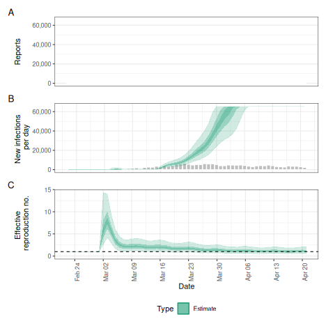
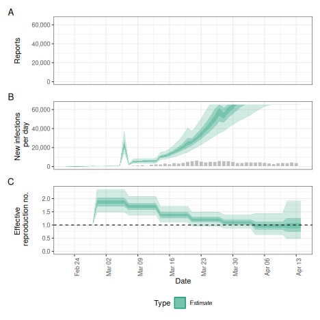
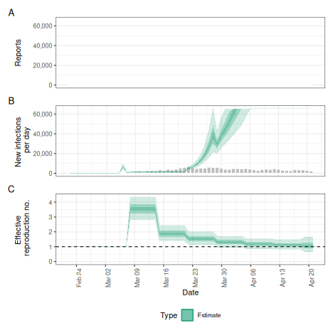

The `estimate_infections()` function encodes a range of different model options.
In this vignette we apply some of these to the example data provided with the _EpiNow2_ package, highlighting differences in inference results and run times.
For mathematical detail on the model please consult the [model definition](estimate_infections.html) vignette, and for a more general description of the use of the function, the [estimate_infections workflow](estimate_infections_workflow.html) vignette.

# Set up

We first load the _EpiNow2_ package.


``` r
library("EpiNow2")
```

In this example we set the number of cores to use to 4 but the optimal value here will depend on the computing resources available.


``` r
options(mc.cores = 4)
```

# Data

We will use an example data set that is included in the package, representing an outbreak of COVID-19 with an initial rapid increase followed by decreasing incidence.


``` r
library("ggplot2")
reported_cases <- example_confirmed[1:60]
ggplot(reported_cases, aes(x =  date, y = confirm)) +
  geom_col() +
  theme_minimal() +
  xlab("Date") +
  ylab("Cases")
```


# Parameters

Before running the model we need to decide on some parameter values, in particular any delays, the generation time, and a prior on the initial reproduction number.

## Delays: incubation period and reporting delay

Delays reflect the time that passes between infection and reporting, if these exist. In this example, we assume two delays, an _incubation period_ (i.e. delay from infection to symptom onset) and a _reporting delay_ (i.e. the delay from symptom onset to being recorded as a symptomatic case). These delays are usually not the same for everyone and are instead characterised by a distribution. For the incubation period we use an example from the literature that is included in the package.


``` r
example_incubation_period
#> - lognormal distribution (max: 14):
#>   meanlog:
#>     - normal distribution:
#>       mean:
#>         1.6
#>       sd:
#>         0.064
#>   sdlog:
#>     - normal distribution:
#>       mean:
#>         0.42
#>       sd:
#>         0.069
```

For the reporting delay, we use a lognormal distribution with mean of 2 days and standard deviation of 1 day.


``` r
reporting_delay <- LogNormal(mean = 2, sd = 1, max = 10)
reporting_delay
#> - lognormal distribution (max: 10):
#>   meanlog:
#>     0.58
#>   sdlog:
#>     0.47
```

_EpiNow2_ provides a feature that allows us to combine these delays into one by summing them up


``` r
delay <- example_incubation_period + reporting_delay
delay
#> Composite distribution:
#> - lognormal distribution (max: 14):
#>   meanlog:
#>     - normal distribution:
#>       mean:
#>         1.6
#>       sd:
#>         0.064
#>   sdlog:
#>     - normal distribution:
#>       mean:
#>         0.42
#>       sd:
#>         0.069
#> - lognormal distribution (max: 10):
#>   meanlog:
#>     0.58
#>   sdlog:
#>     0.47
```

## Generation time

If we want to estimate the reproduction number we need to provide a distribution of generation times. Here again we use an example from the literature that is included with the package.


``` r
example_generation_time
#> - gamma distribution (max: 14):
#>   shape:
#>     - normal distribution:
#>       mean:
#>         1.4
#>       sd:
#>         0.48
#>   rate:
#>     - normal distribution:
#>       mean:
#>         0.38
#>       sd:
#>         0.25
```

## Initial reproduction number

Lastly we need to choose a prior for the initial value of the reproduction number. This is assumed by the model to be normally distributed and we can set the mean and the standard deviation. We decide to set the mean to 2 and the standard deviation to 1.


``` r
rt_prior <- LogNormal(mean = 2, sd = 1)
```

# Running the model

We are now ready to run the model and will in the following show a number of possible options for doing so.

## Weekly random walk (default)

The default model uses a renewal equation for infections and a weekly random walk prior for the reproduction number.


``` r
def <- estimate_infections(reported_cases,
  generation_time = gt_opts(example_generation_time),
  delays = delay_opts(delay),
  rt = rt_opts(prior = rt_prior, rw = 7)
)
#> ℹ Using model /home/sebfunk/R/x86_64-pc-linux-gnu-library/4.5/epinowcast/stan/epinowcast.stan.
#> ℹ Include is /home/sebfunk/R/x86_64-pc-linux-gnu-library/4.5/epinowcast/stan.
#> ! `enw_cache_location` is not set.
#> ℹ Using `tempdir()` at /tmp/RtmpWCvLD6 for the epinowcast model cache location.
#> ℹ Set a specific cache location using `enw_set_cache` to control Stan
#>   recompilation in this R session or across R sessions.
#> ℹ For example: `enw_set_cache(tools::R_user_dir(package = "epinowcast",
#>   "cache"), type = c('session', 'persistent'))`.
#> ℹ See `?enw_set_cache` for details.
#> ℹ Using pathfinder initialization.
#> Path [1] :Initial log joint density = -12627016.298001 
#> Exception: Exception: Exception: neg_binomial_2_log_lpmf: Log location parameter[1] is inf, but must be finite! (in '/tmp/RtmpWCvLD6/include_1/stan/functions/obs_lpmf.stan', line 35, column 4, included from 
#> '/tmp/RtmpWCvLD6/model-1162306a9ad1b9.stan', line 13, column 0) (in '/tmp/RtmpWCvLD6/include_1/stan/functions/delay_lpmf.stan', line 202, column 4, included from 
#> '/tmp/RtmpWCvLD6/model-1162306a9ad1b9.stan', line 18, column 0) (in '/tmp/RtmpWCvLD6/model-1162306a9ad1b9.stan', line 427, column 6 to line 434, column 8) 
#> Exception: Exception: Exception: neg_binomial_2_log_lpmf: Log location parameter[12] is inf, but must be finite! (in '/tmp/RtmpWCvLD6/include_1/stan/functions/obs_lpmf.stan', line 35, column 4, included from 
#> '/tmp/RtmpWCvLD6/model-1162306a9ad1b9.stan', line 13, column 0) (in '/tmp/RtmpWCvLD6/include_1/stan/functions/delay_lpmf.stan', line 202, column 4, included from 
#> '/tmp/RtmpWCvLD6/model-1162306a9ad1b9.stan', line 18, column 0) (in '/tmp/RtmpWCvLD6/model-1162306a9ad1b9.stan', line 427, column 6 to line 434, column 8) 
#> Exception: Exception: Exception: neg_binomial_2_log_lpmf: Log location parameter[32] is inf, but must be finite! (in '/tmp/RtmpWCvLD6/include_1/stan/functions/obs_lpmf.stan', line 35, column 4, included from 
#> '/tmp/RtmpWCvLD6/model-1162306a9ad1b9.stan', line 13, column 0) (in '/tmp/RtmpWCvLD6/include_1/stan/functions/delay_lpmf.stan', line 202, column 4, included from 
#> '/tmp/RtmpWCvLD6/model-1162306a9ad1b9.stan', line 18, column 0) (in '/tmp/RtmpWCvLD6/model-1162306a9ad1b9.stan', line 427, column 6 to line 434, column 8) 
#> Exception: Exception: Exception: neg_binomial_2_log_lpmf: Precision parameter is 0, but must be positive finite! (in '/tmp/RtmpWCvLD6/include_1/stan/functions/obs_lpmf.stan', line 35, column 4, included from 
#> '/tmp/RtmpWCvLD6/model-1162306a9ad1b9.stan', line 13, column 0) (in '/tmp/RtmpWCvLD6/include_1/stan/functions/delay_lpmf.stan', line 202, column 4, included from 
#> '/tmp/RtmpWCvLD6/model-1162306a9ad1b9.stan', line 18, column 0) (in '/tmp/RtmpWCvLD6/model-1162306a9ad1b9.stan', line 427, column 6 to line 434, column 8) 
#> Exception: Exception: Exception: neg_binomial_2_log_lpmf: Precision parameter is 0, but must be positive finite! (in '/tmp/RtmpWCvLD6/include_1/stan/functions/obs_lpmf.stan', line 35, column 4, included from 
#> '/tmp/RtmpWCvLD6/model-1162306a9ad1b9.stan', line 13, column 0) (in '/tmp/RtmpWCvLD6/include_1/stan/functions/delay_lpmf.stan', line 202, column 4, included from 
#> '/tmp/RtmpWCvLD6/model-1162306a9ad1b9.stan', line 18, column 0) (in '/tmp/RtmpWCvLD6/model-1162306a9ad1b9.stan', line 427, column 6 to line 434, column 8) 
#> Error evaluating model log probability: Non-finite function evaluation. 
#> Error evaluating model log probability: Non-finite function evaluation. 
#> Error evaluating model log probability: Non-finite function evaluation. 
#> Error evaluating model log probability: Non-finite function evaluation. 
#> Error evaluating model log probability: Non-finite function evaluation.
#> Chain 1 Warning: file '/tmp/RtmpWCvLD6/init-1162305e21d581_1.json' is being used to initialize all 4 chains!
#> Path [1] : Iter      log prob        ||dx||      ||grad||     alpha      alpha0      # evals       ELBO    Best ELBO        Notes  
#>              99      -6.743e+02      9.802e-03   9.550e+00    3.338e-02  1.000e+00      9463 -7.380e+02 -8.079e+02                   
#> Path [1] : Iter      log prob        ||dx||      ||grad||     alpha      alpha0      # evals       ELBO    Best ELBO        Notes  
#>             189      -6.740e+02      3.714e-04   6.226e-02    1.000e+00  1.000e+00     28449 -7.239e+02 -8.139e+02                   
#> Path [1] :Best Iter: [109] ELBO (-723.924976) evaluations: (28449) 
#> Path [2] :Initial log joint density = -12627016.298001 
#> Exception: Exception: Exception: neg_binomial_2_log_lpmf: Log location parameter[1] is inf, but must be finite! (in '/tmp/RtmpWCvLD6/include_1/stan/functions/obs_lpmf.stan', line 35, column 4, included from 
#> '/tmp/RtmpWCvLD6/model-1162306a9ad1b9.stan', line 13, column 0) (in '/tmp/RtmpWCvLD6/include_1/stan/functions/delay_lpmf.stan', line 202, column 4, included from 
#> '/tmp/RtmpWCvLD6/model-1162306a9ad1b9.stan', line 18, column 0) (in '/tmp/RtmpWCvLD6/model-1162306a9ad1b9.stan', line 427, column 6 to line 434, column 8) 
#> Exception: Exception: Exception: neg_binomial_2_log_lpmf: Log location parameter[12] is inf, but must be finite! (in '/tmp/RtmpWCvLD6/include_1/stan/functions/obs_lpmf.stan', line 35, column 4, included from 
#> '/tmp/RtmpWCvLD6/model-1162306a9ad1b9.stan', line 13, column 0) (in '/tmp/RtmpWCvLD6/include_1/stan/functions/delay_lpmf.stan', line 202, column 4, included from 
#> '/tmp/RtmpWCvLD6/model-1162306a9ad1b9.stan', line 18, column 0) (in '/tmp/RtmpWCvLD6/model-1162306a9ad1b9.stan', line 427, column 6 to line 434, column 8) 
#> Exception: Exception: Exception: neg_binomial_2_log_lpmf: Log location parameter[32] is inf, but must be finite! (in '/tmp/RtmpWCvLD6/include_1/stan/functions/obs_lpmf.stan', line 35, column 4, included from 
#> '/tmp/RtmpWCvLD6/model-1162306a9ad1b9.stan', line 13, column 0) (in '/tmp/RtmpWCvLD6/include_1/stan/functions/delay_lpmf.stan', line 202, column 4, included from 
#> '/tmp/RtmpWCvLD6/model-1162306a9ad1b9.stan', line 18, column 0) (in '/tmp/RtmpWCvLD6/model-1162306a9ad1b9.stan', line 427, column 6 to line 434, column 8) 
#> Exception: Exception: Exception: neg_binomial_2_log_lpmf: Precision parameter is 0, but must be positive finite! (in '/tmp/RtmpWCvLD6/include_1/stan/functions/obs_lpmf.stan', line 35, column 4, included from 
#> '/tmp/RtmpWCvLD6/model-1162306a9ad1b9.stan', line 13, column 0) (in '/tmp/RtmpWCvLD6/include_1/stan/functions/delay_lpmf.stan', line 202, column 4, included from 
#> '/tmp/RtmpWCvLD6/model-1162306a9ad1b9.stan', line 18, column 0) (in '/tmp/RtmpWCvLD6/model-1162306a9ad1b9.stan', line 427, column 6 to line 434, column 8) 
#> Exception: Exception: Exception: neg_binomial_2_log_lpmf: Precision parameter is 0, but must be positive finite! (in '/tmp/RtmpWCvLD6/include_1/stan/functions/obs_lpmf.stan', line 35, column 4, included from 
#> '/tmp/RtmpWCvLD6/model-1162306a9ad1b9.stan', line 13, column 0) (in '/tmp/RtmpWCvLD6/include_1/stan/functions/delay_lpmf.stan', line 202, column 4, included from 
#> '/tmp/RtmpWCvLD6/model-1162306a9ad1b9.stan', line 18, column 0) (in '/tmp/RtmpWCvLD6/model-1162306a9ad1b9.stan', line 427, column 6 to line 434, column 8) 
#> Error evaluating model log probability: Non-finite function evaluation. 
#> Error evaluating model log probability: Non-finite function evaluation. 
#> Error evaluating model log probability: Non-finite function evaluation. 
#> Error evaluating model log probability: Non-finite function evaluation. 
#> Error evaluating model log probability: Non-finite function evaluation. 
#> Path [2] : Iter      log prob        ||dx||      ||grad||     alpha      alpha0      # evals       ELBO    Best ELBO        Notes  
#>              99      -6.743e+02      9.802e-03   9.550e+00    3.338e-02  1.000e+00      9463 -7.357e+02 -8.233e+02                   
#> Path [2] : Iter      log prob        ||dx||      ||grad||     alpha      alpha0      # evals       ELBO    Best ELBO        Notes  
#>             189      -6.740e+02      3.714e-04   6.226e-02    1.000e+00  1.000e+00     28449 -7.293e+02 -7.979e+02                   
#> Path [2] :Best Iter: [109] ELBO (-729.342824) evaluations: (28449) 
#> Path [3] :Initial log joint density = -12627016.298001 
#> Exception: Exception: Exception: neg_binomial_2_log_lpmf: Log location parameter[1] is inf, but must be finite! (in '/tmp/RtmpWCvLD6/include_1/stan/functions/obs_lpmf.stan', line 35, column 4, included from 
#> '/tmp/RtmpWCvLD6/model-1162306a9ad1b9.stan', line 13, column 0) (in '/tmp/RtmpWCvLD6/include_1/stan/functions/delay_lpmf.stan', line 202, column 4, included from 
#> '/tmp/RtmpWCvLD6/model-1162306a9ad1b9.stan', line 18, column 0) (in '/tmp/RtmpWCvLD6/model-1162306a9ad1b9.stan', line 427, column 6 to line 434, column 8) 
#> Exception: Exception: Exception: neg_binomial_2_log_lpmf: Log location parameter[12] is inf, but must be finite! (in '/tmp/RtmpWCvLD6/include_1/stan/functions/obs_lpmf.stan', line 35, column 4, included from 
#> '/tmp/RtmpWCvLD6/model-1162306a9ad1b9.stan', line 13, column 0) (in '/tmp/RtmpWCvLD6/include_1/stan/functions/delay_lpmf.stan', line 202, column 4, included from 
#> '/tmp/RtmpWCvLD6/model-1162306a9ad1b9.stan', line 18, column 0) (in '/tmp/RtmpWCvLD6/model-1162306a9ad1b9.stan', line 427, column 6 to line 434, column 8) 
#> Exception: Exception: Exception: neg_binomial_2_log_lpmf: Log location parameter[32] is inf, but must be finite! (in '/tmp/RtmpWCvLD6/include_1/stan/functions/obs_lpmf.stan', line 35, column 4, included from 
#> '/tmp/RtmpWCvLD6/model-1162306a9ad1b9.stan', line 13, column 0) (in '/tmp/RtmpWCvLD6/include_1/stan/functions/delay_lpmf.stan', line 202, column 4, included from 
#> '/tmp/RtmpWCvLD6/model-1162306a9ad1b9.stan', line 18, column 0) (in '/tmp/RtmpWCvLD6/model-1162306a9ad1b9.stan', line 427, column 6 to line 434, column 8) 
#> Exception: Exception: Exception: neg_binomial_2_log_lpmf: Precision parameter is 0, but must be positive finite! (in '/tmp/RtmpWCvLD6/include_1/stan/functions/obs_lpmf.stan', line 35, column 4, included from 
#> '/tmp/RtmpWCvLD6/model-1162306a9ad1b9.stan', line 13, column 0) (in '/tmp/RtmpWCvLD6/include_1/stan/functions/delay_lpmf.stan', line 202, column 4, included from 
#> '/tmp/RtmpWCvLD6/model-1162306a9ad1b9.stan', line 18, column 0) (in '/tmp/RtmpWCvLD6/model-1162306a9ad1b9.stan', line 427, column 6 to line 434, column 8) 
#> Exception: Exception: Exception: neg_binomial_2_log_lpmf: Precision parameter is 0, but must be positive finite! (in '/tmp/RtmpWCvLD6/include_1/stan/functions/obs_lpmf.stan', line 35, column 4, included from 
#> '/tmp/RtmpWCvLD6/model-1162306a9ad1b9.stan', line 13, column 0) (in '/tmp/RtmpWCvLD6/include_1/stan/functions/delay_lpmf.stan', line 202, column 4, included from 
#> '/tmp/RtmpWCvLD6/model-1162306a9ad1b9.stan', line 18, column 0) (in '/tmp/RtmpWCvLD6/model-1162306a9ad1b9.stan', line 427, column 6 to line 434, column 8) 
#> Error evaluating model log probability: Non-finite function evaluation. 
#> Error evaluating model log probability: Non-finite function evaluation. 
#> Error evaluating model log probability: Non-finite function evaluation. 
#> Error evaluating model log probability: Non-finite function evaluation. 
#> Error evaluating model log probability: Non-finite function evaluation. 
#> Path [3] : Iter      log prob        ||dx||      ||grad||     alpha      alpha0      # evals       ELBO    Best ELBO        Notes  
#>              99      -6.743e+02      9.802e-03   9.550e+00    3.338e-02  1.000e+00      9463 -7.391e+02 -8.080e+02                   
#> Path [3] : Iter      log prob        ||dx||      ||grad||     alpha      alpha0      # evals       ELBO    Best ELBO        Notes  
#>             189      -6.740e+02      3.714e-04   6.226e-02    1.000e+00  1.000e+00     28449 -7.243e+02 -8.001e+02                   
#> Path [3] :Best Iter: [109] ELBO (-724.275784) evaluations: (28449) 
#> Path [4] :Initial log joint density = -12627016.298001 
#> Exception: Exception: Exception: neg_binomial_2_log_lpmf: Log location parameter[1] is inf, but must be finite! (in '/tmp/RtmpWCvLD6/include_1/stan/functions/obs_lpmf.stan', line 35, column 4, included from 
#> '/tmp/RtmpWCvLD6/model-1162306a9ad1b9.stan', line 13, column 0) (in '/tmp/RtmpWCvLD6/include_1/stan/functions/delay_lpmf.stan', line 202, column 4, included from 
#> '/tmp/RtmpWCvLD6/model-1162306a9ad1b9.stan', line 18, column 0) (in '/tmp/RtmpWCvLD6/model-1162306a9ad1b9.stan', line 427, column 6 to line 434, column 8) 
#> Exception: Exception: Exception: neg_binomial_2_log_lpmf: Log location parameter[12] is inf, but must be finite! (in '/tmp/RtmpWCvLD6/include_1/stan/functions/obs_lpmf.stan', line 35, column 4, included from 
#> '/tmp/RtmpWCvLD6/model-1162306a9ad1b9.stan', line 13, column 0) (in '/tmp/RtmpWCvLD6/include_1/stan/functions/delay_lpmf.stan', line 202, column 4, included from 
#> '/tmp/RtmpWCvLD6/model-1162306a9ad1b9.stan', line 18, column 0) (in '/tmp/RtmpWCvLD6/model-1162306a9ad1b9.stan', line 427, column 6 to line 434, column 8) 
#> Exception: Exception: Exception: neg_binomial_2_log_lpmf: Log location parameter[32] is inf, but must be finite! (in '/tmp/RtmpWCvLD6/include_1/stan/functions/obs_lpmf.stan', line 35, column 4, included from 
#> '/tmp/RtmpWCvLD6/model-1162306a9ad1b9.stan', line 13, column 0) (in '/tmp/RtmpWCvLD6/include_1/stan/functions/delay_lpmf.stan', line 202, column 4, included from 
#> '/tmp/RtmpWCvLD6/model-1162306a9ad1b9.stan', line 18, column 0) (in '/tmp/RtmpWCvLD6/model-1162306a9ad1b9.stan', line 427, column 6 to line 434, column 8) 
#> Exception: Exception: Exception: neg_binomial_2_log_lpmf: Precision parameter is 0, but must be positive finite! (in '/tmp/RtmpWCvLD6/include_1/stan/functions/obs_lpmf.stan', line 35, column 4, included from 
#> '/tmp/RtmpWCvLD6/model-1162306a9ad1b9.stan', line 13, column 0) (in '/tmp/RtmpWCvLD6/include_1/stan/functions/delay_lpmf.stan', line 202, column 4, included from 
#> '/tmp/RtmpWCvLD6/model-1162306a9ad1b9.stan', line 18, column 0) (in '/tmp/RtmpWCvLD6/model-1162306a9ad1b9.stan', line 427, column 6 to line 434, column 8) 
#> Exception: Exception: Exception: neg_binomial_2_log_lpmf: Precision parameter is 0, but must be positive finite! (in '/tmp/RtmpWCvLD6/include_1/stan/functions/obs_lpmf.stan', line 35, column 4, included from 
#> '/tmp/RtmpWCvLD6/model-1162306a9ad1b9.stan', line 13, column 0) (in '/tmp/RtmpWCvLD6/include_1/stan/functions/delay_lpmf.stan', line 202, column 4, included from 
#> '/tmp/RtmpWCvLD6/model-1162306a9ad1b9.stan', line 18, column 0) (in '/tmp/RtmpWCvLD6/model-1162306a9ad1b9.stan', line 427, column 6 to line 434, column 8) 
#> Error evaluating model log probability: Non-finite function evaluation. 
#> Error evaluating model log probability: Non-finite function evaluation. 
#> Error evaluating model log probability: Non-finite function evaluation. 
#> Error evaluating model log probability: Non-finite function evaluation. 
#> Error evaluating model log probability: Non-finite function evaluation. 
#> Path [4] : Iter      log prob        ||dx||      ||grad||     alpha      alpha0      # evals       ELBO    Best ELBO        Notes  
#>              99      -6.743e+02      9.802e-03   9.550e+00    3.338e-02  1.000e+00      9463 -7.374e+02 -7.976e+02                   
#> Path [4] : Iter      log prob        ||dx||      ||grad||     alpha      alpha0      # evals       ELBO    Best ELBO        Notes  
#>             189      -6.740e+02      3.714e-04   6.226e-02    1.000e+00  1.000e+00     28449 -7.278e+02 -7.925e+02                   
#> Path [4] :Best Iter: [108] ELBO (-727.777326) evaluations: (28449) 
#> Pareto k value (1.4) is greater than 0.7. Importance resampling was not able to improve the approximation, which may indicate that the approximation itself is poor. 
#> Finished in  1.6 seconds.
#> ℹ Fitting the model using NUTS
#> Init values were only set for a subset of parameters. 
#> Missing init values for the following parameters:
#>  - chain 1: expr_r_int, expl_beta_sd, refp_mean_int, refp_sd_int, refp_mean_beta, refp_sd_beta, refp_mean_beta_sd, refp_sd_beta_sd, refnp_int, refnp_beta, refnp_beta_sd, rep_beta, rep_beta_sd, miss_int, miss_beta, miss_beta_sd
#>  - chain 2: expr_r_int, expl_beta_sd, refp_mean_int, refp_sd_int, refp_mean_beta, refp_sd_beta, refp_mean_beta_sd, refp_sd_beta_sd, refnp_int, refnp_beta, refnp_beta_sd, rep_beta, rep_beta_sd, miss_int, miss_beta, miss_beta_sd
#>  - chain 3: expr_r_int, expl_beta_sd, refp_mean_int, refp_sd_int, refp_mean_beta, refp_sd_beta, refp_mean_beta_sd, refp_sd_beta_sd, refnp_int, refnp_beta, refnp_beta_sd, rep_beta, rep_beta_sd, miss_int, miss_beta, miss_beta_sd
#>  - chain 4: expr_r_int, expl_beta_sd, refp_mean_int, refp_sd_int, refp_mean_beta, refp_sd_beta, refp_mean_beta_sd, refp_sd_beta_sd, refnp_int, refnp_beta, refnp_beta_sd, rep_beta, rep_beta_sd, miss_int, miss_beta, miss_beta_sd
#> 
#> To disable this message use options(cmdstanr_warn_inits = FALSE).
#> 
#> Chain 2 Informational Message: The current Metropolis proposal is about to be rejected because of the following issue:
#> Chain 2 Exception: Exception: Exception: neg_binomial_2_log_lpmf: Log location parameter[1] is -nan, but must be finite! (in '/tmp/RtmpWCvLD6/include_1/stan/functions/obs_lpmf.stan', line 35, column 4, included from
#> Chain 2 '/tmp/RtmpWCvLD6/model-1162306a9ad1b9.stan', line 13, column 0) (in '/tmp/RtmpWCvLD6/include_1/stan/functions/delay_lpmf.stan', line 202, column 4, included from
#> Chain 2 '/tmp/RtmpWCvLD6/model-1162306a9ad1b9.stan', line 18, column 0) (in '/tmp/RtmpWCvLD6/model-1162306a9ad1b9.stan', line 427, column 6 to line 434, column 8)
#> Chain 2 If this warning occurs sporadically, such as for highly constrained variable types like covariance matrices, then the sampler is fine,
#> Chain 2 but if this warning occurs often then your model may be either severely ill-conditioned or misspecified.
#> Chain 2 
#> Chain 2 Informational Message: The current Metropolis proposal is about to be rejected because of the following issue:
#> Chain 2 Exception: Exception: Exception: neg_binomial_2_log_lpmf: Log location parameter[8] is inf, but must be finite! (in '/tmp/RtmpWCvLD6/include_1/stan/functions/obs_lpmf.stan', line 35, column 4, included from
#> Chain 2 '/tmp/RtmpWCvLD6/model-1162306a9ad1b9.stan', line 13, column 0) (in '/tmp/RtmpWCvLD6/include_1/stan/functions/delay_lpmf.stan', line 202, column 4, included from
#> Chain 2 '/tmp/RtmpWCvLD6/model-1162306a9ad1b9.stan', line 18, column 0) (in '/tmp/RtmpWCvLD6/model-1162306a9ad1b9.stan', line 427, column 6 to line 434, column 8)
#> Chain 2 If this warning occurs sporadically, such as for highly constrained variable types like covariance matrices, then the sampler is fine,
#> Chain 2 but if this warning occurs often then your model may be either severely ill-conditioned or misspecified.
#> Chain 2 
#> Chain 3 Informational Message: The current Metropolis proposal is about to be rejected because of the following issue:
#> Chain 3 Exception: Exception: Exception: neg_binomial_2_log_lpmf: Log location parameter[8] is inf, but must be finite! (in '/tmp/RtmpWCvLD6/include_1/stan/functions/obs_lpmf.stan', line 35, column 4, included from
#> Chain 3 '/tmp/RtmpWCvLD6/model-1162306a9ad1b9.stan', line 13, column 0) (in '/tmp/RtmpWCvLD6/include_1/stan/functions/delay_lpmf.stan', line 202, column 4, included from
#> Chain 3 '/tmp/RtmpWCvLD6/model-1162306a9ad1b9.stan', line 18, column 0) (in '/tmp/RtmpWCvLD6/model-1162306a9ad1b9.stan', line 427, column 6 to line 434, column 8)
#> Chain 3 If this warning occurs sporadically, such as for highly constrained variable types like covariance matrices, then the sampler is fine,
#> Chain 3 but if this warning occurs often then your model may be either severely ill-conditioned or misspecified.
#> Chain 3 
#> Chain 3 Informational Message: The current Metropolis proposal is about to be rejected because of the following issue:
#> Chain 3 Exception: Exception: Exception: neg_binomial_2_log_lpmf: Log location parameter[8] is inf, but must be finite! (in '/tmp/RtmpWCvLD6/include_1/stan/functions/obs_lpmf.stan', line 35, column 4, included from
#> Chain 3 '/tmp/RtmpWCvLD6/model-1162306a9ad1b9.stan', line 13, column 0) (in '/tmp/RtmpWCvLD6/include_1/stan/functions/delay_lpmf.stan', line 202, column 4, included from
#> Chain 3 '/tmp/RtmpWCvLD6/model-1162306a9ad1b9.stan', line 18, column 0) (in '/tmp/RtmpWCvLD6/model-1162306a9ad1b9.stan', line 427, column 6 to line 434, column 8)
#> Chain 3 If this warning occurs sporadically, such as for highly constrained variable types like covariance matrices, then the sampler is fine,
#> Chain 3 but if this warning occurs often then your model may be either severely ill-conditioned or misspecified.
#> Chain 3 
#> Chain 4 Informational Message: The current Metropolis proposal is about to be rejected because of the following issue:
#> Chain 4 Exception: Exception: Exception: neg_binomial_2_log_lpmf: Log location parameter[8] is inf, but must be finite! (in '/tmp/RtmpWCvLD6/include_1/stan/functions/obs_lpmf.stan', line 35, column 4, included from
#> Chain 4 '/tmp/RtmpWCvLD6/model-1162306a9ad1b9.stan', line 13, column 0) (in '/tmp/RtmpWCvLD6/include_1/stan/functions/delay_lpmf.stan', line 202, column 4, included from
#> Chain 4 '/tmp/RtmpWCvLD6/model-1162306a9ad1b9.stan', line 18, column 0) (in '/tmp/RtmpWCvLD6/model-1162306a9ad1b9.stan', line 427, column 6 to line 434, column 8)
#> Chain 4 If this warning occurs sporadically, such as for highly constrained variable types like covariance matrices, then the sampler is fine,
#> Chain 4 but if this warning occurs often then your model may be either severely ill-conditioned or misspecified.
#> Chain 4 
#> Chain 4 Informational Message: The current Metropolis proposal is about to be rejected because of the following issue:
#> Chain 4 Exception: Exception: Exception: neg_binomial_2_log_lpmf: Log location parameter[8] is inf, but must be finite! (in '/tmp/RtmpWCvLD6/include_1/stan/functions/obs_lpmf.stan', line 35, column 4, included from
#> Chain 4 '/tmp/RtmpWCvLD6/model-1162306a9ad1b9.stan', line 13, column 0) (in '/tmp/RtmpWCvLD6/include_1/stan/functions/delay_lpmf.stan', line 202, column 4, included from
#> Chain 4 '/tmp/RtmpWCvLD6/model-1162306a9ad1b9.stan', line 18, column 0) (in '/tmp/RtmpWCvLD6/model-1162306a9ad1b9.stan', line 427, column 6 to line 434, column 8)
#> Chain 4 If this warning occurs sporadically, such as for highly constrained variable types like covariance matrices, then the sampler is fine,
#> Chain 4 but if this warning occurs often then your model may be either severely ill-conditioned or misspecified.
#> Chain 4 
#> Chain 4 Informational Message: The current Metropolis proposal is about to be rejected because of the following issue:
#> Chain 4 Exception: Exception: Exception: neg_binomial_2_log_lpmf: Log location parameter[8] is inf, but must be finite! (in '/tmp/RtmpWCvLD6/include_1/stan/functions/obs_lpmf.stan', line 35, column 4, included from
#> Chain 4 '/tmp/RtmpWCvLD6/model-1162306a9ad1b9.stan', line 13, column 0) (in '/tmp/RtmpWCvLD6/include_1/stan/functions/delay_lpmf.stan', line 202, column 4, included from
#> Chain 4 '/tmp/RtmpWCvLD6/model-1162306a9ad1b9.stan', line 18, column 0) (in '/tmp/RtmpWCvLD6/model-1162306a9ad1b9.stan', line 427, column 6 to line 434, column 8)
#> Chain 4 If this warning occurs sporadically, such as for highly constrained variable types like covariance matrices, then the sampler is fine,
#> Chain 4 but if this warning occurs often then your model may be either severely ill-conditioned or misspecified.
#> Chain 4 
#> Chain 4 Informational Message: The current Metropolis proposal is about to be rejected because of the following issue:
#> Chain 4 Exception: Exception: Exception: neg_binomial_2_log_lpmf: Log location parameter[11] is inf, but must be finite! (in '/tmp/RtmpWCvLD6/include_1/stan/functions/obs_lpmf.stan', line 35, column 4, included from
#> Chain 4 '/tmp/RtmpWCvLD6/model-1162306a9ad1b9.stan', line 13, column 0) (in '/tmp/RtmpWCvLD6/include_1/stan/functions/delay_lpmf.stan', line 202, column 4, included from
#> Chain 4 '/tmp/RtmpWCvLD6/model-1162306a9ad1b9.stan', line 18, column 0) (in '/tmp/RtmpWCvLD6/model-1162306a9ad1b9.stan', line 427, column 6 to line 434, column 8)
#> Chain 4 If this warning occurs sporadically, such as for highly constrained variable types like covariance matrices, then the sampler is fine,
#> Chain 4 but if this warning occurs often then your model may be either severely ill-conditioned or misspecified.
#> Chain 4 
#> Warning: 18 of 8000 (0.0%) transitions ended with a divergence.
#> See https://mc-stan.org/misc/warnings for details.
# summarise results
summary(def)
#>                         measure                  estimate
#>                          <char>                    <char>
#> 1:       New infections per day 231206 (158014 -- 345961)
#> 2:   Expected change in reports                    Stable
#> 3:   Effective reproduction no.         1.1 (0.66 -- 1.6)
#> 4:               Rate of growth      0.072 (-0.42 -- 0.5)
#> 5: Doubling/halving time (days)         9.6 (1.4 -- -1.7)
# summary plot
plot(def)
#> Warning in max.default(structure(numeric(0), class = "Date"), na.rm = FALSE):
#> no non-missing arguments to max; returning -Inf
#> Warning in max.default(structure(numeric(0), class = "Date"), na.rm = FALSE):
#> no non-missing arguments to max; returning -Inf
#> Warning in max.default(structure(numeric(0), class = "Date"), na.rm = FALSE):
#> no non-missing arguments to max; returning -Inf
#> Warning in max.default(structure(numeric(0), class = "Date"), na.rm = FALSE):
#> no non-missing arguments to max; returning -Inf
#> Warning: Removed 1 row containing missing values or values outside the scale range
#> (`geom_ribbon()`).
#> Removed 1 row containing missing values or values outside the scale range
#> (`geom_ribbon()`).
#> Removed 1 row containing missing values or values outside the scale range
#> (`geom_ribbon()`).
```


## Daily random walk

Instead of weekly steps, we can use a daily random walk for finer-grained estimates.


``` r
daily <- estimate_infections(reported_cases,
  generation_time = gt_opts(example_generation_time),
  delays = delay_opts(delay),
  rt = rt_opts(prior = rt_prior, rw = 1)
)
#> ℹ Using model /home/sebfunk/R/x86_64-pc-linux-gnu-library/4.5/epinowcast/stan/epinowcast.stan.
#> ℹ Include is /home/sebfunk/R/x86_64-pc-linux-gnu-library/4.5/epinowcast/stan.
#> ! `enw_cache_location` is not set.
#> ℹ Using `tempdir()` at /tmp/RtmpWCvLD6 for the epinowcast model cache location.
#> ℹ Set a specific cache location using `enw_set_cache` to control Stan
#>   recompilation in this R session or across R sessions.
#> ℹ For example: `enw_set_cache(tools::R_user_dir(package = "epinowcast",
#>   "cache"), type = c('session', 'persistent'))`.
#> ℹ See `?enw_set_cache` for details.
#> ℹ Using pathfinder initialization.
#> Path [1] :Initial log joint density = -17005987.774787 
#> Exception: Exception: Exception: neg_binomial_2_log_lpmf: Log location parameter[1] is inf, but must be finite! (in '/tmp/RtmpWCvLD6/include_1/stan/functions/obs_lpmf.stan', line 35, column 4, included from 
#> '/tmp/RtmpWCvLD6/model-1162306a9ad1b9.stan', line 13, column 0) (in '/tmp/RtmpWCvLD6/include_1/stan/functions/delay_lpmf.stan', line 202, column 4, included from 
#> '/tmp/RtmpWCvLD6/model-1162306a9ad1b9.stan', line 18, column 0) (in '/tmp/RtmpWCvLD6/model-1162306a9ad1b9.stan', line 427, column 6 to line 434, column 8) 
#> Exception: Exception: Exception: neg_binomial_2_log_lpmf: Precision parameter is 0, but must be positive finite! (in '/tmp/RtmpWCvLD6/include_1/stan/functions/obs_lpmf.stan', line 35, column 4, included from 
#> '/tmp/RtmpWCvLD6/model-1162306a9ad1b9.stan', line 13, column 0) (in '/tmp/RtmpWCvLD6/include_1/stan/functions/delay_lpmf.stan', line 202, column 4, included from 
#> '/tmp/RtmpWCvLD6/model-1162306a9ad1b9.stan', line 18, column 0) (in '/tmp/RtmpWCvLD6/model-1162306a9ad1b9.stan', line 427, column 6 to line 434, column 8) 
#> Exception: Exception: Exception: neg_binomial_2_log_lpmf: Precision parameter is 0, but must be positive finite! (in '/tmp/RtmpWCvLD6/include_1/stan/functions/obs_lpmf.stan', line 35, column 4, included from 
#> '/tmp/RtmpWCvLD6/model-1162306a9ad1b9.stan', line 13, column 0) (in '/tmp/RtmpWCvLD6/include_1/stan/functions/delay_lpmf.stan', line 202, column 4, included from 
#> '/tmp/RtmpWCvLD6/model-1162306a9ad1b9.stan', line 18, column 0) (in '/tmp/RtmpWCvLD6/model-1162306a9ad1b9.stan', line 427, column 6 to line 434, column 8) 
#> Exception: Exception: Exception: neg_binomial_2_log_lpmf: Precision parameter is 0, but must be positive finite! (in '/tmp/RtmpWCvLD6/include_1/stan/functions/obs_lpmf.stan', line 35, column 4, included from 
#> '/tmp/RtmpWCvLD6/model-1162306a9ad1b9.stan', line 13, column 0) (in '/tmp/RtmpWCvLD6/include_1/stan/functions/delay_lpmf.stan', line 202, column 4, included from 
#> '/tmp/RtmpWCvLD6/model-1162306a9ad1b9.stan', line 18, column 0) (in '/tmp/RtmpWCvLD6/model-1162306a9ad1b9.stan', line 427, column 6 to line 434, column 8) 
#> Exception: Exception: Exception: neg_binomial_2_log_lpmf: Precision parameter is 0, but must be positive finite! (in '/tmp/RtmpWCvLD6/include_1/stan/functions/obs_lpmf.stan', line 35, column 4, included from 
#> '/tmp/RtmpWCvLD6/model-1162306a9ad1b9.stan', line 13, column 0) (in '/tmp/RtmpWCvLD6/include_1/stan/functions/delay_lpmf.stan', line 202, column 4, included from 
#> '/tmp/RtmpWCvLD6/model-1162306a9ad1b9.stan', line 18, column 0) (in '/tmp/RtmpWCvLD6/model-1162306a9ad1b9.stan', line 427, column 6 to line 434, column 8) 
#> Error evaluating model log probability: Non-finite function evaluation. 
#> Error evaluating model log probability: Non-finite function evaluation. 
#> Error evaluating model log probability: Non-finite function evaluation. 
#> Error evaluating model log probability: Non-finite function evaluation. 
#> Error evaluating model log probability: Non-finite function evaluation.
#> Chain 1 Warning: file '/tmp/RtmpWCvLD6/init-116230563479c1_1.json' is being used to initialize all 4 chains!
#> Path [1] : Iter      log prob        ||dx||      ||grad||     alpha      alpha0      # evals       ELBO    Best ELBO        Notes  
#>              99      -6.339e+02      3.864e-02   3.838e+01    8.908e-01  8.908e-02      9547 -9.070e+02 -1.775e+03                   
#> Path [1] : Iter      log prob        ||dx||      ||grad||     alpha      alpha0      # evals       ELBO    Best ELBO        Notes  
#>             199      -6.222e+02      1.450e-03   2.341e+01    4.778e-01  4.778e-01     31556 -9.070e+02 -6.235e+04                   
#> Path [1] : Iter      log prob        ||dx||      ||grad||     alpha      alpha0      # evals       ELBO    Best ELBO        Notes  
#>             299      -6.185e+02      2.730e-03   5.216e+01    1.000e+00  1.000e+00     66132 -9.070e+02 -6.916e+04                   
#> Path [1] : Iter      log prob        ||dx||      ||grad||     alpha      alpha0      # evals       ELBO    Best ELBO        Notes  
#>             399      -6.161e+02      8.854e-03   3.178e+01    9.511e-01  9.511e-01    112974 -9.070e+02 -3.784e+03                   
#> Path [1] : Iter      log prob        ||dx||      ||grad||     alpha      alpha0      # evals       ELBO    Best ELBO        Notes  
#>             499      -6.145e+02      1.558e-02   4.315e+01    1.000e+00  1.000e+00    172100 -9.070e+02 -1.591e+06                   
#> Path [1] : Iter      log prob        ||dx||      ||grad||     alpha      alpha0      # evals       ELBO    Best ELBO        Notes  
#>             599      -6.134e+02      9.752e-04   2.680e+01    6.650e-01  6.650e-01    243659 -9.070e+02 -4.347e+05                   
#> Path [1] : Iter      log prob        ||dx||      ||grad||     alpha      alpha0      # evals       ELBO    Best ELBO        Notes  
#>             699      -6.121e+02      2.193e-02   4.141e+01    1.000e+00  1.000e+00    327974 -9.070e+02 -1.665e+03                   
#> Path [1] : Iter      log prob        ||dx||      ||grad||     alpha      alpha0      # evals       ELBO    Best ELBO        Notes  
#>             799      -6.111e+02      1.107e-03   4.006e+01    1.000e+00  1.000e+00    425154 -9.070e+02 -1.971e+04                   
#> Path [1] : Iter      log prob        ||dx||      ||grad||     alpha      alpha0      # evals       ELBO    Best ELBO        Notes  
#>             899      -6.106e+02      9.280e-03   2.933e+01    1.000e+00  1.000e+00    534876 -9.070e+02 -2.234e+05                   
#> Path [1] : Iter      log prob        ||dx||      ||grad||     alpha      alpha0      # evals       ELBO    Best ELBO        Notes  
#>             999      -6.096e+02      6.772e-03   3.948e+01    6.792e-02  1.000e+00    657436 -9.070e+02 -2.948e+03                   
#> Path [1] : Iter      log prob        ||dx||      ||grad||     alpha      alpha0      # evals       ELBO    Best ELBO        Notes  
#>            1000      -6.096e+02      1.981e-02   4.047e+01    6.853e-01  6.853e-02    658725 -9.070e+02 -1.003e+06                   
#> Path [1] :Best Iter: [26] ELBO (-906.992019) evaluations: (658725) 
#> Path [2] :Initial log joint density = -17005987.774787 
#> Exception: Exception: Exception: neg_binomial_2_log_lpmf: Log location parameter[1] is inf, but must be finite! (in '/tmp/RtmpWCvLD6/include_1/stan/functions/obs_lpmf.stan', line 35, column 4, included from 
#> '/tmp/RtmpWCvLD6/model-1162306a9ad1b9.stan', line 13, column 0) (in '/tmp/RtmpWCvLD6/include_1/stan/functions/delay_lpmf.stan', line 202, column 4, included from 
#> '/tmp/RtmpWCvLD6/model-1162306a9ad1b9.stan', line 18, column 0) (in '/tmp/RtmpWCvLD6/model-1162306a9ad1b9.stan', line 427, column 6 to line 434, column 8) 
#> Exception: Exception: Exception: neg_binomial_2_log_lpmf: Precision parameter is 0, but must be positive finite! (in '/tmp/RtmpWCvLD6/include_1/stan/functions/obs_lpmf.stan', line 35, column 4, included from 
#> '/tmp/RtmpWCvLD6/model-1162306a9ad1b9.stan', line 13, column 0) (in '/tmp/RtmpWCvLD6/include_1/stan/functions/delay_lpmf.stan', line 202, column 4, included from 
#> '/tmp/RtmpWCvLD6/model-1162306a9ad1b9.stan', line 18, column 0) (in '/tmp/RtmpWCvLD6/model-1162306a9ad1b9.stan', line 427, column 6 to line 434, column 8) 
#> Exception: Exception: Exception: neg_binomial_2_log_lpmf: Precision parameter is 0, but must be positive finite! (in '/tmp/RtmpWCvLD6/include_1/stan/functions/obs_lpmf.stan', line 35, column 4, included from 
#> '/tmp/RtmpWCvLD6/model-1162306a9ad1b9.stan', line 13, column 0) (in '/tmp/RtmpWCvLD6/include_1/stan/functions/delay_lpmf.stan', line 202, column 4, included from 
#> '/tmp/RtmpWCvLD6/model-1162306a9ad1b9.stan', line 18, column 0) (in '/tmp/RtmpWCvLD6/model-1162306a9ad1b9.stan', line 427, column 6 to line 434, column 8) 
#> Exception: Exception: Exception: neg_binomial_2_log_lpmf: Precision parameter is 0, but must be positive finite! (in '/tmp/RtmpWCvLD6/include_1/stan/functions/obs_lpmf.stan', line 35, column 4, included from 
#> '/tmp/RtmpWCvLD6/model-1162306a9ad1b9.stan', line 13, column 0) (in '/tmp/RtmpWCvLD6/include_1/stan/functions/delay_lpmf.stan', line 202, column 4, included from 
#> '/tmp/RtmpWCvLD6/model-1162306a9ad1b9.stan', line 18, column 0) (in '/tmp/RtmpWCvLD6/model-1162306a9ad1b9.stan', line 427, column 6 to line 434, column 8) 
#> Exception: Exception: Exception: neg_binomial_2_log_lpmf: Precision parameter is 0, but must be positive finite! (in '/tmp/RtmpWCvLD6/include_1/stan/functions/obs_lpmf.stan', line 35, column 4, included from 
#> '/tmp/RtmpWCvLD6/model-1162306a9ad1b9.stan', line 13, column 0) (in '/tmp/RtmpWCvLD6/include_1/stan/functions/delay_lpmf.stan', line 202, column 4, included from 
#> '/tmp/RtmpWCvLD6/model-1162306a9ad1b9.stan', line 18, column 0) (in '/tmp/RtmpWCvLD6/model-1162306a9ad1b9.stan', line 427, column 6 to line 434, column 8) 
#> Error evaluating model log probability: Non-finite function evaluation. 
#> Error evaluating model log probability: Non-finite function evaluation. 
#> Error evaluating model log probability: Non-finite function evaluation. 
#> Error evaluating model log probability: Non-finite function evaluation. 
#> Error evaluating model log probability: Non-finite function evaluation. 
#> Path [2] : Iter      log prob        ||dx||      ||grad||     alpha      alpha0      # evals       ELBO    Best ELBO        Notes  
#>              99      -6.339e+02      3.864e-02   3.838e+01    8.908e-01  8.908e-02      9547 -9.238e+02 -2.553e+03                   
#> Path [2] : Iter      log prob        ||dx||      ||grad||     alpha      alpha0      # evals       ELBO    Best ELBO        Notes  
#>             199      -6.222e+02      1.450e-03   2.341e+01    4.778e-01  4.778e-01     31556 -9.238e+02 -2.098e+04                   
#> Path [2] : Iter      log prob        ||dx||      ||grad||     alpha      alpha0      # evals       ELBO    Best ELBO        Notes  
#>             299      -6.185e+02      2.730e-03   5.216e+01    1.000e+00  1.000e+00     66132 -9.238e+02 -1.535e+04                   
#> Path [2] : Iter      log prob        ||dx||      ||grad||     alpha      alpha0      # evals       ELBO    Best ELBO        Notes  
#>             399      -6.161e+02      8.854e-03   3.178e+01    9.511e-01  9.511e-01    112974 -9.238e+02 -2.713e+03                   
#> Path [2] : Iter      log prob        ||dx||      ||grad||     alpha      alpha0      # evals       ELBO    Best ELBO        Notes  
#>             499      -6.145e+02      1.558e-02   4.315e+01    1.000e+00  1.000e+00    172100 -9.238e+02 -8.213e+05                   
#> Path [2] : Iter      log prob        ||dx||      ||grad||     alpha      alpha0      # evals       ELBO    Best ELBO        Notes  
#>             599      -6.134e+02      9.752e-04   2.680e+01    6.650e-01  6.650e-01    243659 -9.238e+02 -5.055e+04                   
#> Path [2] : Iter      log prob        ||dx||      ||grad||     alpha      alpha0      # evals       ELBO    Best ELBO        Notes  
#>             699      -6.121e+02      2.193e-02   4.141e+01    1.000e+00  1.000e+00    327974 -9.238e+02 -1.580e+03                   
#> Path [2] : Iter      log prob        ||dx||      ||grad||     alpha      alpha0      # evals       ELBO    Best ELBO        Notes  
#>             799      -6.111e+02      1.107e-03   4.006e+01    1.000e+00  1.000e+00    425154 -9.238e+02 -8.128e+04                   
#> Path [2] : Iter      log prob        ||dx||      ||grad||     alpha      alpha0      # evals       ELBO    Best ELBO        Notes  
#>             899      -6.106e+02      9.280e-03   2.933e+01    1.000e+00  1.000e+00    534876 -9.238e+02 -3.470e+05                   
#> Path [2] : Iter      log prob        ||dx||      ||grad||     alpha      alpha0      # evals       ELBO    Best ELBO        Notes  
#>             999      -6.096e+02      6.772e-03   3.948e+01    6.792e-02  1.000e+00    657436 -9.238e+02 -2.372e+03                   
#> Path [2] : Iter      log prob        ||dx||      ||grad||     alpha      alpha0      # evals       ELBO    Best ELBO        Notes  
#>            1000      -6.096e+02      1.981e-02   4.047e+01    6.853e-01  6.853e-02    658725 -9.238e+02 -5.007e+05                   
#> Path [2] :Best Iter: [26] ELBO (-923.788879) evaluations: (658725) 
#> Path [3] :Initial log joint density = -17005987.774787 
#> Exception: Exception: Exception: neg_binomial_2_log_lpmf: Log location parameter[1] is inf, but must be finite! (in '/tmp/RtmpWCvLD6/include_1/stan/functions/obs_lpmf.stan', line 35, column 4, included from 
#> '/tmp/RtmpWCvLD6/model-1162306a9ad1b9.stan', line 13, column 0) (in '/tmp/RtmpWCvLD6/include_1/stan/functions/delay_lpmf.stan', line 202, column 4, included from 
#> '/tmp/RtmpWCvLD6/model-1162306a9ad1b9.stan', line 18, column 0) (in '/tmp/RtmpWCvLD6/model-1162306a9ad1b9.stan', line 427, column 6 to line 434, column 8) 
#> Exception: Exception: Exception: neg_binomial_2_log_lpmf: Precision parameter is 0, but must be positive finite! (in '/tmp/RtmpWCvLD6/include_1/stan/functions/obs_lpmf.stan', line 35, column 4, included from 
#> '/tmp/RtmpWCvLD6/model-1162306a9ad1b9.stan', line 13, column 0) (in '/tmp/RtmpWCvLD6/include_1/stan/functions/delay_lpmf.stan', line 202, column 4, included from 
#> '/tmp/RtmpWCvLD6/model-1162306a9ad1b9.stan', line 18, column 0) (in '/tmp/RtmpWCvLD6/model-1162306a9ad1b9.stan', line 427, column 6 to line 434, column 8) 
#> Exception: Exception: Exception: neg_binomial_2_log_lpmf: Precision parameter is 0, but must be positive finite! (in '/tmp/RtmpWCvLD6/include_1/stan/functions/obs_lpmf.stan', line 35, column 4, included from 
#> '/tmp/RtmpWCvLD6/model-1162306a9ad1b9.stan', line 13, column 0) (in '/tmp/RtmpWCvLD6/include_1/stan/functions/delay_lpmf.stan', line 202, column 4, included from 
#> '/tmp/RtmpWCvLD6/model-1162306a9ad1b9.stan', line 18, column 0) (in '/tmp/RtmpWCvLD6/model-1162306a9ad1b9.stan', line 427, column 6 to line 434, column 8) 
#> Exception: Exception: Exception: neg_binomial_2_log_lpmf: Precision parameter is 0, but must be positive finite! (in '/tmp/RtmpWCvLD6/include_1/stan/functions/obs_lpmf.stan', line 35, column 4, included from 
#> '/tmp/RtmpWCvLD6/model-1162306a9ad1b9.stan', line 13, column 0) (in '/tmp/RtmpWCvLD6/include_1/stan/functions/delay_lpmf.stan', line 202, column 4, included from 
#> '/tmp/RtmpWCvLD6/model-1162306a9ad1b9.stan', line 18, column 0) (in '/tmp/RtmpWCvLD6/model-1162306a9ad1b9.stan', line 427, column 6 to line 434, column 8) 
#> Exception: Exception: Exception: neg_binomial_2_log_lpmf: Precision parameter is 0, but must be positive finite! (in '/tmp/RtmpWCvLD6/include_1/stan/functions/obs_lpmf.stan', line 35, column 4, included from 
#> '/tmp/RtmpWCvLD6/model-1162306a9ad1b9.stan', line 13, column 0) (in '/tmp/RtmpWCvLD6/include_1/stan/functions/delay_lpmf.stan', line 202, column 4, included from 
#> '/tmp/RtmpWCvLD6/model-1162306a9ad1b9.stan', line 18, column 0) (in '/tmp/RtmpWCvLD6/model-1162306a9ad1b9.stan', line 427, column 6 to line 434, column 8) 
#> Error evaluating model log probability: Non-finite function evaluation. 
#> Error evaluating model log probability: Non-finite function evaluation. 
#> Error evaluating model log probability: Non-finite function evaluation. 
#> Error evaluating model log probability: Non-finite function evaluation. 
#> Error evaluating model log probability: Non-finite function evaluation. 
#> Path [3] : Iter      log prob        ||dx||      ||grad||     alpha      alpha0      # evals       ELBO    Best ELBO        Notes  
#>              99      -6.339e+02      3.864e-02   3.838e+01    8.908e-01  8.908e-02      9547 -9.090e+02 -2.710e+03                   
#> Path [3] : Iter      log prob        ||dx||      ||grad||     alpha      alpha0      # evals       ELBO    Best ELBO        Notes  
#>             199      -6.222e+02      1.450e-03   2.341e+01    4.778e-01  4.778e-01     31556 -9.090e+02 -1.124e+04                   
#> Path [3] : Iter      log prob        ||dx||      ||grad||     alpha      alpha0      # evals       ELBO    Best ELBO        Notes  
#>             299      -6.185e+02      2.730e-03   5.216e+01    1.000e+00  1.000e+00     66132 -9.090e+02 -1.516e+04                   
#> Path [3] : Iter      log prob        ||dx||      ||grad||     alpha      alpha0      # evals       ELBO    Best ELBO        Notes  
#>             399      -6.161e+02      8.854e-03   3.178e+01    9.511e-01  9.511e-01    112974 -9.090e+02 -3.374e+04                   
#> Path [3] : Iter      log prob        ||dx||      ||grad||     alpha      alpha0      # evals       ELBO    Best ELBO        Notes  
#>             499      -6.145e+02      1.558e-02   4.315e+01    1.000e+00  1.000e+00    172100 -9.090e+02 -8.285e+05                   
#> Path [3] : Iter      log prob        ||dx||      ||grad||     alpha      alpha0      # evals       ELBO    Best ELBO        Notes  
#>             599      -6.134e+02      9.752e-04   2.680e+01    6.650e-01  6.650e-01    243659 -9.090e+02 -9.378e+04                   
#> Path [3] : Iter      log prob        ||dx||      ||grad||     alpha      alpha0      # evals       ELBO    Best ELBO        Notes  
#>             699      -6.121e+02      2.193e-02   4.141e+01    1.000e+00  1.000e+00    327974 -9.090e+02 -3.570e+03                   
#> Path [3] : Iter      log prob        ||dx||      ||grad||     alpha      alpha0      # evals       ELBO    Best ELBO        Notes  
#>             799      -6.111e+02      1.107e-03   4.006e+01    1.000e+00  1.000e+00    425154 -9.090e+02 -5.656e+03                   
#> Path [3] : Iter      log prob        ||dx||      ||grad||     alpha      alpha0      # evals       ELBO    Best ELBO        Notes  
#>             899      -6.106e+02      9.280e-03   2.933e+01    1.000e+00  1.000e+00    534876 -9.090e+02 -2.806e+05                   
#> Path [3] : Iter      log prob        ||dx||      ||grad||     alpha      alpha0      # evals       ELBO    Best ELBO        Notes  
#>             999      -6.096e+02      6.772e-03   3.948e+01    6.792e-02  1.000e+00    657436 -9.090e+02 -2.259e+03                   
#> Path [3] : Iter      log prob        ||dx||      ||grad||     alpha      alpha0      # evals       ELBO    Best ELBO        Notes  
#>            1000      -6.096e+02      1.981e-02   4.047e+01    6.853e-01  6.853e-02    658725 -9.090e+02 -1.378e+06                   
#> Path [3] :Best Iter: [44] ELBO (-908.989695) evaluations: (658725) 
#> Path [4] :Initial log joint density = -17005987.774787 
#> Exception: Exception: Exception: neg_binomial_2_log_lpmf: Log location parameter[1] is inf, but must be finite! (in '/tmp/RtmpWCvLD6/include_1/stan/functions/obs_lpmf.stan', line 35, column 4, included from 
#> '/tmp/RtmpWCvLD6/model-1162306a9ad1b9.stan', line 13, column 0) (in '/tmp/RtmpWCvLD6/include_1/stan/functions/delay_lpmf.stan', line 202, column 4, included from 
#> '/tmp/RtmpWCvLD6/model-1162306a9ad1b9.stan', line 18, column 0) (in '/tmp/RtmpWCvLD6/model-1162306a9ad1b9.stan', line 427, column 6 to line 434, column 8) 
#> Exception: Exception: Exception: neg_binomial_2_log_lpmf: Precision parameter is 0, but must be positive finite! (in '/tmp/RtmpWCvLD6/include_1/stan/functions/obs_lpmf.stan', line 35, column 4, included from 
#> '/tmp/RtmpWCvLD6/model-1162306a9ad1b9.stan', line 13, column 0) (in '/tmp/RtmpWCvLD6/include_1/stan/functions/delay_lpmf.stan', line 202, column 4, included from 
#> '/tmp/RtmpWCvLD6/model-1162306a9ad1b9.stan', line 18, column 0) (in '/tmp/RtmpWCvLD6/model-1162306a9ad1b9.stan', line 427, column 6 to line 434, column 8) 
#> Exception: Exception: Exception: neg_binomial_2_log_lpmf: Precision parameter is 0, but must be positive finite! (in '/tmp/RtmpWCvLD6/include_1/stan/functions/obs_lpmf.stan', line 35, column 4, included from 
#> '/tmp/RtmpWCvLD6/model-1162306a9ad1b9.stan', line 13, column 0) (in '/tmp/RtmpWCvLD6/include_1/stan/functions/delay_lpmf.stan', line 202, column 4, included from 
#> '/tmp/RtmpWCvLD6/model-1162306a9ad1b9.stan', line 18, column 0) (in '/tmp/RtmpWCvLD6/model-1162306a9ad1b9.stan', line 427, column 6 to line 434, column 8) 
#> Exception: Exception: Exception: neg_binomial_2_log_lpmf: Precision parameter is 0, but must be positive finite! (in '/tmp/RtmpWCvLD6/include_1/stan/functions/obs_lpmf.stan', line 35, column 4, included from 
#> '/tmp/RtmpWCvLD6/model-1162306a9ad1b9.stan', line 13, column 0) (in '/tmp/RtmpWCvLD6/include_1/stan/functions/delay_lpmf.stan', line 202, column 4, included from 
#> '/tmp/RtmpWCvLD6/model-1162306a9ad1b9.stan', line 18, column 0) (in '/tmp/RtmpWCvLD6/model-1162306a9ad1b9.stan', line 427, column 6 to line 434, column 8) 
#> Exception: Exception: Exception: neg_binomial_2_log_lpmf: Precision parameter is 0, but must be positive finite! (in '/tmp/RtmpWCvLD6/include_1/stan/functions/obs_lpmf.stan', line 35, column 4, included from 
#> '/tmp/RtmpWCvLD6/model-1162306a9ad1b9.stan', line 13, column 0) (in '/tmp/RtmpWCvLD6/include_1/stan/functions/delay_lpmf.stan', line 202, column 4, included from 
#> '/tmp/RtmpWCvLD6/model-1162306a9ad1b9.stan', line 18, column 0) (in '/tmp/RtmpWCvLD6/model-1162306a9ad1b9.stan', line 427, column 6 to line 434, column 8) 
#> Error evaluating model log probability: Non-finite function evaluation. 
#> Error evaluating model log probability: Non-finite function evaluation. 
#> Error evaluating model log probability: Non-finite function evaluation. 
#> Error evaluating model log probability: Non-finite function evaluation. 
#> Error evaluating model log probability: Non-finite function evaluation. 
#> Path [4] : Iter      log prob        ||dx||      ||grad||     alpha      alpha0      # evals       ELBO    Best ELBO        Notes  
#>              99      -6.339e+02      3.864e-02   3.838e+01    8.908e-01  8.908e-02      9547 -9.057e+02 -2.371e+03                   
#> Path [4] : Iter      log prob        ||dx||      ||grad||     alpha      alpha0      # evals       ELBO    Best ELBO        Notes  
#>             199      -6.222e+02      1.450e-03   2.341e+01    4.778e-01  4.778e-01     31556 -9.057e+02 -5.644e+03                   
#> Path [4] : Iter      log prob        ||dx||      ||grad||     alpha      alpha0      # evals       ELBO    Best ELBO        Notes  
#>             299      -6.185e+02      2.730e-03   5.216e+01    1.000e+00  1.000e+00     66132 -9.057e+02 -3.802e+04                   
#> Path [4] : Iter      log prob        ||dx||      ||grad||     alpha      alpha0      # evals       ELBO    Best ELBO        Notes  
#>             399      -6.161e+02      8.854e-03   3.178e+01    9.511e-01  9.511e-01    112974 -9.057e+02 -9.794e+03                   
#> Path [4] : Iter      log prob        ||dx||      ||grad||     alpha      alpha0      # evals       ELBO    Best ELBO        Notes  
#>             499      -6.145e+02      1.558e-02   4.315e+01    1.000e+00  1.000e+00    172100 -9.057e+02 -1.373e+06                   
#> Path [4] : Iter      log prob        ||dx||      ||grad||     alpha      alpha0      # evals       ELBO    Best ELBO        Notes  
#>             599      -6.134e+02      9.752e-04   2.680e+01    6.650e-01  6.650e-01    243659 -9.057e+02 -1.311e+05                   
#> Path [4] : Iter      log prob        ||dx||      ||grad||     alpha      alpha0      # evals       ELBO    Best ELBO        Notes  
#>             699      -6.121e+02      2.193e-02   4.141e+01    1.000e+00  1.000e+00    327974 -9.057e+02 -2.197e+03                   
#> Path [4] : Iter      log prob        ||dx||      ||grad||     alpha      alpha0      # evals       ELBO    Best ELBO        Notes  
#>             799      -6.111e+02      1.107e-03   4.006e+01    1.000e+00  1.000e+00    425154 -9.057e+02 -2.643e+04                   
#> Path [4] : Iter      log prob        ||dx||      ||grad||     alpha      alpha0      # evals       ELBO    Best ELBO        Notes  
#>             899      -6.106e+02      9.280e-03   2.933e+01    1.000e+00  1.000e+00    534876 -9.057e+02 -2.226e+05                   
#> Path [4] : Iter      log prob        ||dx||      ||grad||     alpha      alpha0      # evals       ELBO    Best ELBO        Notes  
#>             999      -6.096e+02      6.772e-03   3.948e+01    6.792e-02  1.000e+00    657436 -9.057e+02 -2.283e+03                   
#> Path [4] : Iter      log prob        ||dx||      ||grad||     alpha      alpha0      # evals       ELBO    Best ELBO        Notes  
#>            1000      -6.096e+02      1.981e-02   4.047e+01    6.853e-01  6.853e-02    658725 -9.057e+02 -3.348e+05                   
#> Path [4] :Best Iter: [26] ELBO (-905.724782) evaluations: (658725) 
#> Pareto k value (3.9) is greater than 0.7. Importance resampling was not able to improve the approximation, which may indicate that the approximation itself is poor. 
#> Finished in  6.7 seconds.
#> ℹ Fitting the model using NUTS
#> Init values were only set for a subset of parameters. 
#> Missing init values for the following parameters:
#>  - chain 1: expr_r_int, expl_beta_sd, refp_mean_int, refp_sd_int, refp_mean_beta, refp_sd_beta, refp_mean_beta_sd, refp_sd_beta_sd, refnp_int, refnp_beta, refnp_beta_sd, rep_beta, rep_beta_sd, miss_int, miss_beta, miss_beta_sd
#>  - chain 2: expr_r_int, expl_beta_sd, refp_mean_int, refp_sd_int, refp_mean_beta, refp_sd_beta, refp_mean_beta_sd, refp_sd_beta_sd, refnp_int, refnp_beta, refnp_beta_sd, rep_beta, rep_beta_sd, miss_int, miss_beta, miss_beta_sd
#>  - chain 3: expr_r_int, expl_beta_sd, refp_mean_int, refp_sd_int, refp_mean_beta, refp_sd_beta, refp_mean_beta_sd, refp_sd_beta_sd, refnp_int, refnp_beta, refnp_beta_sd, rep_beta, rep_beta_sd, miss_int, miss_beta, miss_beta_sd
#>  - chain 4: expr_r_int, expl_beta_sd, refp_mean_int, refp_sd_int, refp_mean_beta, refp_sd_beta, refp_mean_beta_sd, refp_sd_beta_sd, refnp_int, refnp_beta, refnp_beta_sd, rep_beta, rep_beta_sd, miss_int, miss_beta, miss_beta_sd
#> 
#> To disable this message use options(cmdstanr_warn_inits = FALSE).
#> 
#> Chain 1 Informational Message: The current Metropolis proposal is about to be rejected because of the following issue:
#> Chain 1 Exception: Exception: Exception: neg_binomial_2_log_lpmf: Log location parameter[2] is inf, but must be finite! (in '/tmp/RtmpWCvLD6/include_1/stan/functions/obs_lpmf.stan', line 35, column 4, included from
#> Chain 1 '/tmp/RtmpWCvLD6/model-1162306a9ad1b9.stan', line 13, column 0) (in '/tmp/RtmpWCvLD6/include_1/stan/functions/delay_lpmf.stan', line 202, column 4, included from
#> Chain 1 '/tmp/RtmpWCvLD6/model-1162306a9ad1b9.stan', line 18, column 0) (in '/tmp/RtmpWCvLD6/model-1162306a9ad1b9.stan', line 427, column 6 to line 434, column 8)
#> Chain 1 If this warning occurs sporadically, such as for highly constrained variable types like covariance matrices, then the sampler is fine,
#> Chain 1 but if this warning occurs often then your model may be either severely ill-conditioned or misspecified.
#> Chain 1 
#> Chain 1 Informational Message: The current Metropolis proposal is about to be rejected because of the following issue:
#> Chain 1 Exception: Exception: Exception: neg_binomial_2_log_lpmf: Log location parameter[2] is inf, but must be finite! (in '/tmp/RtmpWCvLD6/include_1/stan/functions/obs_lpmf.stan', line 35, column 4, included from
#> Chain 1 '/tmp/RtmpWCvLD6/model-1162306a9ad1b9.stan', line 13, column 0) (in '/tmp/RtmpWCvLD6/include_1/stan/functions/delay_lpmf.stan', line 202, column 4, included from
#> Chain 1 '/tmp/RtmpWCvLD6/model-1162306a9ad1b9.stan', line 18, column 0) (in '/tmp/RtmpWCvLD6/model-1162306a9ad1b9.stan', line 427, column 6 to line 434, column 8)
#> Chain 1 If this warning occurs sporadically, such as for highly constrained variable types like covariance matrices, then the sampler is fine,
#> Chain 1 but if this warning occurs often then your model may be either severely ill-conditioned or misspecified.
#> Chain 1 
#> Chain 1 Informational Message: The current Metropolis proposal is about to be rejected because of the following issue:
#> Chain 1 Exception: Exception: Exception: neg_binomial_2_log_lpmf: Log location parameter[2] is inf, but must be finite! (in '/tmp/RtmpWCvLD6/include_1/stan/functions/obs_lpmf.stan', line 35, column 4, included from
#> Chain 1 '/tmp/RtmpWCvLD6/model-1162306a9ad1b9.stan', line 13, column 0) (in '/tmp/RtmpWCvLD6/include_1/stan/functions/delay_lpmf.stan', line 202, column 4, included from
#> Chain 1 '/tmp/RtmpWCvLD6/model-1162306a9ad1b9.stan', line 18, column 0) (in '/tmp/RtmpWCvLD6/model-1162306a9ad1b9.stan', line 427, column 6 to line 434, column 8)
#> Chain 1 If this warning occurs sporadically, such as for highly constrained variable types like covariance matrices, then the sampler is fine,
#> Chain 1 but if this warning occurs often then your model may be either severely ill-conditioned or misspecified.
#> Chain 1 
#> Chain 1 Informational Message: The current Metropolis proposal is about to be rejected because of the following issue:
#> Chain 1 Exception: Exception: Exception: neg_binomial_2_log_lpmf: Log location parameter[2] is inf, but must be finite! (in '/tmp/RtmpWCvLD6/include_1/stan/functions/obs_lpmf.stan', line 35, column 4, included from
#> Chain 1 '/tmp/RtmpWCvLD6/model-1162306a9ad1b9.stan', line 13, column 0) (in '/tmp/RtmpWCvLD6/include_1/stan/functions/delay_lpmf.stan', line 202, column 4, included from
#> Chain 1 '/tmp/RtmpWCvLD6/model-1162306a9ad1b9.stan', line 18, column 0) (in '/tmp/RtmpWCvLD6/model-1162306a9ad1b9.stan', line 427, column 6 to line 434, column 8)
#> Chain 1 If this warning occurs sporadically, such as for highly constrained variable types like covariance matrices, then the sampler is fine,
#> Chain 1 but if this warning occurs often then your model may be either severely ill-conditioned or misspecified.
#> Chain 1 
#> Chain 1 Informational Message: The current Metropolis proposal is about to be rejected because of the following issue:
#> Chain 1 Exception: Exception: Exception: neg_binomial_2_log_lpmf: Log location parameter[40] is inf, but must be finite! (in '/tmp/RtmpWCvLD6/include_1/stan/functions/obs_lpmf.stan', line 35, column 4, included from
#> Chain 1 '/tmp/RtmpWCvLD6/model-1162306a9ad1b9.stan', line 13, column 0) (in '/tmp/RtmpWCvLD6/include_1/stan/functions/delay_lpmf.stan', line 202, column 4, included from
#> Chain 1 '/tmp/RtmpWCvLD6/model-1162306a9ad1b9.stan', line 18, column 0) (in '/tmp/RtmpWCvLD6/model-1162306a9ad1b9.stan', line 427, column 6 to line 434, column 8)
#> Chain 1 If this warning occurs sporadically, such as for highly constrained variable types like covariance matrices, then the sampler is fine,
#> Chain 1 but if this warning occurs often then your model may be either severely ill-conditioned or misspecified.
#> Chain 1 
#> Chain 2 Informational Message: The current Metropolis proposal is about to be rejected because of the following issue:
#> Chain 2 Exception: Exception: Exception: neg_binomial_2_log_lpmf: Log location parameter[2] is inf, but must be finite! (in '/tmp/RtmpWCvLD6/include_1/stan/functions/obs_lpmf.stan', line 35, column 4, included from
#> Chain 2 '/tmp/RtmpWCvLD6/model-1162306a9ad1b9.stan', line 13, column 0) (in '/tmp/RtmpWCvLD6/include_1/stan/functions/delay_lpmf.stan', line 202, column 4, included from
#> Chain 2 '/tmp/RtmpWCvLD6/model-1162306a9ad1b9.stan', line 18, column 0) (in '/tmp/RtmpWCvLD6/model-1162306a9ad1b9.stan', line 427, column 6 to line 434, column 8)
#> Chain 2 If this warning occurs sporadically, such as for highly constrained variable types like covariance matrices, then the sampler is fine,
#> Chain 2 but if this warning occurs often then your model may be either severely ill-conditioned or misspecified.
#> Chain 2 
#> Chain 2 Informational Message: The current Metropolis proposal is about to be rejected because of the following issue:
#> Chain 2 Exception: Exception: Exception: neg_binomial_2_log_lpmf: Log location parameter[2] is inf, but must be finite! (in '/tmp/RtmpWCvLD6/include_1/stan/functions/obs_lpmf.stan', line 35, column 4, included from
#> Chain 2 '/tmp/RtmpWCvLD6/model-1162306a9ad1b9.stan', line 13, column 0) (in '/tmp/RtmpWCvLD6/include_1/stan/functions/delay_lpmf.stan', line 202, column 4, included from
#> Chain 2 '/tmp/RtmpWCvLD6/model-1162306a9ad1b9.stan', line 18, column 0) (in '/tmp/RtmpWCvLD6/model-1162306a9ad1b9.stan', line 427, column 6 to line 434, column 8)
#> Chain 2 If this warning occurs sporadically, such as for highly constrained variable types like covariance matrices, then the sampler is fine,
#> Chain 2 but if this warning occurs often then your model may be either severely ill-conditioned or misspecified.
#> Chain 2 
#> Chain 2 Informational Message: The current Metropolis proposal is about to be rejected because of the following issue:
#> Chain 2 Exception: Exception: Exception: neg_binomial_2_log_lpmf: Log location parameter[2] is inf, but must be finite! (in '/tmp/RtmpWCvLD6/include_1/stan/functions/obs_lpmf.stan', line 35, column 4, included from
#> Chain 2 '/tmp/RtmpWCvLD6/model-1162306a9ad1b9.stan', line 13, column 0) (in '/tmp/RtmpWCvLD6/include_1/stan/functions/delay_lpmf.stan', line 202, column 4, included from
#> Chain 2 '/tmp/RtmpWCvLD6/model-1162306a9ad1b9.stan', line 18, column 0) (in '/tmp/RtmpWCvLD6/model-1162306a9ad1b9.stan', line 427, column 6 to line 434, column 8)
#> Chain 2 If this warning occurs sporadically, such as for highly constrained variable types like covariance matrices, then the sampler is fine,
#> Chain 2 but if this warning occurs often then your model may be either severely ill-conditioned or misspecified.
#> Chain 2 
#> Chain 2 Informational Message: The current Metropolis proposal is about to be rejected because of the following issue:
#> Chain 2 Exception: Exception: Exception: neg_binomial_2_log_lpmf: Log location parameter[2] is inf, but must be finite! (in '/tmp/RtmpWCvLD6/include_1/stan/functions/obs_lpmf.stan', line 35, column 4, included from
#> Chain 2 '/tmp/RtmpWCvLD6/model-1162306a9ad1b9.stan', line 13, column 0) (in '/tmp/RtmpWCvLD6/include_1/stan/functions/delay_lpmf.stan', line 202, column 4, included from
#> Chain 2 '/tmp/RtmpWCvLD6/model-1162306a9ad1b9.stan', line 18, column 0) (in '/tmp/RtmpWCvLD6/model-1162306a9ad1b9.stan', line 427, column 6 to line 434, column 8)
#> Chain 2 If this warning occurs sporadically, such as for highly constrained variable types like covariance matrices, then the sampler is fine,
#> Chain 2 but if this warning occurs often then your model may be either severely ill-conditioned or misspecified.
#> Chain 2 
#> Chain 2 Informational Message: The current Metropolis proposal is about to be rejected because of the following issue:
#> Chain 2 Exception: Exception: Exception: neg_binomial_2_log_lpmf: Log location parameter[29] is inf, but must be finite! (in '/tmp/RtmpWCvLD6/include_1/stan/functions/obs_lpmf.stan', line 35, column 4, included from
#> Chain 2 '/tmp/RtmpWCvLD6/model-1162306a9ad1b9.stan', line 13, column 0) (in '/tmp/RtmpWCvLD6/include_1/stan/functions/delay_lpmf.stan', line 202, column 4, included from
#> Chain 2 '/tmp/RtmpWCvLD6/model-1162306a9ad1b9.stan', line 18, column 0) (in '/tmp/RtmpWCvLD6/model-1162306a9ad1b9.stan', line 427, column 6 to line 434, column 8)
#> Chain 2 If this warning occurs sporadically, such as for highly constrained variable types like covariance matrices, then the sampler is fine,
#> Chain 2 but if this warning occurs often then your model may be either severely ill-conditioned or misspecified.
#> Chain 2 
#> Chain 3 Informational Message: The current Metropolis proposal is about to be rejected because of the following issue:
#> Chain 3 Exception: Exception: Exception: neg_binomial_2_log_lpmf: Log location parameter[2] is inf, but must be finite! (in '/tmp/RtmpWCvLD6/include_1/stan/functions/obs_lpmf.stan', line 35, column 4, included from
#> Chain 3 '/tmp/RtmpWCvLD6/model-1162306a9ad1b9.stan', line 13, column 0) (in '/tmp/RtmpWCvLD6/include_1/stan/functions/delay_lpmf.stan', line 202, column 4, included from
#> Chain 3 '/tmp/RtmpWCvLD6/model-1162306a9ad1b9.stan', line 18, column 0) (in '/tmp/RtmpWCvLD6/model-1162306a9ad1b9.stan', line 427, column 6 to line 434, column 8)
#> Chain 3 If this warning occurs sporadically, such as for highly constrained variable types like covariance matrices, then the sampler is fine,
#> Chain 3 but if this warning occurs often then your model may be either severely ill-conditioned or misspecified.
#> Chain 3 
#> Chain 3 Informational Message: The current Metropolis proposal is about to be rejected because of the following issue:
#> Chain 3 Exception: Exception: Exception: neg_binomial_2_log_lpmf: Log location parameter[2] is inf, but must be finite! (in '/tmp/RtmpWCvLD6/include_1/stan/functions/obs_lpmf.stan', line 35, column 4, included from
#> Chain 3 '/tmp/RtmpWCvLD6/model-1162306a9ad1b9.stan', line 13, column 0) (in '/tmp/RtmpWCvLD6/include_1/stan/functions/delay_lpmf.stan', line 202, column 4, included from
#> Chain 3 '/tmp/RtmpWCvLD6/model-1162306a9ad1b9.stan', line 18, column 0) (in '/tmp/RtmpWCvLD6/model-1162306a9ad1b9.stan', line 427, column 6 to line 434, column 8)
#> Chain 3 If this warning occurs sporadically, such as for highly constrained variable types like covariance matrices, then the sampler is fine,
#> Chain 3 but if this warning occurs often then your model may be either severely ill-conditioned or misspecified.
#> Chain 3 
#> Chain 3 Informational Message: The current Metropolis proposal is about to be rejected because of the following issue:
#> Chain 3 Exception: Exception: Exception: neg_binomial_2_log_lpmf: Log location parameter[2] is inf, but must be finite! (in '/tmp/RtmpWCvLD6/include_1/stan/functions/obs_lpmf.stan', line 35, column 4, included from
#> Chain 3 '/tmp/RtmpWCvLD6/model-1162306a9ad1b9.stan', line 13, column 0) (in '/tmp/RtmpWCvLD6/include_1/stan/functions/delay_lpmf.stan', line 202, column 4, included from
#> Chain 3 '/tmp/RtmpWCvLD6/model-1162306a9ad1b9.stan', line 18, column 0) (in '/tmp/RtmpWCvLD6/model-1162306a9ad1b9.stan', line 427, column 6 to line 434, column 8)
#> Chain 3 If this warning occurs sporadically, such as for highly constrained variable types like covariance matrices, then the sampler is fine,
#> Chain 3 but if this warning occurs often then your model may be either severely ill-conditioned or misspecified.
#> Chain 3 
#> Chain 3 Informational Message: The current Metropolis proposal is about to be rejected because of the following issue:
#> Chain 3 Exception: Exception: Exception: neg_binomial_2_log_lpmf: Log location parameter[16] is inf, but must be finite! (in '/tmp/RtmpWCvLD6/include_1/stan/functions/obs_lpmf.stan', line 35, column 4, included from
#> Chain 3 '/tmp/RtmpWCvLD6/model-1162306a9ad1b9.stan', line 13, column 0) (in '/tmp/RtmpWCvLD6/include_1/stan/functions/delay_lpmf.stan', line 202, column 4, included from
#> Chain 3 '/tmp/RtmpWCvLD6/model-1162306a9ad1b9.stan', line 18, column 0) (in '/tmp/RtmpWCvLD6/model-1162306a9ad1b9.stan', line 427, column 6 to line 434, column 8)
#> Chain 3 If this warning occurs sporadically, such as for highly constrained variable types like covariance matrices, then the sampler is fine,
#> Chain 3 but if this warning occurs often then your model may be either severely ill-conditioned or misspecified.
#> Chain 3 
#> Chain 4 Informational Message: The current Metropolis proposal is about to be rejected because of the following issue:
#> Chain 4 Exception: Exception: Exception: neg_binomial_2_log_lpmf: Log location parameter[2] is inf, but must be finite! (in '/tmp/RtmpWCvLD6/include_1/stan/functions/obs_lpmf.stan', line 35, column 4, included from
#> Chain 4 '/tmp/RtmpWCvLD6/model-1162306a9ad1b9.stan', line 13, column 0) (in '/tmp/RtmpWCvLD6/include_1/stan/functions/delay_lpmf.stan', line 202, column 4, included from
#> Chain 4 '/tmp/RtmpWCvLD6/model-1162306a9ad1b9.stan', line 18, column 0) (in '/tmp/RtmpWCvLD6/model-1162306a9ad1b9.stan', line 427, column 6 to line 434, column 8)
#> Chain 4 If this warning occurs sporadically, such as for highly constrained variable types like covariance matrices, then the sampler is fine,
#> Chain 4 but if this warning occurs often then your model may be either severely ill-conditioned or misspecified.
#> Chain 4 
#> Chain 4 Informational Message: The current Metropolis proposal is about to be rejected because of the following issue:
#> Chain 4 Exception: Exception: Exception: neg_binomial_2_log_lpmf: Log location parameter[2] is inf, but must be finite! (in '/tmp/RtmpWCvLD6/include_1/stan/functions/obs_lpmf.stan', line 35, column 4, included from
#> Chain 4 '/tmp/RtmpWCvLD6/model-1162306a9ad1b9.stan', line 13, column 0) (in '/tmp/RtmpWCvLD6/include_1/stan/functions/delay_lpmf.stan', line 202, column 4, included from
#> Chain 4 '/tmp/RtmpWCvLD6/model-1162306a9ad1b9.stan', line 18, column 0) (in '/tmp/RtmpWCvLD6/model-1162306a9ad1b9.stan', line 427, column 6 to line 434, column 8)
#> Chain 4 If this warning occurs sporadically, such as for highly constrained variable types like covariance matrices, then the sampler is fine,
#> Chain 4 but if this warning occurs often then your model may be either severely ill-conditioned or misspecified.
#> Chain 4 
#> Chain 4 Informational Message: The current Metropolis proposal is about to be rejected because of the following issue:
#> Chain 4 Exception: Exception: Exception: neg_binomial_2_log_lpmf: Log location parameter[2] is inf, but must be finite! (in '/tmp/RtmpWCvLD6/include_1/stan/functions/obs_lpmf.stan', line 35, column 4, included from
#> Chain 4 '/tmp/RtmpWCvLD6/model-1162306a9ad1b9.stan', line 13, column 0) (in '/tmp/RtmpWCvLD6/include_1/stan/functions/delay_lpmf.stan', line 202, column 4, included from
#> Chain 4 '/tmp/RtmpWCvLD6/model-1162306a9ad1b9.stan', line 18, column 0) (in '/tmp/RtmpWCvLD6/model-1162306a9ad1b9.stan', line 427, column 6 to line 434, column 8)
#> Chain 4 If this warning occurs sporadically, such as for highly constrained variable types like covariance matrices, then the sampler is fine,
#> Chain 4 but if this warning occurs often then your model may be either severely ill-conditioned or misspecified.
#> Chain 4 
#> Chain 4 Informational Message: The current Metropolis proposal is about to be rejected because of the following issue:
#> Chain 4 Exception: Exception: Exception: neg_binomial_2_log_lpmf: Log location parameter[17] is inf, but must be finite! (in '/tmp/RtmpWCvLD6/include_1/stan/functions/obs_lpmf.stan', line 35, column 4, included from
#> Chain 4 '/tmp/RtmpWCvLD6/model-1162306a9ad1b9.stan', line 13, column 0) (in '/tmp/RtmpWCvLD6/include_1/stan/functions/delay_lpmf.stan', line 202, column 4, included from
#> Chain 4 '/tmp/RtmpWCvLD6/model-1162306a9ad1b9.stan', line 18, column 0) (in '/tmp/RtmpWCvLD6/model-1162306a9ad1b9.stan', line 427, column 6 to line 434, column 8)
#> Chain 4 If this warning occurs sporadically, such as for highly constrained variable types like covariance matrices, then the sampler is fine,
#> Chain 4 but if this warning occurs often then your model may be either severely ill-conditioned or misspecified.
#> Chain 4 
#> Chain 4 Informational Message: The current Metropolis proposal is about to be rejected because of the following issue:
#> Chain 4 Exception: Exception: Exception: neg_binomial_2_log_lpmf: Precision parameter is 0, but must be positive finite! (in '/tmp/RtmpWCvLD6/include_1/stan/functions/obs_lpmf.stan', line 35, column 4, included from
#> Chain 4 '/tmp/RtmpWCvLD6/model-1162306a9ad1b9.stan', line 13, column 0) (in '/tmp/RtmpWCvLD6/include_1/stan/functions/delay_lpmf.stan', line 202, column 4, included from
#> Chain 4 '/tmp/RtmpWCvLD6/model-1162306a9ad1b9.stan', line 18, column 0) (in '/tmp/RtmpWCvLD6/model-1162306a9ad1b9.stan', line 427, column 6 to line 434, column 8)
#> Chain 4 If this warning occurs sporadically, such as for highly constrained variable types like covariance matrices, then the sampler is fine,
#> Chain 4 but if this warning occurs often then your model may be either severely ill-conditioned or misspecified.
#> Chain 4 
#> Chain 2 Exception: Exception: neg_binomial_2_log_rng: Random number that came from gamma distribution is 8.11267e+09, but must be less than 1073741824.000000 (in '/tmp/RtmpWCvLD6/include_1/stan/functions/obs_rng.stan', line 34, column 8, included from
#> Chain 2 Exception: Exception: neg_binomial_2_log_rng: Random number that came from gamma distribution is 4.95136e+10, but must be less than 1073741824.000000 (in '/tmp/RtmpWCvLD6/include_1/stan/functions/obs_rng.stan', line 34, column 8, included from
#> Chain 4 Exception: Exception: neg_binomial_2_log_rng: Random number that came from gamma distribution is 1.19816e+10, but must be less than 1073741824.000000 (in '/tmp/RtmpWCvLD6/include_1/stan/functions/obs_rng.stan', line 34, column 8, included from
#> Chain 1 Exception: Exception: neg_binomial_2_log_rng: Random number that came from gamma distribution is 1.51637e+09, but must be less than 1073741824.000000 (in '/tmp/RtmpWCvLD6/include_1/stan/functions/obs_rng.stan', line 34, column 8, included from
#> Chain 2 Exception: Exception: neg_binomial_2_log_rng: Random number that came from gamma distribution is 1.59002e+09, but must be less than 1073741824.000000 (in '/tmp/RtmpWCvLD6/include_1/stan/functions/obs_rng.stan', line 34, column 8, included from
#> Chain 1 Exception: Exception: neg_binomial_2_log_rng: Random number that came from gamma distribution is 4.36956e+09, but must be less than 1073741824.000000 (in '/tmp/RtmpWCvLD6/include_1/stan/functions/obs_rng.stan', line 34, column 8, included from
#> Chain 4 Exception: Exception: neg_binomial_2_log_rng: Random number that came from gamma distribution is 1.15043e+10, but must be less than 1073741824.000000 (in '/tmp/RtmpWCvLD6/include_1/stan/functions/obs_rng.stan', line 34, column 8, included from
#> Chain 2 Exception: Exception: neg_binomial_2_log_rng: Random number that came from gamma distribution is 3.77878e+09, but must be less than 1073741824.000000 (in '/tmp/RtmpWCvLD6/include_1/stan/functions/obs_rng.stan', line 34, column 8, included from
#> Chain 4 Exception: Exception: neg_binomial_2_log_rng: Random number that came from gamma distribution is 2.64753e+09, but must be less than 1073741824.000000 (in '/tmp/RtmpWCvLD6/include_1/stan/functions/obs_rng.stan', line 34, column 8, included from
#> Chain 3 Exception: Exception: neg_binomial_2_log_rng: Random number that came from gamma distribution is 2.44032e+09, but must be less than 1073741824.000000 (in '/tmp/RtmpWCvLD6/include_1/stan/functions/obs_rng.stan', line 34, column 8, included from
#> Chain 3 Exception: Exception: neg_binomial_2_log_rng: Random number that came from gamma distribution is 2.01411e+09, but must be less than 1073741824.000000 (in '/tmp/RtmpWCvLD6/include_1/stan/functions/obs_rng.stan', line 34, column 8, included from
#> Chain 1 Exception: Exception: neg_binomial_2_log_rng: Random number that came from gamma distribution is 6.57887e+09, but must be less than 1073741824.000000 (in '/tmp/RtmpWCvLD6/include_1/stan/functions/obs_rng.stan', line 34, column 8, included from
#> Chain 1 Exception: Exception: neg_binomial_2_log_rng: Random number that came from gamma distribution is 4.49612e+09, but must be less than 1073741824.000000 (in '/tmp/RtmpWCvLD6/include_1/stan/functions/obs_rng.stan', line 34, column 8, included from
#> Chain 1 Exception: Exception: neg_binomial_2_log_rng: Random number that came from gamma distribution is 1.27317e+09, but must be less than 1073741824.000000 (in '/tmp/RtmpWCvLD6/include_1/stan/functions/obs_rng.stan', line 34, column 8, included from
#> Chain 1 Exception: Exception: neg_binomial_2_log_rng: Random number that came from gamma distribution is 8.12489e+09, but must be less than 1073741824.000000 (in '/tmp/RtmpWCvLD6/include_1/stan/functions/obs_rng.stan', line 34, column 8, included from
#> Warning: 500 of 8000 (6.0%) transitions ended with a divergence.
#> See https://mc-stan.org/misc/warnings for details.
#> 
#> Warning: 7473 of 8000 (93.0%) transitions hit the maximum treedepth limit of 10.
#> See https://mc-stan.org/misc/warnings for details.
# summarise results
summary(daily)
#>                         measure                  estimate
#>                          <char>                    <char>
#> 1:       New infections per day 263033 (142483 -- 455015)
#> 2:   Expected change in reports                    Stable
#> 3:   Effective reproduction no.         1.1 (0.56 -- 2.1)
#> 4:               Rate of growth     0.093 (-0.57 -- 0.73)
#> 5: Doubling/halving time (days)        7.5 (0.95 -- -1.2)
# summary plot
plot(daily)
#> Warning in max.default(structure(numeric(0), class = "Date"), na.rm = FALSE):
#> no non-missing arguments to max; returning -Inf
#> Warning in max.default(structure(numeric(0), class = "Date"), na.rm = FALSE):
#> no non-missing arguments to max; returning -Inf
#> Warning in max.default(structure(numeric(0), class = "Date"), na.rm = FALSE):
#> no non-missing arguments to max; returning -Inf
#> Warning in max.default(structure(numeric(0), class = "Date"), na.rm = FALSE):
#> no non-missing arguments to max; returning -Inf
#> Warning: Removed 1 row containing missing values or values outside the scale range
#> (`geom_ribbon()`).
#> Removed 1 row containing missing values or values outside the scale range
#> (`geom_ribbon()`).
#> Removed 1 row containing missing values or values outside the scale range
#> (`geom_ribbon()`).
```



## No delays

Whilst _EpiNow2_ allows the user to specify delays, it can also run directly on the data as does e.g. the [EpiEstim](https://CRAN.R-project.org/package=EpiEstim) package.


``` r
no_delay <- estimate_infections(
  reported_cases,
  generation_time = gt_opts(example_generation_time),
  rt = rt_opts(prior = rt_prior, rw = 7)
)
#> ℹ Using model /home/sebfunk/R/x86_64-pc-linux-gnu-library/4.5/epinowcast/stan/epinowcast.stan.
#> ℹ Include is /home/sebfunk/R/x86_64-pc-linux-gnu-library/4.5/epinowcast/stan.
#> ! `enw_cache_location` is not set.
#> ℹ Using `tempdir()` at /tmp/RtmpWCvLD6 for the epinowcast model cache location.
#> ℹ Set a specific cache location using `enw_set_cache` to control Stan
#>   recompilation in this R session or across R sessions.
#> ℹ For example: `enw_set_cache(tools::R_user_dir(package = "epinowcast",
#>   "cache"), type = c('session', 'persistent'))`.
#> ℹ See `?enw_set_cache` for details.
#> ℹ Using pathfinder initialization.
#> Path [1] :Initial log joint density = -31310620.803942 
#> Exception: Exception: Exception: neg_binomial_2_log_lpmf: Log location parameter[13] is inf, but must be finite! (in '/tmp/RtmpWCvLD6/include_1/stan/functions/obs_lpmf.stan', line 35, column 4, included from 
#> '/tmp/RtmpWCvLD6/model-1162306a9ad1b9.stan', line 13, column 0) (in '/tmp/RtmpWCvLD6/include_1/stan/functions/delay_lpmf.stan', line 202, column 4, included from 
#> '/tmp/RtmpWCvLD6/model-1162306a9ad1b9.stan', line 18, column 0) (in '/tmp/RtmpWCvLD6/model-1162306a9ad1b9.stan', line 427, column 6 to line 434, column 8) 
#> Exception: Exception: Exception: neg_binomial_2_log_lpmf: Precision parameter is 0, but must be positive finite! (in '/tmp/RtmpWCvLD6/include_1/stan/functions/obs_lpmf.stan', line 35, column 4, included from 
#> '/tmp/RtmpWCvLD6/model-1162306a9ad1b9.stan', line 13, column 0) (in '/tmp/RtmpWCvLD6/include_1/stan/functions/delay_lpmf.stan', line 202, column 4, included from 
#> '/tmp/RtmpWCvLD6/model-1162306a9ad1b9.stan', line 18, column 0) (in '/tmp/RtmpWCvLD6/model-1162306a9ad1b9.stan', line 427, column 6 to line 434, column 8) 
#> Exception: Exception: Exception: neg_binomial_2_log_lpmf: Precision parameter is 0, but must be positive finite! (in '/tmp/RtmpWCvLD6/include_1/stan/functions/obs_lpmf.stan', line 35, column 4, included from 
#> '/tmp/RtmpWCvLD6/model-1162306a9ad1b9.stan', line 13, column 0) (in '/tmp/RtmpWCvLD6/include_1/stan/functions/delay_lpmf.stan', line 202, column 4, included from 
#> '/tmp/RtmpWCvLD6/model-1162306a9ad1b9.stan', line 18, column 0) (in '/tmp/RtmpWCvLD6/model-1162306a9ad1b9.stan', line 427, column 6 to line 434, column 8) 
#> Exception: Exception: Exception: neg_binomial_2_log_lpmf: Precision parameter is 0, but must be positive finite! (in '/tmp/RtmpWCvLD6/include_1/stan/functions/obs_lpmf.stan', line 35, column 4, included from 
#> '/tmp/RtmpWCvLD6/model-1162306a9ad1b9.stan', line 13, column 0) (in '/tmp/RtmpWCvLD6/include_1/stan/functions/delay_lpmf.stan', line 202, column 4, included from 
#> '/tmp/RtmpWCvLD6/model-1162306a9ad1b9.stan', line 18, column 0) (in '/tmp/RtmpWCvLD6/model-1162306a9ad1b9.stan', line 427, column 6 to line 434, column 8) 
#> Error evaluating model log probability: Non-finite function evaluation. 
#> Error evaluating model log probability: Non-finite function evaluation. 
#> Error evaluating model log probability: Non-finite function evaluation. 
#> Error evaluating model log probability: Non-finite function evaluation. 
#> Error evaluating model log probability: Non-finite function evaluation.
#> Chain 1 Warning: file '/tmp/RtmpWCvLD6/init-11623013ec9e65_1.json' is being used to initialize all 4 chains!
#> Path [1] : Iter      log prob        ||dx||      ||grad||     alpha      alpha0      # evals       ELBO    Best ELBO        Notes  
#>              99      -7.368e+02      1.427e-02   1.890e+00    1.000e+00  1.000e+00      8876 -7.852e+02 -8.011e+02                   
#> Path [1] : Iter      log prob        ||dx||      ||grad||     alpha      alpha0      # evals       ELBO    Best ELBO        Notes  
#>             167      -7.367e+02      1.433e-04   3.778e-02    7.662e-02  1.000e+00     21570 -7.840e+02 -8.395e+02                   
#> Path [1] :Best Iter: [156] ELBO (-784.019420) evaluations: (21570) 
#> Path [2] :Initial log joint density = -31310620.803942 
#> Exception: Exception: Exception: neg_binomial_2_log_lpmf: Log location parameter[13] is inf, but must be finite! (in '/tmp/RtmpWCvLD6/include_1/stan/functions/obs_lpmf.stan', line 35, column 4, included from 
#> '/tmp/RtmpWCvLD6/model-1162306a9ad1b9.stan', line 13, column 0) (in '/tmp/RtmpWCvLD6/include_1/stan/functions/delay_lpmf.stan', line 202, column 4, included from 
#> '/tmp/RtmpWCvLD6/model-1162306a9ad1b9.stan', line 18, column 0) (in '/tmp/RtmpWCvLD6/model-1162306a9ad1b9.stan', line 427, column 6 to line 434, column 8) 
#> Exception: Exception: Exception: neg_binomial_2_log_lpmf: Precision parameter is 0, but must be positive finite! (in '/tmp/RtmpWCvLD6/include_1/stan/functions/obs_lpmf.stan', line 35, column 4, included from 
#> '/tmp/RtmpWCvLD6/model-1162306a9ad1b9.stan', line 13, column 0) (in '/tmp/RtmpWCvLD6/include_1/stan/functions/delay_lpmf.stan', line 202, column 4, included from 
#> '/tmp/RtmpWCvLD6/model-1162306a9ad1b9.stan', line 18, column 0) (in '/tmp/RtmpWCvLD6/model-1162306a9ad1b9.stan', line 427, column 6 to line 434, column 8) 
#> Exception: Exception: Exception: neg_binomial_2_log_lpmf: Precision parameter is 0, but must be positive finite! (in '/tmp/RtmpWCvLD6/include_1/stan/functions/obs_lpmf.stan', line 35, column 4, included from 
#> '/tmp/RtmpWCvLD6/model-1162306a9ad1b9.stan', line 13, column 0) (in '/tmp/RtmpWCvLD6/include_1/stan/functions/delay_lpmf.stan', line 202, column 4, included from 
#> '/tmp/RtmpWCvLD6/model-1162306a9ad1b9.stan', line 18, column 0) (in '/tmp/RtmpWCvLD6/model-1162306a9ad1b9.stan', line 427, column 6 to line 434, column 8) 
#> Exception: Exception: Exception: neg_binomial_2_log_lpmf: Precision parameter is 0, but must be positive finite! (in '/tmp/RtmpWCvLD6/include_1/stan/functions/obs_lpmf.stan', line 35, column 4, included from 
#> '/tmp/RtmpWCvLD6/model-1162306a9ad1b9.stan', line 13, column 0) (in '/tmp/RtmpWCvLD6/include_1/stan/functions/delay_lpmf.stan', line 202, column 4, included from 
#> '/tmp/RtmpWCvLD6/model-1162306a9ad1b9.stan', line 18, column 0) (in '/tmp/RtmpWCvLD6/model-1162306a9ad1b9.stan', line 427, column 6 to line 434, column 8) 
#> Error evaluating model log probability: Non-finite function evaluation. 
#> Error evaluating model log probability: Non-finite function evaluation. 
#> Error evaluating model log probability: Non-finite function evaluation. 
#> Error evaluating model log probability: Non-finite function evaluation. 
#> Error evaluating model log probability: Non-finite function evaluation. 
#> Path [2] : Iter      log prob        ||dx||      ||grad||     alpha      alpha0      # evals       ELBO    Best ELBO        Notes  
#>              99      -7.368e+02      1.427e-02   1.890e+00    1.000e+00  1.000e+00      8876 -7.863e+02 -7.962e+02                   
#> Path [2] : Iter      log prob        ||dx||      ||grad||     alpha      alpha0      # evals       ELBO    Best ELBO        Notes  
#>             167      -7.367e+02      1.433e-04   3.778e-02    7.662e-02  1.000e+00     21570 -7.856e+02 -8.369e+02                   
#> Path [2] :Best Iter: [156] ELBO (-785.597865) evaluations: (21570) 
#> Path [3] :Initial log joint density = -31310620.803942 
#> Exception: Exception: Exception: neg_binomial_2_log_lpmf: Log location parameter[13] is inf, but must be finite! (in '/tmp/RtmpWCvLD6/include_1/stan/functions/obs_lpmf.stan', line 35, column 4, included from 
#> '/tmp/RtmpWCvLD6/model-1162306a9ad1b9.stan', line 13, column 0) (in '/tmp/RtmpWCvLD6/include_1/stan/functions/delay_lpmf.stan', line 202, column 4, included from 
#> '/tmp/RtmpWCvLD6/model-1162306a9ad1b9.stan', line 18, column 0) (in '/tmp/RtmpWCvLD6/model-1162306a9ad1b9.stan', line 427, column 6 to line 434, column 8) 
#> Exception: Exception: Exception: neg_binomial_2_log_lpmf: Precision parameter is 0, but must be positive finite! (in '/tmp/RtmpWCvLD6/include_1/stan/functions/obs_lpmf.stan', line 35, column 4, included from 
#> '/tmp/RtmpWCvLD6/model-1162306a9ad1b9.stan', line 13, column 0) (in '/tmp/RtmpWCvLD6/include_1/stan/functions/delay_lpmf.stan', line 202, column 4, included from 
#> '/tmp/RtmpWCvLD6/model-1162306a9ad1b9.stan', line 18, column 0) (in '/tmp/RtmpWCvLD6/model-1162306a9ad1b9.stan', line 427, column 6 to line 434, column 8) 
#> Exception: Exception: Exception: neg_binomial_2_log_lpmf: Precision parameter is 0, but must be positive finite! (in '/tmp/RtmpWCvLD6/include_1/stan/functions/obs_lpmf.stan', line 35, column 4, included from 
#> '/tmp/RtmpWCvLD6/model-1162306a9ad1b9.stan', line 13, column 0) (in '/tmp/RtmpWCvLD6/include_1/stan/functions/delay_lpmf.stan', line 202, column 4, included from 
#> '/tmp/RtmpWCvLD6/model-1162306a9ad1b9.stan', line 18, column 0) (in '/tmp/RtmpWCvLD6/model-1162306a9ad1b9.stan', line 427, column 6 to line 434, column 8) 
#> Exception: Exception: Exception: neg_binomial_2_log_lpmf: Precision parameter is 0, but must be positive finite! (in '/tmp/RtmpWCvLD6/include_1/stan/functions/obs_lpmf.stan', line 35, column 4, included from 
#> '/tmp/RtmpWCvLD6/model-1162306a9ad1b9.stan', line 13, column 0) (in '/tmp/RtmpWCvLD6/include_1/stan/functions/delay_lpmf.stan', line 202, column 4, included from 
#> '/tmp/RtmpWCvLD6/model-1162306a9ad1b9.stan', line 18, column 0) (in '/tmp/RtmpWCvLD6/model-1162306a9ad1b9.stan', line 427, column 6 to line 434, column 8) 
#> Error evaluating model log probability: Non-finite function evaluation. 
#> Error evaluating model log probability: Non-finite function evaluation. 
#> Error evaluating model log probability: Non-finite function evaluation. 
#> Error evaluating model log probability: Non-finite function evaluation. 
#> Error evaluating model log probability: Non-finite function evaluation. 
#> Path [3] : Iter      log prob        ||dx||      ||grad||     alpha      alpha0      # evals       ELBO    Best ELBO        Notes  
#>              99      -7.368e+02      1.427e-02   1.890e+00    1.000e+00  1.000e+00      8876 -7.854e+02 -7.968e+02                   
#> Path [3] : Iter      log prob        ||dx||      ||grad||     alpha      alpha0      # evals       ELBO    Best ELBO        Notes  
#>             167      -7.367e+02      1.433e-04   3.778e-02    7.662e-02  1.000e+00     21570 -7.834e+02 -8.749e+02                   
#> Path [3] :Best Iter: [156] ELBO (-783.439227) evaluations: (21570) 
#> Path [4] :Initial log joint density = -31310620.803942 
#> Exception: Exception: Exception: neg_binomial_2_log_lpmf: Log location parameter[13] is inf, but must be finite! (in '/tmp/RtmpWCvLD6/include_1/stan/functions/obs_lpmf.stan', line 35, column 4, included from 
#> '/tmp/RtmpWCvLD6/model-1162306a9ad1b9.stan', line 13, column 0) (in '/tmp/RtmpWCvLD6/include_1/stan/functions/delay_lpmf.stan', line 202, column 4, included from 
#> '/tmp/RtmpWCvLD6/model-1162306a9ad1b9.stan', line 18, column 0) (in '/tmp/RtmpWCvLD6/model-1162306a9ad1b9.stan', line 427, column 6 to line 434, column 8) 
#> Exception: Exception: Exception: neg_binomial_2_log_lpmf: Precision parameter is 0, but must be positive finite! (in '/tmp/RtmpWCvLD6/include_1/stan/functions/obs_lpmf.stan', line 35, column 4, included from 
#> '/tmp/RtmpWCvLD6/model-1162306a9ad1b9.stan', line 13, column 0) (in '/tmp/RtmpWCvLD6/include_1/stan/functions/delay_lpmf.stan', line 202, column 4, included from 
#> '/tmp/RtmpWCvLD6/model-1162306a9ad1b9.stan', line 18, column 0) (in '/tmp/RtmpWCvLD6/model-1162306a9ad1b9.stan', line 427, column 6 to line 434, column 8) 
#> Exception: Exception: Exception: neg_binomial_2_log_lpmf: Precision parameter is 0, but must be positive finite! (in '/tmp/RtmpWCvLD6/include_1/stan/functions/obs_lpmf.stan', line 35, column 4, included from 
#> '/tmp/RtmpWCvLD6/model-1162306a9ad1b9.stan', line 13, column 0) (in '/tmp/RtmpWCvLD6/include_1/stan/functions/delay_lpmf.stan', line 202, column 4, included from 
#> '/tmp/RtmpWCvLD6/model-1162306a9ad1b9.stan', line 18, column 0) (in '/tmp/RtmpWCvLD6/model-1162306a9ad1b9.stan', line 427, column 6 to line 434, column 8) 
#> Exception: Exception: Exception: neg_binomial_2_log_lpmf: Precision parameter is 0, but must be positive finite! (in '/tmp/RtmpWCvLD6/include_1/stan/functions/obs_lpmf.stan', line 35, column 4, included from 
#> '/tmp/RtmpWCvLD6/model-1162306a9ad1b9.stan', line 13, column 0) (in '/tmp/RtmpWCvLD6/include_1/stan/functions/delay_lpmf.stan', line 202, column 4, included from 
#> '/tmp/RtmpWCvLD6/model-1162306a9ad1b9.stan', line 18, column 0) (in '/tmp/RtmpWCvLD6/model-1162306a9ad1b9.stan', line 427, column 6 to line 434, column 8) 
#> Error evaluating model log probability: Non-finite function evaluation. 
#> Error evaluating model log probability: Non-finite function evaluation. 
#> Error evaluating model log probability: Non-finite function evaluation. 
#> Error evaluating model log probability: Non-finite function evaluation. 
#> Error evaluating model log probability: Non-finite function evaluation. 
#> Path [4] : Iter      log prob        ||dx||      ||grad||     alpha      alpha0      # evals       ELBO    Best ELBO        Notes  
#>              99      -7.368e+02      1.427e-02   1.890e+00    1.000e+00  1.000e+00      8876 -7.824e+02 -7.938e+02                   
#> Path [4] : Iter      log prob        ||dx||      ||grad||     alpha      alpha0      # evals       ELBO    Best ELBO        Notes  
#>             167      -7.367e+02      1.433e-04   3.778e-02    7.662e-02  1.000e+00     21570 -7.824e+02 -8.357e+02                   
#> Path [4] :Best Iter: [62] ELBO (-782.376469) evaluations: (21570) 
#> Pareto k value (1.5) is greater than 0.7. Importance resampling was not able to improve the approximation, which may indicate that the approximation itself is poor. 
#> Finished in  1.3 seconds.
#> ℹ Fitting the model using NUTS
#> Init values were only set for a subset of parameters. 
#> Missing init values for the following parameters:
#>  - chain 1: expr_r_int, expl_beta_sd, refp_mean_int, refp_sd_int, refp_mean_beta, refp_sd_beta, refp_mean_beta_sd, refp_sd_beta_sd, refnp_int, refnp_beta, refnp_beta_sd, rep_beta, rep_beta_sd, miss_int, miss_beta, miss_beta_sd
#>  - chain 2: expr_r_int, expl_beta_sd, refp_mean_int, refp_sd_int, refp_mean_beta, refp_sd_beta, refp_mean_beta_sd, refp_sd_beta_sd, refnp_int, refnp_beta, refnp_beta_sd, rep_beta, rep_beta_sd, miss_int, miss_beta, miss_beta_sd
#>  - chain 3: expr_r_int, expl_beta_sd, refp_mean_int, refp_sd_int, refp_mean_beta, refp_sd_beta, refp_mean_beta_sd, refp_sd_beta_sd, refnp_int, refnp_beta, refnp_beta_sd, rep_beta, rep_beta_sd, miss_int, miss_beta, miss_beta_sd
#>  - chain 4: expr_r_int, expl_beta_sd, refp_mean_int, refp_sd_int, refp_mean_beta, refp_sd_beta, refp_mean_beta_sd, refp_sd_beta_sd, refnp_int, refnp_beta, refnp_beta_sd, rep_beta, rep_beta_sd, miss_int, miss_beta, miss_beta_sd
#> 
#> To disable this message use options(cmdstanr_warn_inits = FALSE).
#> 
#> Chain 1 Informational Message: The current Metropolis proposal is about to be rejected because of the following issue:
#> Chain 1 Exception: Exception: Exception: neg_binomial_2_log_lpmf: Log location parameter[22] is inf, but must be finite! (in '/tmp/RtmpWCvLD6/include_1/stan/functions/obs_lpmf.stan', line 35, column 4, included from
#> Chain 1 '/tmp/RtmpWCvLD6/model-1162306a9ad1b9.stan', line 13, column 0) (in '/tmp/RtmpWCvLD6/include_1/stan/functions/delay_lpmf.stan', line 202, column 4, included from
#> Chain 1 '/tmp/RtmpWCvLD6/model-1162306a9ad1b9.stan', line 18, column 0) (in '/tmp/RtmpWCvLD6/model-1162306a9ad1b9.stan', line 427, column 6 to line 434, column 8)
#> Chain 1 If this warning occurs sporadically, such as for highly constrained variable types like covariance matrices, then the sampler is fine,
#> Chain 1 but if this warning occurs often then your model may be either severely ill-conditioned or misspecified.
#> Chain 1 
#> Chain 1 Informational Message: The current Metropolis proposal is about to be rejected because of the following issue:
#> Chain 1 Exception: Exception: Exception: neg_binomial_2_log_lpmf: Log location parameter[22] is inf, but must be finite! (in '/tmp/RtmpWCvLD6/include_1/stan/functions/obs_lpmf.stan', line 35, column 4, included from
#> Chain 1 '/tmp/RtmpWCvLD6/model-1162306a9ad1b9.stan', line 13, column 0) (in '/tmp/RtmpWCvLD6/include_1/stan/functions/delay_lpmf.stan', line 202, column 4, included from
#> Chain 1 '/tmp/RtmpWCvLD6/model-1162306a9ad1b9.stan', line 18, column 0) (in '/tmp/RtmpWCvLD6/model-1162306a9ad1b9.stan', line 427, column 6 to line 434, column 8)
#> Chain 1 If this warning occurs sporadically, such as for highly constrained variable types like covariance matrices, then the sampler is fine,
#> Chain 1 but if this warning occurs often then your model may be either severely ill-conditioned or misspecified.
#> Chain 1 
#> Chain 1 Informational Message: The current Metropolis proposal is about to be rejected because of the following issue:
#> Chain 1 Exception: Exception: Exception: neg_binomial_2_log_lpmf: Log location parameter[33] is inf, but must be finite! (in '/tmp/RtmpWCvLD6/include_1/stan/functions/obs_lpmf.stan', line 35, column 4, included from
#> Chain 1 '/tmp/RtmpWCvLD6/model-1162306a9ad1b9.stan', line 13, column 0) (in '/tmp/RtmpWCvLD6/include_1/stan/functions/delay_lpmf.stan', line 202, column 4, included from
#> Chain 1 '/tmp/RtmpWCvLD6/model-1162306a9ad1b9.stan', line 18, column 0) (in '/tmp/RtmpWCvLD6/model-1162306a9ad1b9.stan', line 427, column 6 to line 434, column 8)
#> Chain 1 If this warning occurs sporadically, such as for highly constrained variable types like covariance matrices, then the sampler is fine,
#> Chain 1 but if this warning occurs often then your model may be either severely ill-conditioned or misspecified.
#> Chain 1 
#> Chain 1 Informational Message: The current Metropolis proposal is about to be rejected because of the following issue:
#> Chain 1 Exception: Exception: Exception: neg_binomial_2_log_lpmf: Log location parameter[22] is -inf, but must be finite! (in '/tmp/RtmpWCvLD6/include_1/stan/functions/obs_lpmf.stan', line 35, column 4, included from
#> Chain 1 '/tmp/RtmpWCvLD6/model-1162306a9ad1b9.stan', line 13, column 0) (in '/tmp/RtmpWCvLD6/include_1/stan/functions/delay_lpmf.stan', line 202, column 4, included from
#> Chain 1 '/tmp/RtmpWCvLD6/model-1162306a9ad1b9.stan', line 18, column 0) (in '/tmp/RtmpWCvLD6/model-1162306a9ad1b9.stan', line 427, column 6 to line 434, column 8)
#> Chain 1 If this warning occurs sporadically, such as for highly constrained variable types like covariance matrices, then the sampler is fine,
#> Chain 1 but if this warning occurs often then your model may be either severely ill-conditioned or misspecified.
#> Chain 1 
#> Chain 2 Informational Message: The current Metropolis proposal is about to be rejected because of the following issue:
#> Chain 2 Exception: Exception: Exception: neg_binomial_2_log_lpmf: Log location parameter[22] is inf, but must be finite! (in '/tmp/RtmpWCvLD6/include_1/stan/functions/obs_lpmf.stan', line 35, column 4, included from
#> Chain 2 '/tmp/RtmpWCvLD6/model-1162306a9ad1b9.stan', line 13, column 0) (in '/tmp/RtmpWCvLD6/include_1/stan/functions/delay_lpmf.stan', line 202, column 4, included from
#> Chain 2 '/tmp/RtmpWCvLD6/model-1162306a9ad1b9.stan', line 18, column 0) (in '/tmp/RtmpWCvLD6/model-1162306a9ad1b9.stan', line 427, column 6 to line 434, column 8)
#> Chain 2 If this warning occurs sporadically, such as for highly constrained variable types like covariance matrices, then the sampler is fine,
#> Chain 2 but if this warning occurs often then your model may be either severely ill-conditioned or misspecified.
#> Chain 2 
#> Chain 2 Informational Message: The current Metropolis proposal is about to be rejected because of the following issue:
#> Chain 2 Exception: Exception: Exception: neg_binomial_2_log_lpmf: Log location parameter[22] is inf, but must be finite! (in '/tmp/RtmpWCvLD6/include_1/stan/functions/obs_lpmf.stan', line 35, column 4, included from
#> Chain 2 '/tmp/RtmpWCvLD6/model-1162306a9ad1b9.stan', line 13, column 0) (in '/tmp/RtmpWCvLD6/include_1/stan/functions/delay_lpmf.stan', line 202, column 4, included from
#> Chain 2 '/tmp/RtmpWCvLD6/model-1162306a9ad1b9.stan', line 18, column 0) (in '/tmp/RtmpWCvLD6/model-1162306a9ad1b9.stan', line 427, column 6 to line 434, column 8)
#> Chain 2 If this warning occurs sporadically, such as for highly constrained variable types like covariance matrices, then the sampler is fine,
#> Chain 2 but if this warning occurs often then your model may be either severely ill-conditioned or misspecified.
#> Chain 2 
#> Chain 2 Informational Message: The current Metropolis proposal is about to be rejected because of the following issue:
#> Chain 2 Exception: Exception: Exception: neg_binomial_2_log_lpmf: Log location parameter[32] is inf, but must be finite! (in '/tmp/RtmpWCvLD6/include_1/stan/functions/obs_lpmf.stan', line 35, column 4, included from
#> Chain 2 '/tmp/RtmpWCvLD6/model-1162306a9ad1b9.stan', line 13, column 0) (in '/tmp/RtmpWCvLD6/include_1/stan/functions/delay_lpmf.stan', line 202, column 4, included from
#> Chain 2 '/tmp/RtmpWCvLD6/model-1162306a9ad1b9.stan', line 18, column 0) (in '/tmp/RtmpWCvLD6/model-1162306a9ad1b9.stan', line 427, column 6 to line 434, column 8)
#> Chain 2 If this warning occurs sporadically, such as for highly constrained variable types like covariance matrices, then the sampler is fine,
#> Chain 2 but if this warning occurs often then your model may be either severely ill-conditioned or misspecified.
#> Chain 2 
#> Chain 2 Informational Message: The current Metropolis proposal is about to be rejected because of the following issue:
#> Chain 2 Exception: Exception: Exception: neg_binomial_2_log_lpmf: Log location parameter[25] is inf, but must be finite! (in '/tmp/RtmpWCvLD6/include_1/stan/functions/obs_lpmf.stan', line 35, column 4, included from
#> Chain 2 '/tmp/RtmpWCvLD6/model-1162306a9ad1b9.stan', line 13, column 0) (in '/tmp/RtmpWCvLD6/include_1/stan/functions/delay_lpmf.stan', line 202, column 4, included from
#> Chain 2 '/tmp/RtmpWCvLD6/model-1162306a9ad1b9.stan', line 18, column 0) (in '/tmp/RtmpWCvLD6/model-1162306a9ad1b9.stan', line 427, column 6 to line 434, column 8)
#> Chain 2 If this warning occurs sporadically, such as for highly constrained variable types like covariance matrices, then the sampler is fine,
#> Chain 2 but if this warning occurs often then your model may be either severely ill-conditioned or misspecified.
#> Chain 2 
#> Chain 3 Informational Message: The current Metropolis proposal is about to be rejected because of the following issue:
#> Chain 3 Exception: Exception: Exception: neg_binomial_2_log_lpmf: Log location parameter[22] is inf, but must be finite! (in '/tmp/RtmpWCvLD6/include_1/stan/functions/obs_lpmf.stan', line 35, column 4, included from
#> Chain 3 '/tmp/RtmpWCvLD6/model-1162306a9ad1b9.stan', line 13, column 0) (in '/tmp/RtmpWCvLD6/include_1/stan/functions/delay_lpmf.stan', line 202, column 4, included from
#> Chain 3 '/tmp/RtmpWCvLD6/model-1162306a9ad1b9.stan', line 18, column 0) (in '/tmp/RtmpWCvLD6/model-1162306a9ad1b9.stan', line 427, column 6 to line 434, column 8)
#> Chain 3 If this warning occurs sporadically, such as for highly constrained variable types like covariance matrices, then the sampler is fine,
#> Chain 3 but if this warning occurs often then your model may be either severely ill-conditioned or misspecified.
#> Chain 3 
#> Chain 3 Informational Message: The current Metropolis proposal is about to be rejected because of the following issue:
#> Chain 3 Exception: Exception: Exception: neg_binomial_2_log_lpmf: Log location parameter[22] is inf, but must be finite! (in '/tmp/RtmpWCvLD6/include_1/stan/functions/obs_lpmf.stan', line 35, column 4, included from
#> Chain 3 '/tmp/RtmpWCvLD6/model-1162306a9ad1b9.stan', line 13, column 0) (in '/tmp/RtmpWCvLD6/include_1/stan/functions/delay_lpmf.stan', line 202, column 4, included from
#> Chain 3 '/tmp/RtmpWCvLD6/model-1162306a9ad1b9.stan', line 18, column 0) (in '/tmp/RtmpWCvLD6/model-1162306a9ad1b9.stan', line 427, column 6 to line 434, column 8)
#> Chain 3 If this warning occurs sporadically, such as for highly constrained variable types like covariance matrices, then the sampler is fine,
#> Chain 3 but if this warning occurs often then your model may be either severely ill-conditioned or misspecified.
#> Chain 3 
#> Chain 3 Informational Message: The current Metropolis proposal is about to be rejected because of the following issue:
#> Chain 3 Exception: Exception: Exception: neg_binomial_2_log_lpmf: Log location parameter[27] is inf, but must be finite! (in '/tmp/RtmpWCvLD6/include_1/stan/functions/obs_lpmf.stan', line 35, column 4, included from
#> Chain 3 '/tmp/RtmpWCvLD6/model-1162306a9ad1b9.stan', line 13, column 0) (in '/tmp/RtmpWCvLD6/include_1/stan/functions/delay_lpmf.stan', line 202, column 4, included from
#> Chain 3 '/tmp/RtmpWCvLD6/model-1162306a9ad1b9.stan', line 18, column 0) (in '/tmp/RtmpWCvLD6/model-1162306a9ad1b9.stan', line 427, column 6 to line 434, column 8)
#> Chain 3 If this warning occurs sporadically, such as for highly constrained variable types like covariance matrices, then the sampler is fine,
#> Chain 3 but if this warning occurs often then your model may be either severely ill-conditioned or misspecified.
#> Chain 3 
#> Chain 3 Informational Message: The current Metropolis proposal is about to be rejected because of the following issue:
#> Chain 3 Exception: Exception: Exception: neg_binomial_2_log_lpmf: Log location parameter[15] is -nan, but must be finite! (in '/tmp/RtmpWCvLD6/include_1/stan/functions/obs_lpmf.stan', line 35, column 4, included from
#> Chain 3 '/tmp/RtmpWCvLD6/model-1162306a9ad1b9.stan', line 13, column 0) (in '/tmp/RtmpWCvLD6/include_1/stan/functions/delay_lpmf.stan', line 202, column 4, included from
#> Chain 3 '/tmp/RtmpWCvLD6/model-1162306a9ad1b9.stan', line 18, column 0) (in '/tmp/RtmpWCvLD6/model-1162306a9ad1b9.stan', line 427, column 6 to line 434, column 8)
#> Chain 3 If this warning occurs sporadically, such as for highly constrained variable types like covariance matrices, then the sampler is fine,
#> Chain 3 but if this warning occurs often then your model may be either severely ill-conditioned or misspecified.
#> Chain 3 
#> Chain 3 Informational Message: The current Metropolis proposal is about to be rejected because of the following issue:
#> Chain 3 Exception: Exception: Exception: neg_binomial_2_log_lpmf: Log location parameter[22] is inf, but must be finite! (in '/tmp/RtmpWCvLD6/include_1/stan/functions/obs_lpmf.stan', line 35, column 4, included from
#> Chain 3 '/tmp/RtmpWCvLD6/model-1162306a9ad1b9.stan', line 13, column 0) (in '/tmp/RtmpWCvLD6/include_1/stan/functions/delay_lpmf.stan', line 202, column 4, included from
#> Chain 3 '/tmp/RtmpWCvLD6/model-1162306a9ad1b9.stan', line 18, column 0) (in '/tmp/RtmpWCvLD6/model-1162306a9ad1b9.stan', line 427, column 6 to line 434, column 8)
#> Chain 3 If this warning occurs sporadically, such as for highly constrained variable types like covariance matrices, then the sampler is fine,
#> Chain 3 but if this warning occurs often then your model may be either severely ill-conditioned or misspecified.
#> Chain 3 
#> Chain 4 Informational Message: The current Metropolis proposal is about to be rejected because of the following issue:
#> Chain 4 Exception: Exception: Exception: neg_binomial_2_log_lpmf: Log location parameter[15] is -nan, but must be finite! (in '/tmp/RtmpWCvLD6/include_1/stan/functions/obs_lpmf.stan', line 35, column 4, included from
#> Chain 4 '/tmp/RtmpWCvLD6/model-1162306a9ad1b9.stan', line 13, column 0) (in '/tmp/RtmpWCvLD6/include_1/stan/functions/delay_lpmf.stan', line 202, column 4, included from
#> Chain 4 '/tmp/RtmpWCvLD6/model-1162306a9ad1b9.stan', line 18, column 0) (in '/tmp/RtmpWCvLD6/model-1162306a9ad1b9.stan', line 427, column 6 to line 434, column 8)
#> Chain 4 If this warning occurs sporadically, such as for highly constrained variable types like covariance matrices, then the sampler is fine,
#> Chain 4 but if this warning occurs often then your model may be either severely ill-conditioned or misspecified.
#> Chain 4 
#> Chain 4 Informational Message: The current Metropolis proposal is about to be rejected because of the following issue:
#> Chain 4 Exception: Exception: Exception: neg_binomial_2_log_lpmf: Log location parameter[22] is inf, but must be finite! (in '/tmp/RtmpWCvLD6/include_1/stan/functions/obs_lpmf.stan', line 35, column 4, included from
#> Chain 4 '/tmp/RtmpWCvLD6/model-1162306a9ad1b9.stan', line 13, column 0) (in '/tmp/RtmpWCvLD6/include_1/stan/functions/delay_lpmf.stan', line 202, column 4, included from
#> Chain 4 '/tmp/RtmpWCvLD6/model-1162306a9ad1b9.stan', line 18, column 0) (in '/tmp/RtmpWCvLD6/model-1162306a9ad1b9.stan', line 427, column 6 to line 434, column 8)
#> Chain 4 If this warning occurs sporadically, such as for highly constrained variable types like covariance matrices, then the sampler is fine,
#> Chain 4 but if this warning occurs often then your model may be either severely ill-conditioned or misspecified.
#> Chain 4 
#> Warning: 29 of 8000 (0.0%) transitions ended with a divergence.
#> See https://mc-stan.org/misc/warnings for details.
# summarise results
summary(no_delay)
#>                         measure                 estimate
#>                          <char>                   <char>
#> 1:       New infections per day 110061 (54387 -- 227643)
#> 2:   Expected change in reports                     <NA>
#> 3:   Effective reproduction no.               (NA -- NA)
#> 4:               Rate of growth               (NA -- NA)
#> 5: Doubling/halving time (days)               (NA -- NA)
# summary plot
plot(no_delay)
#> Warning in max.default(structure(numeric(0), class = "Date"), na.rm = FALSE):
#> no non-missing arguments to max; returning -Inf
#> Warning in max.default(structure(numeric(0), class = "Date"), na.rm = FALSE):
#> no non-missing arguments to max; returning -Inf
#> Warning in max.default(structure(numeric(0), class = "Date"), na.rm = FALSE):
#> no non-missing arguments to max; returning -Inf
#> Warning in max.default(structure(numeric(0), class = "Date"), na.rm = FALSE):
#> no non-missing arguments to max; returning -Inf
#> Warning: Removed 7 rows containing missing values or values outside the scale range
#> (`geom_ribbon()`).
#> Removed 7 rows containing missing values or values outside the scale range
#> (`geom_ribbon()`).
#> Removed 7 rows containing missing values or values outside the scale range
#> (`geom_ribbon()`).
```



## Negative binomial observation model

By default, a Poisson observation model is used. We can switch to a negative binomial model to account for overdispersion.


``` r
nb <- estimate_infections(reported_cases,
  generation_time = gt_opts(example_generation_time),
  delays = delay_opts(delay),
  rt = rt_opts(prior = rt_prior, rw = 7),
  obs = obs_opts(family = "negbin")
)
#> ℹ Using model /home/sebfunk/R/x86_64-pc-linux-gnu-library/4.5/epinowcast/stan/epinowcast.stan.
#> ℹ Include is /home/sebfunk/R/x86_64-pc-linux-gnu-library/4.5/epinowcast/stan.
#> ! `enw_cache_location` is not set.
#> ℹ Using `tempdir()` at /tmp/RtmpWCvLD6 for the epinowcast model cache location.
#> ℹ Set a specific cache location using `enw_set_cache` to control Stan
#>   recompilation in this R session or across R sessions.
#> ℹ For example: `enw_set_cache(tools::R_user_dir(package = "epinowcast",
#>   "cache"), type = c('session', 'persistent'))`.
#> ℹ See `?enw_set_cache` for details.
#> ℹ Using pathfinder initialization.
#> Path [1] :Initial log joint density = -15911210.179716 
#> Exception: Exception: Exception: neg_binomial_2_log_lpmf: Log location parameter[1] is inf, but must be finite! (in '/tmp/RtmpWCvLD6/include_1/stan/functions/obs_lpmf.stan', line 35, column 4, included from 
#> '/tmp/RtmpWCvLD6/model-1162306a9ad1b9.stan', line 13, column 0) (in '/tmp/RtmpWCvLD6/include_1/stan/functions/delay_lpmf.stan', line 202, column 4, included from 
#> '/tmp/RtmpWCvLD6/model-1162306a9ad1b9.stan', line 18, column 0) (in '/tmp/RtmpWCvLD6/model-1162306a9ad1b9.stan', line 427, column 6 to line 434, column 8) 
#> Exception: Exception: Exception: neg_binomial_2_log_lpmf: Log location parameter[47] is inf, but must be finite! (in '/tmp/RtmpWCvLD6/include_1/stan/functions/obs_lpmf.stan', line 35, column 4, included from 
#> '/tmp/RtmpWCvLD6/model-1162306a9ad1b9.stan', line 13, column 0) (in '/tmp/RtmpWCvLD6/include_1/stan/functions/delay_lpmf.stan', line 202, column 4, included from 
#> '/tmp/RtmpWCvLD6/model-1162306a9ad1b9.stan', line 18, column 0) (in '/tmp/RtmpWCvLD6/model-1162306a9ad1b9.stan', line 427, column 6 to line 434, column 8) 
#> Exception: Exception: Exception: neg_binomial_2_log_lpmf: Precision parameter is 0, but must be positive finite! (in '/tmp/RtmpWCvLD6/include_1/stan/functions/obs_lpmf.stan', line 35, column 4, included from 
#> '/tmp/RtmpWCvLD6/model-1162306a9ad1b9.stan', line 13, column 0) (in '/tmp/RtmpWCvLD6/include_1/stan/functions/delay_lpmf.stan', line 202, column 4, included from 
#> '/tmp/RtmpWCvLD6/model-1162306a9ad1b9.stan', line 18, column 0) (in '/tmp/RtmpWCvLD6/model-1162306a9ad1b9.stan', line 427, column 6 to line 434, column 8) 
#> Exception: Exception: Exception: neg_binomial_2_log_lpmf: Precision parameter is 0, but must be positive finite! (in '/tmp/RtmpWCvLD6/include_1/stan/functions/obs_lpmf.stan', line 35, column 4, included from 
#> '/tmp/RtmpWCvLD6/model-1162306a9ad1b9.stan', line 13, column 0) (in '/tmp/RtmpWCvLD6/include_1/stan/functions/delay_lpmf.stan', line 202, column 4, included from 
#> '/tmp/RtmpWCvLD6/model-1162306a9ad1b9.stan', line 18, column 0) (in '/tmp/RtmpWCvLD6/model-1162306a9ad1b9.stan', line 427, column 6 to line 434, column 8) 
#> Exception: Exception: Exception: neg_binomial_2_log_lpmf: Precision parameter is 0, but must be positive finite! (in '/tmp/RtmpWCvLD6/include_1/stan/functions/obs_lpmf.stan', line 35, column 4, included from 
#> '/tmp/RtmpWCvLD6/model-1162306a9ad1b9.stan', line 13, column 0) (in '/tmp/RtmpWCvLD6/include_1/stan/functions/delay_lpmf.stan', line 202, column 4, included from 
#> '/tmp/RtmpWCvLD6/model-1162306a9ad1b9.stan', line 18, column 0) (in '/tmp/RtmpWCvLD6/model-1162306a9ad1b9.stan', line 427, column 6 to line 434, column 8) 
#> Error evaluating model log probability: Non-finite function evaluation. 
#> Error evaluating model log probability: Non-finite function evaluation. 
#> Error evaluating model log probability: Non-finite function evaluation. 
#> Error evaluating model log probability: Non-finite function evaluation. 
#> Error evaluating model log probability: Non-finite function evaluation.
#> Chain 1 Warning: file '/tmp/RtmpWCvLD6/init-11623055484c9_1.json' is being used to initialize all 4 chains!
#> Path [1] : Iter      log prob        ||dx||      ||grad||     alpha      alpha0      # evals       ELBO    Best ELBO        Notes  
#>              99      -6.739e+02      4.897e-02   7.483e+00    1.000e+00  1.000e+00      9589 -7.441e+02 -8.079e+02                   
#> Path [1] : Iter      log prob        ||dx||      ||grad||     alpha      alpha0      # evals       ELBO    Best ELBO        Notes  
#>             199      -6.737e+02      1.123e-03   3.877e-01    1.012e-01  1.000e+00     31240 -7.441e+02 -1.063e+03                   
#> Path [1] : Iter      log prob        ||dx||      ||grad||     alpha      alpha0      # evals       ELBO    Best ELBO        Notes  
#>             216      -6.737e+02      7.259e-04   5.441e-02    1.000e+00  1.000e+00     36105 -7.441e+02 -7.982e+02                   
#> Path [1] :Best Iter: [97] ELBO (-744.097285) evaluations: (36105) 
#> Path [2] :Initial log joint density = -15911210.179716 
#> Exception: Exception: Exception: neg_binomial_2_log_lpmf: Log location parameter[1] is inf, but must be finite! (in '/tmp/RtmpWCvLD6/include_1/stan/functions/obs_lpmf.stan', line 35, column 4, included from 
#> '/tmp/RtmpWCvLD6/model-1162306a9ad1b9.stan', line 13, column 0) (in '/tmp/RtmpWCvLD6/include_1/stan/functions/delay_lpmf.stan', line 202, column 4, included from 
#> '/tmp/RtmpWCvLD6/model-1162306a9ad1b9.stan', line 18, column 0) (in '/tmp/RtmpWCvLD6/model-1162306a9ad1b9.stan', line 427, column 6 to line 434, column 8) 
#> Exception: Exception: Exception: neg_binomial_2_log_lpmf: Log location parameter[47] is inf, but must be finite! (in '/tmp/RtmpWCvLD6/include_1/stan/functions/obs_lpmf.stan', line 35, column 4, included from 
#> '/tmp/RtmpWCvLD6/model-1162306a9ad1b9.stan', line 13, column 0) (in '/tmp/RtmpWCvLD6/include_1/stan/functions/delay_lpmf.stan', line 202, column 4, included from 
#> '/tmp/RtmpWCvLD6/model-1162306a9ad1b9.stan', line 18, column 0) (in '/tmp/RtmpWCvLD6/model-1162306a9ad1b9.stan', line 427, column 6 to line 434, column 8) 
#> Exception: Exception: Exception: neg_binomial_2_log_lpmf: Precision parameter is 0, but must be positive finite! (in '/tmp/RtmpWCvLD6/include_1/stan/functions/obs_lpmf.stan', line 35, column 4, included from 
#> '/tmp/RtmpWCvLD6/model-1162306a9ad1b9.stan', line 13, column 0) (in '/tmp/RtmpWCvLD6/include_1/stan/functions/delay_lpmf.stan', line 202, column 4, included from 
#> '/tmp/RtmpWCvLD6/model-1162306a9ad1b9.stan', line 18, column 0) (in '/tmp/RtmpWCvLD6/model-1162306a9ad1b9.stan', line 427, column 6 to line 434, column 8) 
#> Exception: Exception: Exception: neg_binomial_2_log_lpmf: Precision parameter is 0, but must be positive finite! (in '/tmp/RtmpWCvLD6/include_1/stan/functions/obs_lpmf.stan', line 35, column 4, included from 
#> '/tmp/RtmpWCvLD6/model-1162306a9ad1b9.stan', line 13, column 0) (in '/tmp/RtmpWCvLD6/include_1/stan/functions/delay_lpmf.stan', line 202, column 4, included from 
#> '/tmp/RtmpWCvLD6/model-1162306a9ad1b9.stan', line 18, column 0) (in '/tmp/RtmpWCvLD6/model-1162306a9ad1b9.stan', line 427, column 6 to line 434, column 8) 
#> Exception: Exception: Exception: neg_binomial_2_log_lpmf: Precision parameter is 0, but must be positive finite! (in '/tmp/RtmpWCvLD6/include_1/stan/functions/obs_lpmf.stan', line 35, column 4, included from 
#> '/tmp/RtmpWCvLD6/model-1162306a9ad1b9.stan', line 13, column 0) (in '/tmp/RtmpWCvLD6/include_1/stan/functions/delay_lpmf.stan', line 202, column 4, included from 
#> '/tmp/RtmpWCvLD6/model-1162306a9ad1b9.stan', line 18, column 0) (in '/tmp/RtmpWCvLD6/model-1162306a9ad1b9.stan', line 427, column 6 to line 434, column 8) 
#> Error evaluating model log probability: Non-finite function evaluation. 
#> Error evaluating model log probability: Non-finite function evaluation. 
#> Error evaluating model log probability: Non-finite function evaluation. 
#> Error evaluating model log probability: Non-finite function evaluation. 
#> Error evaluating model log probability: Non-finite function evaluation. 
#> Path [2] : Iter      log prob        ||dx||      ||grad||     alpha      alpha0      # evals       ELBO    Best ELBO        Notes  
#>              99      -6.739e+02      4.897e-02   7.483e+00    1.000e+00  1.000e+00      9589 -7.432e+02 -7.848e+02                   
#> Path [2] : Iter      log prob        ||dx||      ||grad||     alpha      alpha0      # evals       ELBO    Best ELBO        Notes  
#>             199      -6.737e+02      1.123e-03   3.877e-01    1.012e-01  1.000e+00     31240 -7.384e+02 -1.029e+03                   
#> Path [2] : Iter      log prob        ||dx||      ||grad||     alpha      alpha0      # evals       ELBO    Best ELBO        Notes  
#>             216      -6.737e+02      7.259e-04   5.441e-02    1.000e+00  1.000e+00     36105 -7.384e+02 -8.074e+02                   
#> Path [2] :Best Iter: [106] ELBO (-738.402814) evaluations: (36105) 
#> Path [3] :Initial log joint density = -15911210.179716 
#> Exception: Exception: Exception: neg_binomial_2_log_lpmf: Log location parameter[1] is inf, but must be finite! (in '/tmp/RtmpWCvLD6/include_1/stan/functions/obs_lpmf.stan', line 35, column 4, included from 
#> '/tmp/RtmpWCvLD6/model-1162306a9ad1b9.stan', line 13, column 0) (in '/tmp/RtmpWCvLD6/include_1/stan/functions/delay_lpmf.stan', line 202, column 4, included from 
#> '/tmp/RtmpWCvLD6/model-1162306a9ad1b9.stan', line 18, column 0) (in '/tmp/RtmpWCvLD6/model-1162306a9ad1b9.stan', line 427, column 6 to line 434, column 8) 
#> Exception: Exception: Exception: neg_binomial_2_log_lpmf: Log location parameter[47] is inf, but must be finite! (in '/tmp/RtmpWCvLD6/include_1/stan/functions/obs_lpmf.stan', line 35, column 4, included from 
#> '/tmp/RtmpWCvLD6/model-1162306a9ad1b9.stan', line 13, column 0) (in '/tmp/RtmpWCvLD6/include_1/stan/functions/delay_lpmf.stan', line 202, column 4, included from 
#> '/tmp/RtmpWCvLD6/model-1162306a9ad1b9.stan', line 18, column 0) (in '/tmp/RtmpWCvLD6/model-1162306a9ad1b9.stan', line 427, column 6 to line 434, column 8) 
#> Exception: Exception: Exception: neg_binomial_2_log_lpmf: Precision parameter is 0, but must be positive finite! (in '/tmp/RtmpWCvLD6/include_1/stan/functions/obs_lpmf.stan', line 35, column 4, included from 
#> '/tmp/RtmpWCvLD6/model-1162306a9ad1b9.stan', line 13, column 0) (in '/tmp/RtmpWCvLD6/include_1/stan/functions/delay_lpmf.stan', line 202, column 4, included from 
#> '/tmp/RtmpWCvLD6/model-1162306a9ad1b9.stan', line 18, column 0) (in '/tmp/RtmpWCvLD6/model-1162306a9ad1b9.stan', line 427, column 6 to line 434, column 8) 
#> Exception: Exception: Exception: neg_binomial_2_log_lpmf: Precision parameter is 0, but must be positive finite! (in '/tmp/RtmpWCvLD6/include_1/stan/functions/obs_lpmf.stan', line 35, column 4, included from 
#> '/tmp/RtmpWCvLD6/model-1162306a9ad1b9.stan', line 13, column 0) (in '/tmp/RtmpWCvLD6/include_1/stan/functions/delay_lpmf.stan', line 202, column 4, included from 
#> '/tmp/RtmpWCvLD6/model-1162306a9ad1b9.stan', line 18, column 0) (in '/tmp/RtmpWCvLD6/model-1162306a9ad1b9.stan', line 427, column 6 to line 434, column 8) 
#> Exception: Exception: Exception: neg_binomial_2_log_lpmf: Precision parameter is 0, but must be positive finite! (in '/tmp/RtmpWCvLD6/include_1/stan/functions/obs_lpmf.stan', line 35, column 4, included from 
#> '/tmp/RtmpWCvLD6/model-1162306a9ad1b9.stan', line 13, column 0) (in '/tmp/RtmpWCvLD6/include_1/stan/functions/delay_lpmf.stan', line 202, column 4, included from 
#> '/tmp/RtmpWCvLD6/model-1162306a9ad1b9.stan', line 18, column 0) (in '/tmp/RtmpWCvLD6/model-1162306a9ad1b9.stan', line 427, column 6 to line 434, column 8) 
#> Error evaluating model log probability: Non-finite function evaluation. 
#> Error evaluating model log probability: Non-finite function evaluation. 
#> Error evaluating model log probability: Non-finite function evaluation. 
#> Error evaluating model log probability: Non-finite function evaluation. 
#> Error evaluating model log probability: Non-finite function evaluation. 
#> Path [3] : Iter      log prob        ||dx||      ||grad||     alpha      alpha0      # evals       ELBO    Best ELBO        Notes  
#>              99      -6.739e+02      4.897e-02   7.483e+00    1.000e+00  1.000e+00      9589 -7.452e+02 -7.751e+02                   
#> Path [3] : Iter      log prob        ||dx||      ||grad||     alpha      alpha0      # evals       ELBO    Best ELBO        Notes  
#>             199      -6.737e+02      1.123e-03   3.877e-01    1.012e-01  1.000e+00     31240 -7.429e+02 -8.820e+02                   
#> Path [3] : Iter      log prob        ||dx||      ||grad||     alpha      alpha0      # evals       ELBO    Best ELBO        Notes  
#>             216      -6.737e+02      7.259e-04   5.441e-02    1.000e+00  1.000e+00     36105 -7.429e+02 -7.841e+02                   
#> Path [3] :Best Iter: [106] ELBO (-742.886818) evaluations: (36105) 
#> Path [4] :Initial log joint density = -15911210.179716 
#> Exception: Exception: Exception: neg_binomial_2_log_lpmf: Log location parameter[1] is inf, but must be finite! (in '/tmp/RtmpWCvLD6/include_1/stan/functions/obs_lpmf.stan', line 35, column 4, included from 
#> '/tmp/RtmpWCvLD6/model-1162306a9ad1b9.stan', line 13, column 0) (in '/tmp/RtmpWCvLD6/include_1/stan/functions/delay_lpmf.stan', line 202, column 4, included from 
#> '/tmp/RtmpWCvLD6/model-1162306a9ad1b9.stan', line 18, column 0) (in '/tmp/RtmpWCvLD6/model-1162306a9ad1b9.stan', line 427, column 6 to line 434, column 8) 
#> Exception: Exception: Exception: neg_binomial_2_log_lpmf: Log location parameter[47] is inf, but must be finite! (in '/tmp/RtmpWCvLD6/include_1/stan/functions/obs_lpmf.stan', line 35, column 4, included from 
#> '/tmp/RtmpWCvLD6/model-1162306a9ad1b9.stan', line 13, column 0) (in '/tmp/RtmpWCvLD6/include_1/stan/functions/delay_lpmf.stan', line 202, column 4, included from 
#> '/tmp/RtmpWCvLD6/model-1162306a9ad1b9.stan', line 18, column 0) (in '/tmp/RtmpWCvLD6/model-1162306a9ad1b9.stan', line 427, column 6 to line 434, column 8) 
#> Exception: Exception: Exception: neg_binomial_2_log_lpmf: Precision parameter is 0, but must be positive finite! (in '/tmp/RtmpWCvLD6/include_1/stan/functions/obs_lpmf.stan', line 35, column 4, included from 
#> '/tmp/RtmpWCvLD6/model-1162306a9ad1b9.stan', line 13, column 0) (in '/tmp/RtmpWCvLD6/include_1/stan/functions/delay_lpmf.stan', line 202, column 4, included from 
#> '/tmp/RtmpWCvLD6/model-1162306a9ad1b9.stan', line 18, column 0) (in '/tmp/RtmpWCvLD6/model-1162306a9ad1b9.stan', line 427, column 6 to line 434, column 8) 
#> Exception: Exception: Exception: neg_binomial_2_log_lpmf: Precision parameter is 0, but must be positive finite! (in '/tmp/RtmpWCvLD6/include_1/stan/functions/obs_lpmf.stan', line 35, column 4, included from 
#> '/tmp/RtmpWCvLD6/model-1162306a9ad1b9.stan', line 13, column 0) (in '/tmp/RtmpWCvLD6/include_1/stan/functions/delay_lpmf.stan', line 202, column 4, included from 
#> '/tmp/RtmpWCvLD6/model-1162306a9ad1b9.stan', line 18, column 0) (in '/tmp/RtmpWCvLD6/model-1162306a9ad1b9.stan', line 427, column 6 to line 434, column 8) 
#> Exception: Exception: Exception: neg_binomial_2_log_lpmf: Precision parameter is 0, but must be positive finite! (in '/tmp/RtmpWCvLD6/include_1/stan/functions/obs_lpmf.stan', line 35, column 4, included from 
#> '/tmp/RtmpWCvLD6/model-1162306a9ad1b9.stan', line 13, column 0) (in '/tmp/RtmpWCvLD6/include_1/stan/functions/delay_lpmf.stan', line 202, column 4, included from 
#> '/tmp/RtmpWCvLD6/model-1162306a9ad1b9.stan', line 18, column 0) (in '/tmp/RtmpWCvLD6/model-1162306a9ad1b9.stan', line 427, column 6 to line 434, column 8) 
#> Error evaluating model log probability: Non-finite function evaluation. 
#> Error evaluating model log probability: Non-finite function evaluation. 
#> Error evaluating model log probability: Non-finite function evaluation. 
#> Error evaluating model log probability: Non-finite function evaluation. 
#> Error evaluating model log probability: Non-finite function evaluation. 
#> Path [4] : Iter      log prob        ||dx||      ||grad||     alpha      alpha0      # evals       ELBO    Best ELBO        Notes  
#>              99      -6.739e+02      4.897e-02   7.483e+00    1.000e+00  1.000e+00      9589 -7.448e+02 -7.679e+02                   
#> Path [4] : Iter      log prob        ||dx||      ||grad||     alpha      alpha0      # evals       ELBO    Best ELBO        Notes  
#>             199      -6.737e+02      1.123e-03   3.877e-01    1.012e-01  1.000e+00     31240 -7.448e+02 -1.078e+03                   
#> Path [4] : Iter      log prob        ||dx||      ||grad||     alpha      alpha0      # evals       ELBO    Best ELBO        Notes  
#>             216      -6.737e+02      7.259e-04   5.441e-02    1.000e+00  1.000e+00     36105 -7.448e+02 -7.847e+02                   
#> Path [4] :Best Iter: [97] ELBO (-744.798772) evaluations: (36105) 
#> Pareto k value (1.9) is greater than 0.7. Importance resampling was not able to improve the approximation, which may indicate that the approximation itself is poor. 
#> Finished in  1.7 seconds.
#> ℹ Fitting the model using NUTS
#> Init values were only set for a subset of parameters. 
#> Missing init values for the following parameters:
#>  - chain 1: expr_r_int, expl_beta_sd, refp_mean_int, refp_sd_int, refp_mean_beta, refp_sd_beta, refp_mean_beta_sd, refp_sd_beta_sd, refnp_int, refnp_beta, refnp_beta_sd, rep_beta, rep_beta_sd, miss_int, miss_beta, miss_beta_sd
#>  - chain 2: expr_r_int, expl_beta_sd, refp_mean_int, refp_sd_int, refp_mean_beta, refp_sd_beta, refp_mean_beta_sd, refp_sd_beta_sd, refnp_int, refnp_beta, refnp_beta_sd, rep_beta, rep_beta_sd, miss_int, miss_beta, miss_beta_sd
#>  - chain 3: expr_r_int, expl_beta_sd, refp_mean_int, refp_sd_int, refp_mean_beta, refp_sd_beta, refp_mean_beta_sd, refp_sd_beta_sd, refnp_int, refnp_beta, refnp_beta_sd, rep_beta, rep_beta_sd, miss_int, miss_beta, miss_beta_sd
#>  - chain 4: expr_r_int, expl_beta_sd, refp_mean_int, refp_sd_int, refp_mean_beta, refp_sd_beta, refp_mean_beta_sd, refp_sd_beta_sd, refnp_int, refnp_beta, refnp_beta_sd, rep_beta, rep_beta_sd, miss_int, miss_beta, miss_beta_sd
#> 
#> To disable this message use options(cmdstanr_warn_inits = FALSE).
#> 
#> Chain 1 Informational Message: The current Metropolis proposal is about to be rejected because of the following issue:
#> Chain 1 Exception: Exception: Exception: neg_binomial_2_log_lpmf: Log location parameter[1] is -nan, but must be finite! (in '/tmp/RtmpWCvLD6/include_1/stan/functions/obs_lpmf.stan', line 35, column 4, included from
#> Chain 1 '/tmp/RtmpWCvLD6/model-1162306a9ad1b9.stan', line 13, column 0) (in '/tmp/RtmpWCvLD6/include_1/stan/functions/delay_lpmf.stan', line 202, column 4, included from
#> Chain 1 '/tmp/RtmpWCvLD6/model-1162306a9ad1b9.stan', line 18, column 0) (in '/tmp/RtmpWCvLD6/model-1162306a9ad1b9.stan', line 427, column 6 to line 434, column 8)
#> Chain 1 If this warning occurs sporadically, such as for highly constrained variable types like covariance matrices, then the sampler is fine,
#> Chain 1 but if this warning occurs often then your model may be either severely ill-conditioned or misspecified.
#> Chain 1 
#> Chain 1 Informational Message: The current Metropolis proposal is about to be rejected because of the following issue:
#> Chain 1 Exception: Exception: Exception: neg_binomial_2_log_lpmf: Log location parameter[8] is inf, but must be finite! (in '/tmp/RtmpWCvLD6/include_1/stan/functions/obs_lpmf.stan', line 35, column 4, included from
#> Chain 1 '/tmp/RtmpWCvLD6/model-1162306a9ad1b9.stan', line 13, column 0) (in '/tmp/RtmpWCvLD6/include_1/stan/functions/delay_lpmf.stan', line 202, column 4, included from
#> Chain 1 '/tmp/RtmpWCvLD6/model-1162306a9ad1b9.stan', line 18, column 0) (in '/tmp/RtmpWCvLD6/model-1162306a9ad1b9.stan', line 427, column 6 to line 434, column 8)
#> Chain 1 If this warning occurs sporadically, such as for highly constrained variable types like covariance matrices, then the sampler is fine,
#> Chain 1 but if this warning occurs often then your model may be either severely ill-conditioned or misspecified.
#> Chain 1 
#> Chain 2 Informational Message: The current Metropolis proposal is about to be rejected because of the following issue:
#> Chain 2 Exception: Exception: Exception: neg_binomial_2_log_lpmf: Log location parameter[1] is -nan, but must be finite! (in '/tmp/RtmpWCvLD6/include_1/stan/functions/obs_lpmf.stan', line 35, column 4, included from
#> Chain 2 '/tmp/RtmpWCvLD6/model-1162306a9ad1b9.stan', line 13, column 0) (in '/tmp/RtmpWCvLD6/include_1/stan/functions/delay_lpmf.stan', line 202, column 4, included from
#> Chain 2 '/tmp/RtmpWCvLD6/model-1162306a9ad1b9.stan', line 18, column 0) (in '/tmp/RtmpWCvLD6/model-1162306a9ad1b9.stan', line 427, column 6 to line 434, column 8)
#> Chain 2 If this warning occurs sporadically, such as for highly constrained variable types like covariance matrices, then the sampler is fine,
#> Chain 2 but if this warning occurs often then your model may be either severely ill-conditioned or misspecified.
#> Chain 2 
#> Chain 2 Informational Message: The current Metropolis proposal is about to be rejected because of the following issue:
#> Chain 2 Exception: Exception: Exception: neg_binomial_2_log_lpmf: Log location parameter[8] is inf, but must be finite! (in '/tmp/RtmpWCvLD6/include_1/stan/functions/obs_lpmf.stan', line 35, column 4, included from
#> Chain 2 '/tmp/RtmpWCvLD6/model-1162306a9ad1b9.stan', line 13, column 0) (in '/tmp/RtmpWCvLD6/include_1/stan/functions/delay_lpmf.stan', line 202, column 4, included from
#> Chain 2 '/tmp/RtmpWCvLD6/model-1162306a9ad1b9.stan', line 18, column 0) (in '/tmp/RtmpWCvLD6/model-1162306a9ad1b9.stan', line 427, column 6 to line 434, column 8)
#> Chain 2 If this warning occurs sporadically, such as for highly constrained variable types like covariance matrices, then the sampler is fine,
#> Chain 2 but if this warning occurs often then your model may be either severely ill-conditioned or misspecified.
#> Chain 2 
#> Chain 4 Informational Message: The current Metropolis proposal is about to be rejected because of the following issue:
#> Chain 4 Exception: Exception: Exception: neg_binomial_2_log_lpmf: Precision parameter is inf, but must be positive finite! (in '/tmp/RtmpWCvLD6/include_1/stan/functions/obs_lpmf.stan', line 35, column 4, included from
#> Chain 4 '/tmp/RtmpWCvLD6/model-1162306a9ad1b9.stan', line 13, column 0) (in '/tmp/RtmpWCvLD6/include_1/stan/functions/delay_lpmf.stan', line 202, column 4, included from
#> Chain 4 '/tmp/RtmpWCvLD6/model-1162306a9ad1b9.stan', line 18, column 0) (in '/tmp/RtmpWCvLD6/model-1162306a9ad1b9.stan', line 427, column 6 to line 434, column 8)
#> Chain 4 If this warning occurs sporadically, such as for highly constrained variable types like covariance matrices, then the sampler is fine,
#> Chain 4 but if this warning occurs often then your model may be either severely ill-conditioned or misspecified.
#> Chain 4 
#> Chain 4 Informational Message: The current Metropolis proposal is about to be rejected because of the following issue:
#> Chain 4 Exception: Exception: Exception: neg_binomial_2_log_lpmf: Log location parameter[41] is inf, but must be finite! (in '/tmp/RtmpWCvLD6/include_1/stan/functions/obs_lpmf.stan', line 35, column 4, included from
#> Chain 4 '/tmp/RtmpWCvLD6/model-1162306a9ad1b9.stan', line 13, column 0) (in '/tmp/RtmpWCvLD6/include_1/stan/functions/delay_lpmf.stan', line 202, column 4, included from
#> Chain 4 '/tmp/RtmpWCvLD6/model-1162306a9ad1b9.stan', line 18, column 0) (in '/tmp/RtmpWCvLD6/model-1162306a9ad1b9.stan', line 427, column 6 to line 434, column 8)
#> Chain 4 If this warning occurs sporadically, such as for highly constrained variable types like covariance matrices, then the sampler is fine,
#> Chain 4 but if this warning occurs often then your model may be either severely ill-conditioned or misspecified.
#> Chain 4 
#> Warning: 7 of 8000 (0.0%) transitions ended with a divergence.
#> See https://mc-stan.org/misc/warnings for details.
# summarise results
summary(nb)
#>                         measure                  estimate
#>                          <char>                    <char>
#> 1:       New infections per day 232742 (158392 -- 343058)
#> 2:   Expected change in reports                    Stable
#> 3:   Effective reproduction no.         1.1 (0.67 -- 1.6)
#> 4:               Rate of growth      0.065 (-0.4 -- 0.49)
#> 5: Doubling/halving time (days)          11 (1.4 -- -1.7)
# summary plot
plot(nb)
#> Warning in max.default(structure(numeric(0), class = "Date"), na.rm = FALSE):
#> no non-missing arguments to max; returning -Inf
#> Warning in max.default(structure(numeric(0), class = "Date"), na.rm = FALSE):
#> no non-missing arguments to max; returning -Inf
#> Warning in max.default(structure(numeric(0), class = "Date"), na.rm = FALSE):
#> no non-missing arguments to max; returning -Inf
#> Warning in max.default(structure(numeric(0), class = "Date"), na.rm = FALSE):
#> no non-missing arguments to max; returning -Inf
#> Warning: Removed 1 row containing missing values or values outside the scale range
#> (`geom_ribbon()`).
#> Removed 1 row containing missing values or values outside the scale range
#> (`geom_ribbon()`).
#> Removed 1 row containing missing values or values outside the scale range
#> (`geom_ribbon()`).
```


## Forecasting

We can forecast into the future by specifying a forecast horizon.


``` r
fc <- estimate_infections(reported_cases,
  generation_time = gt_opts(example_generation_time),
  delays = delay_opts(delay),
  rt = rt_opts(prior = rt_prior, rw = 7),
  forecast = forecast_opts(horizon = 14)
)
#> ℹ Using model /home/sebfunk/R/x86_64-pc-linux-gnu-library/4.5/epinowcast/stan/epinowcast.stan.
#> ℹ Include is /home/sebfunk/R/x86_64-pc-linux-gnu-library/4.5/epinowcast/stan.
#> ! `enw_cache_location` is not set.
#> ℹ Using `tempdir()` at /tmp/RtmpWCvLD6 for the epinowcast model cache location.
#> ℹ Set a specific cache location using `enw_set_cache` to control Stan
#>   recompilation in this R session or across R sessions.
#> ℹ For example: `enw_set_cache(tools::R_user_dir(package = "epinowcast",
#>   "cache"), type = c('session', 'persistent'))`.
#> ℹ See `?enw_set_cache` for details.
#> ℹ Using pathfinder initialization.
#> Path [1] :Initial log joint density = -15570060.873879 
#> Exception: Exception: Exception: neg_binomial_2_log_lpmf: Log location parameter[1] is inf, but must be finite! (in '/tmp/RtmpWCvLD6/include_1/stan/functions/obs_lpmf.stan', line 35, column 4, included from 
#> '/tmp/RtmpWCvLD6/model-1162306a9ad1b9.stan', line 13, column 0) (in '/tmp/RtmpWCvLD6/include_1/stan/functions/delay_lpmf.stan', line 202, column 4, included from 
#> '/tmp/RtmpWCvLD6/model-1162306a9ad1b9.stan', line 18, column 0) (in '/tmp/RtmpWCvLD6/model-1162306a9ad1b9.stan', line 427, column 6 to line 434, column 8) 
#> Exception: Exception: Exception: neg_binomial_2_log_lpmf: Precision parameter is 0, but must be positive finite! (in '/tmp/RtmpWCvLD6/include_1/stan/functions/obs_lpmf.stan', line 35, column 4, included from 
#> '/tmp/RtmpWCvLD6/model-1162306a9ad1b9.stan', line 13, column 0) (in '/tmp/RtmpWCvLD6/include_1/stan/functions/delay_lpmf.stan', line 202, column 4, included from 
#> '/tmp/RtmpWCvLD6/model-1162306a9ad1b9.stan', line 18, column 0) (in '/tmp/RtmpWCvLD6/model-1162306a9ad1b9.stan', line 427, column 6 to line 434, column 8) 
#> Exception: Exception: Exception: neg_binomial_2_log_lpmf: Precision parameter is 0, but must be positive finite! (in '/tmp/RtmpWCvLD6/include_1/stan/functions/obs_lpmf.stan', line 35, column 4, included from 
#> '/tmp/RtmpWCvLD6/model-1162306a9ad1b9.stan', line 13, column 0) (in '/tmp/RtmpWCvLD6/include_1/stan/functions/delay_lpmf.stan', line 202, column 4, included from 
#> '/tmp/RtmpWCvLD6/model-1162306a9ad1b9.stan', line 18, column 0) (in '/tmp/RtmpWCvLD6/model-1162306a9ad1b9.stan', line 427, column 6 to line 434, column 8) 
#> Exception: Exception: Exception: neg_binomial_2_log_lpmf: Precision parameter is 0, but must be positive finite! (in '/tmp/RtmpWCvLD6/include_1/stan/functions/obs_lpmf.stan', line 35, column 4, included from 
#> '/tmp/RtmpWCvLD6/model-1162306a9ad1b9.stan', line 13, column 0) (in '/tmp/RtmpWCvLD6/include_1/stan/functions/delay_lpmf.stan', line 202, column 4, included from 
#> '/tmp/RtmpWCvLD6/model-1162306a9ad1b9.stan', line 18, column 0) (in '/tmp/RtmpWCvLD6/model-1162306a9ad1b9.stan', line 427, column 6 to line 434, column 8) 
#> Exception: Exception: Exception: neg_binomial_2_log_lpmf: Precision parameter is 0, but must be positive finite! (in '/tmp/RtmpWCvLD6/include_1/stan/functions/obs_lpmf.stan', line 35, column 4, included from 
#> '/tmp/RtmpWCvLD6/model-1162306a9ad1b9.stan', line 13, column 0) (in '/tmp/RtmpWCvLD6/include_1/stan/functions/delay_lpmf.stan', line 202, column 4, included from 
#> '/tmp/RtmpWCvLD6/model-1162306a9ad1b9.stan', line 18, column 0) (in '/tmp/RtmpWCvLD6/model-1162306a9ad1b9.stan', line 427, column 6 to line 434, column 8) 
#> Error evaluating model log probability: Non-finite function evaluation. 
#> Error evaluating model log probability: Non-finite function evaluation. 
#> Error evaluating model log probability: Non-finite function evaluation. 
#> Error evaluating model log probability: Non-finite function evaluation. 
#> Error evaluating model log probability: Non-finite function evaluation.
#> Chain 1 Warning: file '/tmp/RtmpWCvLD6/init-11623054a8e17a_1.json' is being used to initialize all 4 chains!
#> Path [1] : Iter      log prob        ||dx||      ||grad||     alpha      alpha0      # evals       ELBO    Best ELBO        Notes  
#>              99      -6.738e+02      6.148e-03   2.848e+00    3.782e-01  3.782e-01      9696 -7.441e+02 -7.506e+02                   
#> Path [1] : Iter      log prob        ||dx||      ||grad||     alpha      alpha0      # evals       ELBO    Best ELBO        Notes  
#>             199      -6.737e+02      6.132e-04   6.456e-02    1.000e+00  1.000e+00     31695 -7.441e+02 -9.031e+02                   
#> Path [1] : Iter      log prob        ||dx||      ||grad||     alpha      alpha0      # evals       ELBO    Best ELBO        Notes  
#>             206      -6.737e+02      2.397e-04   7.211e-02    1.514e-01  1.000e+00     33675 -7.441e+02 -7.789e+02                   
#> Path [1] :Best Iter: [47] ELBO (-744.052757) evaluations: (33675) 
#> Path [2] :Initial log joint density = -15570060.873879 
#> Exception: Exception: Exception: neg_binomial_2_log_lpmf: Log location parameter[1] is inf, but must be finite! (in '/tmp/RtmpWCvLD6/include_1/stan/functions/obs_lpmf.stan', line 35, column 4, included from 
#> '/tmp/RtmpWCvLD6/model-1162306a9ad1b9.stan', line 13, column 0) (in '/tmp/RtmpWCvLD6/include_1/stan/functions/delay_lpmf.stan', line 202, column 4, included from 
#> '/tmp/RtmpWCvLD6/model-1162306a9ad1b9.stan', line 18, column 0) (in '/tmp/RtmpWCvLD6/model-1162306a9ad1b9.stan', line 427, column 6 to line 434, column 8) 
#> Exception: Exception: Exception: neg_binomial_2_log_lpmf: Precision parameter is 0, but must be positive finite! (in '/tmp/RtmpWCvLD6/include_1/stan/functions/obs_lpmf.stan', line 35, column 4, included from 
#> '/tmp/RtmpWCvLD6/model-1162306a9ad1b9.stan', line 13, column 0) (in '/tmp/RtmpWCvLD6/include_1/stan/functions/delay_lpmf.stan', line 202, column 4, included from 
#> '/tmp/RtmpWCvLD6/model-1162306a9ad1b9.stan', line 18, column 0) (in '/tmp/RtmpWCvLD6/model-1162306a9ad1b9.stan', line 427, column 6 to line 434, column 8) 
#> Exception: Exception: Exception: neg_binomial_2_log_lpmf: Precision parameter is 0, but must be positive finite! (in '/tmp/RtmpWCvLD6/include_1/stan/functions/obs_lpmf.stan', line 35, column 4, included from 
#> '/tmp/RtmpWCvLD6/model-1162306a9ad1b9.stan', line 13, column 0) (in '/tmp/RtmpWCvLD6/include_1/stan/functions/delay_lpmf.stan', line 202, column 4, included from 
#> '/tmp/RtmpWCvLD6/model-1162306a9ad1b9.stan', line 18, column 0) (in '/tmp/RtmpWCvLD6/model-1162306a9ad1b9.stan', line 427, column 6 to line 434, column 8) 
#> Exception: Exception: Exception: neg_binomial_2_log_lpmf: Precision parameter is 0, but must be positive finite! (in '/tmp/RtmpWCvLD6/include_1/stan/functions/obs_lpmf.stan', line 35, column 4, included from 
#> '/tmp/RtmpWCvLD6/model-1162306a9ad1b9.stan', line 13, column 0) (in '/tmp/RtmpWCvLD6/include_1/stan/functions/delay_lpmf.stan', line 202, column 4, included from 
#> '/tmp/RtmpWCvLD6/model-1162306a9ad1b9.stan', line 18, column 0) (in '/tmp/RtmpWCvLD6/model-1162306a9ad1b9.stan', line 427, column 6 to line 434, column 8) 
#> Exception: Exception: Exception: neg_binomial_2_log_lpmf: Precision parameter is 0, but must be positive finite! (in '/tmp/RtmpWCvLD6/include_1/stan/functions/obs_lpmf.stan', line 35, column 4, included from 
#> '/tmp/RtmpWCvLD6/model-1162306a9ad1b9.stan', line 13, column 0) (in '/tmp/RtmpWCvLD6/include_1/stan/functions/delay_lpmf.stan', line 202, column 4, included from 
#> '/tmp/RtmpWCvLD6/model-1162306a9ad1b9.stan', line 18, column 0) (in '/tmp/RtmpWCvLD6/model-1162306a9ad1b9.stan', line 427, column 6 to line 434, column 8) 
#> Error evaluating model log probability: Non-finite function evaluation. 
#> Error evaluating model log probability: Non-finite function evaluation. 
#> Error evaluating model log probability: Non-finite function evaluation. 
#> Error evaluating model log probability: Non-finite function evaluation. 
#> Error evaluating model log probability: Non-finite function evaluation. 
#> Path [2] : Iter      log prob        ||dx||      ||grad||     alpha      alpha0      # evals       ELBO    Best ELBO        Notes  
#>              99      -6.738e+02      6.148e-03   2.848e+00    3.782e-01  3.782e-01      9696 -7.482e+02 -7.542e+02                   
#> Path [2] : Iter      log prob        ||dx||      ||grad||     alpha      alpha0      # evals       ELBO    Best ELBO        Notes  
#>             199      -6.737e+02      6.132e-04   6.456e-02    1.000e+00  1.000e+00     31695 -7.475e+02 -8.160e+02                   
#> Path [2] : Iter      log prob        ||dx||      ||grad||     alpha      alpha0      # evals       ELBO    Best ELBO        Notes  
#>             206      -6.737e+02      2.397e-04   7.211e-02    1.514e-01  1.000e+00     33675 -7.471e+02 -7.821e+02                   
#> Path [2] :Best Iter: [200] ELBO (-747.148103) evaluations: (33675) 
#> Path [3] :Initial log joint density = -15570060.873879 
#> Exception: Exception: Exception: neg_binomial_2_log_lpmf: Log location parameter[1] is inf, but must be finite! (in '/tmp/RtmpWCvLD6/include_1/stan/functions/obs_lpmf.stan', line 35, column 4, included from 
#> '/tmp/RtmpWCvLD6/model-1162306a9ad1b9.stan', line 13, column 0) (in '/tmp/RtmpWCvLD6/include_1/stan/functions/delay_lpmf.stan', line 202, column 4, included from 
#> '/tmp/RtmpWCvLD6/model-1162306a9ad1b9.stan', line 18, column 0) (in '/tmp/RtmpWCvLD6/model-1162306a9ad1b9.stan', line 427, column 6 to line 434, column 8) 
#> Exception: Exception: Exception: neg_binomial_2_log_lpmf: Precision parameter is 0, but must be positive finite! (in '/tmp/RtmpWCvLD6/include_1/stan/functions/obs_lpmf.stan', line 35, column 4, included from 
#> '/tmp/RtmpWCvLD6/model-1162306a9ad1b9.stan', line 13, column 0) (in '/tmp/RtmpWCvLD6/include_1/stan/functions/delay_lpmf.stan', line 202, column 4, included from 
#> '/tmp/RtmpWCvLD6/model-1162306a9ad1b9.stan', line 18, column 0) (in '/tmp/RtmpWCvLD6/model-1162306a9ad1b9.stan', line 427, column 6 to line 434, column 8) 
#> Exception: Exception: Exception: neg_binomial_2_log_lpmf: Precision parameter is 0, but must be positive finite! (in '/tmp/RtmpWCvLD6/include_1/stan/functions/obs_lpmf.stan', line 35, column 4, included from 
#> '/tmp/RtmpWCvLD6/model-1162306a9ad1b9.stan', line 13, column 0) (in '/tmp/RtmpWCvLD6/include_1/stan/functions/delay_lpmf.stan', line 202, column 4, included from 
#> '/tmp/RtmpWCvLD6/model-1162306a9ad1b9.stan', line 18, column 0) (in '/tmp/RtmpWCvLD6/model-1162306a9ad1b9.stan', line 427, column 6 to line 434, column 8) 
#> Exception: Exception: Exception: neg_binomial_2_log_lpmf: Precision parameter is 0, but must be positive finite! (in '/tmp/RtmpWCvLD6/include_1/stan/functions/obs_lpmf.stan', line 35, column 4, included from 
#> '/tmp/RtmpWCvLD6/model-1162306a9ad1b9.stan', line 13, column 0) (in '/tmp/RtmpWCvLD6/include_1/stan/functions/delay_lpmf.stan', line 202, column 4, included from 
#> '/tmp/RtmpWCvLD6/model-1162306a9ad1b9.stan', line 18, column 0) (in '/tmp/RtmpWCvLD6/model-1162306a9ad1b9.stan', line 427, column 6 to line 434, column 8) 
#> Exception: Exception: Exception: neg_binomial_2_log_lpmf: Precision parameter is 0, but must be positive finite! (in '/tmp/RtmpWCvLD6/include_1/stan/functions/obs_lpmf.stan', line 35, column 4, included from 
#> '/tmp/RtmpWCvLD6/model-1162306a9ad1b9.stan', line 13, column 0) (in '/tmp/RtmpWCvLD6/include_1/stan/functions/delay_lpmf.stan', line 202, column 4, included from 
#> '/tmp/RtmpWCvLD6/model-1162306a9ad1b9.stan', line 18, column 0) (in '/tmp/RtmpWCvLD6/model-1162306a9ad1b9.stan', line 427, column 6 to line 434, column 8) 
#> Error evaluating model log probability: Non-finite function evaluation. 
#> Error evaluating model log probability: Non-finite function evaluation. 
#> Error evaluating model log probability: Non-finite function evaluation. 
#> Error evaluating model log probability: Non-finite function evaluation. 
#> Error evaluating model log probability: Non-finite function evaluation. 
#> Path [3] : Iter      log prob        ||dx||      ||grad||     alpha      alpha0      # evals       ELBO    Best ELBO        Notes  
#>              99      -6.738e+02      6.148e-03   2.848e+00    3.782e-01  3.782e-01      9696 -7.493e+02 -7.524e+02                   
#> Path [3] : Iter      log prob        ||dx||      ||grad||     alpha      alpha0      # evals       ELBO    Best ELBO        Notes  
#>             199      -6.737e+02      6.132e-04   6.456e-02    1.000e+00  1.000e+00     31695 -7.493e+02 -9.151e+02                   
#> Path [3] : Iter      log prob        ||dx||      ||grad||     alpha      alpha0      # evals       ELBO    Best ELBO        Notes  
#>             206      -6.737e+02      2.397e-04   7.211e-02    1.514e-01  1.000e+00     33675 -7.428e+02 -7.823e+02                   
#> Path [3] :Best Iter: [200] ELBO (-742.759838) evaluations: (33675) 
#> Path [4] :Initial log joint density = -15570060.873879 
#> Exception: Exception: Exception: neg_binomial_2_log_lpmf: Log location parameter[1] is inf, but must be finite! (in '/tmp/RtmpWCvLD6/include_1/stan/functions/obs_lpmf.stan', line 35, column 4, included from 
#> '/tmp/RtmpWCvLD6/model-1162306a9ad1b9.stan', line 13, column 0) (in '/tmp/RtmpWCvLD6/include_1/stan/functions/delay_lpmf.stan', line 202, column 4, included from 
#> '/tmp/RtmpWCvLD6/model-1162306a9ad1b9.stan', line 18, column 0) (in '/tmp/RtmpWCvLD6/model-1162306a9ad1b9.stan', line 427, column 6 to line 434, column 8) 
#> Exception: Exception: Exception: neg_binomial_2_log_lpmf: Precision parameter is 0, but must be positive finite! (in '/tmp/RtmpWCvLD6/include_1/stan/functions/obs_lpmf.stan', line 35, column 4, included from 
#> '/tmp/RtmpWCvLD6/model-1162306a9ad1b9.stan', line 13, column 0) (in '/tmp/RtmpWCvLD6/include_1/stan/functions/delay_lpmf.stan', line 202, column 4, included from 
#> '/tmp/RtmpWCvLD6/model-1162306a9ad1b9.stan', line 18, column 0) (in '/tmp/RtmpWCvLD6/model-1162306a9ad1b9.stan', line 427, column 6 to line 434, column 8) 
#> Exception: Exception: Exception: neg_binomial_2_log_lpmf: Precision parameter is 0, but must be positive finite! (in '/tmp/RtmpWCvLD6/include_1/stan/functions/obs_lpmf.stan', line 35, column 4, included from 
#> '/tmp/RtmpWCvLD6/model-1162306a9ad1b9.stan', line 13, column 0) (in '/tmp/RtmpWCvLD6/include_1/stan/functions/delay_lpmf.stan', line 202, column 4, included from 
#> '/tmp/RtmpWCvLD6/model-1162306a9ad1b9.stan', line 18, column 0) (in '/tmp/RtmpWCvLD6/model-1162306a9ad1b9.stan', line 427, column 6 to line 434, column 8) 
#> Exception: Exception: Exception: neg_binomial_2_log_lpmf: Precision parameter is 0, but must be positive finite! (in '/tmp/RtmpWCvLD6/include_1/stan/functions/obs_lpmf.stan', line 35, column 4, included from 
#> '/tmp/RtmpWCvLD6/model-1162306a9ad1b9.stan', line 13, column 0) (in '/tmp/RtmpWCvLD6/include_1/stan/functions/delay_lpmf.stan', line 202, column 4, included from 
#> '/tmp/RtmpWCvLD6/model-1162306a9ad1b9.stan', line 18, column 0) (in '/tmp/RtmpWCvLD6/model-1162306a9ad1b9.stan', line 427, column 6 to line 434, column 8) 
#> Exception: Exception: Exception: neg_binomial_2_log_lpmf: Precision parameter is 0, but must be positive finite! (in '/tmp/RtmpWCvLD6/include_1/stan/functions/obs_lpmf.stan', line 35, column 4, included from 
#> '/tmp/RtmpWCvLD6/model-1162306a9ad1b9.stan', line 13, column 0) (in '/tmp/RtmpWCvLD6/include_1/stan/functions/delay_lpmf.stan', line 202, column 4, included from 
#> '/tmp/RtmpWCvLD6/model-1162306a9ad1b9.stan', line 18, column 0) (in '/tmp/RtmpWCvLD6/model-1162306a9ad1b9.stan', line 427, column 6 to line 434, column 8) 
#> Error evaluating model log probability: Non-finite function evaluation. 
#> Error evaluating model log probability: Non-finite function evaluation. 
#> Error evaluating model log probability: Non-finite function evaluation. 
#> Error evaluating model log probability: Non-finite function evaluation. 
#> Error evaluating model log probability: Non-finite function evaluation. 
#> Path [4] : Iter      log prob        ||dx||      ||grad||     alpha      alpha0      # evals       ELBO    Best ELBO        Notes  
#>              99      -6.738e+02      6.148e-03   2.848e+00    3.782e-01  3.782e-01      9696 -7.466e+02 -7.556e+02                   
#> Path [4] : Iter      log prob        ||dx||      ||grad||     alpha      alpha0      # evals       ELBO    Best ELBO        Notes  
#>             199      -6.737e+02      6.132e-04   6.456e-02    1.000e+00  1.000e+00     31695 -7.466e+02 -9.652e+02                   
#> Path [4] : Iter      log prob        ||dx||      ||grad||     alpha      alpha0      # evals       ELBO    Best ELBO        Notes  
#>             206      -6.737e+02      2.397e-04   7.211e-02    1.514e-01  1.000e+00     33675 -7.466e+02 -7.950e+02                   
#> Path [4] :Best Iter: [47] ELBO (-746.582009) evaluations: (33675) 
#> Pareto k value (2) is greater than 0.7. Importance resampling was not able to improve the approximation, which may indicate that the approximation itself is poor. 
#> Finished in  1.7 seconds.
#> ℹ Fitting the model using NUTS
#> Init values were only set for a subset of parameters. 
#> Missing init values for the following parameters:
#>  - chain 1: expr_r_int, expl_beta_sd, refp_mean_int, refp_sd_int, refp_mean_beta, refp_sd_beta, refp_mean_beta_sd, refp_sd_beta_sd, refnp_int, refnp_beta, refnp_beta_sd, rep_beta, rep_beta_sd, miss_int, miss_beta, miss_beta_sd
#>  - chain 2: expr_r_int, expl_beta_sd, refp_mean_int, refp_sd_int, refp_mean_beta, refp_sd_beta, refp_mean_beta_sd, refp_sd_beta_sd, refnp_int, refnp_beta, refnp_beta_sd, rep_beta, rep_beta_sd, miss_int, miss_beta, miss_beta_sd
#>  - chain 3: expr_r_int, expl_beta_sd, refp_mean_int, refp_sd_int, refp_mean_beta, refp_sd_beta, refp_mean_beta_sd, refp_sd_beta_sd, refnp_int, refnp_beta, refnp_beta_sd, rep_beta, rep_beta_sd, miss_int, miss_beta, miss_beta_sd
#>  - chain 4: expr_r_int, expl_beta_sd, refp_mean_int, refp_sd_int, refp_mean_beta, refp_sd_beta, refp_mean_beta_sd, refp_sd_beta_sd, refnp_int, refnp_beta, refnp_beta_sd, rep_beta, rep_beta_sd, miss_int, miss_beta, miss_beta_sd
#> 
#> To disable this message use options(cmdstanr_warn_inits = FALSE).
#> 
#> Chain 1 Informational Message: The current Metropolis proposal is about to be rejected because of the following issue:
#> Chain 1 Exception: Exception: Exception: neg_binomial_2_log_lpmf: Log location parameter[8] is inf, but must be finite! (in '/tmp/RtmpWCvLD6/include_1/stan/functions/obs_lpmf.stan', line 35, column 4, included from
#> Chain 1 '/tmp/RtmpWCvLD6/model-1162306a9ad1b9.stan', line 13, column 0) (in '/tmp/RtmpWCvLD6/include_1/stan/functions/delay_lpmf.stan', line 202, column 4, included from
#> Chain 1 '/tmp/RtmpWCvLD6/model-1162306a9ad1b9.stan', line 18, column 0) (in '/tmp/RtmpWCvLD6/model-1162306a9ad1b9.stan', line 427, column 6 to line 434, column 8)
#> Chain 1 If this warning occurs sporadically, such as for highly constrained variable types like covariance matrices, then the sampler is fine,
#> Chain 1 but if this warning occurs often then your model may be either severely ill-conditioned or misspecified.
#> Chain 1 
#> Chain 1 Informational Message: The current Metropolis proposal is about to be rejected because of the following issue:
#> Chain 1 Exception: Exception: Exception: neg_binomial_2_log_lpmf: Log location parameter[8] is inf, but must be finite! (in '/tmp/RtmpWCvLD6/include_1/stan/functions/obs_lpmf.stan', line 35, column 4, included from
#> Chain 1 '/tmp/RtmpWCvLD6/model-1162306a9ad1b9.stan', line 13, column 0) (in '/tmp/RtmpWCvLD6/include_1/stan/functions/delay_lpmf.stan', line 202, column 4, included from
#> Chain 1 '/tmp/RtmpWCvLD6/model-1162306a9ad1b9.stan', line 18, column 0) (in '/tmp/RtmpWCvLD6/model-1162306a9ad1b9.stan', line 427, column 6 to line 434, column 8)
#> Chain 1 If this warning occurs sporadically, such as for highly constrained variable types like covariance matrices, then the sampler is fine,
#> Chain 1 but if this warning occurs often then your model may be either severely ill-conditioned or misspecified.
#> Chain 1 
#> Chain 1 Informational Message: The current Metropolis proposal is about to be rejected because of the following issue:
#> Chain 1 Exception: Exception: Exception: neg_binomial_2_log_lpmf: Log location parameter[8] is inf, but must be finite! (in '/tmp/RtmpWCvLD6/include_1/stan/functions/obs_lpmf.stan', line 35, column 4, included from
#> Chain 1 '/tmp/RtmpWCvLD6/model-1162306a9ad1b9.stan', line 13, column 0) (in '/tmp/RtmpWCvLD6/include_1/stan/functions/delay_lpmf.stan', line 202, column 4, included from
#> Chain 1 '/tmp/RtmpWCvLD6/model-1162306a9ad1b9.stan', line 18, column 0) (in '/tmp/RtmpWCvLD6/model-1162306a9ad1b9.stan', line 427, column 6 to line 434, column 8)
#> Chain 1 If this warning occurs sporadically, such as for highly constrained variable types like covariance matrices, then the sampler is fine,
#> Chain 1 but if this warning occurs often then your model may be either severely ill-conditioned or misspecified.
#> Chain 1 
#> Chain 1 Informational Message: The current Metropolis proposal is about to be rejected because of the following issue:
#> Chain 1 Exception: Exception: Exception: neg_binomial_2_log_lpmf: Log location parameter[1] is -nan, but must be finite! (in '/tmp/RtmpWCvLD6/include_1/stan/functions/obs_lpmf.stan', line 35, column 4, included from
#> Chain 1 '/tmp/RtmpWCvLD6/model-1162306a9ad1b9.stan', line 13, column 0) (in '/tmp/RtmpWCvLD6/include_1/stan/functions/delay_lpmf.stan', line 202, column 4, included from
#> Chain 1 '/tmp/RtmpWCvLD6/model-1162306a9ad1b9.stan', line 18, column 0) (in '/tmp/RtmpWCvLD6/model-1162306a9ad1b9.stan', line 427, column 6 to line 434, column 8)
#> Chain 1 If this warning occurs sporadically, such as for highly constrained variable types like covariance matrices, then the sampler is fine,
#> Chain 1 but if this warning occurs often then your model may be either severely ill-conditioned or misspecified.
#> Chain 1 
#> Chain 1 Informational Message: The current Metropolis proposal is about to be rejected because of the following issue:
#> Chain 1 Exception: Exception: Exception: neg_binomial_2_log_lpmf: Log location parameter[8] is inf, but must be finite! (in '/tmp/RtmpWCvLD6/include_1/stan/functions/obs_lpmf.stan', line 35, column 4, included from
#> Chain 1 '/tmp/RtmpWCvLD6/model-1162306a9ad1b9.stan', line 13, column 0) (in '/tmp/RtmpWCvLD6/include_1/stan/functions/delay_lpmf.stan', line 202, column 4, included from
#> Chain 1 '/tmp/RtmpWCvLD6/model-1162306a9ad1b9.stan', line 18, column 0) (in '/tmp/RtmpWCvLD6/model-1162306a9ad1b9.stan', line 427, column 6 to line 434, column 8)
#> Chain 1 If this warning occurs sporadically, such as for highly constrained variable types like covariance matrices, then the sampler is fine,
#> Chain 1 but if this warning occurs often then your model may be either severely ill-conditioned or misspecified.
#> Chain 1 
#> Chain 2 Informational Message: The current Metropolis proposal is about to be rejected because of the following issue:
#> Chain 2 Exception: Exception: Exception: neg_binomial_2_log_lpmf: Log location parameter[8] is inf, but must be finite! (in '/tmp/RtmpWCvLD6/include_1/stan/functions/obs_lpmf.stan', line 35, column 4, included from
#> Chain 2 '/tmp/RtmpWCvLD6/model-1162306a9ad1b9.stan', line 13, column 0) (in '/tmp/RtmpWCvLD6/include_1/stan/functions/delay_lpmf.stan', line 202, column 4, included from
#> Chain 2 '/tmp/RtmpWCvLD6/model-1162306a9ad1b9.stan', line 18, column 0) (in '/tmp/RtmpWCvLD6/model-1162306a9ad1b9.stan', line 427, column 6 to line 434, column 8)
#> Chain 2 If this warning occurs sporadically, such as for highly constrained variable types like covariance matrices, then the sampler is fine,
#> Chain 2 but if this warning occurs often then your model may be either severely ill-conditioned or misspecified.
#> Chain 2 
#> Chain 2 Informational Message: The current Metropolis proposal is about to be rejected because of the following issue:
#> Chain 2 Exception: Exception: Exception: neg_binomial_2_log_lpmf: Log location parameter[8] is inf, but must be finite! (in '/tmp/RtmpWCvLD6/include_1/stan/functions/obs_lpmf.stan', line 35, column 4, included from
#> Chain 2 '/tmp/RtmpWCvLD6/model-1162306a9ad1b9.stan', line 13, column 0) (in '/tmp/RtmpWCvLD6/include_1/stan/functions/delay_lpmf.stan', line 202, column 4, included from
#> Chain 2 '/tmp/RtmpWCvLD6/model-1162306a9ad1b9.stan', line 18, column 0) (in '/tmp/RtmpWCvLD6/model-1162306a9ad1b9.stan', line 427, column 6 to line 434, column 8)
#> Chain 2 If this warning occurs sporadically, such as for highly constrained variable types like covariance matrices, then the sampler is fine,
#> Chain 2 but if this warning occurs often then your model may be either severely ill-conditioned or misspecified.
#> Chain 2 
#> Chain 2 Informational Message: The current Metropolis proposal is about to be rejected because of the following issue:
#> Chain 2 Exception: Exception: Exception: neg_binomial_2_log_lpmf: Log location parameter[8] is inf, but must be finite! (in '/tmp/RtmpWCvLD6/include_1/stan/functions/obs_lpmf.stan', line 35, column 4, included from
#> Chain 2 '/tmp/RtmpWCvLD6/model-1162306a9ad1b9.stan', line 13, column 0) (in '/tmp/RtmpWCvLD6/include_1/stan/functions/delay_lpmf.stan', line 202, column 4, included from
#> Chain 2 '/tmp/RtmpWCvLD6/model-1162306a9ad1b9.stan', line 18, column 0) (in '/tmp/RtmpWCvLD6/model-1162306a9ad1b9.stan', line 427, column 6 to line 434, column 8)
#> Chain 2 If this warning occurs sporadically, such as for highly constrained variable types like covariance matrices, then the sampler is fine,
#> Chain 2 but if this warning occurs often then your model may be either severely ill-conditioned or misspecified.
#> Chain 2 
#> Chain 2 Informational Message: The current Metropolis proposal is about to be rejected because of the following issue:
#> Chain 2 Exception: Exception: Exception: neg_binomial_2_log_lpmf: Log location parameter[60] is inf, but must be finite! (in '/tmp/RtmpWCvLD6/include_1/stan/functions/obs_lpmf.stan', line 35, column 4, included from
#> Chain 2 '/tmp/RtmpWCvLD6/model-1162306a9ad1b9.stan', line 13, column 0) (in '/tmp/RtmpWCvLD6/include_1/stan/functions/delay_lpmf.stan', line 202, column 4, included from
#> Chain 2 '/tmp/RtmpWCvLD6/model-1162306a9ad1b9.stan', line 18, column 0) (in '/tmp/RtmpWCvLD6/model-1162306a9ad1b9.stan', line 427, column 6 to line 434, column 8)
#> Chain 2 If this warning occurs sporadically, such as for highly constrained variable types like covariance matrices, then the sampler is fine,
#> Chain 2 but if this warning occurs often then your model may be either severely ill-conditioned or misspecified.
#> Chain 2 
#> Chain 2 Informational Message: The current Metropolis proposal is about to be rejected because of the following issue:
#> Chain 2 Exception: Exception: Exception: neg_binomial_2_log_lpmf: Precision parameter is inf, but must be positive finite! (in '/tmp/RtmpWCvLD6/include_1/stan/functions/obs_lpmf.stan', line 35, column 4, included from
#> Chain 2 '/tmp/RtmpWCvLD6/model-1162306a9ad1b9.stan', line 13, column 0) (in '/tmp/RtmpWCvLD6/include_1/stan/functions/delay_lpmf.stan', line 202, column 4, included from
#> Chain 2 '/tmp/RtmpWCvLD6/model-1162306a9ad1b9.stan', line 18, column 0) (in '/tmp/RtmpWCvLD6/model-1162306a9ad1b9.stan', line 427, column 6 to line 434, column 8)
#> Chain 2 If this warning occurs sporadically, such as for highly constrained variable types like covariance matrices, then the sampler is fine,
#> Chain 2 but if this warning occurs often then your model may be either severely ill-conditioned or misspecified.
#> Chain 2 
#> Chain 3 Informational Message: The current Metropolis proposal is about to be rejected because of the following issue:
#> Chain 3 Exception: Exception: Exception: neg_binomial_2_log_lpmf: Log location parameter[8] is inf, but must be finite! (in '/tmp/RtmpWCvLD6/include_1/stan/functions/obs_lpmf.stan', line 35, column 4, included from
#> Chain 3 '/tmp/RtmpWCvLD6/model-1162306a9ad1b9.stan', line 13, column 0) (in '/tmp/RtmpWCvLD6/include_1/stan/functions/delay_lpmf.stan', line 202, column 4, included from
#> Chain 3 '/tmp/RtmpWCvLD6/model-1162306a9ad1b9.stan', line 18, column 0) (in '/tmp/RtmpWCvLD6/model-1162306a9ad1b9.stan', line 427, column 6 to line 434, column 8)
#> Chain 3 If this warning occurs sporadically, such as for highly constrained variable types like covariance matrices, then the sampler is fine,
#> Chain 3 but if this warning occurs often then your model may be either severely ill-conditioned or misspecified.
#> Chain 3 
#> Chain 3 Informational Message: The current Metropolis proposal is about to be rejected because of the following issue:
#> Chain 3 Exception: Exception: Exception: neg_binomial_2_log_lpmf: Log location parameter[8] is inf, but must be finite! (in '/tmp/RtmpWCvLD6/include_1/stan/functions/obs_lpmf.stan', line 35, column 4, included from
#> Chain 3 '/tmp/RtmpWCvLD6/model-1162306a9ad1b9.stan', line 13, column 0) (in '/tmp/RtmpWCvLD6/include_1/stan/functions/delay_lpmf.stan', line 202, column 4, included from
#> Chain 3 '/tmp/RtmpWCvLD6/model-1162306a9ad1b9.stan', line 18, column 0) (in '/tmp/RtmpWCvLD6/model-1162306a9ad1b9.stan', line 427, column 6 to line 434, column 8)
#> Chain 3 If this warning occurs sporadically, such as for highly constrained variable types like covariance matrices, then the sampler is fine,
#> Chain 3 but if this warning occurs often then your model may be either severely ill-conditioned or misspecified.
#> Chain 3 
#> Chain 3 Informational Message: The current Metropolis proposal is about to be rejected because of the following issue:
#> Chain 3 Exception: Exception: Exception: neg_binomial_2_log_lpmf: Log location parameter[8] is inf, but must be finite! (in '/tmp/RtmpWCvLD6/include_1/stan/functions/obs_lpmf.stan', line 35, column 4, included from
#> Chain 3 '/tmp/RtmpWCvLD6/model-1162306a9ad1b9.stan', line 13, column 0) (in '/tmp/RtmpWCvLD6/include_1/stan/functions/delay_lpmf.stan', line 202, column 4, included from
#> Chain 3 '/tmp/RtmpWCvLD6/model-1162306a9ad1b9.stan', line 18, column 0) (in '/tmp/RtmpWCvLD6/model-1162306a9ad1b9.stan', line 427, column 6 to line 434, column 8)
#> Chain 3 If this warning occurs sporadically, such as for highly constrained variable types like covariance matrices, then the sampler is fine,
#> Chain 3 but if this warning occurs often then your model may be either severely ill-conditioned or misspecified.
#> Chain 3 
#> Chain 3 Informational Message: The current Metropolis proposal is about to be rejected because of the following issue:
#> Chain 3 Exception: Exception: Exception: neg_binomial_2_log_lpmf: Log location parameter[46] is inf, but must be finite! (in '/tmp/RtmpWCvLD6/include_1/stan/functions/obs_lpmf.stan', line 35, column 4, included from
#> Chain 3 '/tmp/RtmpWCvLD6/model-1162306a9ad1b9.stan', line 13, column 0) (in '/tmp/RtmpWCvLD6/include_1/stan/functions/delay_lpmf.stan', line 202, column 4, included from
#> Chain 3 '/tmp/RtmpWCvLD6/model-1162306a9ad1b9.stan', line 18, column 0) (in '/tmp/RtmpWCvLD6/model-1162306a9ad1b9.stan', line 427, column 6 to line 434, column 8)
#> Chain 3 If this warning occurs sporadically, such as for highly constrained variable types like covariance matrices, then the sampler is fine,
#> Chain 3 but if this warning occurs often then your model may be either severely ill-conditioned or misspecified.
#> Chain 3 
#> Chain 3 Informational Message: The current Metropolis proposal is about to be rejected because of the following issue:
#> Chain 3 Exception: Exception: Exception: neg_binomial_2_log_lpmf: Precision parameter is inf, but must be positive finite! (in '/tmp/RtmpWCvLD6/include_1/stan/functions/obs_lpmf.stan', line 35, column 4, included from
#> Chain 3 '/tmp/RtmpWCvLD6/model-1162306a9ad1b9.stan', line 13, column 0) (in '/tmp/RtmpWCvLD6/include_1/stan/functions/delay_lpmf.stan', line 202, column 4, included from
#> Chain 3 '/tmp/RtmpWCvLD6/model-1162306a9ad1b9.stan', line 18, column 0) (in '/tmp/RtmpWCvLD6/model-1162306a9ad1b9.stan', line 427, column 6 to line 434, column 8)
#> Chain 3 If this warning occurs sporadically, such as for highly constrained variable types like covariance matrices, then the sampler is fine,
#> Chain 3 but if this warning occurs often then your model may be either severely ill-conditioned or misspecified.
#> Chain 3 
#> Chain 4 Informational Message: The current Metropolis proposal is about to be rejected because of the following issue:
#> Chain 4 Exception: Exception: Exception: neg_binomial_2_log_lpmf: Log location parameter[8] is inf, but must be finite! (in '/tmp/RtmpWCvLD6/include_1/stan/functions/obs_lpmf.stan', line 35, column 4, included from
#> Chain 4 '/tmp/RtmpWCvLD6/model-1162306a9ad1b9.stan', line 13, column 0) (in '/tmp/RtmpWCvLD6/include_1/stan/functions/delay_lpmf.stan', line 202, column 4, included from
#> Chain 4 '/tmp/RtmpWCvLD6/model-1162306a9ad1b9.stan', line 18, column 0) (in '/tmp/RtmpWCvLD6/model-1162306a9ad1b9.stan', line 427, column 6 to line 434, column 8)
#> Chain 4 If this warning occurs sporadically, such as for highly constrained variable types like covariance matrices, then the sampler is fine,
#> Chain 4 but if this warning occurs often then your model may be either severely ill-conditioned or misspecified.
#> Chain 4 
#> Chain 4 Informational Message: The current Metropolis proposal is about to be rejected because of the following issue:
#> Chain 4 Exception: Exception: Exception: neg_binomial_2_log_lpmf: Log location parameter[8] is inf, but must be finite! (in '/tmp/RtmpWCvLD6/include_1/stan/functions/obs_lpmf.stan', line 35, column 4, included from
#> Chain 4 '/tmp/RtmpWCvLD6/model-1162306a9ad1b9.stan', line 13, column 0) (in '/tmp/RtmpWCvLD6/include_1/stan/functions/delay_lpmf.stan', line 202, column 4, included from
#> Chain 4 '/tmp/RtmpWCvLD6/model-1162306a9ad1b9.stan', line 18, column 0) (in '/tmp/RtmpWCvLD6/model-1162306a9ad1b9.stan', line 427, column 6 to line 434, column 8)
#> Chain 4 If this warning occurs sporadically, such as for highly constrained variable types like covariance matrices, then the sampler is fine,
#> Chain 4 but if this warning occurs often then your model may be either severely ill-conditioned or misspecified.
#> Chain 4 
#> Chain 4 Informational Message: The current Metropolis proposal is about to be rejected because of the following issue:
#> Chain 4 Exception: Exception: Exception: neg_binomial_2_log_lpmf: Log location parameter[8] is inf, but must be finite! (in '/tmp/RtmpWCvLD6/include_1/stan/functions/obs_lpmf.stan', line 35, column 4, included from
#> Chain 4 '/tmp/RtmpWCvLD6/model-1162306a9ad1b9.stan', line 13, column 0) (in '/tmp/RtmpWCvLD6/include_1/stan/functions/delay_lpmf.stan', line 202, column 4, included from
#> Chain 4 '/tmp/RtmpWCvLD6/model-1162306a9ad1b9.stan', line 18, column 0) (in '/tmp/RtmpWCvLD6/model-1162306a9ad1b9.stan', line 427, column 6 to line 434, column 8)
#> Chain 4 If this warning occurs sporadically, such as for highly constrained variable types like covariance matrices, then the sampler is fine,
#> Chain 4 but if this warning occurs often then your model may be either severely ill-conditioned or misspecified.
#> Chain 4 
#> Chain 4 Informational Message: The current Metropolis proposal is about to be rejected because of the following issue:
#> Chain 4 Exception: Exception: Exception: neg_binomial_2_log_lpmf: Log location parameter[1] is -nan, but must be finite! (in '/tmp/RtmpWCvLD6/include_1/stan/functions/obs_lpmf.stan', line 35, column 4, included from
#> Chain 4 '/tmp/RtmpWCvLD6/model-1162306a9ad1b9.stan', line 13, column 0) (in '/tmp/RtmpWCvLD6/include_1/stan/functions/delay_lpmf.stan', line 202, column 4, included from
#> Chain 4 '/tmp/RtmpWCvLD6/model-1162306a9ad1b9.stan', line 18, column 0) (in '/tmp/RtmpWCvLD6/model-1162306a9ad1b9.stan', line 427, column 6 to line 434, column 8)
#> Chain 4 If this warning occurs sporadically, such as for highly constrained variable types like covariance matrices, then the sampler is fine,
#> Chain 4 but if this warning occurs often then your model may be either severely ill-conditioned or misspecified.
#> Chain 4 
#> Chain 4 Informational Message: The current Metropolis proposal is about to be rejected because of the following issue:
#> Chain 4 Exception: Exception: Exception: neg_binomial_2_log_lpmf: Log location parameter[8] is inf, but must be finite! (in '/tmp/RtmpWCvLD6/include_1/stan/functions/obs_lpmf.stan', line 35, column 4, included from
#> Chain 4 '/tmp/RtmpWCvLD6/model-1162306a9ad1b9.stan', line 13, column 0) (in '/tmp/RtmpWCvLD6/include_1/stan/functions/delay_lpmf.stan', line 202, column 4, included from
#> Chain 4 '/tmp/RtmpWCvLD6/model-1162306a9ad1b9.stan', line 18, column 0) (in '/tmp/RtmpWCvLD6/model-1162306a9ad1b9.stan', line 427, column 6 to line 434, column 8)
#> Chain 4 If this warning occurs sporadically, such as for highly constrained variable types like covariance matrices, then the sampler is fine,
#> Chain 4 but if this warning occurs often then your model may be either severely ill-conditioned or misspecified.
#> Chain 4 
#> Chain 3 Exception: Exception: neg_binomial_2_log_rng: Random number that came from gamma distribution is 1.58199e+09, but must be less than 1073741824.000000 (in '/tmp/RtmpWCvLD6/include_1/stan/functions/obs_rng.stan', line 34, column 8, included from
#> Chain 3 Exception: Exception: neg_binomial_2_log_rng: Random number that came from gamma distribution is 1.65562e+09, but must be less than 1073741824.000000 (in '/tmp/RtmpWCvLD6/include_1/stan/functions/obs_rng.stan', line 34, column 8, included from
#> Chain 4 Exception: Exception: neg_binomial_2_log_rng: Random number that came from gamma distribution is 1.6294e+09, but must be less than 1073741824.000000 (in '/tmp/RtmpWCvLD6/include_1/stan/functions/obs_rng.stan', line 34, column 8, included from
#> Chain 4 Exception: Exception: neg_binomial_2_log_rng: Random number that came from gamma distribution is 1.80885e+09, but must be less than 1073741824.000000 (in '/tmp/RtmpWCvLD6/include_1/stan/functions/obs_rng.stan', line 34, column 8, included from
#> Chain 3 Exception: Exception: neg_binomial_2_log_rng: Random number that came from gamma distribution is 1.99427e+09, but must be less than 1073741824.000000 (in '/tmp/RtmpWCvLD6/include_1/stan/functions/obs_rng.stan', line 34, column 8, included from
#> Chain 1 Exception: Exception: neg_binomial_2_log_rng: Random number that came from gamma distribution is 1.48075e+09, but must be less than 1073741824.000000 (in '/tmp/RtmpWCvLD6/include_1/stan/functions/obs_rng.stan', line 34, column 8, included from
#> Chain 2 Exception: Exception: neg_binomial_2_log_rng: Random number that came from gamma distribution is 1.28668e+09, but must be less than 1073741824.000000 (in '/tmp/RtmpWCvLD6/include_1/stan/functions/obs_rng.stan', line 34, column 8, included from
#> Chain 1 Exception: Exception: neg_binomial_2_log_rng: Random number that came from gamma distribution is 1.27713e+09, but must be less than 1073741824.000000 (in '/tmp/RtmpWCvLD6/include_1/stan/functions/obs_rng.stan', line 34, column 8, included from
#> Chain 1 Exception: Exception: neg_binomial_2_log_rng: Random number that came from gamma distribution is 1.61864e+09, but must be less than 1073741824.000000 (in '/tmp/RtmpWCvLD6/include_1/stan/functions/obs_rng.stan', line 34, column 8, included from
#> Chain 3 Exception: Exception: neg_binomial_2_log_rng: Random number that came from gamma distribution is 3.64039e+09, but must be less than 1073741824.000000 (in '/tmp/RtmpWCvLD6/include_1/stan/functions/obs_rng.stan', line 34, column 8, included from
#> Chain 4 Exception: Exception: neg_binomial_2_log_rng: Random number that came from gamma distribution is 1.77527e+09, but must be less than 1073741824.000000 (in '/tmp/RtmpWCvLD6/include_1/stan/functions/obs_rng.stan', line 34, column 8, included from
#> Chain 3 Exception: Exception: neg_binomial_2_log_rng: Random number that came from gamma distribution is 2.50252e+09, but must be less than 1073741824.000000 (in '/tmp/RtmpWCvLD6/include_1/stan/functions/obs_rng.stan', line 34, column 8, included from
#> Chain 1 Exception: Exception: neg_binomial_2_log_rng: Random number that came from gamma distribution is 9.70239e+09, but must be less than 1073741824.000000 (in '/tmp/RtmpWCvLD6/include_1/stan/functions/obs_rng.stan', line 34, column 8, included from
#> Chain 4 Exception: Exception: neg_binomial_2_log_rng: Random number that came from gamma distribution is 4.43913e+09, but must be less than 1073741824.000000 (in '/tmp/RtmpWCvLD6/include_1/stan/functions/obs_rng.stan', line 34, column 8, included from
#> Chain 1 Exception: Exception: neg_binomial_2_log_rng: Random number that came from gamma distribution is 4.90072e+09, but must be less than 1073741824.000000 (in '/tmp/RtmpWCvLD6/include_1/stan/functions/obs_rng.stan', line 34, column 8, included from
#> Chain 1 Exception: Exception: neg_binomial_2_log_rng: Random number that came from gamma distribution is 2.23591e+09, but must be less than 1073741824.000000 (in '/tmp/RtmpWCvLD6/include_1/stan/functions/obs_rng.stan', line 34, column 8, included from
#> Chain 2 Exception: Exception: neg_binomial_2_log_rng: Random number that came from gamma distribution is 3.80911e+09, but must be less than 1073741824.000000 (in '/tmp/RtmpWCvLD6/include_1/stan/functions/obs_rng.stan', line 34, column 8, included from
#> Chain 3 Exception: Exception: neg_binomial_2_log_rng: Random number that came from gamma distribution is 4.02363e+09, but must be less than 1073741824.000000 (in '/tmp/RtmpWCvLD6/include_1/stan/functions/obs_rng.stan', line 34, column 8, included from
#> Chain 2 Exception: Exception: neg_binomial_2_log_rng: Random number that came from gamma distribution is 1.53218e+09, but must be less than 1073741824.000000 (in '/tmp/RtmpWCvLD6/include_1/stan/functions/obs_rng.stan', line 34, column 8, included from
#> Chain 2 Exception: Exception: neg_binomial_2_log_rng: Random number that came from gamma distribution is 4.26959e+09, but must be less than 1073741824.000000 (in '/tmp/RtmpWCvLD6/include_1/stan/functions/obs_rng.stan', line 34, column 8, included from
#> Chain 2 Exception: Exception: neg_binomial_2_log_rng: Random number that came from gamma distribution is 1.23649e+09, but must be less than 1073741824.000000 (in '/tmp/RtmpWCvLD6/include_1/stan/functions/obs_rng.stan', line 34, column 8, included from
#> Warning: 21 of 8000 (0.0%) transitions ended with a divergence.
#> See https://mc-stan.org/misc/warnings for details.
# summarise results
summary(fc)
#>                         measure                  estimate
#>                          <char>                    <char>
#> 1:       New infections per day 231958 (158058 -- 345412)
#> 2:   Expected change in reports                    Stable
#> 3:   Effective reproduction no.         1.1 (0.66 -- 1.6)
#> 4:               Rate of growth      0.063 (-0.42 -- 0.5)
#> 5: Doubling/halving time (days)          11 (1.4 -- -1.6)
# summary plot
plot(fc)
#> Warning in max.default(structure(numeric(0), class = "Date"), na.rm = FALSE):
#> no non-missing arguments to max; returning -Inf
#> Warning in max.default(structure(numeric(0), class = "Date"), na.rm = FALSE):
#> no non-missing arguments to max; returning -Inf
#> Warning in max.default(structure(numeric(0), class = "Date"), na.rm = FALSE):
#> no non-missing arguments to max; returning -Inf
#> Warning in max.default(structure(numeric(0), class = "Date"), na.rm = FALSE):
#> no non-missing arguments to max; returning -Inf
#> Warning: Removed 1 row containing missing values or values outside the scale range
#> (`geom_ribbon()`).
#> Removed 1 row containing missing values or values outside the scale range
#> (`geom_ribbon()`).
#> Removed 1 row containing missing values or values outside the scale range
#> (`geom_ribbon()`).
```


